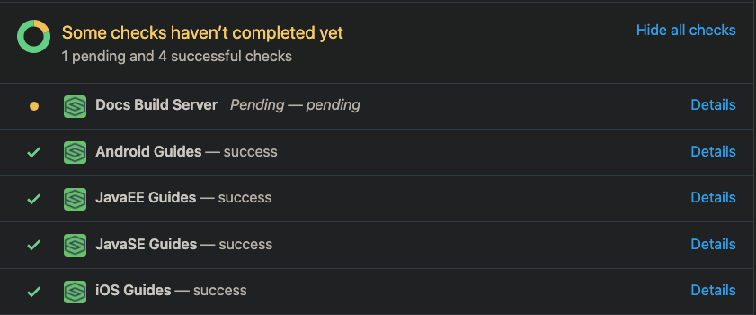

# SDL App Library Guide Content
The iOS, Java Suite (Android, JavaEE, and JavaSE), and JavaScript Suite guides are located on the [SDL Developer Portal](https://smartdevicelink.com/docs/).

## Overview
Since the iOS, Java Suite, and JavaScript Suite guides provide almost the same instructions and information, the content of each section should be written as generically as possible. This allows the guides to be written once for all platforms with little modification needed. If a guide is specific to one platform or has content specific to one platform, like code snippets, the content should be separated out using custom platform tags.

Guide documents are formatted using a custom SDL markdown format. All guides get created as directories inside this repository. Each directory gets a link in the left-hand sidebar on [smartdevicelink.com](https://smartdevicelink.com). Guides do not currently support multiple pages or sub-directories.

Learn how to use SDL flavored markdown (aka DocDown) at the [spec page](https://github.com/smartdevicelink/sdl_markdown_spec).

## Custom SDL Markdown Tags
Basic markdown tags will act [as expected](https://github.com/smartdevicelink/sdl_markdown_spec#basic-markdown-syntax), including headings, bold, italics, and tables. In addition, there are [SDL specific custom extensions](https://github.com/smartdevicelink/sdl_markdown_spec#basic-markdown-syntax) for inline notes and relative links to assets.

### Specifying Platforms
This repository has additional markdown customizations to permit content to be included or excluded from a platform. This can be done inline within a guide in order to, for example, display one code snippet for iOS and another for Java-family platforms. This can also be done within the configuration file in order to allow a guide, such as a guide demoing how to deploy a Java Web app to AWS, to only build for the JavaEE platform.

#### Valid Tags

| Platform         | Tag                |
| ---------------- | ------------------ |
| iOS              | @![iOS] ------- !@ |
| Android          | @![android] --- !@ |
| JavaEE           | @![javaEE] ---- !@ |
| JavaSE           | @![javaSE] ---- !@ |
| JavaScript       | @![javascript]- !@ |

#### How to Use Inline Tags
Inline tags allow you to create content that is only rendered for the specified platforms within a guide that is available on multiple platforms. For example, if you have a guide available on Android, JavaSE, and JavaEE but not on iOS (see below How to Use Configuration Tags for how to configure guide availability), then you can use inline tags to render some content for Android that won't be rendered for JavaSE or JavaEE, or visa versa.

    # How To Code Stuff
    Here is non-platform specific documentation and instructions that tell the developer things and stuff and how to do whatever
    
    ## Code Example
    @![android]
    This is an Android specific instruction that only applies to the Android platform.
    
    ```java
    (Android code snippet)
    ``` !@
    
    This is a JavaSE and JavaEE specific instruction that only applies to the Java platform.
    @![javaSE,javaEE]
    ```java
    (Java code snippet)
    ``` !@
    
#### How to Use Configuration Tags
Configuration tags allow to you create guides that are only available for the specified platforms. If no platforms are included for a section, the section will be generated for all possible configured platforms. 

    {
      "name": "Hello Sdl Android",
      "platforms":["Android"]
    }

This code snippet shows how to configure a guide to only be made available for the Android platform guides.

## To create a link to a header:
1. The first character must be a `#`
1. All characters must be lowercased
1. All spaces need to be replaced by a hyphen
1. Apostrophes need to be removed

### Examples
#### To link to a header on the same page:
```
### Supporting Service RPCs and Actions
```

Use the following formatting:
```
[Supporting Service RPCs and Actions](#supporting-service-rpcs-and-actions) 
```

#### To link to a header on a different page:
To link to the following header on a page called **Using App Services**:
```
### Getting and Subscribing to Services
```

Use the following formatting:
```
[Using App Services](Using App Services#getting-and-subscribing-to-services)
```

## Previewing Content
Build servers will build all PRs for all available platforms. At the bottom of the PR you will see the progress of the build server for each platform. Press the "Details" button to open a link to the generated docs with the PR included for that given platform.



## Best Practices
* When shortening "SmartDeviceLink", the correct acronym is "SDL", not "Sdl", "sdl", or "S.D.L."
* Screenshots should be _only_ of the SDL generic_HMI if available, if not, then another HMI such as Ford's Sync 3 head unit may be used.
