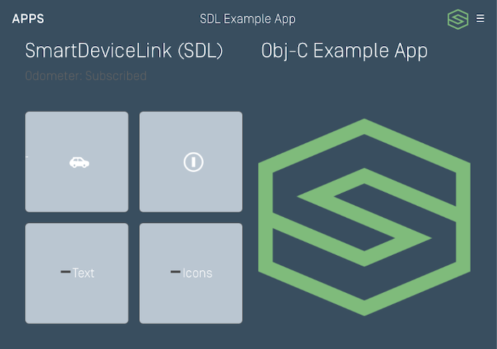

# Customizing the Template
You have the ability to customize the look and feel of the template. How much customization is available depends on the RPC version of the head unit you are connected with as well as the design of the HMI.

## Customizing Template Colors (RPC v5.0+)
You can customize the color scheme of your app using template coloring APIs.

### Customizing the Default Layout
You can change the template colors of the initial template layout in the `lifecycleConfiguration`.



@![iOS]
##### Objective-C
```objc
SDLRGBColor *green = [[SDLRGBColor alloc] initWithRed:126 green:188 blue:121];
SDLRGBColor *white = [[SDLRGBColor alloc] initWithRed:249 green:251 blue:254];
SDLRGBColor *darkGrey = [[SDLRGBColor alloc] initWithRed:57 green:78 blue:96];
SDLRGBColor *grey = [[SDLRGBColor alloc] initWithRed:186 green:198 blue:210];
lifecycleConfiguration.dayColorScheme = [[SDLTemplateColorScheme alloc] initWithPrimaryRGBColor:green secondaryRGBColor:grey backgroundRGBColor:white];
lifecycleConfiguration.nightColorScheme = [[SDLTemplateColorScheme alloc] initWithPrimaryRGBColor:green secondaryRGBColor:grey backgroundRGBColor:darkGrey];
```

##### Swift
```swift
let green = SDLRGBColor(red: 126, green: 188, blue: 121)
let white = SDLRGBColor(red: 249, green: 251, blue: 254)
let grey = SDLRGBColor(red: 186, green: 198, blue: 210)
let darkGrey = SDLRGBColor(red: 57, green: 78, blue: 96)
lifecycleConfiguration.dayColorScheme = SDLTemplateColorScheme(primaryRGBColor: green, secondaryRGBColor: grey, backgroundRGBColor: white)
lifecycleConfiguration.nightColorScheme = SDLTemplateColorScheme(primaryRGBColor: green, secondaryRGBColor: grey, backgroundRGBColor: darkGrey)
```
!@
@![android, javaSE, javaEE]
```java
// Set color schemes
RGBColor green = new RGBColor(126, 188, 121);
RGBColor white = new RGBColor(249, 251, 254);
RGBColor grey = new RGBColor(186, 198, 210);
RGBColor darkGrey = new RGBColor(57, 78, 96);

TemplateColorScheme dayColorScheme = new TemplateColorScheme();
dayColorScheme.setBackgroundColor(white);
dayColorScheme.setPrimaryColor(green);
dayColorScheme.setSecondaryColor(grey);
builder.setDayColorScheme(dayColorScheme);

TemplateColorScheme nightColorScheme = new TemplateColorScheme();
nightColorScheme.setBackgroundColor(white);
nightColorScheme.setPrimaryColor(green);
nightColorScheme.setSecondaryColor(darkGrey);
builder.setDayColorScheme(nightColorScheme);
```
!@
@![javascript]
```js
// Set color schemes
const green = new SDL.rpc.structs.RGBColor().setRed(126).setGreen(188).setBlue(121);
const white = new SDL.rpc.structs.RGBColor().setRed(249).setGreen(251).setBlue(254);
const grey = new SDL.rpc.structs.RGBColor().setRed(186).setGreen(198).setBlue(210);
const darkGrey = new SDL.rpc.structs.RGBColor().setRed(57).setGreen(78).setBlue(96);

const dayColorScheme = new SDL.rpc.structs.TemplateColorScheme();
dayColorScheme.setBackgroundColor(white);
dayColorScheme.setPrimaryColor(green);
dayColorScheme.setSecondaryColor(grey);
lifecycleConfig.setDayColorScheme(dayColorScheme);

const nightColorScheme = new SDL.rpc.structs.TemplateColorScheme();
nightColorScheme.setBackgroundColor(white);
nightColorScheme.setPrimaryColor(green);
nightColorScheme.setSecondaryColor(darkGrey);
lifecycleConfig.setNightColorScheme(nightColorScheme);
```
!@

!!! NOTE
You may change the template coloring in the `lifecycleConfiguration` and the `SetDisplayLayout`, if connecting to a head unit with RPC v5.0+,  or with the `Show` request if connecting to RPC v6.0+. You may only change the template coloring once per template; that is, you cannot call `SetDisplayLayout` or `Show` for the template you are already on and expect the color scheme to update.
!!!

### Customizing Future Layouts
You can change the template color scheme when you change layouts in the @![iOS]`SDLSetDisplayLayout` (any RPC version) or `SDLShow` (RPC v6.0+)!@@![android, javaSE, javaEE, javascript]`SetDisplayLayout` (any RPC version) or `Show` (RPC v6.0+)!@ request.

@![iOS]
##### Objective-C
```objc
SDLRGBColor *green = [[SDLRGBColor alloc] initWithRed:126 green:188 blue:121];
SDLRGBColor *white = [[SDLRGBColor alloc] initWithRed:249 green:251 blue:254];
SDLRGBColor *darkGrey = [[SDLRGBColor alloc] initWithRed:57 green:78 blue:96];
SDLRGBColor *grey = [[SDLRGBColor alloc] initWithRed:186 green:198 blue:210];

SDLSetDisplayLayout *setLayout = [[SDLSetDisplayLayout alloc] initWithPredefinedLayout:SDLPredefinedLayoutGraphicWithText];
setLayout.dayColorScheme = [[SDLTemplateColorScheme alloc] initWithPrimaryRGBColor:green secondaryRGBColor:grey backgroundRGBColor:white];
setLayout.nightColorScheme = [[SDLTemplateColorScheme alloc] initWithPrimaryRGBColor:green secondaryRGBColor:grey backgroundRGBColor:darkGrey];
```

##### Swift
```swift
let green = SDLRGBColor(red: 126, green: 188, blue: 121)
let white = SDLRGBColor(red: 249, green: 251, blue: 254)
let grey = SDLRGBColor(red: 186, green: 198, blue: 210)
let darkGrey = SDLRGBColor(red: 57, green: 78, blue: 96)

let setLayout = SDLSetDisplayLayout(predefinedLayout: .graphicWithText)
setLayout.dayColorScheme = SDLTemplateColorScheme(primaryRGBColor: green, secondaryRGBColor: grey, backgroundRGBColor: white)
setLayout.nightColorScheme = SDLTemplateColorScheme(primaryRGBColor: green, secondaryRGBColor: grey, backgroundRGBColor: darkGrey)
```
!@
@![android, javaSE, javaEE]
```java
// Set color schemes
RGBColor green = new RGBColor(126, 188, 121);
RGBColor white = new RGBColor(249, 251, 254);
RGBColor grey = new RGBColor(186, 198, 210);
RGBColor darkGrey = new RGBColor(57, 78, 96);

TemplateColorScheme dayColorScheme = new TemplateColorScheme();
dayColorScheme.setBackgroundColor(white);
dayColorScheme.setPrimaryColor(green);
dayColorScheme.setSecondaryColor(grey);
builder.setDayColorScheme(dayColorScheme);

TemplateColorScheme nightColorScheme = new TemplateColorScheme();
nightColorScheme.setBackgroundColor(white);
nightColorScheme.setPrimaryColor(green);
nightColorScheme.setSecondaryColor(darkGrey);

SetDisplayLayout setDisplayLayout = new SetDisplayLayout(PredefinedLayout.GRAPHIC_WITH_TEXT.toString());
setDisplayLayout.setDayColorScheme(dayColorScheme);
setDisplayLayout.setNightColorScheme(nightColorScheme);
setDisplayLayout.setOnRPCResponseListener(new OnRPCResponseListener() {
    @Override
    public void onResponse(int correlationId, RPCResponse response) {
        if (response.getSuccess()){
            // Success
        }
    }

    @Override
    public void onError(int correlationId, Result resultCode, String info){
        // Handle error
    }
});
sdlManager.sendRPC(setDisplayLayout);
```
!@
@![javascript]
```js
// Set color schemes
const green = new SDL.rpc.structs.RGBColor().setRed(126).setGreen(188).setBlue(121);
const white = new SDL.rpc.structs.RGBColor().setRed(249).setGreen(251).setBlue(254);
const grey = new SDL.rpc.structs.RGBColor().setRed(186).setGreen(198).setBlue(210);
const darkGrey = new SDL.rpc.structs.RGBColor().setRed(57).setGreen(78).setBlue(96);

const dayColorScheme = new SDL.rpc.structs.TemplateColorScheme();
dayColorScheme.setBackgroundColor(white);
dayColorScheme.setPrimaryColor(green);
dayColorScheme.setSecondaryColor(grey);
lifecycleConfig.setDayColorScheme(dayColorScheme);

const nightColorScheme = new SDL.rpc.structs.TemplateColorScheme();
nightColorScheme.setBackgroundColor(white);
nightColorScheme.setPrimaryColor(green);
nightColorScheme.setSecondaryColor(darkGrey);

const setDisplayLayout = new SDL.rpc.messages.SetDisplayLayout().setDisplayLayout(SDL.rpc.enums.PredefinedLayout.GRAPHIC_WITH_TEXT);
setDisplayLayout.setDayColorScheme(dayColorScheme);
setDisplayLayout.setNightColorScheme(nightColorScheme);
sdlManager.addRpcListener(SDL.rpc.enums.FunctionID.SetDisplayLayout, function (response) {
        if (response instanceof SDL.rpc.RpcResponse && response.getSuccess()){
            // Success
        }
    }
});
sdlManager.sendRpc(setDisplayLayout);
```
!@

## Customizing the Menu Title and Icon
You can also customize the title and icon of the main menu button that appears on your template layouts. The menu icon must first be uploaded with a specific name through the file manager; see the [Uploading Images](Other SDL Features/Uploading Images) section for more information on how to upload your image.

@![iOS]
##### Objective-C
```objc
SDLSetGlobalProperties *setGlobals = [[SDLSetGlobalProperties alloc] init];
setGlobals.menuTitle = @"<#Custom Title#>";

// The image must be uploaded before referencing the image name here
setGlobals.menuIcon = [[SDLImage alloc] initWithName:@"<#Custom Icon Name#>" isTemplate:YES];

[self.sdlManager sendRequest:setGlobals withResponseHandler:^(SDLRPCRequest *request, SDLRPCResponse *response, NSError *error) {
    if (error != nil) {
        // Something went wrong
    }

    // The menu title and icon should be updated
}];
```

##### Swift
```swift
let setGlobals = SDLSetGlobalProperties()
setGlobals.menuTitle = "<#Custom Title#>"

// The image must be uploaded before referencing the image name here
setGlobals.menuIcon = SDLImage(name: "<#Custom Icon Name#>", isTemplate: true)

sdlManager.send(request: setGlobals) { (request, response, error) in
    if error != nil {
        // Something went wrong
    }

    // The menu title and icon should be updated
}
```
!@
@![android, javaSE, javaEE]
```java
SetGlobalProperties setGlobalProperties = new SetGlobalProperties();
setGlobalProperties.setMenuTitle("customTitle");
// The image must be uploaded before referencing the image name here
setGlobalProperties.setMenuIcon(<#Image#>);
setGlobalProperties.setOnRPCResponseListener(new OnRPCResponseListener() {
    @Override
    public void onResponse(int correlationId, RPCResponse response) {
        if (response.getSuccess()){
            // Success
        }
    }

    @Override
    public void onError(int correlationId, Result resultCode, String info){
        // Handle error
    }
});
sdlManager.sendRPC(setGlobalProperties);
```
!@
@![javascript]
```js
const setGlobalProperties = new SDL.rpc.messages.SetGlobalProperties();
setGlobalProperties.setMenuTitle('customTitle');
// The image must be uploaded before referencing the image name here
setGlobalProperties.setMenuIcon(<#Image#>);
sdlManager.addRpcListener(SDL.rpc.enums.FunctionID.SetGlobalProperties, function (response) {
        if (response instanceof SDL.rpc.RpcResponse && response.getSuccess()){
            // Success
        }
    }
});
sdlManager.sendRpc(setGlobalProperties);
```
!@
