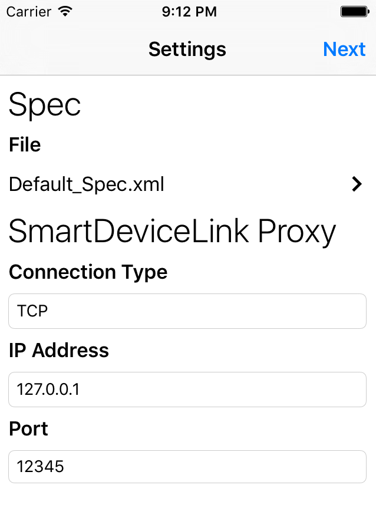
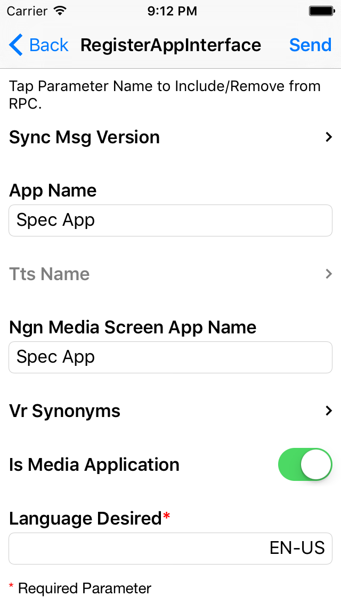
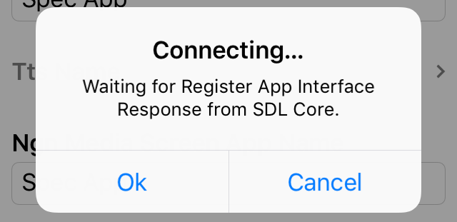
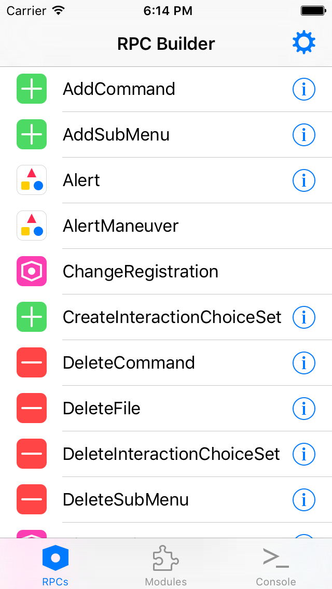
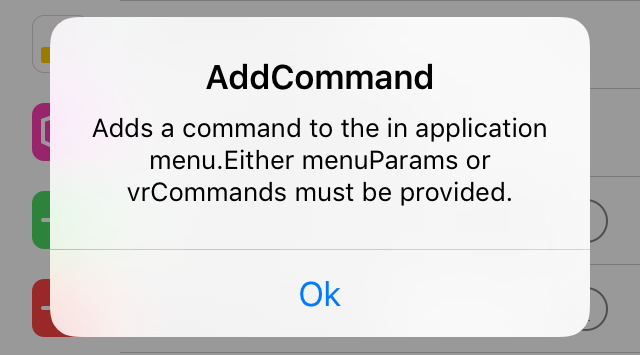
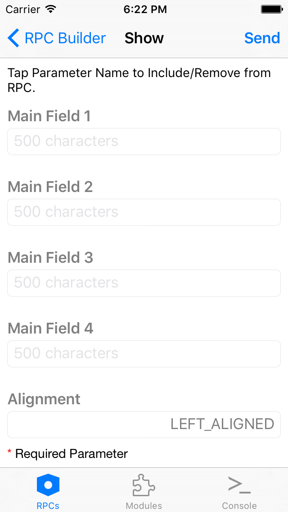
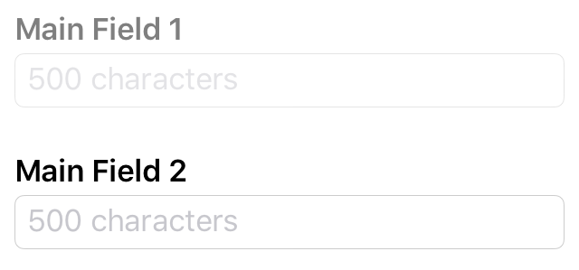
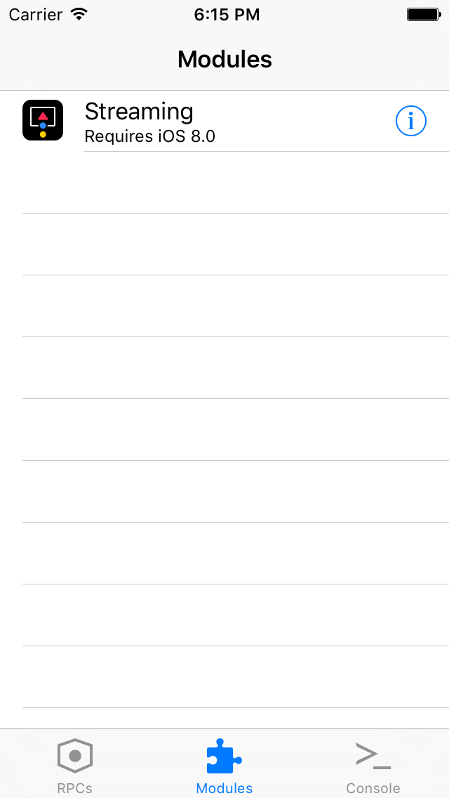
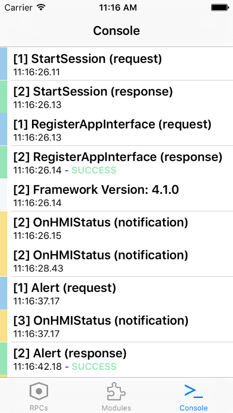
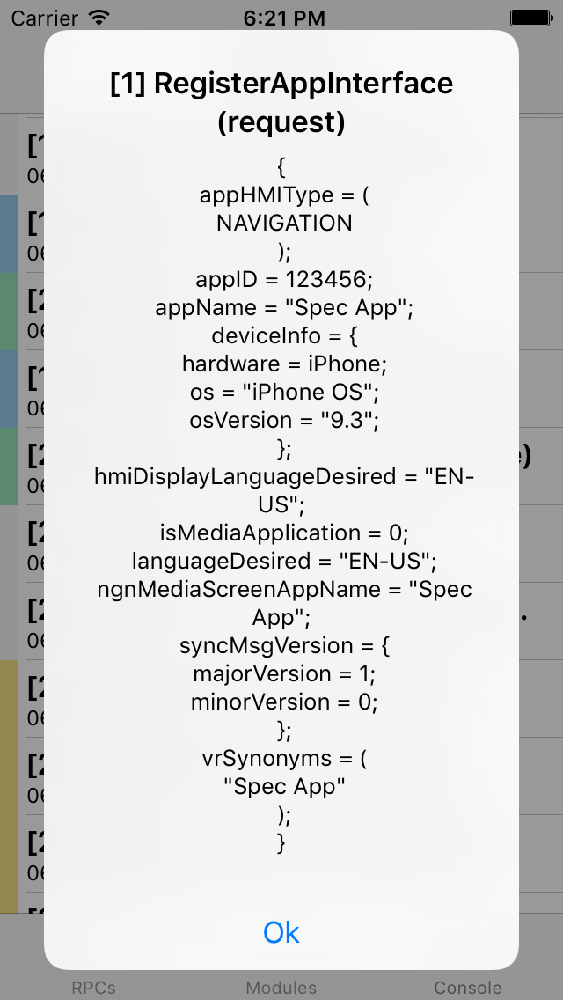

# RPC Builder

## Introduction
The SmartDeviceLink (SDL) RPC Builder app is a free iOS app designed to help developers understand the SDL interface and how remote procedure calls (RPCs) work. Use the app to test sending and receiving RPCs without writing any code.

!!! NOTE
In order for the RPC Builder app to work correctly, all commands must be executed in proper sequence. For example, when building a custom menu, a `performInteraction` request will only be successful if sent after a `createInteractionChoiceSet` request. To find more information about how to properly set up a sequence of commands, please reference the [SDL App Developer Documentation](https://smartdevicelink.com/docs/iOS/master/).
!!!

## Getting Started
In order to begin using RPC Builder, the [SDL iOS](http://www.github.com/smartdevicelink/sdl_ios) library must be added to the project. There is already support for [CocoaPods](https://cocoapods.org) in this project, so to install the library, simply navigate to the RPC Builder folder in a terminal and then install:
```
cd RPC\ Builder/
pod install
```

Once the SDL iOS library has been installed, the RPC Builder app can be deployed on an iOS device.

## RPC Builder Interface
### Settings Page


On the settings page, select a RPC spec file. The default *Mobile_API.xml* file will generate all possible RPCs available for the app. To use a custom RPC spec file, add a new file via iTunes file sharing to the `SpecXMLs` directory. The file can also be added via a remote URL.

Also on the settings page, set the transport layer to TCP/IP or iAP.  For more information on which type of connection to use, please view the [SDL iOS Guide](https://smartdevicelink.com/en/guides/iOS/getting-started/connecting-to-an-infotainment-system/).

Once the spec file and transport layer have been set, click on *Next*. On the next page, send the `RegisterAppInterface` (RAI) RPC, a request that registers the app with SDL Core. Simply click on *Send* to use the default RAI settings. If the properties on the RAI screen are modified, they will be cached for subsequent launches.




!!! IMPORTANT
Once *Send* is pressed, the app will only proceed once it has successfully connected with SDL Core and received a RAI response.
!!!

### Main RPCs Table


The main RPC table is created at runtime by the app from a spec XML file. If there is additional information provided about the RPC call, an information button will appear next to the RPC name in the table. Click on the information button to learn more about the RPC call.



### Send a RPC
To send an RPC to the SDL Core select the RPC from the table, fill out the RPC parameters and click *Send*.

#### Parameter Information
After selecting an RPC from the table, a view will appear with all possible parameters for this RPC. To find out more information about an argument, tap and hold the argument name to reveal the information.



#### Required Parameters
Required data will have a red asterisk next to the argument name.

#### Struct or Array Parameters
If a parameter is a struct or array, an arrow will appear to the right of the parameter name. More parameter information for the array or struct can be entered by clicking on the parameter table cell. A new view will appear where more information about the parameter can be entered.

#### Parameter Data
There are three different ways to send an RPC argument.

1. Send with data.
    * To send an argument with data just add the information next to the arguments name.
2. Send without data
    * To send an argument with an empty string, leave the field next to the argument name empty
3. Don't send the argument
    * To disable the argument from being included in the RPC, tap once on the argument's name. The argument will be grayed out and not included in the request. In the picture below `mainField1` will not be included in the RPC Request, but `mainField2` will be included with an empty string.
    

### Modules
The purpose of modules is to allow developers to create more advanced testing scenarios. A module can contain multiple RPCs. It can also define capabilities not provided in the RPC spec file.
    

#### Building New Modules
There are a few requirements for building Modules:

1. All Modules must be subclasses of `RBModuleViewController`, and all class functions labeled as **Required** must be overridden.
    - These properties will allow other developers to easily understand what the Module will be testing and will also include the iOS version required in order to use Module.
    - Any Module with an iOS version other than 6 as the requirement will be listed.
    - Although other class functions such as `moduleImageName`/`moduleImage` are optional, it is encouraged to add these functions.
1. All Modules must use the provided `SDLProxy`, `SDLManager`, and `RBSettingsManager` that are provided to subclasses of `RBModuleViewController`.
1. All Modules must be added to the `Modules.storyboard` storyboard in order to correctly load.
    - When designing your view controller, use 8px for the vertical and horizontal displacement between views to create a consistent user experience.
1. All Modules must not interact with any other Module.
1. All Modules must be added to `RBModuleViewController`'s class function `moduleClassNames`. The new Module should be added to this list in alphabetical order. For an example of how to add this see below:

        + (NSArray*)moduleClassNames {
                if (!moduleClassNames) {
                        moduleClassNames = @[
                        [RBStreamingModuleViewController classString],  // Streaming
                        [RBNewModuleViewController classString]  // Module Name
                        ];
                }
                return moduleClassNames;
        }


#### Default Modules
1. Streaming
    - Allows for testing of video and audio streaming of camera / video files as well as audio files respectively.
2. Audio Capture
    - Allows for saving of audio data via `AudioPassThru` RPCs. Properties of this RPC can be modified to test the robustness of the RPC. This audio data may be retrieved via iTunes File Sharing.

### Console Log
The console log shows a simplified output of sent and received requests.



#### Console Color Codes
The console logs are color coded for quick identification.  

1. **White** - Used for logs with no additional data.
2. **Blue** - Used for requests sent to the SDL Core.
3. **Green** - Used for responses from the SDL Core. There are three possible response types:
    - *Successful*: these response types are colored green.
    - *Aborted, Timed-Out, or Warnings*: these response types are colored yellow.
    - *Miscellaneous*: these response types are colored red.
4. **Yellow** - Used for notifications sent from the SDL Core.

#### RPC JSON
Tapping once on a RPC call in the console will reveal the JSON associated with that RPC call, if applicable.



### A Special Note About Putfile
A `putFile` is the RPC responsible for sending binary data from our mobile libraries to the SDL Core. The RPC Builder app provides support for adding any type of file: either from the camera roll (for images) or iTunes shared storage for any other kind of files. Similar to adding custom RPC spec files, any file located within the `BulkData` directory will be present in local storage and be usable for upload.

### Need Help?
If you need general assistance, or have other questions, you can [sign up](http://sdlslack.herokuapp.com/) for the [SDL Slack](https://smartdevicelink.slack.com/) and chat with other developers and the maintainers of the project.

### Found a Bug?
If you see a bug, feel free to [post an issue](https://github.com/smartdevicelink/rpc_builder_app_ios/issues/new).

### Want to Help?
If you want to help add more features, please [file a pull request](https://github.com/smartdevicelink/rpc_builder_app_ios/compare).
