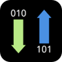
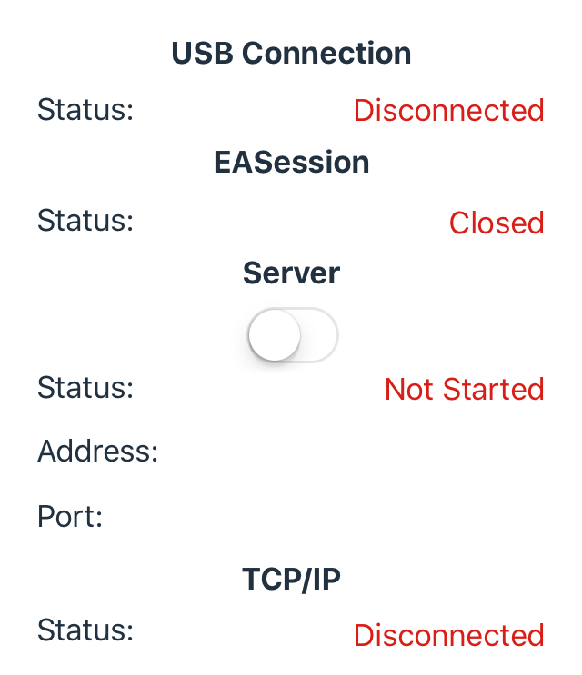
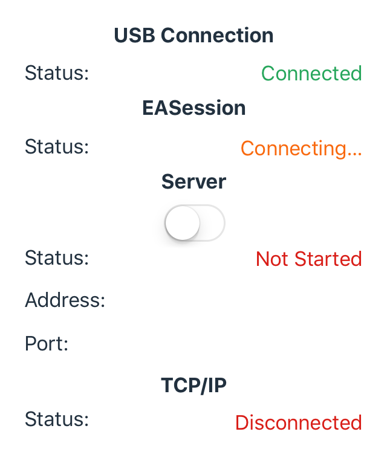
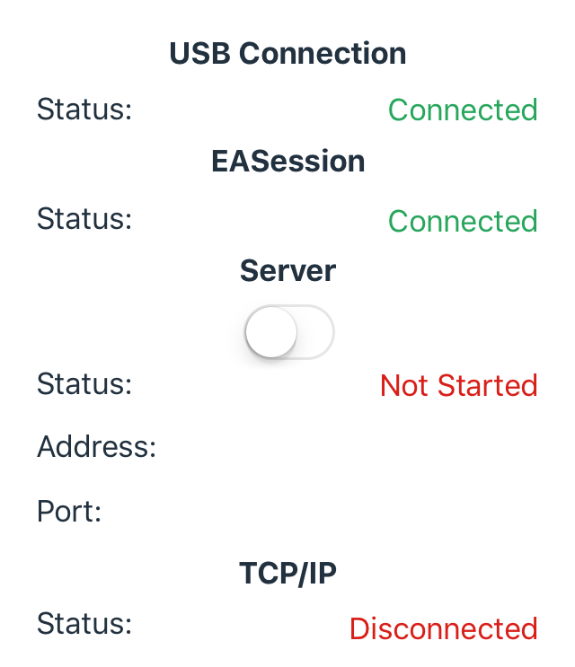
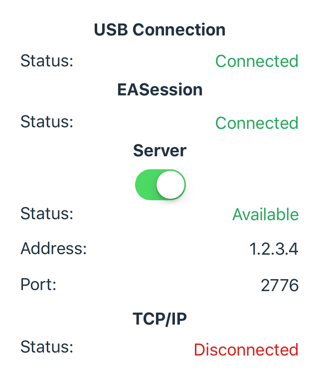
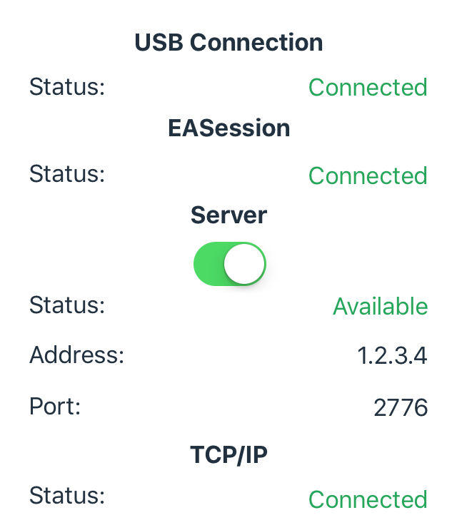

# SDL Relay

!!! NOTE
A better method than using the iOS Relay app is to use Xcode 9 / iOS 11 wireless debugging. This allows you to use the IAP connection instead of the TCP connection and can be more reliable. The Relay app is still useful if your phone is not on iOS 11.
!!!

The SmartDeviceLink (SDL) iOS Relay app is a debugging tool for developers building iOS applications that communicate with a vehicle head unit requiring a USB cable. Testing is done over a TCP/IP connection. During testing developers can easily see logs of in-going/out-going remote procedure calls (RPCs) in Xcode's debug console, thus making debugging easier and faster.

!!! IMPORTANT
If you are using a head unit or TDK, and are using the Relay app for debugging, the IP address and port number should be set to the same IP address and port number as the app. This information appears in the Relay app once the server is turned on in the app. Also be sure that the device is on the same network as your app.
!!!

## Necessary Tools
In order to use the Relay app, you must have the following tools:

1. A SDL Core enabled vehicle head unit or a [Test Development Kit](https://developer.ford.com/pages/hardware#toc0).
2. An iOS device with the [SDL iOS Relay](https://github.com/smartdevicelink/relay_app_ios) app installed.
3. A USB cable to connect the iOS device to the head unit or TDK.
4. Xcode with the app being tested running in Xcode's iOS Simulator app.

## Examples
### Example: Connecting the RPC Builder iOS App
This example shows you how to use the RPC Builder app in conjunction with the Relay app. For a tutorial on how to connect a custom app, please see the example below.  

1. Download the [RPC Builder](https://github.com/smartdevicelink/rpc_builder_app_ios) app. The RPC Builder app is a free tool designed to help developers understand how RPCs work.
2. Download the [Relay](https://github.com/smartdevicelink/relay_app_ios) app and install it on an iOS device.  
3. Launch the Relay app on an iOS device. If the Relay app is not connected to any hardware running SDL Core via USB, the app's screen will not show any active connections.

    

    *Initial app startup. This state is visible when the app is not connected to hardware running SDL Core via USB.*
4. Connect the iOS device to the SDL Core using a USB cable.
5. When the iOS device is connected to the SDL Core, the status under **USB Connection** should change from *Disconnected* to *Connected*. Wait for the the status of the **EASession** to change to *Connected*. The EASession is a communication channel between the Relay app and SDL Core. If **EASession** is not *Connected* within a few seconds pull and reconnect the USB cord to the SDL Core.

    

    *The Relay App is initially connected via USB, but the connection is still in progress.*

    

    *The Relay App is fully connected via USB, and ready for server start.*  
6. Once the USB Connection and EASession are both set to *Connected*, the app is fully connected and ready for server start. Toggle the switch under **Server** to on. When the status of the server changes to *Available*, the IP address and port number of the wifi network the Relay app is connected to will appear under **Server**.

    

    *Server is now started and awaiting connection.*
7. Open the RPC Builder app in Xcode and click on the *run* button to launch the app in Xcode's iOS Simulator. Enter the IP address and port number from the Relay app into the RPC Builder app and click on *Next*. On the next page of the RPC Builder app, click on *Send*.
8. Once the RPC Builder app is running on the Simulator, the status of **SDL** in the Relay app should change to *Connected*.

    

    *Application is correctly connected to Relay, and messages can now be sent and received.*  
9. The RPC Builder app is now connected to Relay, and messages can be sent and received. Debug logs will appear in Xcode's debug area.

### Example: Connecting Your Custom App
This example shows you how to connect a custom app with the Relay app.  

1. First, follow steps 2 through 7 in the example above called *Connecting the RPC Builder iOS App*.
2. It is very important to make sure that the Relay app and the app you are testing are connected to the same wifi network. Make sure to set the proxy's TCP/IP initializer with the same IP address and port number used by the Relay app. To do this, set the proxy builder's TCP/IP initializer in the app being tested.   

        SDLProxy* proxy = [SDLProxyFactory buildSDLProxyWithListener:sdlProxyListenerDelegate
            tcpIPAddress:@"1.2.3.4"
            port:@"2776"];

3. Start the app being tested on Xcode's simulator.
4. Once the app is running on the simulator, the status of **SDL** in the Relay app should change to *Connected*.

    

    *Application is correctly connected to Relay, and messages can now be sent and received.*  
5. The app is now connected to Relay, and messages can be sent and received. Debug logs will appear in Xcode's debug area.

!!! NOTE  
The Relay app should always be connected to the SDL Core before starting your app, otherwise setup will not work. 
!!!

### Need Help?
If you need general assistance, or have other questions, you can [sign up](http://sdlslack.herokuapp.com) for the [SDL Slack](https://smartdevicelink.slack.com/) and chat with other developers and the maintainers of the project.

### Found a Bug?
If you see a bug, feel free to [post an issue](https://github.com/smartdevicelink/relay_app_ios/issues/new).

### Want to Help?
If you want to help add more features, please [file a pull request](https://github.com/smartdevicelink/relay_app_ios/compare).
