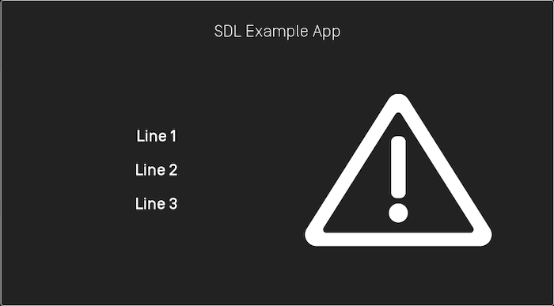
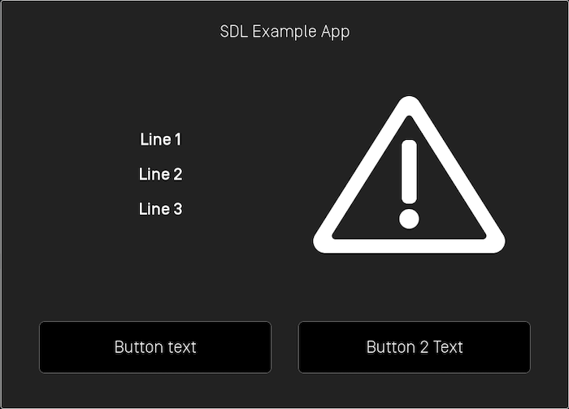
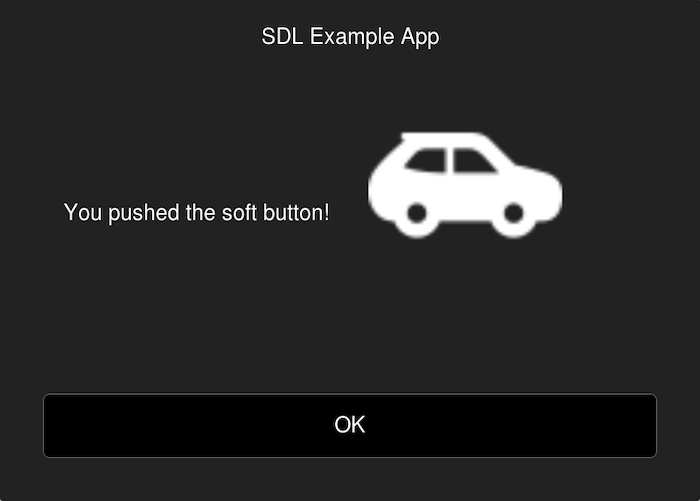
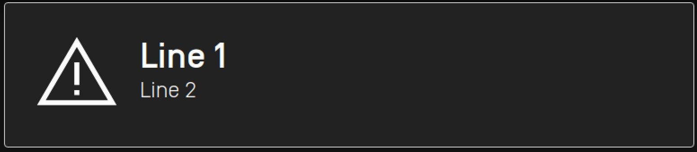
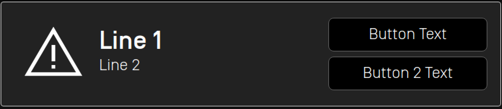
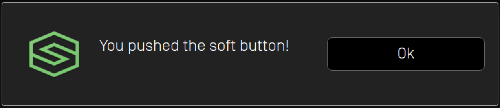

# Alerts and Subtle Alerts
SDL supports two types of alerts: a large popup alert that typically takes over the whole screen and a smaller subtle alert that only covers a small part of screen.

## Checking if the Module Supports Alerts 
Your SDL app may be restricted to only being allowed to send an alert when your app is open (i.e. the `hmiLevel` is non-`NONE`) or when it is the currently active app (i.e. the `hmiLevel` is `FULL`). Subtle alert is a new feature (RPC v7.0+) and may not be supported on all modules.

@![iOS]
##### Objective-C
```objc
BOOL isAlertAllowed = [self.sdlManager.permissionManager isRPCNameAllowed:SDLRPCFunctionNameAlert];
BOOL isSubtleAlertAllowed = [self.sdlManager.permissionManager isRPCNameAllowed:SDLRPCFunctionNameSubtleAlert];
```

##### Swift
```swift
let isAlertAllowed = sdlManager.permissionManager.isRPCNameAllowed(.alert)
let isSubtleAlertAllowed = sdlManager.permissionManager.isRPCNameAllowed(.subtleAlert)
```
!@

@![android,javaSE,javaEE]
```java
boolean isAlertAllowed = sdlManager.getPermissionManager().isRPCAllowed(FunctionID.ALERT);
boolean isSubtleAlertAllowed = sdlManager.getPermissionManager().isRPCAllowed(FunctionID.SUBTLE_ALERT);
```
!@

@![javascript]
```js
const isAlertAllowed = sdlManager.getPermissionManager().isRpcAllowed(SDL.rpc.enums.FunctionID.Alert);
const isSubtleAlertAllowed = sdlManager.getPermissionManager().isRpcAllowed(SDL.rpc.enums.FunctionID.SubtleAlert);
```
!@

## Alerts
An alert is a large pop-up window showing a short message with optional buttons. When an alert is activated, it will abort any SDL operation that is in-progress, except the already-in-progress alert. If an alert is issued while another alert is still in progress the newest alert will wait until the current alert has finished.

Depending on the platform, an alert can have up to three lines of text, a progress indicator (e.g. a spinning wheel or hourglass), and up to four soft buttons.  

##### Alert With No Soft Buttons


!!! NOTE
If no soft buttons are added to an alert some modules may add a default "cancel" or "close" button.
!!!

##### Alert With Soft Buttons


### Creating the AlertView
An @![android,javaSE,javaEE, javascript]`AlertView`!@@![iOS]`SDLAlertView`!@ is an object that we will create to store all the properties of an `Alert` to be presented.

!!! NOTE
An @![android,javaSE,javaEE, javascript]`AlertView`!@@![iOS]`SDLAlertView`!@ must contain at least either text, secondaryText or audio for the Alert to be presented.
!!!

#### Text

@![iOS]
##### Objective-C
```objc

```

##### Swift
```swift

```
!@

@![android,javaSE,javaEE]
```java
AlertView.Builder builder = new AlertView.Builder();
builder.setText("Text");
builder.setSecondaryText("secondaryText");
builder.setAudio(AlertAudioData);
AlertView alertView = builder.build();
```
!@

@![javascript]
```js

```
!@

#### Buttons

@![iOS]
##### Objective-C
```objc

```

##### Swift
```swift

```
!@

@![android,javaSE,javaEE]
```java
alertView.setSoftButtons(List<SoftButtonObject>)
```
!@

@![javascript]
```js

```
!@

#### Icon 
An alert can include a custom or static (built-in) image that will be displayed within the alert.



@![iOS]
##### Objective-C
```objc

```
##### Swift
```swift

```
!@

@![android,javaSE,javaEE]
```java
alertView.setIcon(SdlArtwork)
```
!@

@![javascript]
```js

```
!@

#### Timeouts
An optional timeout can be added that will dismiss the alert when the duration is over. Typical timeouts are between 3 and 10 seconds. If omitted, a default of 5 seconds is used. 

@![iOS]
##### Objective-C
```objc

```

##### Swift
```swift

```
!@

@![android,javaSE,javaEE]
```java
// 5 seconds
alertView.setTimeout(5);
```
!@

@![javascript]
```js

```
!@

#### Progress Indicator
Not all modules support a progress indicator. If supported, the alert will show an animation that indicates that the user must wait (e.g. a spinning wheel or hourglass, etc). If omitted, no progress indicator will be shown.

@![iOS]
##### Objective-C
```objc

```

##### Swift
```swift

```
!@

@![android,javaSE,javaEE]
```java
alertView.setProgressIndicator(true);
```
!@

@![javascript]
```js

```
!@

#### Text-To-Speech
An alert can also speak a prompt or play a sound file when the alert appears on the screen. This is done by creating an `AlertAudioData` object and setting it in the `AlertView` parameter.

@![iOS]
##### Objective-C
```objc

```

##### Swift
```swift

```
!@

@![android,javaSE,javaEE]
```java
AlertAudioData alertAudioData = new AlertAudioData("Text to Speak");
```
!@

@![javascript]
```js

```
!@

`AlertAudioData`  can also take a file to play/speak. 

@![iOS]
##### Objective-C
```objc

```

##### Swift
```swift

```
!@

@![android,javaSE,javaEE]
```java
AlertAudioData alertAudioData = new AlertAudioData(sdlFile);
alertView.setAudio(alertAudioData);
```
!@

@![javascript]
```js

```
!@

You can have a combination of Audio files and Test-To-Speech.

@![iOS]
##### Objective-C
```objc

```

##### Swift
```swift

```
!@

@![android,javaSE,javaEE]
```java
AlertAudioData alertAudioData = new AlertAudioData(sdlFile);
List<String> textToSpeech = new ArrayList<>();
textToSpeech.add("Text to speak")
alertAudioData.addSpeechSynthesizerStrings(textToSpeech);
```
!@

@![javascript]
```js

```
!@


#### Play Tone
To play a notification sound when the alert appears, set `playTone` to `true`.

@![iOS]
##### Objective-C
```objc

```

##### Swift
```swift

```
!@

@![android,javaSE,javaEE]
```java
AlertAudioData alertAudioData = new AlertAudioData("Text to Speak");
alertAudioData.setPlayTone(true);
```
!@

@![javascript]
```js

```
!@

### Showing the Alert

@![iOS]
##### Objective-C
```objc

```

##### Swift
```swift

```
!@

@![android,javaSE,javaEE]
```java
AlertView alertView = builder.build();
sdlManager.getScreenManager().presentAlert(alertView, new AlertCompletionListener() {
    @Override
    public void onComplete(boolean success, Integer tryAgainTime) {
        if(success){
            // Alert was presented successfully
        }
    }
});
```
!@

@![javascript]
```js

```
!@

### Canceling/Dismissing the Alert
You can cancel an alert that has not yet been sent to the head unit.

On systems with RPC v6.0+ you can dismiss a displayed alert before the timeout has elapsed. This feature is useful if you want to show users a loading screen while performing a task, such as searching for a list for nearby coffee shops. As soon as you have the search results, you can cancel the alert and show the results. 

!!! NOTE
If connected to older head units that do not support this feature, the cancel request will be ignored, and the alert will persist on the screen until the timeout has elapsed or the user dismisses the alert by selecting a button.
!!!

!!! NOTE
Canceling the alert will only dismiss the displayed alert. If the alert has audio, the speech will play in its entirety even when the displayed alert has been dismissed. If you know you will cancel an alert, consider setting a short audo message like "searching" instead of "searching for coffee shops, please wait."
!!!


@![iOS]
##### Objective-C
```objc

```

##### Swift
```swift

```
!@

@![android,javaSE,javaEE]
```java
alertView.cancel();
```
!@

@![javascript]
```js

```
!@


### Using RPCs
You can also use RPCs to present alerts. You need to use the `Alert` RPC to do so. Note that if you do so, you must avoid using soft button ids 0 - 10000 and cancel ids 0 - 10000 because these ranges are used by the `ScreenManager`.

## Subtle Alerts (RPC v7.0+)
A subtle alert is a notification style alert window showing a short message with optional buttons. When a subtle alert is activated, it will not abort other SDL operations that are in-progress like the larger pop-up alert does. If a subtle alert is issued while another subtle alert is still in progress the newest subtle alert will simply be ignored.
 
Touching anywhere on the screen when a subtle alert is showing will dismiss the alert. If the SDL app presenting the alert is not currently the active app, touching inside the subtle alert will open the app.

Depending on the platform, a subtle alert can have up to two lines of text and up to two soft buttons.

!!! NOTE
Because `SubtleAlert` is not currently supported in the `ScreenManager`, you need to be careful when setting soft buttons or cancel ids to ensure that they do not conflict with those used by the `ScreenManager`. The `ScreenManager` takes soft button ids 0 - 10000 and cancel ids 0 - 10000. Ensure that if you use custom RPCs that the soft button ids and cancel ids are outside of this range.
!!!

##### Subtle Alert With No Soft Buttons


##### Subtle Alert With Soft Buttons


### Creating the Subtle Alert
The following steps show you how to add text, images, buttons, and sound to your subtle alert. Please note that at least one line of text or the "text-to-speech" chunks must be set in order for your subtle alert to work. 

#### Text

@![iOS]
##### Objective-C
```objc
SDLSubtleAlert *subtleAlert = [[SDLSubtleAlert alloc] initWithAlertText1:<#(nullable NSString *)#> alertText2:<#(nullable NSString *)#> alertIcon:<#(nullable SDLImage *)#> ttsChunks:<#(nullable NSArray<SDLTTSChunk *> *)#> duration:<#(nullable NSNumber<SDLUInt> *)#> softButtons:<#(nullable NSArray<SDLSoftButton *> *)#> cancelID:<#(nullable NSNumber<SDLInt> *)#>];
```

##### Swift
```swift
let subtleAlert = SDLSubtleAlert(alertText1: <#String?#>, alertText2: <#String?#>, alertIcon: <#SDLImage?#>, ttsChunks: <#[SDLTTSChunk]?#>, duration: <#(NSNumber & SDLUInt)?#>, softButtons: <#[SDLSoftButton]?#>, cancelID: <#(NSNumber & SDLInt)?#>)
```
!@

@![android,javaSE,javaEE]
```java
SubtleAlert subtleAlert = new SubtleAlert()
    .setAlertText1("Line 1")
    .setAlertText2("Line 2")
    .setCancelID(cancelId);
```
!@

@![javascript]
```js
const subtleAlert = new SDL.rpc.messages.SubtleAlert()
    .setAlertText1('Line 1')
    .setAlertText2('Line 2')
    .setCancelID(<#Number#>);
```
!@

#### Buttons

@![iOS]
##### Objective-C
```objc
SDLSoftButton *button1 = [[SDLSoftButton alloc] initWithType:<#(nonnull SDLSoftButtonType)#> text:<#(nullable NSString *)#> image:<#(nullable SDLImage *)#> highlighted:<#(BOOL)#> buttonId:<#(UInt16)#> systemAction:<#(nullable SDLSystemAction)#> handler:^(SDLOnButtonPress * _Nullable buttonPress, SDLOnButtonEvent * _Nullable buttonEvent) {
    if (buttonPress == nil) {
        return;
    }

    <#Button has been pressed#>
}];

subtleAlert.softButtons = @[button1];
```

##### Swift
```swift
let button1 = SDLSoftButton(type: <#SDLSoftButtonType#>, text: <#String?#>, image: <#SDLImage?#>, highlighted: <#Bool#>, buttonId: <#UInt16#>, systemAction: <#SDLSystemAction?#>) { (buttonPress, buttonEvent) in
    guard buttonPress != nil else { return }
    <#Button has been pressed#>
}

subtleAlert.softButtons = [button1]
```
!@

@![android,javaSE,javaEE]
```java
// Soft buttons
final int softButtonId = 123; // Set it to any unique ID
SoftButton okButton = new SoftButton(SoftButtonType.SBT_TEXT, softButtonId);
okButton.setText("OK");

// Set the softbuttons(s) to the subtle alert
subtleAlert.setSoftButtons(Collections.singletonList(okButton));

// This listener is only needed once, and will work for all of soft buttons you send with your subtle alert
sdlManager.addOnRPCNotificationListener(FunctionID.ON_BUTTON_PRESS, new OnRPCNotificationListener() {
      @Override
      public void onNotified(RPCNotification notification) {
          OnButtonPress onButtonPress = (OnButtonPress) notification;
          if (onButtonPress.getCustomButtonID() == softButtonId){
               DebugTool.logInfo(TAG, "Ok button pressed");
          }
      }
});
```
!@

@![javascript]
```js
// Soft buttons
const softButtonId = 123; // Set it to any unique ID
const okButton = new SDL.rpc.structs.SoftButton()
    .setType(SDL.rpc.enums.SoftButtonType.SBT_TEXT)
    .setSoftButtonID(softButtonId)
    .setText('OK');

// Set the softbuttons(s) to the alert
subtleAlert.setSoftButtons([okButton]);

// This listener is only needed once, and will work for all of soft buttons you send with your alert
sdlManager.addRpcListener(SDL.rpc.enums.FunctionID.OnButtonPress, function (onButtonPress) {
    if (onButtonPress.getCustomButtonID() === softButtonId) {
        console.log("OK button pressed");
    }
})
```
!@

#### Icon
A subtle alert can include a custom or static (built-in) image that will be displayed within the subtle alert. Before you add the image to the subtle alert, make sure the image is uploaded to the head unit using the @![iOS]`SDLFileManager`!@@![android,javaSE,javaEE,javascript]`FileManager`!@. Once the image is uploaded, you can show the alert with the icon.



@![iOS]
##### Objective-C
```objc
subtleAlert.alertIcon = [[SDLImage alloc] initWithName:<#(nonnull NSString *)#> isTemplate:<#(BOOL)#>];
```

##### Swift
```swift
subtleAlert.alertIcon = SDLImage(name: <#String#>, isTemplate: <#Bool#>)
```
!@

@![android,javaSE,javaEE]
```java
subtleAlert.setAlertIcon(new Image("artworkName", ImageType.DYNAMIC));
```
!@

@![javascript]
```js
subtleAlert.setAlertIcon(new SDL.rpc.structs.Image()
    .setValueParam(<#artworkName#>)
    .setImageType(SDL.rpc.enums.ImageType.DYNAMIC));
```
!@

#### Timeouts
An optional timeout can be added that will dismiss the subtle alert when the duration is over. Typical timeouts are between 3 and 10 seconds. If omitted, a default of 5 seconds is used.

@![iOS]
##### Objective-C
```objc
// Duration timeout is in milliseconds
subtleAlert.duration = @4000;
```

##### Swift
```swift
// Duration timeout is in milliseconds
subtleAlert.duration = NSNumber(4000)
```
!@

@![android,javaSE,javaEE]
```java
subtleAlert.setDuration(5000);
```
!@

@![javascript]
```js
subtleAlert.setDuration(5000);
```
!@

#### Text-To-Speech
A subtle alert can also speak a prompt or play a sound file when the subtle alert appears on the screen. This is done by setting the `ttsChunks` parameter.

@![iOS]
##### Objective-C
```objc
subtleAlert.ttsChunks = [SDLTTSChunk textChunksFromString:<#(nonnull NSString *)#>];
```

##### Swift
```swift
subtleAlert.ttsChunks = SDLTTSChunk.textChunks(from: <#String#>)
```
!@

@![android,javaSE,javaEE]
```java
subtleAlert.setTtsChunks(Collections.singletonList(new TTSChunk("Text to Speak", SpeechCapabilities.TEXT)));
```
!@

@![javascript]
```js
const chunk = new SDL.rpc.structs.TTSChunk()
    .setType(SDL.rpc.enums.SpeechCapabilities.SC_TEXT)
    .setText('Text to Speak');
subtleAlert.setTtsChunks([chunk]);
```
!@

The `ttsChunks` parameter can also take a file to play/speak. For more information on how to upload the file please refer to the [Playing Audio Indications](Speech and Audio/Playing Audio Indications) guide.

@![iOS]
##### Objective-C
```objc
subtleAlert.ttsChunks = [SDLTTSChunk fileChunksWithName:<#(nonnull NSString *)#>];
```

##### Swift
```swift
subtleAlert.ttsChunks = SDLTTSChunk.fileChunks(withName: <#String#>)
```
!@

@![android,javaSE,javaEE]
```java
TTSChunk ttsChunk = new TTSChunk(sdlFile.getName(), SpeechCapabilities.FILE);
subtleAlert.setTtsChunks(Collections.singletonList(ttsChunk));
```
!@

@![javascript]
```js
const ttsChunk = new SDL.rpc.structs.TTSChunk()
    .setText(sdlFile.getName())
    .setType(SDL.rpc.enums.SpeechCapabilities.FILE);
subtleAlert.setTtsChunk([ttsChunk]);
```
!@

### Showing the Subtle Alert

@![iOS]
##### Objective-C
```objc
[self.sdlManager sendRequest:subtleAlert withResponseHandler:^(SDLRPCRequest *request, SDLRPCResponse *response, NSError *error) {
    if (!response.success.boolValue) { 
        <#Print out the error if there is one#>
        return;
    }

    <#Subtle alert was shown successfully#>
}];
```

##### Swift
```swift
sdlManager.send(request: subtleAlert) { (request, response, error) in
    guard response?.success.boolValue == true else {
        <#Print out the error if there is one#>
        return
    }

    <#Subtle alert was shown successfully#>
}
```
!@

@![android,javaSE,javaEE]
```java
// Handle RPC response
subtleAlert.setOnRPCResponseListener(new OnRPCResponseListener() {
    @Override
    public void onResponse(int correlationId, RPCResponse response) {
      if (response.getSuccess()){
        DebugTool.logInfo(TAG, "Subtle Alert was shown successfully");
      }
    }
});
sdlManager.sendRPC(subtleAlert);
```
!@

@![javascript]
```js
// sdl_javascript_suite v1.1+
const response = await sdlManager.sendRpcResolve(subtleAlert);
if (response.getSuccess()) {
    console.log('Subtle alert was shown successfully');
}
// thrown exceptions should be caught by a parent function via .catch()
// Pre sdl_javascript_suite v1.1
// Handle RPC Response
const response = await sdlManager.sendRpc(subtleAlert).catch(function (error) {
    // Handle Error
});
if (response.getSuccess()) {
    console.log('Subtle alert was shown successfully');
}
```
!@

### Checking if the User Dismissed the Subtle Alert 
If desired, you can be notified when the user tapped on the subtle alert by registering for the @![iOS]`SDLOnSubtleAlertPressed`!@@![android,javaSE,javaEE,javascript]`OnSubtleAlertPressed`!@ notification. 

@![iOS]
##### Objective-C
```objc
[self.sdlManager subscribeToRPC:SDLDidReceiveSubtleAlertPressedNotification withObserver:self selector:@selector(subtleAlertPressed)];

- (void)subtleAlertPressed {
    <#The subtle alert was pressed#>
}
```

##### Swift
```swift
sdlManager.subscribe(to: .SDLDidReceiveSubtleAlertPressed, observer: self, selector: #selector(subtleAlertPressed))

@objc func subtleAlertPressed() {
    <#The subtle alert was pressed#>
}
```
!@

@![android,javaSE,javaEE]
```java
sdlManager.addOnRPCNotificationListener(FunctionID.ON_SUBTLE_ALERT_PRESSED, new OnRPCNotificationListener() {
    @Override
    public void onNotified(RPCNotification notification) {
        // The subtle alert was pressed
    }
});
```
!@

@![javascript]
```js
sdlManager.addRpcListener(SDL.rpc.enums.FunctionID.OnSubtleAlertPressed, function (onSubtleAlertPressed) {
    <#The subtle alert was pressed#>
});
```
!@

### Dismissing the Subtle Alert
You can dismiss a displayed subtle alert before the timeout has elapsed.

!!! Note
Canceling the subtle alert will only dismiss the displayed alert. If you have set the `ttsChunk` property, the speech will play in its entirety even when the displayed subtle alert has been dismissed. If you know you will cancel a subtle alert, consider setting a short `ttsChunk`.
!!!

There are two ways to dismiss a subtle alert. The first way is to dismiss a specific subtle alert using a unique `cancelID` assigned to the subtle alert. The second way is to dismiss whichever subtle alert is currently on-screen.

#### Dismissing a Specific Subtle Alert

@![iOS]
##### Objective-C
```objc
// `cancelID` is the ID that you assigned when creating and sending the subtle alert
SDLCancelInteraction *cancelInteraction = [[SDLCancelInteraction alloc] initWithSubtleAlertCancelID:cancelID];
[self.sdlManager sendRequest:cancelInteraction withResponseHandler:^(__kindof SDLRPCRequest * _Nullable request, __kindof SDLRPCResponse * _Nullable response, NSError * _Nullable error) {
    if (!response.success.boolValue) { 
        <#Print out the error if there is one#>
        return;
    }
    <#The subtle alert was canceled successfully#>
}];
```

##### Swift
```swift
// `cancelID` is the ID that you assigned when creating and sending the subtle alert
let cancelInteraction = SDLCancelInteraction(subtleAlertCancelID: cancelID)
sdlManager.send(request: cancelInteraction) { (request, response, error) in
    guard response?.success.boolValue == true else {
        <#Print out the error if there is one#>
        return
    }

    <#The subtle alert was canceled successfully#>
}
```
!@

@![android,javaSE,javaEE]
```java
// `cancelID` is the ID that you assigned when creating and sending the alert
CancelInteraction cancelInteraction = new CancelInteraction(FunctionID.SUBTLE_ALERT.getId(), cancelID);
cancelInteraction.setOnRPCResponseListener(new OnRPCResponseListener() {
    @Override
    public void onResponse(int correlationId, RPCResponse response) {
        if (response.getSuccess()){
            DebugTool.logInfo(TAG, "Subtle alert was dismissed successfully");
        }
    }
});
sdlManager.sendRPC(cancelInteraction);
```
!@

@![javascript]
```js
const cancelInteraction = new SDL.rpc.messages.CancelInteraction()
    .setFunctionIDParam(SDL.rpc.enums.FunctionID.SubtleAlert)
    .setCancelID(cancelID);

// sdl_javascript_suite v1.1+
const response = await sdlManager.sendRpcResolve(cancelInteraction);
if (response.getSuccess()) {
    console.log('Subtle alert was dismissed successfully');
}
// thrown exceptions should be caught by a parent function via .catch()
// Pre sdl_javascript_suite v1.1
// Handle RPC Response
const response = await sdlManager.sendRpc(cancelInteraction).catch(function (error) {
    // Handle Error
});
if (response.getSuccess()) {
    console.log('Subtle alert was dismissed successfully');
}
```
!@

#### Dismissing the Current Subtle Alert

@![iOS]
##### Objective-C
```objc
SDLCancelInteraction *cancelInteraction = [SDLCancelInteraction subtleAlert];
[self.sdlManager sendRequest:cancelInteraction withResponseHandler:^(__kindof SDLRPCRequest * _Nullable request, __kindof SDLRPCResponse * _Nullable response, NSError * _Nullable error) {
    if (!response.success.boolValue) { 
        <#Print out the error if there is one#>
        return;
    }
    <#The subtle alert was canceled successfully#>
}];
```

##### Swift
```swift
let cancelInteraction = SDLCancelInteraction.subtleAlert()
sdlManager.send(request: cancelInteraction) { (request, response, error) in
    guard response?.success.boolValue == true else {
        <#Print out the error if there is one#>
        return
    }

    <#The subtle alert was canceled successfully#>
}
```
!@

@![android,javaSE,javaEE]
```java
CancelInteraction cancelInteraction = new CancelInteraction(FunctionID.SUBTLE_ALERT.getId());
cancelInteraction.setOnRPCResponseListener(new OnRPCResponseListener() {
    @Override
    public void onResponse(int correlationId, RPCResponse response) {
        if (response.getSuccess()){
            DebugTool.logInfo(TAG, "Subtle Alert was dismissed successfully");
        }
    }
});
sdlManager.sendRPC(cancelInteraction);
```
!@  

@![javascript]
```js
const cancelInteraction = new SDL.rpc.messages.CancelInteraction().setFunctionIDParam(SDL.rpc.enums.FunctionID.SubtleAlert)

// sdl_javascript_suite v1.1+
const response = await sdlManager.sendRpcResolve(cancelInteraction);
if (response.getSuccess()) {
    console.log('Subtle alert was dismissed successfully');
}
// thrown exceptions should be caught by a parent function via .catch()
// Pre sdl_javascript_suite v1.1
// Handle RPC Response
const response = await sdlManager.sendRpc(cancelInteraction).catch(function (error) {
    // Handle Error
});
if (response.getSuccess()) {
    console.log('Subtle alert was dismissed successfully');
}
```
!@
