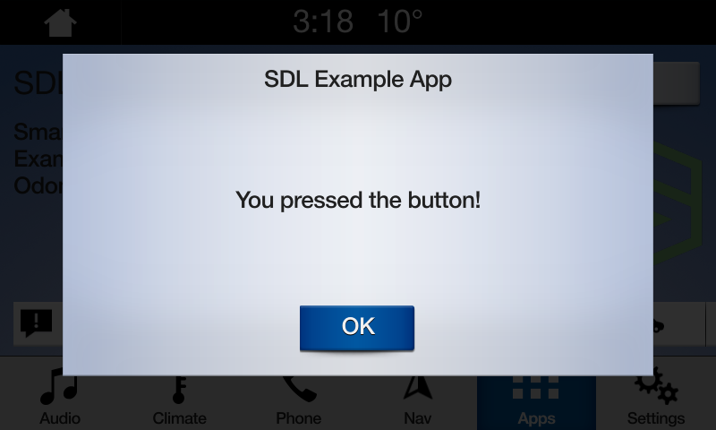

# Alerts
An alert is a pop-up window that can show a short message with optional buttons. When an alert is activated, it will abort any SDL operation that is in-progress, except the already-in-progress alert. If an alert is issued while another alert is still in progress, the newest alert will simply be ignored.

!!! NOTE
The alert will persist on the screen until the timeout has elapsed, or the user dismisses the alert by selecting a button. There is no way to dismiss the alert programmatically other than to set the timeout length.
!!!

## Alert UI
Depending the platform, an alert can have up to three lines of text, a progress indicator (e.g. a spinning wheel or hourglass), and up to four soft buttons.

## Create an Alert
### Alert No Soft Buttons
!!! NOTE
If no soft buttons are added to an alert some OEMs will add a default  button.
!!!

#### Alert HMI
###### Generic HMI


###### Ford HMI


@![iOS]
####  Objective-C
```objc
SDLALert *alert =  [SDLAlert alloc] initWithAlertText1:@"<#Line 1#>" alertText2:@"<#Line 2#>" alertText3:@"<#Line 3#>"];
```

#### Swift
```swift
let alert = SDLAlert(alertText1: "<#Line 1#>", alertText2: "<#Line 2#>", alertText3: "<#Line 3#>")
```
!@

@![android,javaSE,javaEE]
` TODO - code example `
!@

### Alert With Soft Buttons

#### Alert HMI
###### Generic HMI


###### Ford HMI


@![iOS]
#### Objective-C
```objc
SDLAlert *alert =  [[SDLAlert alloc] initWithAlertText1:@"<#Line 1#>" alertText2:@"<#Line 2#>" alertText3:@"<#Line 3#>"];

NSMutableArray<SDLSoftButton *> *softButtons = [[NSMutableArray alloc] init];

SDLSoftButton *button1 = [[SDLSoftButton alloc] init];
button1.text = @"<# Button Text #>";
button1.type = SDLSoftButtonTypeText;
button1.softButtonID  = @<#Soft Button Id#>;
button1.handler = ^(SDLOnButtonPress *_Nullable buttonPress,  SDLOnButtonEvent *_Nullable buttonEvent) {
if (buttonPress == nil) {
    return;
}
// create a custom action for the selected button
};

SDLSoftButton *button2 = [[SDLSoftButton alloc] init];
button2.text = @"<# Button Text 2 #>";
button2.type = SDLSoftButtonTypeText;
button2.softButtonID  = @<#Soft Button Id#>;
button2.handler = ^(SDLOnButtonPress *_Nullable buttonPress,  SDLOnButtonEvent *_Nullable buttonEvent) {
if (buttonPress == nil) {
    return;
}
// create a custom action for the selected button
};

[softButtons addObject: button1];
[softButtons addObject: button2];

alert.softButtons = softButtons;
```

#### Swift
```swift
let alert = SDLAlert(alertText1: "<#Line 1#>", alertText2: "<#Line 2#>", alertText3: "<#Line 3#>")

var softButtons = [SDLSoftButton]()

var button1 = SDLSoftButton()
button1.text = "<# Button Text #>"
button1.type = .text
button1.handler = { buttonPress, buttonEvent in
    guard buttonPress != nil else { return }
    <# Create a custom action for the selected button #>
}

var button2 = SDLSoftButton()
button2.text = "<# Button Text 2 #>"
button2.type = .text
button2.handler = { buttonPress, buttonEvent in
    guard buttonPress != nil else { return }
    <# Create a custom action for the selected button #>
}

softButtons.append(button1)
softButtons.append(button2)

alert.softButtons = softButtons;
```
!@

@![android,javaSE,javaEE]
` TODO - code example `
!@

### Additonal Alert Paramaters
@![iOS]

### Timeouts
An optional timeout can be added that will dimiss the alert when the duration is over.  Typical timeouts are between 3 and 5 seconds. If omitted a default of 5 second is used.
#### Objective-C
```objc
alert.duration = @4000;
```

##### Swift
```swift
alert.duration = 4000
```
!@

@![android,javaSE,javaEE]
` TODO - code example `
!@

### Progress Indicator
Not all OEMs support progress Indicator, if supported the alert will show an animation that indictates  loading of a feature (e.g. a spinning wheel or hourglass, etc). If ommited no progess indicator will be shown.

@![iOS]
#### Objective-C
```objc
alert.progressIndicator = @YES;
```

#### Swift
```swift
alert.progressIndicator = true
```
!@

@![android,javaSE,javaEE]
` TODO - code example `
!@

### Text-To-Speach
The alert can also be formatted to speak a prompt when the alert appears on the screen. Do this by setting the `ttsChunks` parameter.

@![iOS]

#### Objective-C
```objc
alert.ttsChunks = [SDLTTSChunk textChunksFromString:@"<#Text to speak#>"];
```

#### Swift
```swift
alert.ttsChunks = SDLTTSChunk.textChunks(from: "<#Text to speak#>")
```
!@

@![android,javaSE,javaEE]
` TODO - code example `
!@

### Play Tone
To play the alert tone before the text-to-speech is spoken, set `playTone` to `true`.

@![iOS]
#### Objective-C
```objc
alert.playTone = @YES;
```

#### Swift
```swift
alert.playTone = true
```
!@

@![android,javaSE,javaEE]
` TODO - code example `
!@

### Show The Alert
@![iOS]
#### Objective-C
```objc
[self.sdlManager sendRequest:alert withResponseHandler:^(SDLRPCRequest *request, SDLRPCResponse *response, NSError *error) {
    if ([response.resultCode isEqualToEnum:SDLResultSuccess]) {
        // alert was dismissed successfully
        }
}];
```

#### Swift
```swift
sdlManager.send(request: alert) { (request, response, error) in
    if response?.resultCode == .success {
        // alert was dismissed successfully
    }    
}
```
!@

@![android,javaSE,javaEE]
` TODO - code example `
!@
