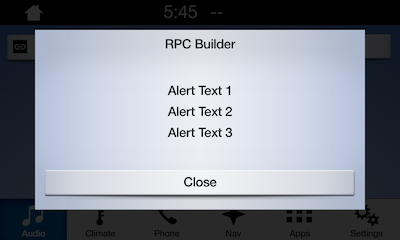
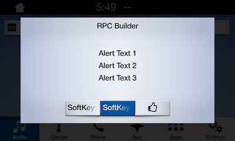

# Alerts
An alert is a pop-up window with some lines of text and optional soft buttons. When an alert is activated, it will abort any SDL operation that is in-progress, except the already-in-progress alert. If an alert is issued while another alert is still in progress, the newest alert will simply be ignored.

!!! NOTE
The alert will persist on the screen until the timeout has elapsed, or the user dismisses the alert by selecting a button. There is no way to dismiss the alert programmatically other than to set the timeout length.
!!!

## Alert UI
Depending the platform, an alert can have up to three lines of text, a progress indicator (e.g. a spinning wheel or hourglass), and up to four soft buttons.

###### Ford HMI


###### Ford HMI


## Alert TTS
The alert can also be formatted to speak a prompt when the alert appears on the screen. Do this by setting the `ttsChunks` parameter. To play the alert tone before the text-to-speech is spoken, set `playTone` to `true`.

##### Objective-C
```objc
SDLAlert *alert = [[SDLAlert alloc] initWithAlertText1:@"<#Line 1#>" alertText2:@"<#Line 2#>" alertText3:@"<#Line 3#>"];

// Maximum time alert appears before being dismissed
// Timeouts are must be between 3-10 seconds
// Timeouts may not work when soft buttons are also used in the alert
alert.duration = @5000;

// A progress indicator (e.g. spinning wheel or hourglass)
// Not all head units support the progress indicator
alert.progressIndicator = @YES;

// Text-to-speech
alert.ttsChunks = [SDLTTSChunk textChunksFromString:@"<#Text to speak#>"];

// Special tone played before the tts is spoken
alert.playTone = @YES;

// Soft buttons
SDLSoftButton *okButton = [[SDLSoftButton alloc] init];
okButton.text = @"OK";
okButton.type = SDLSoftButtonTypeText;
okButton.softButtonID = @<#Soft Button Id#>;
okButton.handler = ^(SDLOnButtonPress *_Nullable buttonPress,  SDLOnButtonEvent *_Nullable buttonEvent) {
    if (buttonPress == nil) {
      return;
    }

    // create a custom action for the selected button
};

alert.softButtons = @[okButton];

// Send the alert
[self.sdlManager sendRequest:alert withResponseHandler:^(SDLRPCRequest *request, SDLRPCResponse *response, NSError *error) {
    if ([response.resultCode isEqualToEnum:SDLResultSuccess]) {
      // alert was dismissed successfully
    }
}];
```

##### Swift
```swift
let alert = SDLAlert(alertText1: "<#Line 1#>", alertText2: "<#Line 2#>", alertText3: "<#Line 3#>")

// Maximum time alert appears before being dismissed
// Timeouts are must be between 3-10 seconds
// Timeouts may not work when soft buttons are also used in the alert
alert.duration = 5000

// A progress indicator (e.g. spinning wheel or hourglass)
// Not all head units support the progress indicator
alert.progressIndicator = true

// Text-to-speech
alert.ttsChunks = SDLTTSChunk.textChunks(from: "<#Text to speak#>")

// Special tone played before the tts is spoken
alert.playTone = true

// Soft buttons
let okButton = SDLSoftButton()
okButton.text = "OK"
okButton.type = .text
okButton.softButtonID = <#Soft Button Id#>
okButton.handler = { (buttonPress, buttonEvent) in
    guard let press = buttonPress else { return }

    // create a custom action for the selected button
}

alert.softButtons = [okButton]

// Send the alert
sdlManager.send(request: alert) { (request, response, error) in
    if response?.resultCode == .success {
        // alert was dismissed successfully
    }
}
```
