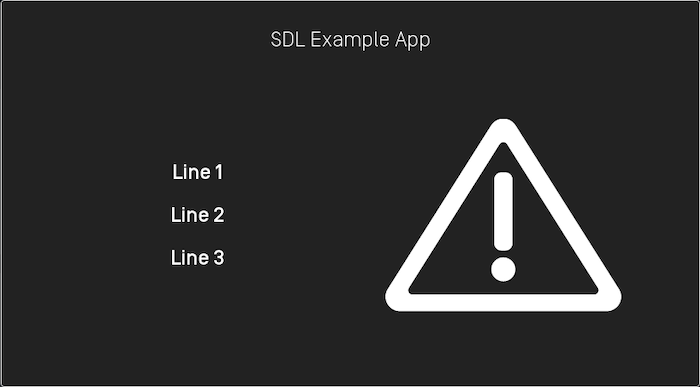

# Alerts
An alert is a pop-up window showing a short message with optional buttons. When an alert is activated, it will abort any SDL operation that is in-progress, except the already-in-progress alert. If an alert is issued while another alert is still in progress, the newest alert will simply be ignored.

Depending the platform, an alert can have up to three lines of text, a progress indicator (e.g. a spinning wheel or hourglass), and up to four soft buttons.

!!! NOTE
The alert will persist on the screen until the timeout has elapsed, or the user dismisses the alert by selecting a button. There is no way to dismiss the alert programmatically other than to set the timeout length.
!!!

## Alert Layouts
###### Alert With No Soft Buttons



!!! NOTE
If no soft buttons are added to an alert some OEMs may add a default "cancel" or "close" button.
!!!

###### Alert With Soft Buttons


## Creating the Alert

### Text
@![iOS]
##### Objective-C
```objc
SDLAlert *alert =  [[SDLAlert alloc] initWithAlertText1:@"<#Line 1#>" alertText2:@"<#Line 2#>" alertText3:@"<#Line 3#>"];
```

##### Swift
```swift
let alert = SDLAlert(alertText1: "<#Line 1#>", alertText2: "<#Line 2#>", alertText3: "<#Line 3#>")
```
!@

@![android,javaSE,javaEE]
```java
Alert alert = new Alert();
alert.setAlertText1("Line 1");
alert.setAlertText2("Line 2");
alert.setAlertText3("Line 3");
```
!@

### Buttons

@![iOS]
##### Objective-C
```objc
SDLAlert *alert = [[SDLAlert alloc] initWithAlertText1:@"<#Line 1#>" alertText2:@"<#Line 2#>" alertText3:@"<#Line 3#>"];

SDLSoftButton *button1 = [[SDLSoftButton alloc] initWithType:SDLSoftButtonTypeText text:@"<#Button Text#>" image:nil highlighted:false buttonId:<#Soft Button Id#> systemAction:SDLSystemActionDefaultAction handler:^(SDLOnButtonPress *_Nullable buttonPress, SDLOnButtonEvent *_Nullable buttonEvent) {
    if (buttonPress == nil) {
        return;
    }
    <#Button has been pressed#>
}];

SDLSoftButton *button2 = [[SDLSoftButton alloc] initWithType:SDLSoftButtonTypeText text:<#Button Text#> image:nil highlighted:false buttonId:<#Soft Button Id#> systemAction:SDLSystemActionDefaultAction handler:^(SDLOnButtonPress *_Nullable buttonPress, SDLOnButtonEvent *_Nullable buttonEvent) {
    if (buttonPress == nil) {
        return;
    }
    <#Button has been pressed#>
}];

alert.softButtons = @[button1, button2];
```

##### Swift
```swift
let alert = SDLAlert(alertText1: "<#Line 1#>", alertText2: "<#Line 2#>", alertText3: "<#Line 3#>")

let button1 = SDLSoftButton(type: .text, text: <#Button Text#>, image: nil, highlighted: false, buttonId: <#Soft Button Id#>, systemAction: .defaultAction, handler: { buttonPress, buttonEvent in
    guard buttonPress != nil else { return }
    <#Button has been pressed#>
})

let button2 = SDLSoftButton(type: .text, text: <#Button Text#>, image: nil, highlighted: false, buttonId: <#Soft Button Id#>, systemAction: .defaultAction, handler: { buttonPress, buttonEvent in
    guard buttonPress != nil else { return }
    <#Button has been pressed#>
})

alert.softButtons = [button1, button2]
```
!@

@![android,javaSE,javaEE]
```java
Alert alert = new Alert();
alert.setAlertText1("Line 1");
alert.setAlertText2("Line 2");
alert.setAlertText3("Line 3");

// Soft buttons
final int softButtonId = 123; // Set it to any unique ID
SoftButton okButton = new SoftButton(SoftButtonType.SBT_TEXT, softButtonId);
okButton.setText("OK");

// Set the softbuttons(s) to the alert
alert.setSoftButtons(Collections.singletonList(okButton));

// This listener is only needed once, and will work for all of soft buttons you send with your alert
sdlManager.addOnRPCNotificationListener(FunctionID.ON_BUTTON_PRESS, new OnRPCNotificationListener() {
      @Override
      public void onNotified(RPCNotification notification) {
          OnButtonPress onButtonPress = (OnButtonPress) notification;
          if (onButtonPress.getCustomButtonName() == softButtonId){
               Log.i(TAG, "Ok button pressed");
          }
      }
});
```
!@

### Alert Icon


An alert can include a custom or static (built-in) image that will be displayed within the alert. Before you add the image to the alert make sure the image is uploaded to the head unit using the @![iOS]SDLFileManager!@@![android,javaSE,javaEE]//TODO!@. If the image is already uploaded, you can set the `alertIcon` property.

@![iOS]
##### Objective-C
```objc
alert.alertIcon = [[SDLImage alloc] initWithName:<#artworkName#> isTemplate:YES];
```
##### Swift
```swift
alert.alertIcon = SDLImage(name: <#artworkName#>, isTemplate: true)
```
!@

@![android,javaSE,javaEE]
```java
// TODO: Add example
```
!@


### Timeouts
An optional timeout can be added that will dismiss the alert when the duration is over. Typical timeouts are between 3 and 10 seconds. If omitted a default of 5 seconds is used.

@![iOS]
##### Objective-C
```objc
// Duration timeout is in milliseconds
alert.duration = @(4000);
```

##### Swift
```swift
// Duration timeout is in milliseconds
alert.duration = 4000 as NSNumber
```
!@

@![android,javaSE,javaEE]
```java
alert.setDuration(5000);
```
!@

### Progress Indicator
Not all OEMs support a progress indicator. If supported, the alert will show an animation that indicates that the user must wait (e.g. a spinning wheel or hourglass, etc). If omitted, no progress indicator will be shown.

@![iOS]
##### Objective-C
```objc
alert.progressIndicator = @YES;
```

##### Swift
```swift
alert.progressIndicator = true as NSNumber
```
!@

@![android,javaSE,javaEE]
```java
alert.setProgressIndicator(true);
```
!@

### Text-To-Speech
An alert can also speak a prompt or play a sound file when the alert appears on the screen. This is done by setting the `ttsChunks` parameter.

#### Text
@![iOS]
##### Objective-C
```objc
alert.ttsChunks = [SDLTTSChunk textChunksFromString:@"<#Text to speak#>"];
```

##### Swift
```swift
alert.ttsChunks = SDLTTSChunk.textChunks(from: "<#Text to speak#>")
```
!@

@![android,javaSE,javaEE]
```java
alert.setTtsChunks(TTSChunkFactory.createSimpleTTSChunks("Text to Speak"));
```
!@

#### Sound File
The `ttsChunks` parameter can also take a file to play/speak. For more information on how to upload the file please refer to the [Playing Audio Indications](Other SDL Features/Playing Audio Indications) guide.

@![iOS]
##### Objective-C
```objc
 alert.ttsChunks = [SDLTTSChunk fileChunksWithName:@"<#Name#>"];
```

##### Swift
```swift
 alert.ttsChunks = SDLTTSChunk.fileChunks(withName: "<#Name#>")
```
!@

@![android,javaSE,javaEE]
```java
TTSChunk ttsChunk = new TTSChunk(sdlFile.getName(), SpeechCapabilities.FILE);
alert.setTtsChunks(Collections.singletonList(ttsChunk));
```
!@


### Play Tone
To play the alert tone when the alert appears and before the text-to-speech is spoken, set `playTone` to `true`.

@![iOS]
##### Objective-C
```objc
alert.playTone = @YES;
```

##### Swift
```swift
alert.playTone = true as NSNumber
```
!@

@![android,javaSE,javaEE]
```java
alert.setPlayTone(true);
```
!@


## Showing the Alert

@![iOS]
##### Objective-C
```objc
[self.sdlManager sendRequest:alert withResponseHandler:^(SDLRPCRequest *request, SDLRPCResponse *response, NSError *error) {
    if (![response.resultCode isEqualToEnum:SDLResultSuccess]) { return; }
    <#alert was dismissed successfully#>
}];
```

##### Swift
```swift
sdlManager.send(request: alert) { (request, response, error) in
    guard response?.resultCode == .success else { return }
    <#alert was dismissed successfully#>
}
```
!@

@![android,javaSE,javaEE]
```java
// Handle RPC response
alert.setOnRPCResponseListener(new OnRPCResponseListener() {
    @Override
    public void onResponse(int correlationId, RPCResponse response) {
      if (response.getSuccess()){
        Log.i(TAG, "Alert was dismissed successfully");
      }
    }

    @Override
    public void onError(int correlationId, Result resultCode, String info){
      Log.e(TAG, "onError: "+ resultCode+ " | Info: "+ info );
    }
});
sdlManager.sendRPC(alert);
```
!@
