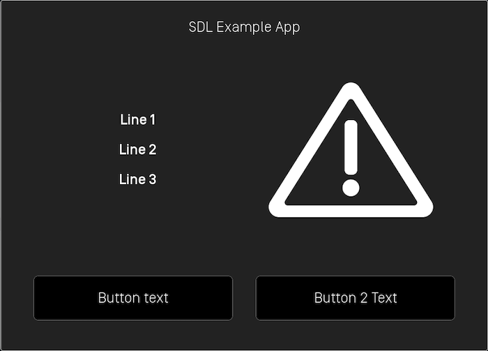

# Alerts
An alert is a pop-up window showing a short message with optional buttons. When an alert is activated, it will abort any SDL operation that is in-progress, except the already-in-progress alert. If an alert is issued while another alert is still in progress, the newest alert will simply be ignored.

Depending the platform, an alert can have up to three lines of text, a progress indicator (e.g. a spinning wheel or hourglass), and up to four soft buttons.

!!! NOTE
The alert will persist on the screen until the timeout has elapsed, or the user dismisses the alert by selecting a button. There is no way to dismiss the alert programmatically other than to set the timeout length.
!!!

## Alert Layouts
###### Alert With No Soft Buttons


!!! NOTE
If no soft buttons are added to an alert some OEMs may add a default "cancel" or "close" button.
!!!

###### Alert With Soft Buttons



## Creating the Alert

### Text
@![iOS]
##### Objective-C
```objc
SDLAlert *alert =  [[SDLAlert alloc] initWithAlertText1:@"<#Line 1#>" alertText2:@"<#Line 2#>" alertText3:@"<#Line 3#>"];
```

##### Swift
```swift
let alert = SDLAlert(alertText1: "<#Line 1#>", alertText2: "<#Line 2#>", alertText3: "<#Line 3#>")
```
!@

@![android,javaSE,javaEE]
` TODO - code example `
!@

### Buttons

@![iOS]
##### Objective-C
```objc
SDLAlert *alert = [[SDLAlert alloc] initWithAlertText1:@"<#Line 1#>" alertText2:@"<#Line 2#>" alertText3:@"<#Line 3#>"];

SDLSoftButton *button1 = [[SDLSoftButton alloc] initWithType:SDLSoftButtonTypeText text:@"<#Button Text#>" image:nil highlighted:false buttonId:<#Soft Button Id#> systemAction:SDLSystemActionDefaultAction handler:^(SDLOnButtonPress *_Nullable buttonPress, SDLOnButtonEvent *_Nullable buttonEvent) {
    if (buttonPress == nil) {
        return;
    }
    <#Button has been pressed#>
}];

SDLSoftButton *button2 = [[SDLSoftButton alloc] initWithType:SDLSoftButtonTypeText text:<#Button Text#> image:nil highlighted:false buttonId:<#Soft Button Id#> systemAction:SDLSystemActionDefaultAction handler:^(SDLOnButtonPress *_Nullable buttonPress, SDLOnButtonEvent *_Nullable buttonEvent) {
    if (buttonPress == nil) {
        return;
    }
    <#Button has been pressed#>
}];

alert.softButtons = @[button1, button2];
```

##### Swift
```swift
let alert = SDLAlert(alertText1: "<#Line 1#>", alertText2: "<#Line 2#>", alertText3: "<#Line 3#>")

let button1 = SDLSoftButton(type: .text, text: <#Button Text#>, image: nil, highlighted: false, buttonId: <#Soft Button Id#>, systemAction: .defaultAction, handler: { buttonPress, buttonEvent in
    guard buttonPress != nil else { return }
    <#Button has been pressed#>
})

let button2 = SDLSoftButton(type: .text, text: <#Button Text#>, image: nil, highlighted: false, buttonId: <#Soft Button Id#>, systemAction: .defaultAction, handler: { buttonPress, buttonEvent in
    guard buttonPress != nil else { return }
    <#Button has been pressed#>
})

alert.softButtons = [button1, button2]
```
!@

@![android,javaSE,javaEE]
` TODO - code example `
!@

### Timeouts
An optional timeout can be added that will dimiss the alert when the duration is over. Typical timeouts are between 3 and 10 seconds. If omitted a default of 5 seconds is used.

@![iOS]
##### Objective-C
```objc
// Duration timeout is in milliseconds
alert.duration = @(4000);
```

##### Swift
```swift
// Duration timeout is in milliseconds
alert.duration = 4000 as NSNumber
```
!@

@![android,javaSE,javaEE]
` TODO - code example `
!@

### Progress Indicator
Not all OEMs support a progress indicator. If supported, the alert will show an animation that indicates that the user must wait (e.g. a spinning wheel or hourglass, etc). If omitted, no progress indicator will be shown.

@![iOS]
##### Objective-C
```objc
alert.progressIndicator = @YES;
```

##### Swift
```swift
alert.progressIndicator = true as NSNumber
```
!@

@![android,javaSE,javaEE]
` TODO - code example `
!@

### Text-To-Speech
An alert can also speak a prompt or play a sound file when the alert appears on the screen. This is done by setting the `ttsChunks` parameter.

#### Text
@![iOS]
##### Objective-C
```objc
alert.ttsChunks = [SDLTTSChunk textChunksFromString:@"<#Text to speak#>"];
```

##### Swift
```swift
alert.ttsChunks = SDLTTSChunk.textChunks(from: "<#Text to speak#>")
```
!@

@![android,javaSE,javaEE]
` TODO - code example `
!@

#### Sound File
The `ttsChunks` parameter can also take a file to play/speak. For more information on how to upload the file please refer to the [Playing Audio Indications](Other SDL Features/Playing Audio Indications) guide.

@![iOS]
##### Objective-C
```objc
 alert.ttsChunks = [SDLTTSChunk fileChunksWithName:@"<#Name#>"];
```
 
##### Swift
```swift
 alert.ttsChunks = SDLTTSChunk.fileChunks(withName: "<#Name#>")
```
!@
 
@![android,javaSE,javaEE]
` TODO - code example `
!@

### Play Tone
To play the alert tone when the alert appears and before the text-to-speech is spoken, set `playTone` to `true`.

@![iOS]
##### Objective-C
```objc
alert.playTone = @YES;
```

##### Swift
```swift
alert.playTone = true as NSNumber
```
!@

@![android,javaSE,javaEE]
` TODO - code example `
!@

## Showing the Alert

@![iOS]
##### Objective-C
```objc
[self.sdlManager sendRequest:alert withResponseHandler:^(SDLRPCRequest *request, SDLRPCResponse *response, NSError *error) {
    if (![response.resultCode isEqualToEnum:SDLResultSuccess]) { return; }
    <#alert was dismissed successfully#>
}];
```

##### Swift
```swift
sdlManager.send(request: alert) { (request, response, error) in
    guard error == nil else { return }
    <#alert was dismissed successfully#>   
}
```
!@

@![android,javaSE,javaEE]
` TODO - code example `
!@
