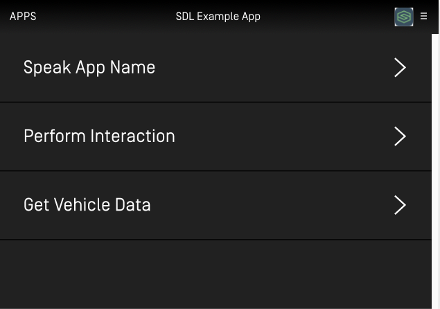
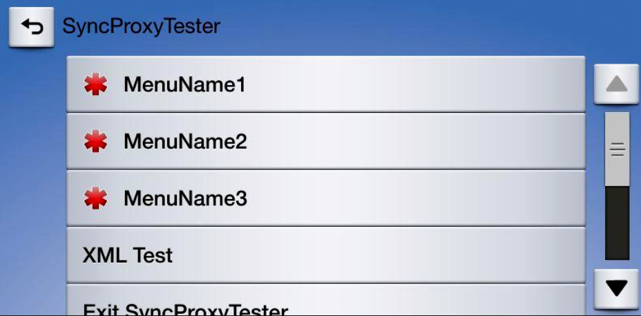

# Main Menu
You have two different options when creating menus. One is to simply add items to the default menu available in every template. The other is to create a custom menu that pops up when needed. You can find more information about these popups in the [Popup Menus and Keyboards](Displaying a User Interface/Popup Menus and Keyboards) section.

Every template has a main menu button. The position of this button varies between templates, and can not be removed from the template. The default menu is initially empty except for an "Exit {App Name}" button. Items can be added to the menu at the root level or to a submenu.

###### Generic HMI


###### Ford HMI


## Adding Menu Items
As of iOS library v6.0, the best way to create and update your menu is the use the Screen Manager API. The screen manager contains two menu related properties: `menu`, and `voiceCommands`. Setting an array of `SDLMenuCell`s into the `menu` property will automatically set and update your menu and submenus, while setting an array of `SDLVoiceCommand`s into the `voiceCommands` property allows you to use "hidden" menu items that only contain voice recognition data. The user can then use the IVI system's voice engine to activate this command even though it will not be displayed within the main menu.

To find out more information on how to create `voiceCommands` see the [related documentation](Displaying a User Interface/Global Voice Commands).

##### Objective-C
```objc
// Create the menu cell
SDLMenuCell *cell = [[SDLMenuCell alloc] initWithTitle:<#Menu Item Text#> icon:<#Menu Item Artwork#> voiceCommands:@[<#Menu Item #>] handler:^(SDLTriggerSource  _Nonnull triggerSource) {
    // Menu item was selected, check the `triggerSource` to know if the user used touch or voice to activate it
    <#Handle the cell's selection#>
}];

self.sdlManager.screenManager.menu = @[cell];
```

##### Swift
```swift
// Create the menu cell
let cell = SDLMenuCell(title: <#String#>, icon: <#SDLArtwork?#>, voiceCommands: <#[String]?#>) { (triggerSource: SDLTriggerSource) in
    // Menu item was selected, check the `triggerSource` to know if the user used touch or voice to activate it
    <#Handle the Cell's Selection#>
}

self.sdlManager.screenManager.menu = [cell]
```

## Adding Submenus
Adding a submenu is as simple as adding subcells to an `SDLMenuCell`. This can currently only be done with one layer of subcells, and automatically displays the submenu when selected.

##### Objective-C
```objc
// Create the inner menu cell
SDLMenuCell *cell = [[SDLMenuCell alloc] initWithTitle:<#Menu Item Text#> icon:<#Menu Item Artwork#> voiceCommands:@[<#Menu Item #>] handler:^(SDLTriggerSource  _Nonnull triggerSource) {
    // Menu item was selected, check the `triggerSource` to know if the user used touch or voice to activate it
    <#Handle the cell's selection#>
}];

// Create and set the submenu cell
SDLMenuCell *submenuCell = [[SDLMenuCell alloc] initWithTitle:<#Menu Item Text#> icon:<#SDLArtwork#> subCells:@[cell]];
self.sdlManager.screenManager.menu = @[submenuCell];
```

##### Swift
```swift
// Create the inner menu cell
let cell = SDLMenuCell(title: <#T##String#>, icon: <#T##SDLArtwork?#>, voiceCommands: <#T##[String]?#>) { (triggerSource: SDLTriggerSource) in
    // Menu item was selected, check the `triggerSource` to know if the user used touch or voice to activate it
    <#code#>
}

let submenuCell = SDLMenuCell(title: <#T##String#>, icon: <#SDLArtwork#>, subCells:<#T##[SDLMenuCell]#>)
self.sdlManager.screenManager.menu = @[submenuCell]
```

### Artworks
Artworks will be automatically handled when using the screen manager API. First, a "non-artwork" menu will be displayed, then, when the artworks have finished uploading, the "artwork-ified" menu will be displayed. If you are doing this manually with RPCs, you will have to upload artworks using the file manager yourself, and send the correct menu when they are ready.

### Deleting Menu Items
When using the screen manager, this will be intelligently handled for you. If you want to show new menu items, simply set a new array of menu cells. If you want to have a blank menu, set an empty array. The screen manager will handle deleting and adding new commands and submenus for you. If you are doing this manually, you must use the `SDLDeleteCommand` and `SDLDeleteSubMenu` RPCs, passing the `cmdID`s you wish to delete.

## Using RPCs
The `SDLAddCommand` RPC can be used to add items to the root menu or to a submenu. Each `SDLAddCommand` RPC must be sent with a unique id, a voice-recognition command, and a set of menu parameters. The menu parameters include the menu name, the position of the item in the menu, and the id of the menu item’s parent. If the menu item is being added to the root menu, then the parent id is 0. If it is being added to a submenu, then the parent id is the submenu’s id.

To create a submenu using RPCs, you must use a `SDLAddSubMenu` RPC with a unique id. When a response is received from the SDL Core, check if the submenu was added successfully. If it was, send an `SDLAddCommand` RPC for each item in the submenu.