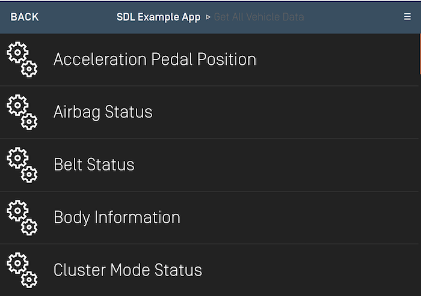
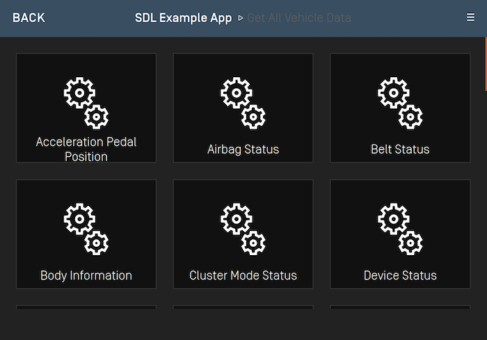
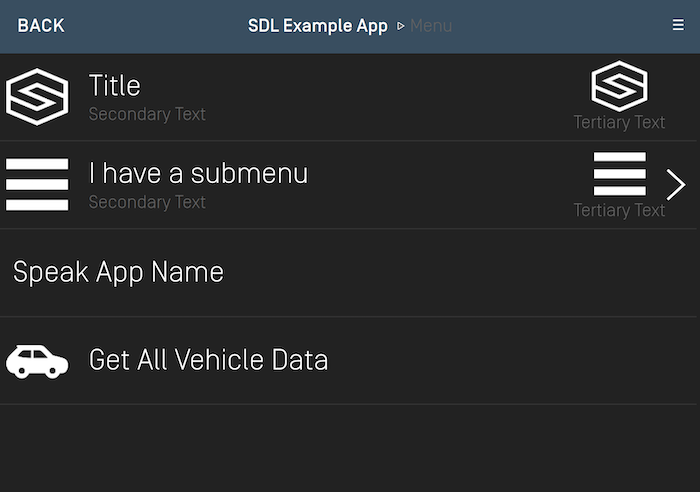
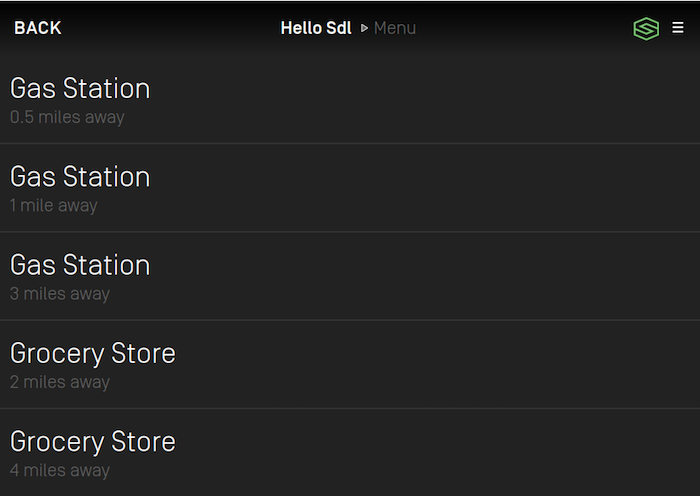
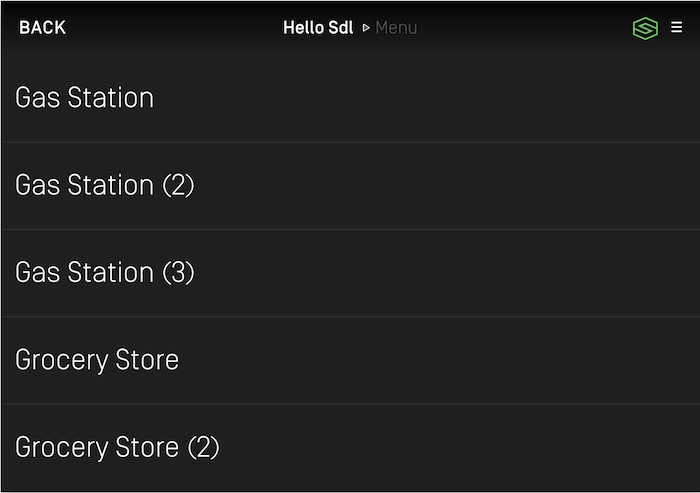

# Main Menu
You have two different options when creating menus. One is to simply add items to the default menu available in every template. The other is to create a custom menu that pops up when needed. You can find more information about these popups in the [Popup Menus](Displaying a User Interface/Popup Menus) section. This guide will cover using the default menu / menu button.

!!! NOTE
Every template has a main menu button. The position of this button varies between templates and cannot be removed from the template. Some OEMs may format certain templates to not display the main menu button if you have no menu items (such as the navigation map view).
!!!

## Setting the Menu Layout (RPC v6.0+)
On some newer head units, you may have the option to display menu items as a grid of tiles instead of the default list layout. To determine if the head unit supports the tiles layout, check the `SystemCapabilityManager`'s @![iOS]`defaultMainWindowCapability.menuLayoutsAvailable`!@@![android,javaEE,javaSE,javascript] `getDefaultMainWindowCapability().getMenuLayoutsAvailable()`!@ property after successfully connecting to the head unit. To set the menu layout using the screen manager, you will need to set the `ScreenManager.menuConfiguration` property.

#### List Menu Layout


#### Grid Menu Layout


@![iOS]
|~
```objc
SDLMenuConfiguration *menuConfiguration = [[SDLMenuConfiguration alloc] initWithMainMenuLayout:<#SDLMenuLayout#> defaultSubmenuLayout:<#SDLMenuLayout#>];
self.sdlManager.screenManager.menuConfiguration = menuConfiguration;
```
```swift
let menuConfiguration = SDLMenuConfiguration(mainMenuLayout: <#SDLMenuLayout#>, defaultSubmenuLayout: <#SDLMenuLayout#>)
sdlManager.screenManager.menuConfiguration = menuConfiguration
```
~|
!@

@![android, javaSE, javaEE]
```java
MenuConfiguration menuConfiguration = new MenuConfiguration(mainMenuLayout, submenuLayout);
sdlManager.getScreenManager().setMenuConfiguration(menuConfiguration);
```
!@

@![javascript]
```javascript
const menuConfiguration = new SDL.manager.screen.menu.MenuConfiguration()
    .setMenuLayout(mainMenuLayout)
    .setSubMenuLayout(submenuLayout);
sdlManager.getScreenManager().setMenuConfiguration(menuConfiguration);
```
!@

## Adding Menu Items 
The best way to create and update your menu is to the use the Screen Manager API. The screen manager contains two menu related properties: `menu`, and `voiceCommands`. Setting an array of @![iOS]`SDLMenuCell`!@@![android, javaSE, javaEE, javascript]`MenuCell`!@s into the `menu` property will automatically set and update your menu and submenus, while setting an array of @![iOS]`SDLVoiceCommand`!@@![android, javaSE, javaEE, javascript]`VoiceCommand`!@s into the `voiceCommands` property allows you to use "hidden" menu items that only contain voice recognition data. The user can then use the IVI system's voice engine to activate this command even though it will not be displayed within the main menu.

To find out more information on how to create `voiceCommands` see the [related documentation](Speech and Audio/Setting Up Voice Commands).



!!! NOTE
Head units supporting RPC v7.1+ may support displaying `secondaryText`, `tertiaryText`, and `secondaryArtwork`. This gives the user a richer experience by displaying more data. Attempting to set this data on head units that do not support RPC 7.1+ will result in that data not being displayed to the user.

To determine if the head unit supports displaying these fields, you can check the `SystemCapabilityManager`'s @![iOS]`defaultMainWindowCapability.textFields` / `defaultMainWindowCapability.imageFields`!@@![android,javaEE,javaSE,javascript] `getDefaultMainWindowCapability().getTextFields()` / `getDefaultMainWindowCapability().getImageFields()`!@ properties after successfully connecting to the head unit. Then check those arrays for objects with the related text / image field names.
!!!

@![iOS]
|~
```objc
// Create the menu cell
SDLMenuCell *cell = [[SDLMenuCell alloc] initWithTitle:<#NSString#> secondaryText:<#(nullable NSString *)#> tertiaryText:<#(nullable NSString *)#> icon:<#SDLArtwork#> secondaryArtwork:<#(nullable SDLArtwork *)#> voiceCommands:<#@[NSString]#> handler:^(SDLTriggerSource  _Nonnull triggerSource) {
    // Menu item was selected, check the `triggerSource` to know if the user used touch or voice to activate it
    <#Handle the cell's selection#>
}];

self.sdlManager.screenManager.menu = @[cell];
```
```swift
// Create the menu cell
let cell = SDLMenuCell(title: <#String#>, secondaryText: <#String?#>, tertiaryText: <#String?#>, icon: <#SDLArtwork?#>, secondaryArtwork: <#SDLArtwork?#>, voiceCommands: <#[String]?#>) { (triggerSource: SDLTriggerSource) in
    // Menu item was selected, check the `triggerSource` to know if the user used touch or voice to activate it
    <#Handle the cell's selection#>
}

sdlManager.screenManager.menu = [cell]
```
~|
!@

@![android, javaSE, javaEE]
```java
// Create the menu cell
MenuCell cell = new MenuCell("Cell text", "Secondary Text", "Tertiary Text", null, null, Collections.singletonList("cell text"), new MenuSelectionListener() {
    @Override
    public void onTriggered(TriggerSource trigger) {
        // Menu item was selected, check the `triggerSource` to know if the user used touch or voice to activate it
        // Handle the Cell's Selection
    }
});

sdlManager.getScreenManager().setMenu(Collections.singletonList(cell));
```
!@

@![javascript]
```javascript
// Create the menu cell
const cell = new SDL.manager.screen.menu.MenuCell('Cell Text')
    .setSecondaryText('Secondary Text')
    .setTertiaryText('Tertiary Text')
    .setVoiceCommands(['cell text'])
    .setMenuSelectionListener(new SDL.manager.screen.menu.MenuSelectionListener()
        .setOnTriggered((trigger) => {
            // Menu item was selected, check the `triggerSource` to know if the user used touch or voice to activate it
            // Handle the Cell's Selection
        }));
```
!@

### Adding Submenus
Adding a submenu is as simple as adding subcells to a @![iOS]`SDLMenuCell`!@@![android, javaSE, javaEE, javascript]`MenuCell`!@. The submenu is automatically displayed when selected by the user. Currently menus only support one layer of subcells. In RPC v6.0+ it is possible to set individual submenus to use different layouts such as tiles or lists.

@![iOS]
|~
```objc
// Create the inner menu cell
SDLMenuCell *cell = [[SDLMenuCell alloc] initWithTitle:<#NSString#> secondaryText:<#(nullable NSString *)#> tertiaryText:<#(nullable NSString *)#> icon:<#SDLArtwork#> secondaryArtwork:<#(nullable SDLArtwork *)#> voiceCommands:<#@[NSString]#> handler:^(SDLTriggerSource  _Nonnull triggerSource) {
    // Menu item was selected, check the `triggerSource` to know if the user used touch or voice to activate it
    <#Handle the cell's selection#>
}];

// Create and set the submenu cell
SDLMenuCell *submenuCell = [[SDLMenuCell alloc] initWithTitle:<#NSString#> secondaryText:<#(nullable NSString *)#> tertiaryText:<#(nullable NSString *)#> icon:<#SDLArtwork?#> secondaryArtwork:<#(nullable SDLArtwork *)#> submenuLayout:<#SDLMenuLayout#> subCells:@[cell]];
self.sdlManager.screenManager.menu = @[submenuCell];
```
```swift
// Create the inner menu cell
let cell = SDLMenuCell(title: <#String#>, secondaryText: <#String?#>, tertiaryText: <#String?#>, icon: <#SDLArtwork?#>, secondaryArtwork: <#SDLArtwork?#>, voiceCommands: <#[String]?#>) { (triggerSource: SDLTriggerSource) in
    // Menu item was selected, check the `triggerSource` to know if the user used touch or voice to activate it
    <#Handle the cell's selection#>
}

let submenuCell = SDLMenuCell(title: <#String#>, secondaryText: <#String?#>, tertiaryText: <#String?#>, icon: <#SDLArtwork?#>, secondaryArtwork: <#SDLArtwork?#>, submenuLayout: <#SDLMenuLayout#>, subCells: [cell])
sdlManager.screenManager.menu = [submenuCell]
```
~|
!@

@![android, javaSE, javaEE]
```java
// Create the inner menu cell
MenuCell innerCell = new MenuCell("inner menu cell", "secondary text", "tertiary test", null, null,Collections.singletonList("inner menu cell"), new MenuSelectionListener() {
    @Override
    public void onTriggered(TriggerSource trigger) {
        // Menu item was selected, check the `triggerSource` to know if the user used touch or voice to activate it
        // Handle the cell's selection
    }
});

// Create and set the submenu cell
MenuCell cell = new MenuCell("cell", "secondary text", "tertiary text", MenuLayout.LIST, null, null, Collections.singletonList(innerCell));

sdlManager.getScreenManager().setMenu(Collections.singletonList(cell));
```
!@

@![javascript]
```javascript
// Create the inner menu cell
const innerCell = new SDL.manager.screen.menu.MenuCell('inner menu cell')
    .setSecondaryText('secondary text')
    .setTertiaryText('tertiary text')
    .setVoiceCommands(['inner menu cell'])
    .setMenuSelectionListener(new SDL.manager.screen.menu.MenuSelectionListener()
        .setOnTriggered((trigger) => {
            // Menu item was selected, check the `triggerSource` to know if the user used touch or voice to activate it
            // Handle the cell's selection
        }));

// Create and set the submenu cell
const cell = new SDL.manager.screen.menu.MenuCell('cell')
    .setSecondaryText('secondary text')
    .setTertiaryText('tertiary text')
    .setMenuLayout(SDL.rpc.enums.MenuLayout.LIST)
    .setSubCells([innerCell]);

sdlManager.getScreenManager().setMenu([cell]);
```
!@

### Menu Item Artwork
Artworks will be automatically handled when using the screen manager API. First, a "non-artwork" menu will be displayed, then, when the artworks have finished uploading, the "artwork-ified" menu will be displayed. If you are doing this manually with RPCs, you will have to upload artworks using the file manager yourself and send the correct menu when they are ready.

### Deleting and Changing Menu Items
The screen manager will intelligently handle deletions for you. If you want to show new menu items, simply set a new array of menu cells. If you want to have a blank menu, set an empty array. On supported systems, the library will calculate the optimal adds / deletes to create the new menu. If the system doesn't support this sort of dynamic updating, the entire list will be removed and re-added.

If you are doing this manually, you must use the `DeleteCommand` and `DeleteSubMenu` RPCs, passing the `cmdID`s you wish to delete.

### Duplicate Menu Titles
Starting with SDL @![android, javaEE, javaSE]v5.1+ menu!@@![iOS]v7.1+ menu!@@![javascript]v1.5+ menu!@ cells and sub-menu cells @![iOS, android, javaEE, javaSE]no longer!@@![javascript]do not!@ require unique titles in order to be presented. For example, if you are trying to display points of interest as a list you can now have multiple locations with the same name but are not the same location. You cannot present multiple cells that are exactly the same. They must have some property that makes them different, such as `secondaryText` or an artwork.

##### RPC v7.1+ Connections
The titles on the menu will be displayed as provided even if there are duplicate titles.


##### RPC v7.0 And Below Connections
The titles on the menu will have a number appended to them when there are duplicate titles.


## Using RPCs
The `AddCommand` RPC can be used to add items to the root menu or to a submenu. Each `AddCommand` RPC must be sent with a unique id, a voice-recognition command, and a set of menu parameters. The menu parameters include the menu name, the position of the item in the menu, and the id of the menu item’s parent. If the menu item is being added to the root menu, then the parent id is 0. If it is being added to a submenu, then the parent id is the submenu’s id.

To create a submenu using RPCs, you must use a `AddSubMenu` RPC with a unique id. When a response is received from the SDL Core, check if the submenu was added successfully. If it was, send an `AddCommand` RPC for each item in the submenu.

!!! NOTE
You should not mix usage of the @![iOS]`SDLScreenManager`!@ @![android, javaSE, javaEE, javascript]`ScreenManager`!@ menu features and menu RPCs described above. You must use either one system or the other, but not both.
!!!