## Main Screen Templates
Each car manufacturer supports a set of user interface templates. These templates determine the position and size of the text, images, and buttons on the screen. Once the app has connected successfully with a SDL enabled accessory, a list of supported templates is available in `SDLManager.systemCapabilityManager.displayCapabilities.templatesAvailable`.

To change a template at any time, send a `SetDisplayLayout` RPC to core.

@![iOS]
##### Objective-C
```objc
SDLSetDisplayLayout* display = [[SDLSetDisplayLayout alloc] initWithPredefinedLayout:SDLPredefinedLayoutGraphicWithText];
[self.sdlManager sendRequest:display withResponseHandler:^(SDLRPCRequest *request, SDLRPCResponse *response, NSError *error) {
    if ([response.resultCode isEqualToEnum:SDLResultSuccess]) {
      // The template has been set successfully
    }
}];
```

##### Swift
```swift
let display = SDLSetDisplayLayout(predefinedLayout: .graphicWithText)
sdlManager.send(request: display) { (request, response, error) in
    if response?.resultCode == .success {
        // The template has been set successfully
    }
}
```
!@

@![android, javaSE, javaEE]
`// TODO: Android / Java content`
!@

### Available Templates
There are fifteen standard templates to choose from, however some head units may only support a subset of these templates. Please check `SystemCapabilityManager` for the supported templates. The following examples show how templates will appear on the [Generic HMI](https://github.com/smartdevicelink/generic_hmi) and [Ford's SYNC 3 HMI](https://developer.ford.com). 

#### Media
###### Generic HMI

###### Ford HMI
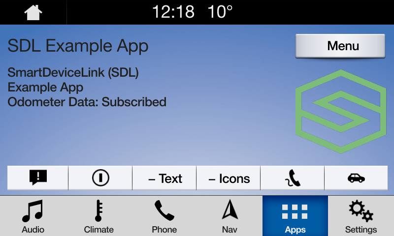

#### Media (with a Progress Bar)
###### Generic HMI

###### Ford HMI


#### Non-Media
###### Generic HMI

###### Ford HMI


#### Graphic with Text
###### Generic HMI

###### Ford HMI
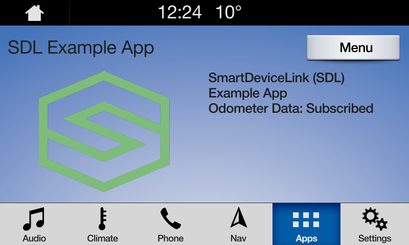

#### Text with Graphic
###### Generic HMI

###### Ford HMI


#### Tiles Only
###### Generic HMI

###### Ford HMI
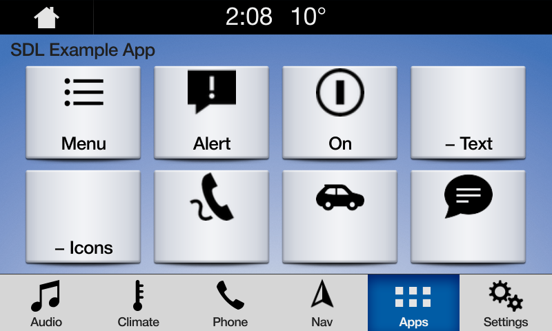

#### Graphic with Tiles
###### Generic HMI
Currently not implemented
###### Ford HMI
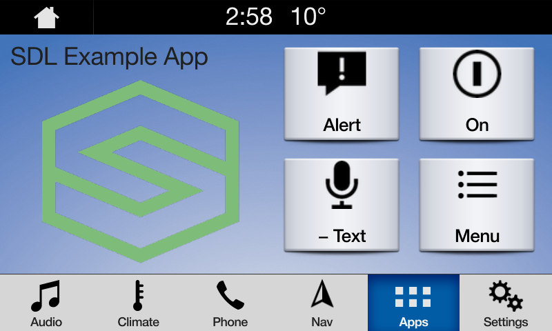

#### Tiles with Graphic
###### Generic HMI
Currently not implemented
###### Ford HMI


#### Graphic with Text and Soft Buttons 
###### Generic HMI
Currently not implemented
###### Ford HMI
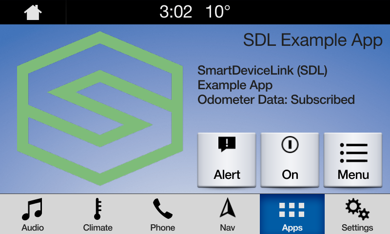

#### Text and Soft Buttons with Graphic 
###### Generic HMI
Currently not implemented
###### Ford HMI
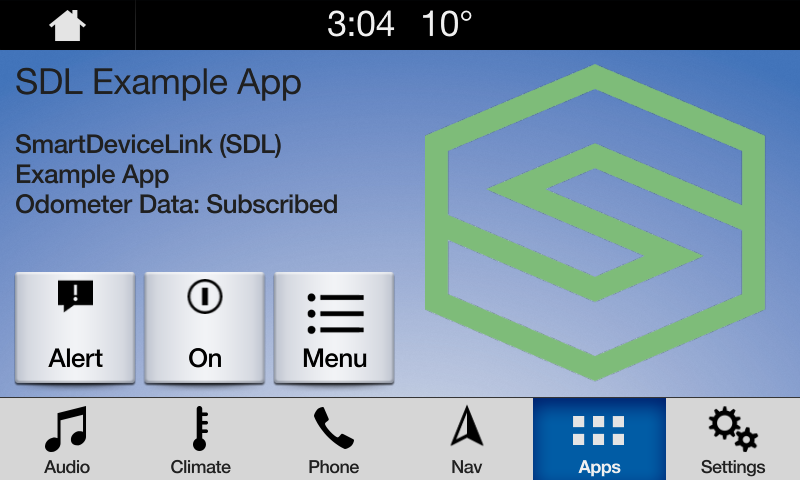

#### Graphic with Text Buttons
###### Generic HMI

###### Ford HMI
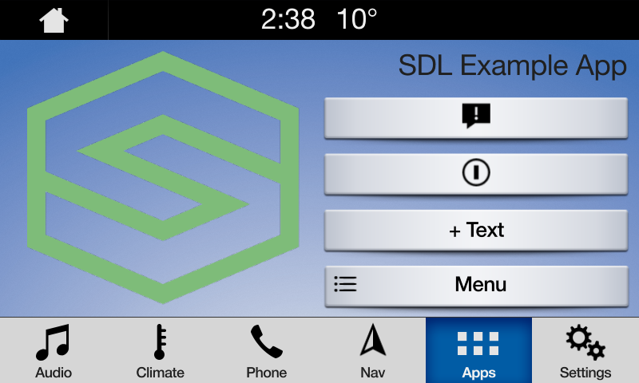

#### Double Graphic with Soft Buttons
###### Generic HMI

###### Ford HMI
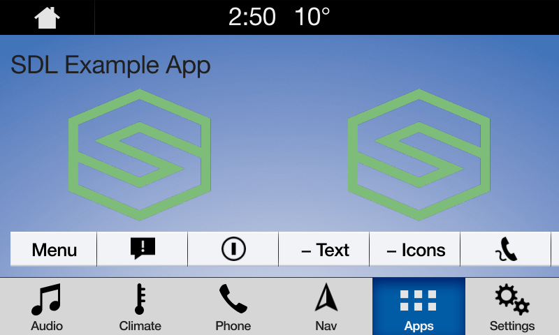

#### Text Buttons with Graphic
###### Generic HMI

###### Ford HMI
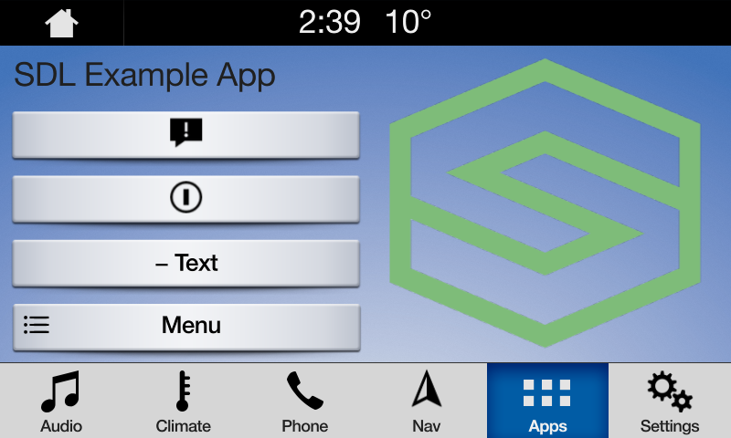

#### Text Buttons Only
###### Generic HMI

###### Ford HMI
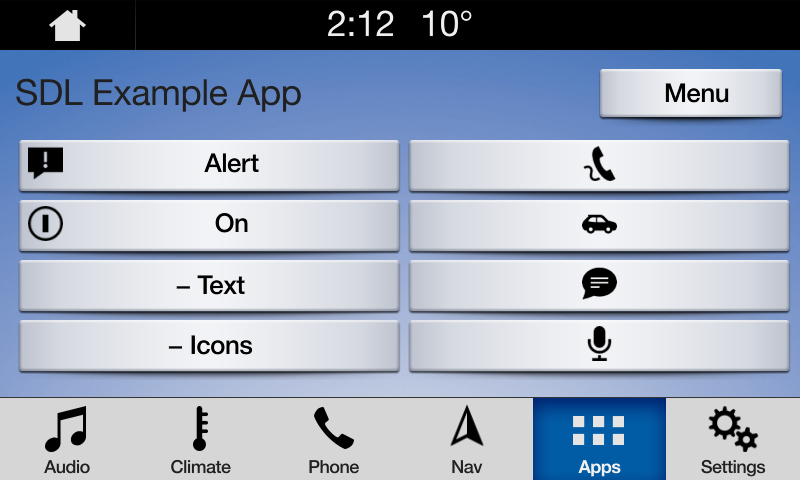

#### Large Graphic with Soft Buttons
###### Generic HMI

###### Ford HMI
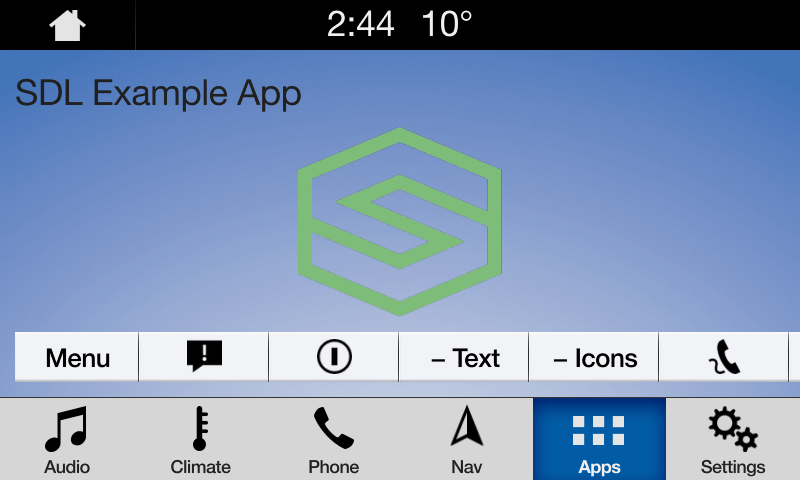

#### Large Graphic Only
###### Generic HMI

###### Ford HMI
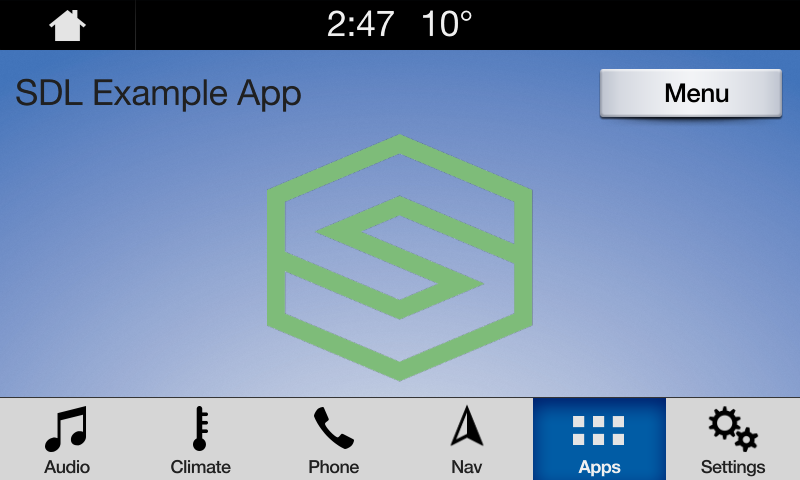
