# Main Screen Templates
Each head unit manufacturer supports a set of user interface templates. These templates determine the position and size of the text, images, and buttons on the screen. Once the app has connected successfully with an SDL enabled head unit, a list of supported templates is available on @![iOS]`SDLManager.systemCapabilityManager.defaultMainWindowCapability.templatesAvailable`!@@![android, javaSE, javaEE, javascript]`sdlManager.getSystemCapabilityManager().getDefaultMainWindowCapability().getTemplatesAvailable()`!@.

## Change the Template
To change a template at any time, use @![iOS]`[SDLScreenManager changeLayout:]`!@@![android, javaSE, javaEE, javascript]`ScreenManager.changeLayout()`!@. This guide requires SDL @![android, javaSE, javaEE]Java Suite version 5.0!@@![iOS]iOS version 7.0!@ @![javascript]JavaScript Suite version 1.2!@. If using an older version, use the `SetDisplayLayout` RPC.

!!! NOTE
When changing the layout, you may get an error or failure if the update is "superseded." This isn't technically a failure, because changing the layout has not yet been attempted. The layout or batched operation was cancelled before it could be completed because another operation was requested. The layout change will then be inserted into the future operation and completed then.
!!!

@![iOS]
|~
```objc
[self.sdlManager.screenManager changeLayout:[[SDLTemplateConfiguration alloc] initWithTemplate:SDLPredefinedLayoutGraphicWithText] withCompletionHandler:^(NSError * _Nullable error) {
    if (error != nil) {
        // Print out the error if there is one and return early
        return;
    }
    // The template has been set successfully
}];
```
```swift
sdlManager.screenManager.changeLayout(SDLTemplateConfiguration(predefinedLayout: .graphicWithText)) { err in
    if let error = err {
        // Print out the error if there is one and return early
        return
    }
    // The template has been set successfully
}
```
~|
!@

@![android, javaSE, javaEE]
```java
TemplateConfiguration templateConfiguration = new TemplateConfiguration().setTemplate(PredefinedLayout.GRAPHIC_WITH_TEXT.toString());
sdlManager.getScreenManager().changeLayout(templateConfiguration, new CompletionListener() {
    @Override
    public void onComplete(boolean success) {
        if (success) {
            DebugTool.logInfo(TAG, "Layout set successfully");
        } else {
            DebugTool.logInfo(TAG, "Layout not set successfully");
        }
    }
});
```
!@

@![javascript]
```js
const templateConfiguration = new SDL.rpc.structs.TemplateConfiguration()
    .setTemplate(SDL.rpc.enums.PredefinedLayout.GRAPHIC_WITH_TEXT);
    
const success = await sdlManager.getScreenManager().changeLayout(templateConfiguration);
if (success) {
    console.log('Layout set successfully');
} else {
    console.log('Layout not set successfully');
}
```
!@

Template changes can also be batched with text and graphics updates:

@![iOS]
|~
```objc
[self.sdlManager.screenManager beginUpdates];
self.sdlManager.screenManager.textField1 = "Line of Text";
[self.sdlManager.screenManager changeLayout:[[SDLTemplateConfiguration alloc] initWithTemplate:SDLPredefinedLayoutGraphicWithText] withCompletionHandler:^(NSError * _Nullable error) {
    // This listener will be ignored, and will use the handler sent in endUpdatesWithCompletionHandler.
}];
self.sdlManager.screenManager.primaryGraphic = <#SDLArtwork#>;
[self.sdlManager.screenManager endUpdatesWithCompletionHandler:^(NSError * _Nullable error) {
    if (error != nil) {
        // Print out the error if there is one and return early
        return
    }
    // The data and template has been set successfully
}];
```
```swift
sdlManager.screenManager.beginUpdates()
sdlManager.screenManager.textField1 = "Line of Text"
sdlManager.screenManager.changeLayout(SDLTemplateConfiguration(predefinedLayout: .graphicWithText)) { err in
    // This listener will be ignored, and will use the handler set in the endUpdates call.
}
sdlManager.screenManager.primaryGraphic = <#SDLArtwork#>
sdlManager.screenManager.endUpdates { err in
    if let error = err {
        // Print out the error if there is one and return early
        return
    }
    // The data and template has been set successfully
}
```
~|
!@

@![android, javaSE, javaEE]
```java
sdlManager.getScreenManager().beginTransaction();
sdlManager.getScreenManager().setTextField1("Line of Text");
sdlManager.getScreenManager().changeLayout(templateConfiguration, new CompletionListener() {
    @Override
    public void onComplete(boolean success) {
        // This listener will be ignored, and will use the CompletionListener sent in commit.
    }
});
sdlManager.getScreenManager().setPrimaryGraphic(sdlArtwork);
sdlManager.getScreenManager().commit(new CompletionListener() {
    @Override
    public void onComplete(boolean success) {
        if (success) {
            DebugTool.logInfo(TAG, "The data and template have been set successfully");
        }
    }
});
```
!@

@![javascript]
```js
sdlManager.getScreenManager().beginTransaction();
sdlManager.getScreenManager().setTextField1('Line of Text');
// The promise returned by changeLayout will not resolve because it is part of a batch update, and the await operator should be avoided as a result
sdlManager.getScreenManager().changeLayout(templateConfiguration);
sdlManager.getScreenManager().setPrimaryGraphic(artwork);
const success = await sdlManager.getScreenManager().commit();
if (success) {
    console.log('Text, Graphic, and Template changed successful');
}
```
!@

@![iOS]
When changing screen layouts or template fields, it is highly recommended to encapsulate these updates into a class or method. Doing so is a good way to keep SDL UI changes organized. An example of this can be seen in the [example weather app](https://github.com/SmartDeviceLink-Examples/example_weather_app_ios). See below for another example:

|~
```objc
// CustomSDLScreen.h - Protcol
@class SDLManager;

@protocol CustomSDLScreen <NSObject>

@required
- (instancetype)initWithManager:(SDLManager *)sdlManager;
- (void)showScreen;

@end

// HomeSDLScreen.h
#import <Foundation/Foundation.h>
#import "CustomSDLScreen.h"

@class HomeDataModel;
@class SDLManager;
@class SDLScreenManager;

NS_ASSUME_NONNULL_BEGIN

@interface HomeSDLScreen : NSObject<CustomSDLScreen>

@end

NS_ASSUME_NONNULL_END

// HomeSDLScreen.m
#import "HomeSDLScreen.h"

#import "CustomSDLScreen.h"
#import "HomeDataModel.h"
#import "SmartDeviceLink.h"

@interface HomeSDLScreen()

@property (strong, nonatomic) SDLManager *sdlManager;
@property (assign, nonatomic) HomeDataModel *homeDataModel;

@end

@implementation HomeSDLScreen

- (instancetype)initWithManager:(SDLManager *)sdlManager {
    _sdlManager = sdlManager;
    _homeDataModel = HomeDataModel();
}

- (void)showScreen {
    [self.sdlManager.screenManager beginUpdates];
    [self.sdlManager.screenManager changeLayout:[[SDLTemplateConfiguration alloc] initWithTemplate:SDLPredefinedLayoutGraphicWithText] withCompletionHandler:nil];
    self.sdlManager.screenManager.textField1 = self.homeDataModel.text1;
    self.sdlManager.screenManager.textField2 = self.homeDataModel.text2;
    self.sdlManager.screenManager.textField3 = self.homeDataModel.text3;
    self.sdlManager.screenManager.textField4 = self.homeDataModel.text4;
    self.sdlManager.screenManager.softButtonObjects = @[];
    self.sdlManager.screenManager.primaryGraphic = <#SDLArtwork#>;
    [self.sdlManager.screenManager endUpdates];
}

@end

// ButtonSDLScreen.h
#import <Foundation/Foundation.h>
#import "CustomSDLScreen.h"

@class ButtonDataModel;
@class SDLManager;
@class SDLScreenManager;

NS_ASSUME_NONNULL_BEGIN

@interface ButtonSDLScreen : NSObject<CustomSDLScreen>

@end

NS_ASSUME_NONNULL_END

// ButtonSDLScreen.m
#import "ButtonSDLScreen.h"

#import "ButtonDataModel.h"
#import "CustomSDLScreen.h"
#import "SmartDeviceLink.h"

@interface ButtonSDLScreen()

@property (strong, nonatomic) SDLManager *sdlManager;
@property (assign, nonatomic) ButtonDataModel *buttonDataModel;

@end

@implementation ButtonSDLScreen

- (instancetype)initWithManager:(SDLManager *)sdlManager {
    _sdlManager = sdlManager;
    _buttonDataModel = ButtonDataModel();
}

- (void)showScreen {
    [self.sdlManager.screenManager beginUpdates];
    [self.sdlManager.screenManager changeLayout:[[SDLTemplateConfiguration alloc] initWithTemplate:SDLPredefinedLayoutTilesOnly] withCompletionHandler:nil];
    self.sdlManager.screenManager.textField1 = self.buttonDataModel.text1;
    self.sdlManager.screenManager.textField2 = self.buttonDataModel.text2;
    self.sdlManager.screenManager.textField3 = self.buttonDataModel.text3;
    self.sdlManager.screenManager.textField4 = self.buttonDataModel.text4;
    self.sdlManager.screenManager.softButtonObjects = self.buttonDataModel.buttons;
    [self.sdlManager.screenManager endUpdates];
}

@end

// DataSDLScreen.h
#import <Foundation/Foundation.h>
#import "CustomSDLScreen.h"

@class DataModel;
@class SDLManager;
@class SDLScreenManager;

NS_ASSUME_NONNULL_BEGIN

@interface DataSDLScreen : NSObject<CustomSDLScreen>

@end

NS_ASSUME_NONNULL_END

// DataSDLScreen.m
#import "DataSDLScreen.h"

#import "DataModel.h"
#import "CustomSDLScreen.h"
#import "SmartDeviceLink.h"

@interface DataSDLScreen()

@property (strong, nonatomic) SDLManager *sdlManager;
@property (assign, nonatomic) DataModel *dataModel;

@end

@implementation DataSDLScreen

- (instancetype)initWithManager:(SDLManager *)sdlManager {
    _sdlManager = sdlManager;
    _buttonDataModel = DataModel();
}

- (void)showScreen {
    [self.sdlManager.screenManager beginUpdates];
    [self.sdlManager.screenManager changeLayout:[[SDLTemplateConfiguration alloc] initWithTemplate:SDLPredefinedLayoutTextWithGraphic] withCompletionHandler:nil];
    self.sdlManager.screenManager.textField1 = self.dataModel.text1;
    self.sdlManager.screenManager.textField2 = self.dataModel.text2;
    self.sdlManager.screenManager.textField3 = self.dataModel.text3;
    self.sdlManager.screenManager.textField4 = self.dataModel.text4;
    self.sdlManager.screenManager.softButtonObjects = @[];
    [self.sdlManager.screenManager endUpdates];
}

@end
```
```swift
import Foundation
import SmartDeviceLink
import SmartDeviceLinkSwift

protocol CustomSDLScreen {
    init(sdlManager: SDLManager)
    func showScreen()
}

struct HomeSDLScreen: CustomSDLScreen {
    let sdlManager: SDLManager
    let homeDataModel = HomeDataModel()

    init(sdlManager: SDLManager) {
        self.sdlManager = sdlManager
    }

    func showScreen() {
        self.sdlManager.screenManager.beginUpdates()
        self.sdlManager.screenManager.changeLayout(SDLTemplateConfiguration(predefinedLayout: .graphicWithText))
        self.sdlManager.screenManager.textField1 = homeDataModel.text1
        self.sdlManager.screenManager.textField2 = homeDataModel.text2
        self.sdlManager.screenManager.textField3 = homeDataModel.text3
        self.sdlManager.screenManager.textField4 = homeDataModel.text4
        self.sdlManager.screenManager.softButtonObjects = []
        self.sdlManager.screenManager.endUpdates()
    }

}

struct ButtonSDLScreen: CustomSDLScreen {
    let sdlManager: SDLManager
    let buttonDataModel = ButtonDataModel()

    init(sdlManager: SDLManager) {
        self.sdlManager = sdlManager
    }

    func showScreen() {
        self.sdlManager.screenManager.beginUpdates()
        self.sdlManager.screenManager.changeLayout(SDLTemplateConfiguration(predefinedLayout: .tilesOnly))
        self.sdlManager.screenManager.textField1 = buttonDataModel.text1
        self.sdlManager.screenManager.textField2 = buttonDataModel.text2
        self.sdlManager.screenManager.textField3 = buttonDataModel.text3
        self.sdlManager.screenManager.textField4 = buttonDataModel.text4
        self.sdlManager.screenManager.softButtonObjects = buttonDataModel.buttons
        self.sdlManager.screenManager.endUpdates()
    }
}

struct DataSDLScreen: CustomSDLScreen {
    let sdlManager: SDLManager
    let dataModel = DataModel()

    init(sdlManager: SDLManager) {
        self.sdlManager = sdlManager
    }

    func showScreen() {
        self.sdlManager.screenManager.beginUpdates()
        self.sdlManager.screenManager.changeLayout(SDLTemplateConfiguration(predefinedLayout: .textWithGraphic))
        self.sdlManager.screenManager.textField1 = dataModel.text1
        self.sdlManager.screenManager.textField2 = dataModel.text2
        self.sdlManager.screenManager.textField3 = dataModel.text3
        self.sdlManager.screenManager.textField4 = dataModel.text4
        self.sdlManager.screenManager.softButtonObjects = []
        self.sdlManager.screenManager.endUpdates()
    }
}
```
~|
!@

@![android]
When changing screen layouts or template fields, it is highly recommended to encapsulate these updates into a class or a method. Doing so is a good way to keep SDL UI changes organized. An example of this can be seen in the [example weather app](https://github.com/SmartDeviceLink-Examples/example_weather_app_android).
!@

@![javaEE,javaSE,javascript]
When changing screen layouts or template fields, it is highly recommended to encapsulate these updates into a class or a method. Doing so is a good way to keep SDL UI changes organized.
!@

## Available Templates
There are fifteen standard templates to choose from, however some head units may only support a subset of these templates. The following examples show how templates will appear on the [Generic HMI](https://github.com/smartdevicelink/generic_hmi) and [Ford's SYNC® 3 HMI](https://developer.ford.com).

#### Media
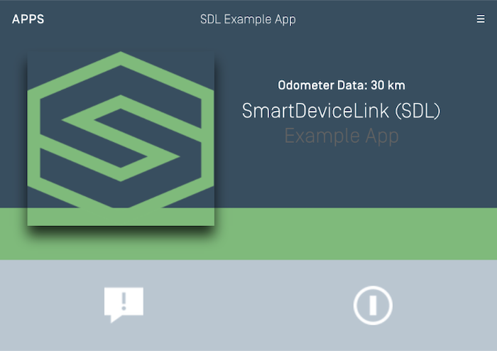

#### Media (with a Progress Bar)
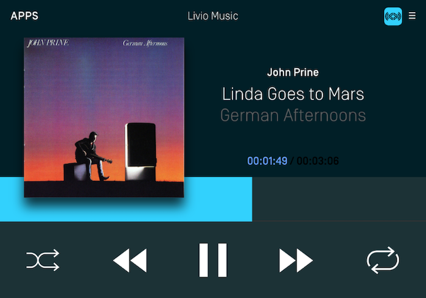

#### Non-Media


#### Graphic with Text
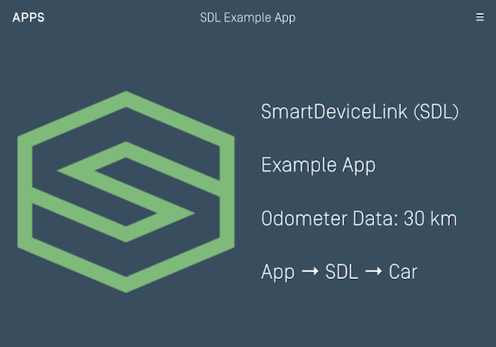

#### Text with Graphic
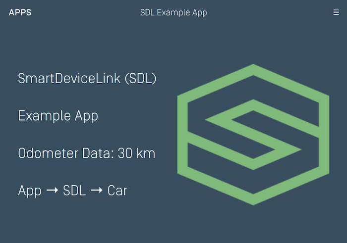

#### Tiles Only
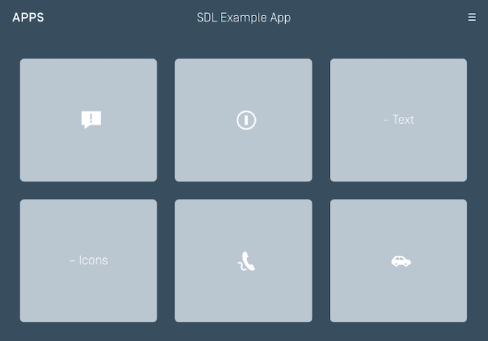

#### Graphic with Tiles


#### Tiles with Graphic
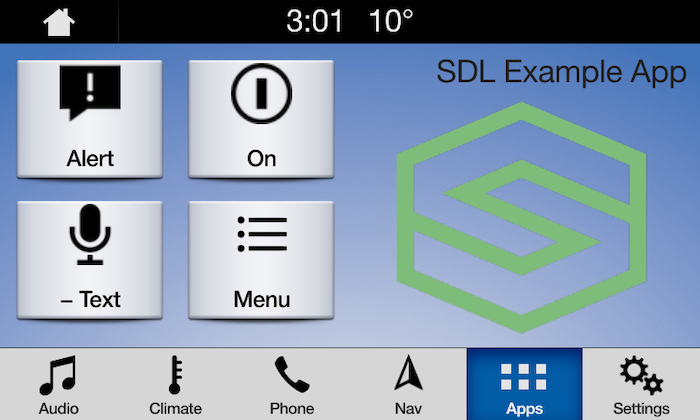

#### Graphic with Text and Soft Buttons
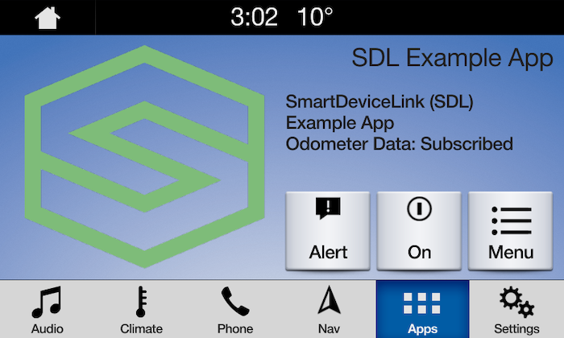

#### Text and Soft Buttons with Graphic
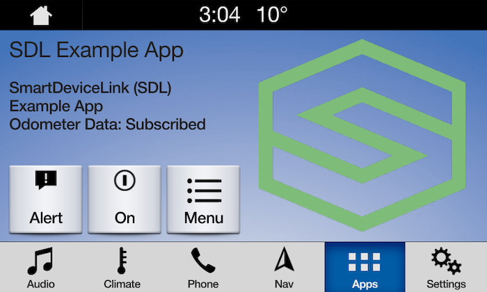

#### Graphic with Text Buttons
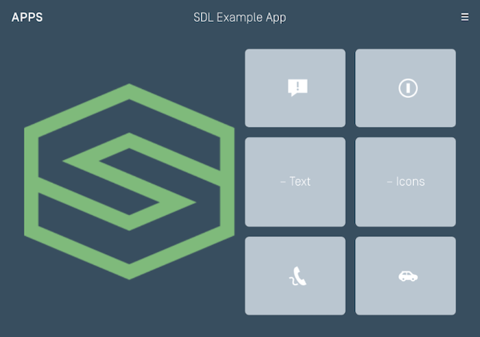

#### Double Graphic with Soft Buttons
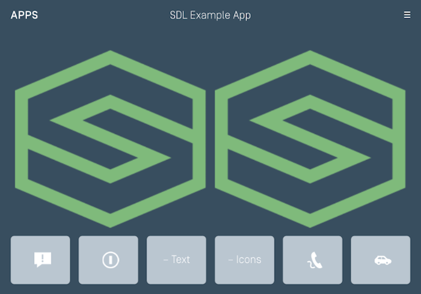

#### Text Buttons with Graphic
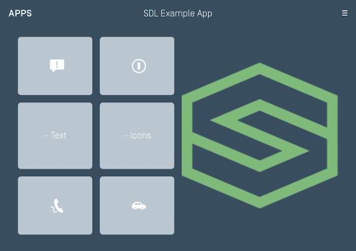

#### Text Buttons Only
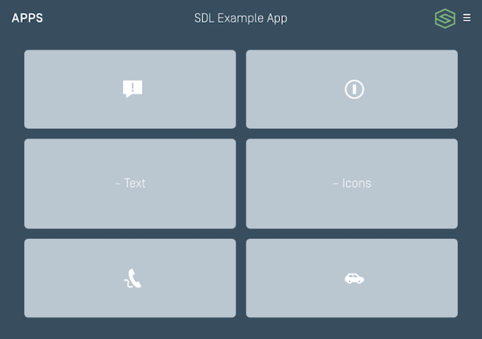

#### Large Graphic with Soft Buttons
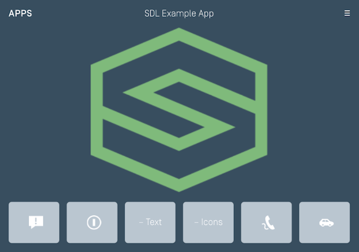

#### Large Graphic Only
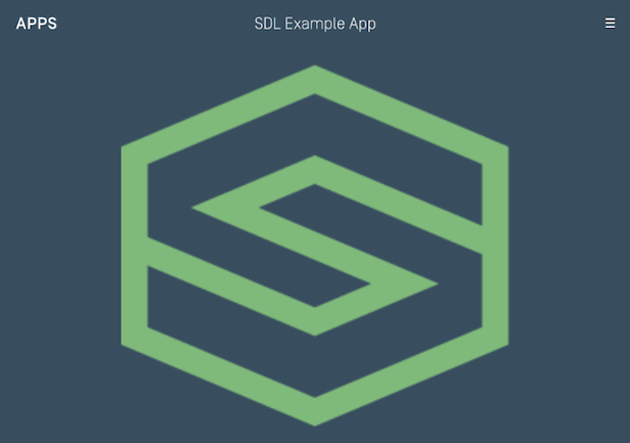
