## Main Screen Templates
Each car manufacturer supports a set of templates for the user interface. These templates determine the position and size of the text, images, and buttons on the screen. A list of supported templates is sent in `SDLManager.systemCapabilityManager.displayCapabilities.templatesAvailable`.

To change a template at any time, send a `SDLSetDisplayLayout` RPC to the SDL Core. If you want to ensure that the new template is used, wait for a response from the SDL Core before sending any more user interface RPCs.

##### Objective-C
```objc
SDLSetDisplayLayout* display = [[SDLSetDisplayLayout alloc] initWithPredefinedLayout:SDLPredefinedLayoutGraphicWithText];
[self.sdlManager sendRequest:display withResponseHandler:^(SDLRPCRequest *request, SDLRPCResponse *response, NSError *error) {
    if ([response.resultCode isEqualToEnum:SDLResultSuccess]) {
      // The template has been set successfully
    }
}];
```

##### Swift
```swift
let display = SDLSetDisplayLayout(predefinedLayout: .graphicWithText)
sdlManager.send(request: display) { (request, response, error) in
    if response?.resultCode == .success {
        // The template has been set successfully
    }
}
```

### Available Templates
There are fifteen standard templates to choose from, however some head units may only support a subset of these templates. Please check `SystemCapabilityManager` for the supported templates. The following examples show how templates will appear on the [Generic HMI](https://github.com/smartdevicelink/generic_hmi) and [Ford's SYNC 3 HMI](https://developer.ford.com). 

##### Media - with and without progress bar
###### Generic HMI
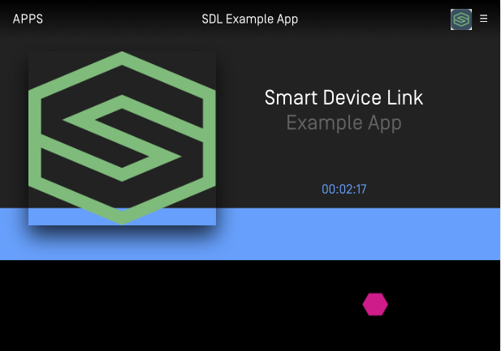

###### Ford HMI
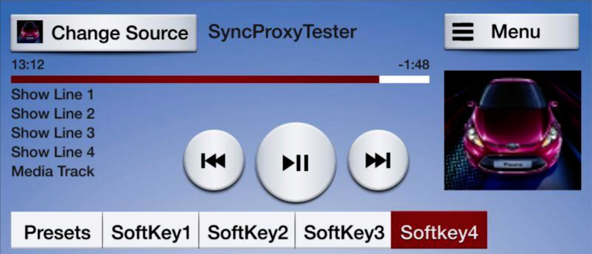

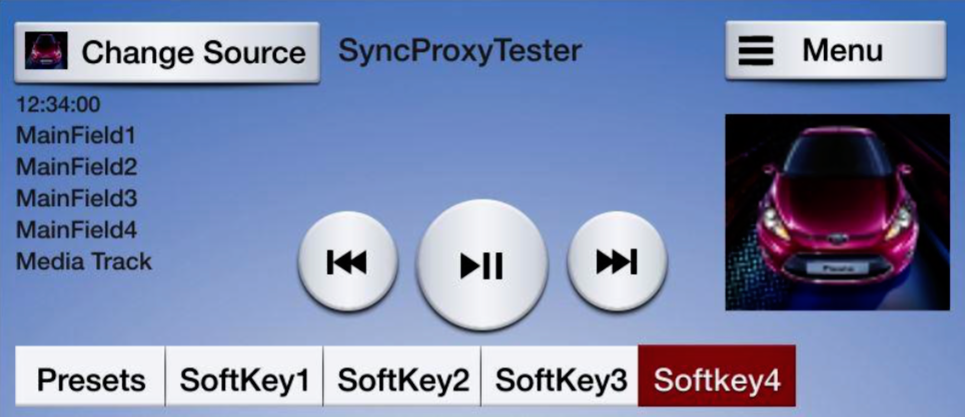

##### Non-Media - with and without soft buttons
###### Generic HMI
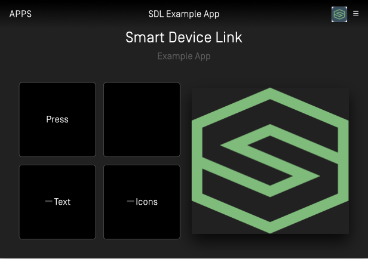

###### Ford HMI
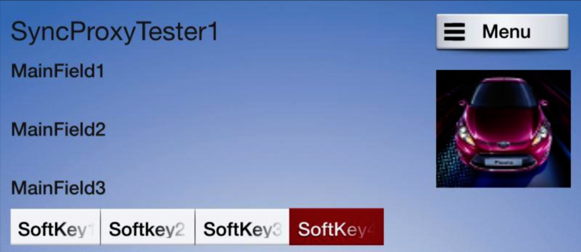

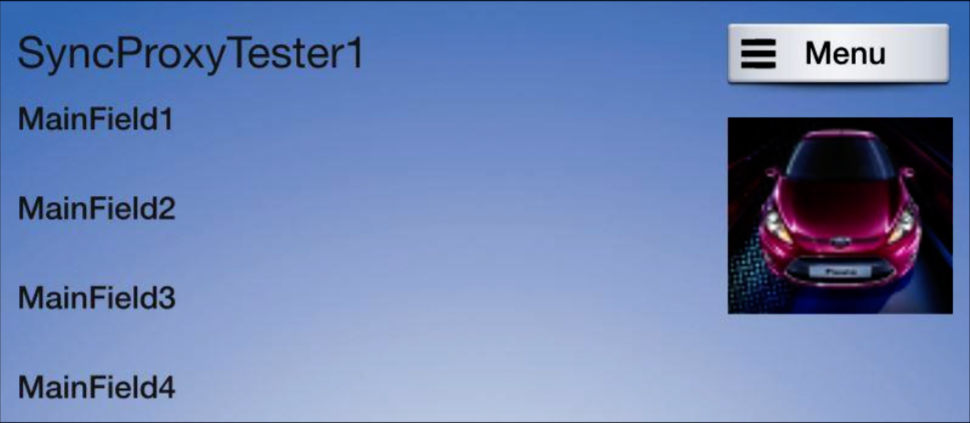

##### GRAPHIC_WITH_TEXT
###### Ford HMI
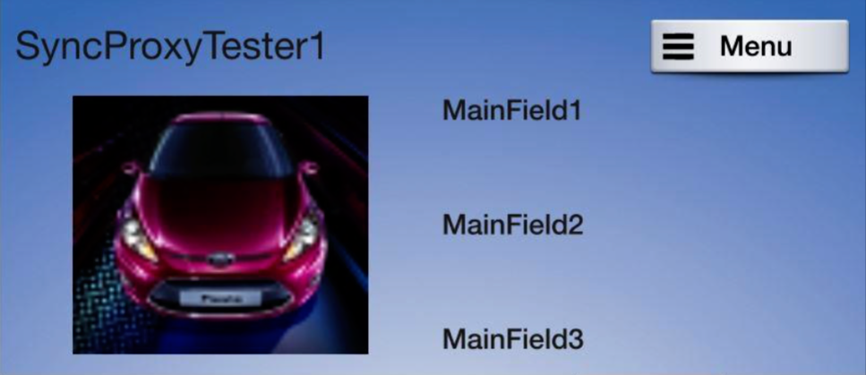

##### TEXT_WITH_GRAPHIC
###### Ford HMI
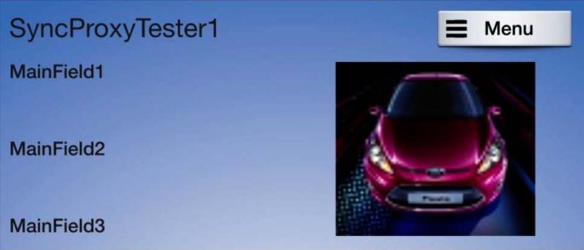

##### TILES_ONLY
###### Ford HMI
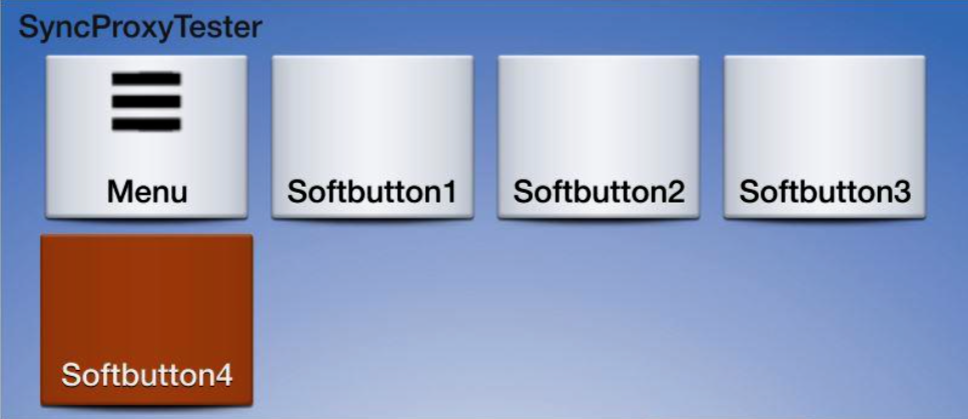

##### GRAPHIC_WITH_TILES
###### Ford HMI
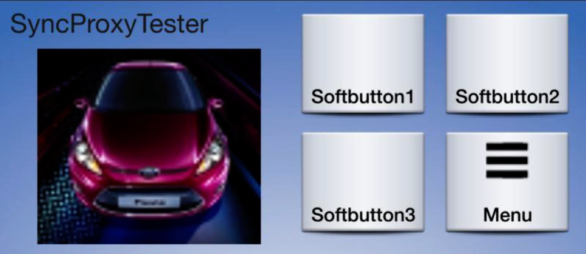

##### TILES_WITH_GRAPHIC
###### Ford HMI
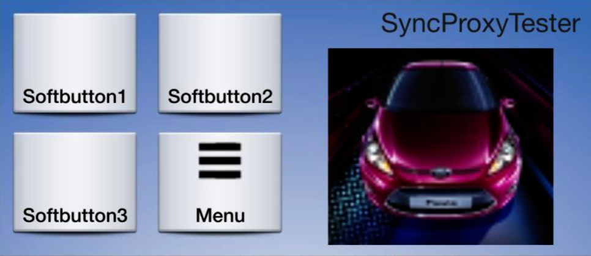

##### GRAPHIC_WITH_TEXT_AND_SOFTBUTTONS
###### Ford HMI
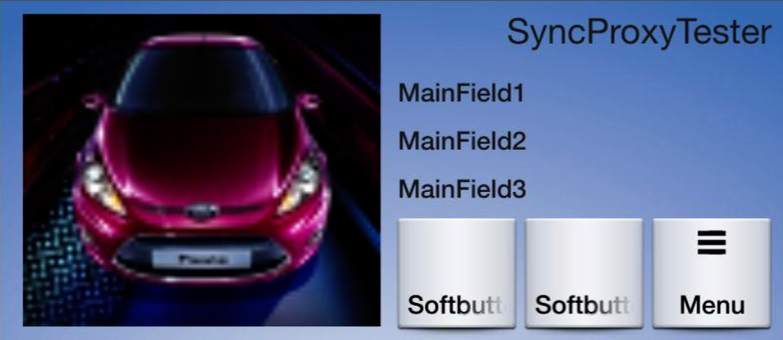

##### TEXT_AND_SOFTBUTTONS_WITH_GRAPHIC
###### Ford HMI
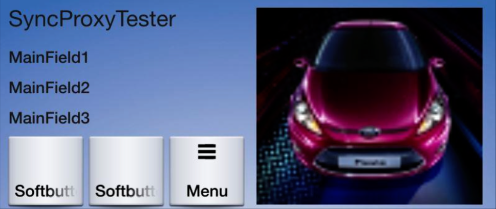

##### GRAPHIC_WITH_TEXTBUTTONS
###### Ford HMI
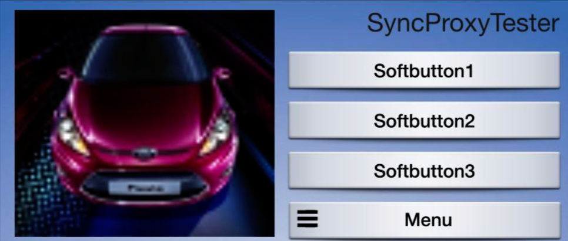

##### DOUBLE_GRAPHIC_SOFTBUTTONS
###### Ford HMI
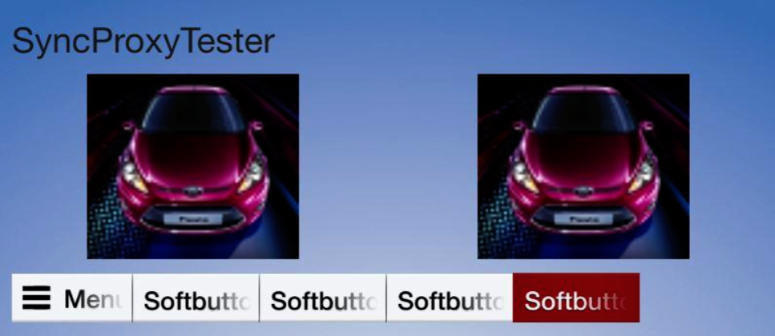

##### TEXTBUTTONS_WITH_GRAPHIC
###### Ford HMI


##### TEXTBUTTONS_ONLY
###### Ford HMI
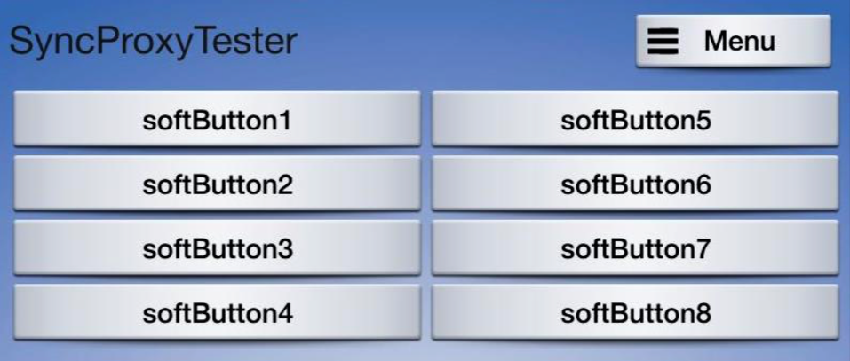

##### LARGE_GRAPHIC_WITH_SOFTBUTTONS
###### Generic HMI
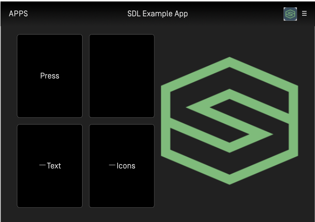

###### Ford HMI


##### LARGE_GRAPHIC_ONLY
###### Generic HMI
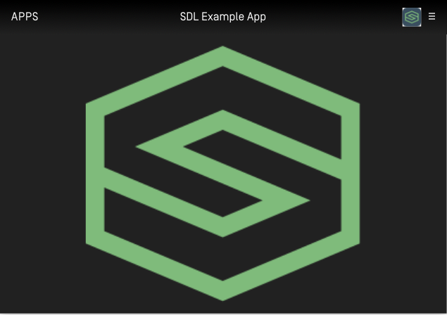

###### Ford HMI

