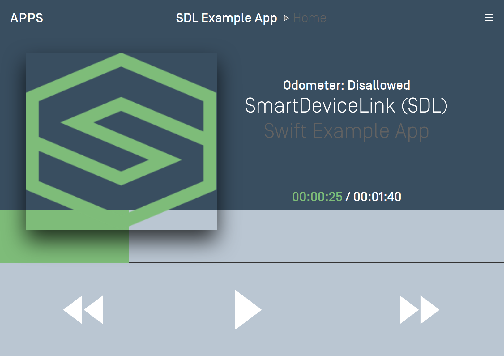

# Media Clock
The media clock is used by media apps to present the current timing information of a playing media item such as a song, podcast, or audiobook.

The media clock consists of three parts: the progress bar, a current position label and a remaining time label. In addition you may want to update the play/pause button icon to reflect the current state of the audio. 

!!! NOTE
Ensure your app has an `appType` of media and you are using the media template before implementing this feature.
!!!


## Counting Up
In order to count up using the timer, you will need to set a start time that is less than the end time. The "bottom end" of the media clock will always start at `0:00` and the "top end" will be the end time you specified. The start time can be set to any position between 0 and the end time. For example, if you are starting a song at `0:30` and it ends at `4:13` the media clock timer progress bar will start at the `0:30` position and start incrementing up automatically every second until it reaches `4:13`. The current position label will start counting upwards from `0:30` and the remaining time label will start counting down from `3:43`. When the end is reached, the current time label will read `4:13`, the remaining time label will read `0:00` and the progress bar will stop moving.

The play / pause indicator parameter is used to update the play / pause button to your desired button type. This is explained below in the section "Updating the Audio Indicator"

@![iOS]
##### Objective-C
```objc
SDLSetMediaClockTimer *mediaClock = [SDLSetMediaClockTimer countUpFromStartTimeInterval:30 toEndTimeInterval:253 playPauseIndicator:SDLAudioStreamingIndicatorPause];
[self.sdlManager sendRequest:mediaClock];
```

##### Swift
```swift
let mediaClock = SDLSetMediaClockTimer.countUp(from: 30, to: 253, playPauseIndicator: .pause)
sdlManager.send(mediaClock)
```
!@

@![android, javaSE, javaEE]
```java
SetMediaClockTimer mediaClock = new SetMediaClockTimer().countUpFromStartTimeInterval(30, 253, AudioStreamingIndicator.PAUSE);
sdlManager.sendRPC(mediaClock);
```
!@

@![javascript]
```js
const mediaClock = new SDL.rpc.messages.SetMediaClockTimer()
    .setUpdateMode(SDL.rpc.enums.UpdateMode.COUNTUP)
    .setStartTime(
        new SDL.rpc.structs.StartTime()
            .setSeconds(30)
    ).setEndTime(
        new SDL.rpc.structs.StartTime()
            .setStartTime(253)
    ).setAudioStreamingIndicator(SDL.rpc.enums.AudioStreamingIndicator.PAUSE);

// sdl_javascript_suite v1.1+
sdlManager.sendRpcResolve(mediaClock);
// Pre sdl_javascript_suite v1.1
sdlManager.sendRpc(mediaClock);
```
!@

## Counting Down
Counting down is the opposite of counting up (I know, right?). In order to count down using the timer, you will need to set a start time that is greater than the end time. The timer bar moves from right to left and the timer will automatically count down. For example, if you're counting down from `10:00` to `0:00`, the progress bar will be at the leftmost position and start decrementing every second until it reaches `0:00`.

@![iOS]
##### Objective-C
```objc
SDLSetMediaClockTimer *mediaClock = [SDLSetMediaClockTimer countDownFromStartTimeInterval:600 toEndTimeInterval:0 playPauseIndicator:SDLAudioStreamingIndicatorPause];
[self.sdlManager sendRequest:mediaClock];
```

##### Swift
```swift
let mediaClock = SDLSetMediaClockTimer.countDown(from: 600, to: 0, playPauseIndicator: .pause)
sdlManager.send(mediaClock)
```
!@

@![android, javaSE, javaEE]
```java
SetMediaClockTimer mediaClock = new SetMediaClockTimer().countDownFromStartTimeInterval(600, 0, AudioStreamingIndicator.PAUSE);
sdlManager.sendRPC(mediaClock);
```
!@

@![javascript]
```js
const mediaClock = new SDL.rpc.messages.SetMediaClockTimer()
    .setUpdateMode(SDL.rpc.enums.UpdateMode.COUNTDOWN)
    .setStartTime(
        new SDL.rpc.structs.StartTime()
            .setStartTime(600)
    ).setEndTime(
        new SDL.rpc.structs.StartTime()
            .setStartTime(0)
    ).setAudioStreamingIndicator(SDL.rpc.enums.AudioStreamingIndicator.PAUSE);

// sdl_javascript_suite v1.1+
sdlManager.sendRpcResolve(mediaClock);
// Pre sdl_javascript_suite v1.1
sdlManager.sendRpc(mediaClock);
```
!@

## Pausing & Resuming
When pausing the timer, it will stop the timer as soon as the request is received and processed. When a resume request is sent, the timer begins again at the paused time as soon as the request is processed. You can update the start and end times using a pause command to change the timer while remaining paused.

@![iOS]
##### Objective-C
```objc
SDLSetMediaClockTimer *mediaClock = [SDLSetMediaClockTimer pauseWithPlayPauseIndicator:SDLAudioStreamingIndicatorPlay];
[self.sdlManager sendRequest:mediaClock];
```

```objc
SDLSetMediaClockTimer *mediaClock = [SDLSetMediaClockTimer resumeWithPlayPauseIndicator:SDLAudioStreamingIndicatorPause];
[self.sdlManager sendRequest:mediaClock];
```

```objc
SDLSetMediaClockTimer *mediaClock = [SDLSetMediaClockTimer updatePauseWithNewStartTimeInterval:60 endTimeInterval:240 playPauseIndicator:SDLAudioStreamingIndicatorPlay];
[self.sdlManager sendRequest:mediaClock];
```

##### Swift
```swift
let mediaClock = SDLSetMediaClockTimer.pause(playPauseIndicator: .play)
sdlManager.send(mediaClock)
```

```swift
let mediaClock = SDLSetMediaClockTimer.resume(playPauseIndicator: .pause)
sdlManager.send(mediaClock)
```

```swift
let mediaClock = SDLSetMediaClockTimer.pause(newStart: 60, newEnd: 240, playPauseIndicator: .play)
sdlManager.send(mediaClock)
```
!@

@![android, javaSE, javaEE]
```java
SetMediaClockTimer mediaClock = new SetMediaClockTimer().pauseWithPlayPauseIndicator(AudioStreamingIndicator.PLAY);
sdlManager.sendRPC(mediaClock);
```

```java
SetMediaClockTimer mediaClock = new SetMediaClockTimer().resumeWithPlayPauseIndicator(AudioStreamingIndicator.PAUSE);
sdlManager.sendRPC(mediaClock);
```

```java
SetMediaClockTimer mediaClock = new SetMediaClockTimer().updatePauseWithNewStartTimeInterval(60, 240, AudioStreamingIndicator.PLAY);
sdlManager.sendRPC(mediaClock);
```
!@

@![javascript]
```js
// Pause the progress bar and set the play / pause indicator to PLAY
const mediaClock = new SDL.rpc.messages.SetMediaClockTimer()
    .setUpdateMode(SDL.rpc.enums.UpdateMode.PAUSE)
    .setAudioStreamingIndicator(SDL.rpc.enums.AudioStreamingIndicator.PLAY);
// sdl_javascript_suite v1.1+
sdlManager.sendRpcResolve(mediaClock);
// Pre sdl_javascript_suite v1.1
sdlManager.sendRpc(mediaClock);
```

```js
// Resume the progress bar from its current location and set the play / pause indicator to PAUSE
const mediaClock = new SDL.rpc.messages.SetMediaClockTimer()
    .setUpdateMode(SDL.rpc.enums.UpdateMode.RESUME)
    .setAudioStreamingIndicator(SDL.rpc.enums.AudioStreamingIndicator.PAUSE);
// sdl_javascript_suite v1.1+
sdlManager.sendRpcResolve(mediaClock);
// Pre sdl_javascript_suite v1.1
sdlManager.sendRpc(mediaClock);
```

```js
// Pause the progress bar, update the progress start / end time and set the play / pause indicator to PLAY
const mediaClock = new SDL.rpc.messages.SetMediaClockTimer()
    .setUpdateMode(SDL.rpc.enums.UpdateMode.PAUSE)
    .setStartTime(
        new SDL.rpc.structs.StartTime()
            .setStartTime(60)
    ).setEndTime(
        new SDL.rpc.structs.StartTime()
            .setStartTime(240)
    ).setAudioStreamingIndicator(SDL.rpc.enums.AudioStreamingIndicator.PLAY);
// sdl_javascript_suite v1.1+
sdlManager.sendRpcResolve(mediaClock);
// Pre sdl_javascript_suite v1.1
sdlManager.sendRpc(mediaClock);
```
!@

## Clearing the Timer
Clearing the timer removes it from the screen.

@![iOS]
##### Objective-C
```objc
SDLSetMediaClockTimer *mediaClock = [SDLSetMediaClockTimer clearWithPlayPauseIndicator:SDLAudioStreamingIndicatorPlay];
[self.sdlManager sendRequest:mediaClock];
```

##### Swift
```swift
let mediaClock = SDLSetMediaClockTimer.clear(playPauseIndicator: .play)
sdlManager.send(mediaClock)
```
!@

@![android, javaSE, javaEE]
```java
SetMediaClockTimer mediaClock = new SetMediaClockTimer().clearWithPlayPauseIndicator(AudioStreamingIndicator.PLAY);
sdlManager.sendRPC(mediaClock);
```
!@

@![javascript]
```js
const mediaClock = new SDL.rpc.structs.SetMediaClockTimer()
    .setUpdateMode(SDL.rpc.enums.UpdateMode.CLEAR)
    .setPlayPauseIndicator(SDL.rpc.enums.AudioStreamingIndicator.PLAY);
// sdl_javascript_suite v1.1+
sdlManager.sendRpcResolve(mediaClock);
// Pre sdl_javascript_suite v1.1
sdlManager.sendRpc(mediaClock);
```
!@

## Updating the Audio Indicator (RPC v5.0+)
The audio indicator is, essentially, the play / pause button. You can tell the system which icon to display on the play / pause button to correspond with how your app works. For example, if audio is currently playing you can update the play/pause button to show the pause icon. On older head units, the audio indicator shows an icon with both the play and pause indicators and the icon can not be updated.

For example, a radio app will probably want two button states: play and stop. A music app, in contrast, will probably want a play and pause button. If you don't send any audio indicator information, a play / pause button will be displayed.

## Setting Media Skip Indicators (RPC v7.1+)
The media skip indicators are media controls that affects the next and previous buttons. They should have the ability to show time skip buttons that are commonly used by podcast & audiobook media.

Currently there are 2 types supported for seek indicators, Track and Time.
If the type is Time, this number of seconds may be present alongside the skip indicator. It will indicate the number of seconds that the currently playing media will skip forward or backward.

### Seek Indicator type TRACK

@![iOS]
##### Objective-C
```objc
SDLSeekStreamingIndicator *seekStreamingIndicatorTypeTrack = [[SDLSeekStreamingIndicator alloc] initWithType:SDLSeekIndicatorTypeTrack];
SDLSetMediaClockTimer *mediaClock = [SDLSetMediaClockTimer countUpFromStartTimeInterval:30 toEndTimeInterval:253 playPauseIndicator:SDLAudioStreamingIndicatorPause forwardSeekIndicator:seekStreamingIndicatorTypeTrack backSeekIndicator:seekStreamingIndicatorTypeTrack countRate:nil];
[self.sdlManager sendRequest:mediaClock];
```

##### Swift
```swift
let seekStreamingIndicatorTypeTrack = SDLSeekStreamingIndicator(type: .track)
let mediaClock = SDLSetMediaClockTimer.countUp(from: 30, to: 253, playPauseIndicator: .pause, forwardSeekIndicator: seekStreamingIndicatorTypeTrack, backSeekIndicator: seekStreamingIndicatorTypeTrack, countRate: nil)
sdlManager.send(mediaClock)
```
!@

@![android, javaSE, javaEE]
```java
// TODO: Add code example that sets backSeekIndicator and forwardSeekIndicator in for type TRACK
```
!@

### Seek Indicator type TIME

@![iOS]
##### Objective-C
```objc
SDLSeekStreamingIndicator *seekStreamingIndicatorTypeTime = [[SDLSeekStreamingIndicator alloc] initWithType:SDLSeekIndicatorTypeTrack seekTime:@(10)];
SDLSetMediaClockTimer *mediaClock = [SDLSetMediaClockTimer countUpFromStartTimeInterval:30 toEndTimeInterval:253 playPauseIndicator:SDLAudioStreamingIndicatorPause forwardSeekIndicator:seekStreamingIndicatorTypeTime backSeekIndicator:seekStreamingIndicatorTypeTime countRate:nil];
[self.sdlManager sendRequest:mediaClock];
```

##### Swift
```swift
let seekStreamingIndicatorTypeTime = SDLSeekStreamingIndicator(type: .time, seekTime: 10 as NSNumber)
let mediaClock = SDLSetMediaClockTimer.countUp(from: 30, to: 253, playPauseIndicator: .pause, forwardSeekIndicator: seekStreamingIndicatorTypeTime, backSeekIndicator: seekStreamingIndicatorTypeTime, countRate: nil)
sdlManager.send(mediaClock)
```
!@

@![android, javaSE, javaEE]
```java
// TODO: Add code example that sets backSeekIndicator and forwardSeekIndicator in for type TIME
```
!@
