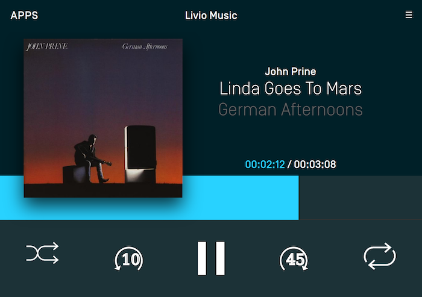

# Media Clock
The media clock is used by media apps to present the current timing information of a playing media item such as a song, podcast, or audiobook.

The media clock consists of three parts: the progress bar, a current position label and a remaining time label. In addition, you may want to [update the play/pause button icon](#setting-the-play-pause-button-style-rpc-v50) to reflect the current state of the audio [or the media forward / back buttons](#setting-the-media-forward-back-button-style-rpc-v71) to reflect if it will skip tracks or time.

@![android, javaEE, javaSE]Media clock operations require the HMI status to be `FULL`. More information on how to monitor the HMI status can be found in the [Understanding Permissions](Userstanding Permissions#monitoring-the-hmi-level) guide.!@

!!! NOTE
Ensure your app has an `appType` of media and you are using the media template before implementing this feature.
!!!


## Counting Up
In order to count up using the timer, you will need to set a start time that is less than the end time. The "bottom end" of the media clock will always start at `0:00` and the "top end" will be the end time you specified. The start time can be set to any position between 0 and the end time. For example, if you are starting a song at `0:30` and it ends at `4:13` the media clock timer progress bar will start at the `0:30` position and start incrementing up automatically every second until it reaches `4:13`. The current position label will start counting upwards from `0:30` and the remaining time label will start counting down from `3:43`. When the end is reached, the current time label will read `4:13`, the remaining time label will read `0:00` and the progress bar will stop moving.

The play / pause indicator parameter is used to update the play / pause button to your desired button type. This is explained below in the section "Updating the Audio Indicator"

@![iOS]
|~
```objc
SDLSetMediaClockTimer *mediaClock = [SDLSetMediaClockTimer countUpFromStartTimeInterval:0 toEndTimeInterval:300 playPauseIndicator:SDLAudioStreamingIndicatorPause forwardSeekIndicator:nil backSeekIndicator:nil countRate:nil];
[self.sdlManager sendRequest:mediaClock];
```
```swift
let mediaClock = SDLSetMediaClockTimer.countUp(from: 0, to: 300, playPauseIndicator: .pause, forwardSeekIndicator: nil, backSeekIndicator: nil, countRate: nil)
sdlManager.send(mediaClock)
```
~|
!@

@![android, javaSE, javaEE]
```java
SetMediaClockTimer mediaClock = new SetMediaClockTimer().countUpFromStartTimeInterval(30, 253, AudioStreamingIndicator.PAUSE);
sdlManager.sendRPC(mediaClock);
```
!@

@![javascript]
```js
const mediaClock = new SDL.rpc.messages.SetMediaClockTimer()
    .setUpdateMode(SDL.rpc.enums.UpdateMode.COUNTUP)
    .setStartTime(
        new SDL.rpc.structs.StartTime()
            .setHours(0)
            .setMinutes(0)
            .setSeconds(30)
    ).setEndTime(
        new SDL.rpc.structs.StartTime()
            .setHours(0)
            .setMinutes(4)
            .setSeconds(13)
    ).setAudioStreamingIndicator(SDL.rpc.enums.AudioStreamingIndicator.PAUSE);

// sdl_javascript_suite v1.1+
sdlManager.sendRpcResolve(mediaClock);
// Pre sdl_javascript_suite v1.1
sdlManager.sendRpc(mediaClock);
```
!@

## Counting Down
Counting down is the opposite of counting up (I know, right?). In order to count down using the timer, you will need to set a start time that is greater than the end time. The timer bar moves from right to left and the timer will automatically count down. For example, if you're counting down from `10:00` to `0:00`, the progress bar will be at the leftmost position and start decrementing every second until it reaches `0:00`.

@![iOS]
|~
```objc
SDLSetMediaClockTimer *mediaClock = [SDLSetMediaClockTimer countDownFromStartTimeInterval:600 toEndTimeInterval:0 playPauseIndicator:SDLAudioStreamingIndicatorPause forwardSeekIndicator:nil backSeekIndicator:nil countRate:nil];
[self.sdlManager sendRequest:mediaClock];
```
```swift
let mediaClock = SDLSetMediaClockTimer.countDown(from: 600, to: 0, playPauseIndicator: .pause, forwardSeekIndicator: nil, backSeekIndicator: nil, countRate: nil)
sdlManager.send(mediaClock)
```
~|
!@

@![android, javaSE, javaEE]
```java
SetMediaClockTimer mediaClock = new SetMediaClockTimer().countDownFromStartTimeInterval(600, 0, AudioStreamingIndicator.PAUSE);
sdlManager.sendRPC(mediaClock);
```
!@

@![javascript]
```js
const mediaClock = new SDL.rpc.messages.SetMediaClockTimer()
    .setUpdateMode(SDL.rpc.enums.UpdateMode.COUNTDOWN)
    .setStartTime(
        new SDL.rpc.structs.StartTime()
            .setHours(0)
            .setMinutes(10)
            .setSeconds(0)
    ).setEndTime(
        new SDL.rpc.structs.StartTime()
            .setHours(0)
            .setMinutes(0)
            .setSeconds(0)
    ).setAudioStreamingIndicator(SDL.rpc.enums.AudioStreamingIndicator.PAUSE);

// sdl_javascript_suite v1.1+
sdlManager.sendRpcResolve(mediaClock);
// Pre sdl_javascript_suite v1.1
sdlManager.sendRpc(mediaClock);
```
!@

## Pausing & Resuming
When pausing the timer, it will stop the timer as soon as the request is received and processed. When a resume request is sent, the timer begins again at the paused time as soon as the request is processed. You can update the start and end times using a pause command to change the timer while remaining paused.

@![iOS]
|~
```objc
// Pause the timer with a play button
SDLSetMediaClockTimer *mediaClock = [SDLSetMediaClockTimer pauseWithPlayPauseIndicator:SDLAudioStreamingIndicatorPlay];
[self.sdlManager sendRequest:mediaClock];

// Resume the timer with a pause button
SDLSetMediaClockTimer *mediaClock = [SDLSetMediaClockTimer resumeWithPlayPauseIndicator:SDLAudioStreamingIndicatorPause forwardSeekIndicator:nil backSeekIndicator:nil countRate:nil];
[self.sdlManager sendRequest:mediaClock];

// When paused, update the timer with a new start and end time, and a play button
SDLSetMediaClockTimer *mediaClock = [SDLSetMediaClockTimer updatePauseWithNewStartTimeInterval:60 endTimeInterval:240 playPauseIndicator:SDLAudioStreamingIndicatorPlay];
[self.sdlManager sendRequest:mediaClock];
```
```swift
// Pause the timer with a play button
let mediaClock = SDLSetMediaClockTimer.pause(playPauseIndicator: .play)
sdlManager.send(mediaClock)

// Resume the timer with a pause button
let mediaClock = SDLSetMediaClockTimer.resume(playPauseIndicator: .pause, forwardSeekIndicator: nil, backSeekIndicator: nil, countRate: nil)
sdlManager.send(mediaClock)

// When paused, update the timer with a new start and end time, and a play button
let mediaClock = SDLSetMediaClockTimer.pause(newStart: 60, newEnd: 240, playPauseIndicator: .play)
sdlManager.send(mediaClock)
```
~|
!@

@![android, javaSE, javaEE]
```java
SetMediaClockTimer mediaClock = new SetMediaClockTimer().pauseWithPlayPauseIndicator(AudioStreamingIndicator.PLAY);
sdlManager.sendRPC(mediaClock);
```

```java
SetMediaClockTimer mediaClock = new SetMediaClockTimer().resumeWithPlayPauseIndicator(AudioStreamingIndicator.PAUSE);
sdlManager.sendRPC(mediaClock);
```

```java
SetMediaClockTimer mediaClock = new SetMediaClockTimer().updatePauseWithNewStartTimeInterval(60, 240, AudioStreamingIndicator.PLAY);
sdlManager.sendRPC(mediaClock);
```
!@

@![javascript]
```js
// Pause the progress bar and set the play / pause indicator to PLAY
const mediaClock = new SDL.rpc.messages.SetMediaClockTimer()
    .setUpdateMode(SDL.rpc.enums.UpdateMode.PAUSE)
    .setAudioStreamingIndicator(SDL.rpc.enums.AudioStreamingIndicator.PLAY);
// sdl_javascript_suite v1.1+
sdlManager.sendRpcResolve(mediaClock);
// Pre sdl_javascript_suite v1.1
sdlManager.sendRpc(mediaClock);
```

```js
// Resume the progress bar from its current location and set the play / pause indicator to PAUSE
const mediaClock = new SDL.rpc.messages.SetMediaClockTimer()
    .setUpdateMode(SDL.rpc.enums.UpdateMode.RESUME)
    .setAudioStreamingIndicator(SDL.rpc.enums.AudioStreamingIndicator.PAUSE);
// sdl_javascript_suite v1.1+
sdlManager.sendRpcResolve(mediaClock);
// Pre sdl_javascript_suite v1.1
sdlManager.sendRpc(mediaClock);
```

```js
// Pause the progress bar, update the progress start / end time and set the play / pause indicator to PLAY
const mediaClock = new SDL.rpc.messages.SetMediaClockTimer()
    .setUpdateMode(SDL.rpc.enums.UpdateMode.PAUSE)
    .setStartTime(
        new SDL.rpc.structs.StartTime()
            .setHours(0)
            .setMinutes(1)
            .setSeconds(0)
    ).setEndTime(
        new SDL.rpc.structs.StartTime()
            .setHours(0)
            .setMinutes(4)
            .setSeconds(0)
    ).setAudioStreamingIndicator(SDL.rpc.enums.AudioStreamingIndicator.PLAY);
// sdl_javascript_suite v1.1+
sdlManager.sendRpcResolve(mediaClock);
// Pre sdl_javascript_suite v1.1
sdlManager.sendRpc(mediaClock);
```
!@

## Clearing the Timer
Clearing the timer removes it from the screen.

@![iOS]
|~
```objc
SDLSetMediaClockTimer *mediaClock = [SDLSetMediaClockTimer clearWithPlayPauseIndicator:SDLAudioStreamingIndicatorPlay];
[self.sdlManager sendRequest:mediaClock];
```
```swift
let mediaClock = SDLSetMediaClockTimer.clear(playPauseIndicator: .play)
sdlManager.send(mediaClock)
```
~|
!@

@![android, javaSE, javaEE]
```java
SetMediaClockTimer mediaClock = new SetMediaClockTimer().clearWithPlayPauseIndicator(AudioStreamingIndicator.PLAY);
sdlManager.sendRPC(mediaClock);
```
!@

@![javascript]
```js
const mediaClock = new SDL.rpc.messages.SetMediaClockTimer()
    .setUpdateMode(SDL.rpc.enums.UpdateMode.CLEAR)
    .setAudioStreamingIndicator(SDL.rpc.enums.AudioStreamingIndicator.PLAY);
// sdl_javascript_suite v1.1+
sdlManager.sendRpcResolve(mediaClock);
// Pre sdl_javascript_suite v1.1
sdlManager.sendRpc(mediaClock);
```
!@

## Setting the Play / Pause Button Style (RPC v5.0+)
The audio indicator is, essentially, the play / pause button. You can tell the system which icon to display on the play / pause button to correspond with how your app works. For example, if audio is currently playing you can update the play/pause button to show the pause icon. On older head units, the audio indicator shows an icon with both the play and pause indicators and the icon can not be updated.

For example, a radio app will probably want two button states: play and stop. A music app, in contrast, will probably want a play and pause button. If you don't send any audio indicator information, a play / pause button will be displayed.

## Setting The Media Forward / Back Button Style (RPC v7.1+)
As of RPC v7.1, you can set the style of the media forward / back buttons to show icons for skipping time (in seconds) forward and backward instead of skipping tracks. The skipping time style is common in podcast & audiobook media apps.

When you set the skip indicator style, you can set type `TRACK`, which is the default style that shows "skip forward" and "skip back" indicators. This is the only style available on RPC < 7.1 connections. You can also set the new type `TIME`, which will allow you to set the number of seconds and display indicators for skipping forward and backward in time.

### Track Style


@![iOS]
|~
```objc
SDLSeekStreamingIndicator *trackStyle = [[SDLSeekStreamingIndicator alloc] initWithType:SDLSeekIndicatorTypeTrack];
SDLSetMediaClockTimer *mediaClock = [SDLSetMediaClockTimer countUpFromStartTimeInterval:0 toEndTimeInterval:300 playPauseIndicator:SDLAudioStreamingIndicatorPause forwardSeekIndicator:trackStyle backSeekIndicator:trackStyle countRate:nil];
[self.sdlManager sendRequest:mediaClock];
```
```swift
let trackStyle = SDLSeekStreamingIndicator(type: .track)
let mediaClock = SDLSetMediaClockTimer.countUp(from: 0, to: 300, playPauseIndicator: .pause, forwardSeekIndicator: trackStyle, backSeekIndicator: trackStyle, countRate: nil)
sdlManager.send(mediaClock)
```
~|
!@

@![android, javaSE, javaEE]
```java
SetMediaClockTimer mediaClock = new SetMediaClockTimer().countUpFromStartTimeInterval(0, 300, AudioStreamingIndicator.PAUSE);
SeekStreamingIndicator trackStyle = new SeekStreamingIndicator(SeekIndicatorType.TRACK);
mediaClock.setForwardSeekIndicator(trackStyle);
mediaClock.setBackSeekIndicator(trackStyle);
sdlManager.sendRPC(mediaClock);
```
!@

@![javascript]
```js
const streamingIndicator = new SDL.rpc.structs.SeekStreamingIndicator()
    .setType(SDL.rpc.enums.SeekIndicatorType.TRACK);

const mediaClock = new SDL.rpc.messages.SetMediaClockTimer()
    .setUpdateMode(SDL.rpc.enums.UpdateMode.PAUSE)
    .setForwardSeekIndicator(streamingIndicator)
    .setBackSeekIndicator(streamingIndicator)
    .setAudioStreamingIndicator(SDL.rpc.enums.AudioStreamingIndicator.PLAY);
// sdl_javascript_suite v1.1+
sdlManager.sendRpcResolve(mediaClock);
// Pre sdl_javascript_suite v1.1
sdlManager.sendRpc(mediaClock);
```
!@

### Time Style


@![iOS]
|~
```objc
SDLSeekStreamingIndicator *seek10Style = [SDLSeekStreamingIndicator seekIndicatorWithSeekTime:@10];
SDLSeekStreamingIndicator *seek45Style = [SDLSeekStreamingIndicator seekIndicatorWithSeekTime:@45];
SDLSetMediaClockTimer *mediaClock = [SDLSetMediaClockTimer countUpFromStartTimeInterval:0 toEndTimeInterval:300 playPauseIndicator:SDLAudioStreamingIndicatorPause forwardSeekIndicator:seek45Style backSeekIndicator:seek10Style countRate:nil];
[self.sdlManager sendRequest:mediaClock];
```
```swift
let seek10Style = SDLSeekStreamingIndicator.seekIndicator(withSeekTime: NSNumber(10))
let seek45Style = SDLSeekStreamingIndicator.seekIndicator(withSeekTime: NSNumber(45))
let mediaClock = SDLSetMediaClockTimer.countUp(from: 0, to: 300, playPauseIndicator: .pause, forwardSeekIndicator: seek45Style, backSeekIndicator: seek10Style, countRate: nil)
sdlManager.send(mediaClock)
```
~|
!@

@![android, javaSE, javaEE]
```java
SetMediaClockTimer mediaClock = new SetMediaClockTimer().countUpFromStartTimeInterval(0, 300, AudioStreamingIndicator.PAUSE);
SeekStreamingIndicator seek45Style = new SeekStreamingIndicator(SeekIndicatorType.TIME);
seek45Style.setSeekTime(45);
SeekStreamingIndicator seek10Style = new SeekStreamingIndicator(SeekIndicatorType.TIME);
seek10Style.setSeekTime(10);
mediaClock.setForwardSeekIndicator(seek45Style);
mediaClock.setBackSeekIndicator(seek10Style);
sdlManager.sendRPC(mediaClock);
```
!@

@![javascript]
```js
const streamingIndicator = new SDL.rpc.structs.SeekStreamingIndicator()
    .setType(SDL.rpc.enums.SeekIndicatorType.TIME)
    .setSeekTime(5);

const mediaClock = new SDL.rpc.messages.SetMediaClockTimer()
    .setUpdateMode(SDL.rpc.enums.UpdateMode.PAUSE)
    .setForwardSeekIndicator(streamingIndicator)
    .setBackSeekIndicator(streamingIndicator)
    .setAudioStreamingIndicator(SDL.rpc.enums.AudioStreamingIndicator.PLAY);
```
!@

## Adding Custom Playback Rate (RPC v7.1+)
Many audio apps that support podcasts and audiobooks allow the user to adjust the audio playback rate.
As of RPC v7.1, you can set the rate that the audio is playing at to ensure the media clock accurately reflects the audio.

For example, a user can play a podcast at 125% speed or at 75% speed.

@![iOS]
|~
```objc
//Play Audio at 50% or half speed
SDLSetMediaClockTimer *mediaClockSlow = [SDLSetMediaClockTimer countUpFromStartTimeInterval:30 toEndTimeInterval:253 playPauseIndicator:SDLAudioStreamingIndicatorPause forwardSeekIndicator:nil backSeekIndicator:nil countRate:@(0.5)];
[self.sdlManager sendRPC:mediaClockSlow];

//Play Audio at 200% or double speed
SDLSetMediaClockTimer *mediaClockSlow = [SDLSetMediaClockTimer countUpFromStartTimeInterval:30 toEndTimeInterval:253 playPauseIndicator:SDLAudioStreamingIndicatorPause forwardSeekIndicator:nil backSeekIndicator:nil countRate:@(2.0)];
[self.sdlManager sendRPC:mediaClockSlow];
```
```swift
//Play Audio at 50% or half speed
let mediaClockSlow = SDLSetMediaClockTimer.countUp(from: 30, to: 253, playPauseIndicator: .pause, forwardSeekIndicator: nil, backSeekIndicator: nil, countRate: NSNumber(0.5))
sdlManager.send(mediaClockSlow)

//Play Audio at 200% or double speed
let mediaClockSlow = SDLSetMediaClockTimer.countUp(from: 30, to: 253, playPauseIndicator: .pause, forwardSeekIndicator: nil, backSeekIndicator: nil, countRate: NSNumber(2.0))
sdlManager.send(mediaClockSlow)
```
~|
!@

@![android, javaSE, javaEE]
```java
//Play Audio at 50% or half speed
SetMediaClockTimer mediaClockSlow = new SetMediaClockTimer().countUpFromStartTimeInterval(30, 253, AudioStreamingIndicator.PAUSE);
mediaClockSlow.setCountRate(0.5f);
sdlManager.sendRPC(mediaClockSlow);

//Play Audio at 200% or double speed
SetMediaClockTimer mediaClockFast = new SetMediaClockTimer().countUpFromStartTimeInterval(30, 253, AudioStreamingIndicator.PAUSE);
mediaClockFast.setCountRate(2.0f);
sdlManager.sendRPC(mediaClockFast);
```
!@

@![javascript]
```js
//Play Audio at 50% or half speed
const mediaClockSlow = new SDL.rpc.messages.SetMediaClockTimer()
    .setUpdateMode(SDL.rpc.enums.UpdateMode.COUNTUP)
    .setStartTime(
        new SDL.rpc.structs.StartTime()
            .setHours(0)
            .setMinutes(0)
            .setSeconds(30)
    ).setEndTime(
        new SDL.rpc.structs.StartTime()
            .setHours(0)
            .setMinutes(4)
            .setSeconds(13)
    ).setAudioStreamingIndicator(SDL.rpc.enums.AudioStreamingIndicator.PAUSE)
    .setCountRate(0.5);

sdlManager.sendRpcResolve(mediaClockSlow);

//Play Audio at 200% or double speed
const mediaClockFast = new SDL.rpc.messages.SetMediaClockTimer()
    .setUpdateMode(SDL.rpc.enums.UpdateMode.COUNTUP)
    .setStartTime(
        new SDL.rpc.structs.StartTime()
            .setHours(0)
            .setMinutes(0)
            .setSeconds(30)
    ).setEndTime(
        new SDL.rpc.structs.StartTime()
            .setHours(0)
            .setMinutes(4)
            .setSeconds(13)
    ).setAudioStreamingIndicator(SDL.rpc.enums.AudioStreamingIndicator.PAUSE)
    .setCountRate(2);

sdlManager.sendRpcResolve(mediaClockFast);
```
!@

!!! NOTE
`CountRate` has a default value of 1.0, and the `CountRate` will be reset to 1.0 if any `SetMediaClockTimer` request does not have the parameter set.
To ensure that you maintain the correct `CountRate` in your application make sure to set the parameter in all `SetMediaClockTimer` requests (including when sending a RESUME request).
!!!
