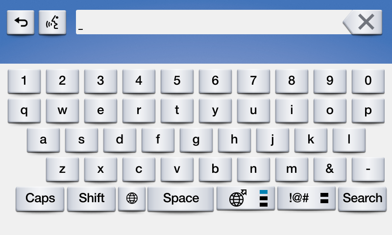

# Popup Keyboards

## Presenting a Keyboard
Presenting a keyboard or a popup menu with a search field requires you to implement the @![iOS]`SDLKeyboardDelegate`!@@![android, javaSE, javaEE]`KeyboardListener`!@. Note that the `initialText` in the keyboard case often acts as "placeholder text" and not as true initial text.

!!! NOTE
Keyboards are unavailable for use in many countries when the driver is distracted. This is often when the vehicle is moving above a certain speed, such as 5 miles per hour.
!!!

##### Keyboard Search


@![iOS]
##### Objective-C
```objc
// Returns a cancelID and presents the keyboard
NSNumber<SDLInt> *cancelID = [self.sdlManager.screenManager presentKeyboardWithInitialText:<#(nonnull NSString *)#> delegate:<#(nonnull id<SDLKeyboardDelegate>)#>];
```

##### Swift
```swift
// Returns a cancelID and presents the keyboard
let cancelID = sdlManager.screenManager.presentKeyboard(withInitialText: <#String#>, delegate: <#SDLKeyboardDelegate#>)
```
!@

@![android, javaSE, javaEE]
```java
int cancelId = sdlManager.getScreenManager().presentKeyboard("Initial text", null, keyboardListener);
```
!@

@![iOS]
### Implementing the Keyboard Delegate
Using the `SDLKeyboardDelegate` involves two required methods (for handling the user's input and the keyboard's unexpected abort), as well as several optional methods for additional functionality.

##### Objective-C
```objc
#pragma mark - SDLKeyboardDelegate

/// Required Methods
- (void)keyboardDidAbortWithReason:(SDLKeyboardEvent)event {
    if ([event isEqualToEnum:SDLKeyboardEventCancelled]) {
        <#The user cancelled the keyboard interaction#>
    } else if ([event isEqualToEnum:SDLKeyboardEventAborted]) {
        <#The system aborted the keyboard interaction#>
    }
}

- (void)userDidSubmitInput:(NSString *)inputText withEvent:(SDLKeyboardEvent)source {
    if ([source isEqualToEnum:SDLKeyboardEventSubmitted]) {
        <#The user submitted some text with the keyboard#>
    } else if ([source isEqualToEnum:SDLKeyboardEventVoice]) {
        <#The user decided to start voice input, you should start an AudioPassThru session if supported#>
    }
}

/// Optional Methods
- (void)updateAutocompleteWithInput:(NSString *)currentInputText autoCompleteResultsHandler:(SDLKeyboardAutoCompleteResultsHandler)resultsHandler {
    <#Check the input text and return an array of autocomplete results#>
    resultsHandler(@[<#String results to be displayed#>]);
}

- (void)updateCharacterSetWithInput:(NSString *)currentInputText completionHandler:(SDLKeyboardCharacterSetCompletionHandler)completionHandler {
    <#Check the input text and return a set of characters to allow the user to enter#>
}

- (void)keyboardDidSendEvent:(SDLKeyboardEvent)event text:(NSString *)currentInputText {
    <#This is sent upon every event, such as keypresses, cancellations, and aborting#>
}

- (SDLKeyboardProperties *)customKeyboardConfiguration {
    <#Use an alternate keyboard configuration. The keypressMode, limitedCharacterSet, and autoCompleteText will be overridden by the screen manager#>
}
```

##### Swift
```swift
extension <#Class Name#>: SDLKeyboardDelegate {
    /// Required Methods
    func keyboardDidAbort(withReason event: SDLKeyboardEvent) {
        switch event {
        case .cancelled:
            <#The user cancelled the keyboard interaction#>
        case .aborted:
            <#The system aborted the keyboard interaction#>
        default: break
        }
    }

    func userDidSubmitInput(_ inputText: String, withEvent source: SDLKeyboardEvent) {
        switch source {
        case .voice:
            <#The user decided to start voice input, you should start an AudioPassThru session if supported#>
        case .submitted:
            <#The user submitted some text with the keyboard#>
        default: break
        }
    }

    /// Optional Methods
    func updateAutocomplete(withInput currentInputText: String, autoCompleteResultsHandler resultsHandler: @escaping SDLKeyboardAutoCompleteResultsHandler) {
        <#Check the input text and return an array of autocomplete results#>
        resultsHandler([<#String results to be displayed#>]);
    }

    func updateCharacterSet(withInput currentInputText: String, completionHandler: @escaping SDLKeyboardCharacterSetCompletionHandler) {
        <#Check the input text and return a set of characters to allow the user to enter#>
    }

    func keyboardDidSendEvent(_ event: SDLKeyboardEvent, text currentInputText: String) {
        <#This is sent upon every event, such as keypresses, cancellations, and aborting#>
    }

    func customKeyboardConfiguration() -> SDLKeyboardProperties {
        <#Use an alternate keyboard configuration. The keypressMode, limitedCharacterSet, and autoCompleteText will be overridden by the screen manager#>
    }
}
```
!@

@![android, javaSE, javaEE]
### Implementing the Keyboard Listeners
Using the `KeyboardListener` involves implementing five methods: 

```java
KeyboardListener keyboardListener = new KeyboardListener() {
    @Override
    public void onUserDidSubmitInput(String inputText, KeyboardEvent event) {
        switch (event) {
            case ENTRY_VOICE:
                // <#The user decided to start voice input, you should start an AudioPassThru session if supported#>
                break;
            case ENTRY_SUBMITTED:
                // <#The user submitted some text with the keyboard#>
                break;
            default:
                break;
        }
    }

    @Override
    public void onKeyboardDidAbortWithReason(KeyboardEvent event) {
        switch (event) {
            case ENTRY_CANCELLED:
                // <#The user cancelled the keyboard interaction#>
                break;
            case ENTRY_ABORTED:
                // <#The system aborted the keyboard interaction#>
                break;
            default:
                break;
        }
    }

    @Override
    public void updateAutocompleteWithInput(String currentInputText, KeyboardAutocompleteCompletionListener keyboardAutocompleteCompletionListener) {
        // <#Check the input text and return a list of autocomplete results#>
        // keyboardAutocompleteCompletionListener.onUpdatedAutoCompleteList(<#String results to be displayed#>]);
    }

    @Override
    public void updateCharacterSetWithInput(String currentInputText, KeyboardCharacterSetCompletionListener keyboardCharacterSetCompletionListener) {
        // <#Check the input text and return a set of characters to allow the user to enter#>
    }

    @Override
    public void onKeyboardDidSendEvent(KeyboardEvent event, String currentInputText) {
        // <#This is sent upon every event, such as keypresses, cancellations, and aborting#>
    }
};
```
!@

### Dismissing the Keyboard (RPC v6.0+)
You can dismiss a displayed keyboard before the timeout has elapsed by sending a `CancelInteraction` request. If you presented the keyboard using the screen manager, you can dismiss the choice set by calling `dismissKeyboard` with the `cancelID` that was returned (if one was returned) when presenting.

!!! NOTE
If connected to older head units that do not support this feature, the cancel request will be ignored, and the keyboard will persist on the screen until the timeout has elapsed or the user dismisses it by making a selection.
!!!

@![iOS]
##### Objective-C
```objc
// Use the saved cancelID from above to dismiss the keyboard
[self.sdlManager.screenManager dismissKeyboardWithCancelID:cancelID];
```

##### Swift
```swift
// Use the saved cancelID from above to dismiss the keyboard
sdlManager.screenManager.dismissKeyboard(withCancelID: cancelID)
```
!@

@![android, javaSE, javaEE]
```java
sdlManager.getScreenManager().dismissKeyboard(cancelId);
```
!@
