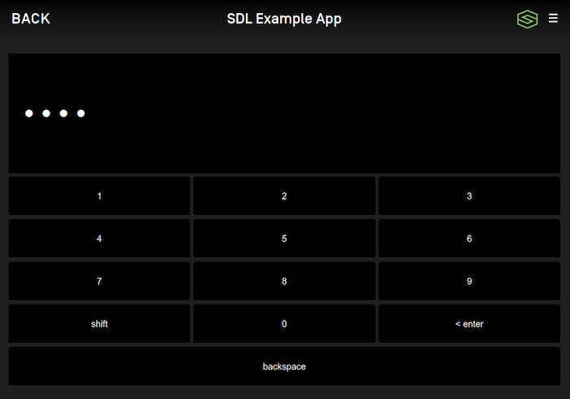

# Popup Keyboards
Presenting a keyboard or a popup menu with a search field requires you to implement the @![iOS]`SDLKeyboardDelegate`!@@![android, javaSE, javaEE, javascript]`KeyboardListener`!@. Note that the `initialText` in the keyboard case often acts as "placeholder text" and not as true initial text.

## Presenting a Keyboard

You should present a keyboard to users when your app contains a "search" field. For example, in a music player app, you may want to give the user a way to search for a song or album. A keyboard could also be useful in an app that displays nearby points of interest, or in other situations.

!!! NOTE
Keyboards are unavailable for use in many countries when the driver is distracted. This is often when the vehicle is moving above a certain speed, such as 5 miles per hour. This will be automatically managed by the system. Your keyboard may be disabled or an error returned if the driver is distracted.
!!!


@![iOS]
##### Objective-C
```objc
// Returns a cancelID and presents the keyboard
NSNumber<SDLInt> *cancelID = [self.sdlManager.screenManager presentKeyboardWithInitialText:<#(nonnull NSString *)#> delegate:<#(nonnull id<SDLKeyboardDelegate>)#>];
```

##### Swift
```swift
// Returns a cancelID and presents the keyboard
let cancelID = sdlManager.screenManager.presentKeyboard(withInitialText: <#String#>, delegate: <#SDLKeyboardDelegate#>)
```
!@

@![android, javaSE, javaEE]
```java
int cancelId = sdlManager.getScreenManager().presentKeyboard("Initial text", null, keyboardListener);
```
!@

@![javascript]
```javascript
const cancelId = sdlManager.getScreenManager().presentKeyboard('Initial text', null, keyboardListener);
```
!@

@![iOS]
### Implementing the Keyboard Delegate
Using the `SDLKeyboardDelegate` is required for popup keyboards and popup menus with search. It involves two required methods (for handling the user's input and the keyboard's unexpected abort), as well as several optional methods for additional functionality.

##### Objective-C
```objc
#pragma mark - SDLKeyboardDelegate

/// Required Methods
- (void)keyboardDidAbortWithReason:(SDLKeyboardEvent)event {
    if ([event isEqualToEnum:SDLKeyboardEventCancelled]) {
        <#The user cancelled the keyboard interaction#>
    } else if ([event isEqualToEnum:SDLKeyboardEventAborted]) {
        <#The system aborted the keyboard interaction#>
    }
}

- (void)userDidSubmitInput:(NSString *)inputText withEvent:(SDLKeyboardEvent)source {
    if ([source isEqualToEnum:SDLKeyboardEventSubmitted]) {
        <#The user submitted some text with the keyboard#>
    } else if ([source isEqualToEnum:SDLKeyboardEventVoice]) {
        <#The user decided to start voice input, you should start an AudioPassThru session if supported#>
    }
}

/// Optional Methods
- (void)updateAutocompleteWithInput:(NSString *)currentInputText autoCompleteResultsHandler:(SDLKeyboardAutoCompleteResultsHandler)resultsHandler {
    <#Check the input text and return an array of autocomplete results#>
    resultsHandler(@[<#String results to be displayed#>]);
}

- (void)updateCharacterSetWithInput:(NSString *)currentInputText completionHandler:(SDLKeyboardCharacterSetCompletionHandler)completionHandler {
    <#Check the input text and return a set of characters to allow the user to enter#>
}

- (void)keyboardDidSendEvent:(SDLKeyboardEvent)event text:(NSString *)currentInputText {
    <#This is sent upon every event, such as keypresses, cancellations, and aborting#>
}

- (SDLKeyboardProperties *)customKeyboardConfiguration {
    <#Use an alternate keyboard configuration. The keypressMode, limitedCharacterSet, and autoCompleteText will be overridden by the screen manager#>
}
```

##### Swift
```swift
extension <#Class Name#>: SDLKeyboardDelegate {
    /// Required Methods
    func keyboardDidAbort(withReason event: SDLKeyboardEvent) {
        switch event {
        case .cancelled:
            <#The user cancelled the keyboard interaction#>
        case .aborted:
            <#The system aborted the keyboard interaction#>
        default: break
        }
    }

    func userDidSubmitInput(_ inputText: String, withEvent source: SDLKeyboardEvent) {
        switch source {
        case .voice:
            <#The user decided to start voice input, you should start an AudioPassThru session if supported#>
        case .submitted:
            <#The user submitted some text with the keyboard#>
        default: break
        }
    }

    /// Optional Methods
    func updateAutocomplete(withInput currentInputText: String, autoCompleteResultsHandler resultsHandler: @escaping SDLKeyboardAutoCompleteResultsHandler) {
        <#Check the input text and return an array of autocomplete results#>
        resultsHandler([<#String results to be displayed#>]);
    }

    func updateCharacterSet(withInput currentInputText: String, completionHandler: @escaping SDLKeyboardCharacterSetCompletionHandler) {
        <#Check the input text and return a set of characters to allow the user to enter#>
    }

    func keyboardDidSendEvent(_ event: SDLKeyboardEvent, text currentInputText: String) {
        <#This is sent upon every event, such as keypresses, cancellations, and aborting#>
    }

    func customKeyboardConfiguration() -> SDLKeyboardProperties {
        <#Use an alternate keyboard configuration. The keypressMode, limitedCharacterSet, and autoCompleteText will be overridden by the screen manager#>
    }

    func keyboardDidUpdateInputMask(_ isEnabled: Bool) {
        if isEnabled {
            <#The user turned on masking the input#>
        } else {
            <#The user turned off masking the input#>
        }
    }
}
```
!@

@![android, javaSE, javaEE, javascript]
### Implementing the Keyboard Listener
Using the `KeyboardListener` involves implementing several methods: 
!@

@![android, javaSE, javaEE]
```java
KeyboardListener keyboardListener = new KeyboardListener() {
    @Override
    public void onUserDidSubmitInput(String inputText, KeyboardEvent event) {
        switch (event) {
            case ENTRY_VOICE:
                // The user decided to start voice input, you should start an AudioPassThru session if supported
                break;
            case ENTRY_SUBMITTED:
                // The user submitted some text with the keyboard
                break;
            default:
                break;
        }
    }

    @Override
    public void onKeyboardDidAbortWithReason(KeyboardEvent event) {
        switch (event) {
            case ENTRY_CANCELLED:
                // The user cancelled the keyboard interaction
                break;
            case ENTRY_ABORTED:
                // The system aborted the keyboard interaction
                break;
            default:
                break;
        }
    }

    @Override
    public void updateAutocompleteWithInput(String currentInputText, KeyboardAutocompleteCompletionListener keyboardAutocompleteCompletionListener) {
        // Check the input text and return a list of autocomplete results
        keyboardAutocompleteCompletionListener.onUpdatedAutoCompleteList(updatedAutoCompleteList);
    }

    @Override
    public void updateCharacterSetWithInput(String currentInputText, KeyboardCharacterSetCompletionListener keyboardCharacterSetCompletionListener) {
        // Check the input text and return a set of characters to allow the user to enter
    }

    @Override
    public void onKeyboardDidSendEvent(KeyboardEvent event, String currentInputText) {
        // This is sent upon every event, such as keypresses, cancellations, and aborting
    }

    @Override
    public void onKeyboardDidUpdateInputMask(KeyboardEvent event) {
        switch (event) {
            case INPUT_KEY_MASK_ENABLED:
                // The user enabled input key masking
                break;
            case INPUT_KEY_MASK_DISABLED:
                // The user disabled input key masking
                break;
            default:
                break;
        }
    }
};
```
!@

@![javascript]
```javascript
const keyboardListener = new KeyboardListener()
    .setOnUserDidSubmitInput((inputText, event) => {
        switch (event) {
            case KeyboardEvent.ENTRY_VOICE:
                // The user decided to start voice input, you should start an AudioPassThru session if supported
                break;
            case KeyboardEvent.ENTRY_SUBMITTED:
                // The user submitted some text with the keyboard
                break;
            default:
                break;
        }
    })
    .setOnKeyboardDidAbortWithReason((event) => {
        switch (event) {
            case KeyboardEvent.ENTRY_CANCELLED:
                // The user cancelled the keyboard interaction
                break;
            case KeyboardEvent.ENTRY_ABORTED:
                // The system aborted the keyboard interaction
                break;
            default:
                break;
        }
    })
    .setUpdateAutocompleteWithInput((currentInputText, keyboardAutocompleteCompletionListener) => {
        // Check the input text and return a list of autocomplete results
        keyboardAutocompleteCompletionListener(updatedAutoCompleteList);
    })
    .setUpdateCharacterSetWithInput((currentInputText, keyboardCharacterSetCompletionListener) => {
        // Check the input text and return a set of characters to allow the user to enter
    })
    .setOnKeyboardDidSendEvent((event, currentInputText) => {
        // This is sent upon every event, such as keypresses, cancellations, and aborting
    })
    .setOnKeyboardDidUpdateInputMask((event) => {
        switch (event) {
            case KeyboardEvent.INPUT_KEY_MASK_ENABLED:
                // The user enabled input key masking
                break;
            case KeyboardEvent.INPUT_KEY_MASK_DISABLED:
                // The user disabled input key masking
                break;
            default:
                break;
        }
    });
```
!@


### Configuring Keyboard Properties
You can change default keyboard properties by updating @![iOS]`sdlManager.screenManager.keyboardConfiguration`!@@![android, javaSE, javaEE, javascript]`sdlManager.getScreenManager().setKeyboardConfiguration()`!@. If you want to change the keyboard configuration for only one keyboard session and keep the default keyboard configuration unchanged, you can @![iOS]implement the `customKeyboardConfiguration` delegate method and pass back the single-use `KeyboardProperties` for that given keyboard presentation!@@![android, javaSE, javaEE, javascript]pass a single-use `KeyboardProperties` to `presentKeyboard()`!@.


#### Keyboard Language
You can modify the keyboard language by changing the keyboard configuration's `language`. For example, you can set an `EN_US` keyboard. It will default to `EN_US` if not otherwise set.


@![android, javaSE, javaEE]
```java
KeyboardProperties keyboardConfiguration = new KeyboardProperties()
        .setLanguage(Language.EN_US);

sdlManager.getScreenManager().setKeyboardConfiguration(keyboardConfiguration);
```
!@

@![iOS]
##### Objective-C
```objc
SDLKeyboardProperties *keyboardConfiguration = [[SDLKeyboardProperties alloc] init];
keyboardConfiguration.language = SDLLanguageEnUs;

self.sdlManager.screenManager.keyboardConfiguration = keyboardConfiguration;
```

##### Swift
```swift
let keyboardConfiguration = SDLKeyboardProperties()
keyboardConfiguration.language = .enUs

sdlManager.screenManager.keyboardConfiguration = keyboardConfiguration
```
!@

@![javascript]
```javascript
const keyboardConfiguration = new KeyboardProperties()
    .setLanguage(Language.EN_US);

sdlManager.getScreenManager().setKeyboardConfiguration(keyboardConfiguration);
```
!@


#### Limited Character List
You can modify the keyboard to enable only some characters by responding to the @![iOS]`updateCharacterSet:completionHandler:` delegate!@@![android, javaSE, javaEE, javascript]`updateCharacterSetWithInput ` listener!@ method or by changing the keyboard configuration before displaying the keyboard. For example, you can enable only "a", "b" , and "c" on the keyboard. All other characters will be greyed out (disabled).


@![android, javaSE, javaEE]
```java
KeyboardProperties keyboardConfiguration = new KeyboardProperties()
        .setLimitedCharacterList(Arrays.asList("a", "b", "c"));

sdlManager.getScreenManager().setKeyboardConfiguration(keyboardConfiguration);
```
!@

@![iOS]
##### Objective-C
```objc
SDLKeyboardProperties *keyboardConfiguration = [[SDLKeyboardProperties alloc] init];
keyboardConfiguration.limitedCharacterList = @[@"a", @"b", @"c"];

self.sdlManager.screenManager.keyboardConfiguration = keyboardConfiguration;
```

##### Swift
```swift
let keyboardConfiguration = SDLKeyboardProperties()
keyboardConfiguration.limitedCharacterList = ["a", "b", "c"]

sdlManager.screenManager.keyboardConfiguration = keyboardConfiguration
```
!@

@![javascript]
```javascript
const keyboardConfiguration = new KeyboardProperties()
    .setLimitedCharacterList(['a', 'b', 'c']);

sdlManager.getScreenManager().setKeyboardConfiguration(keyboardConfiguration);
```
!@


#### Autocomplete List
You can modify the keyboard to allow an app to pre-populate the text field with a list of suggested entries as the user types by responding to the @![iOS]`updateAutocompleteWithInput:autoCompleteResultsHandler:` delegate!@@![android, javaSE, javaEE, javascript]`updateAutocompleteWithInput` listener!@ method or by changing the keyboard configuration before displaying the keyboard. For example, you can display recommended searches "test1", "test2", and "test3" if the user types "tes".

!!! NOTE
A list of autocomplete results is only available on RPC 6.0+ connections. On connections < RPC 6.0, only the first item will be available to the user.
!!!


@![android, javaSE, javaEE]
```java
KeyboardProperties keyboardConfiguration = new KeyboardProperties()
        .setAutoCompleteList(Arrays.asList("test1", "test2", "test3"));

sdlManager.getScreenManager().setKeyboardConfiguration(keyboardConfiguration);
```
!@

@![iOS]
##### Objective-C
```objc
SDLKeyboardProperties *keyboardConfiguration = [[SDLKeyboardProperties alloc] init];
keyboardConfiguration.autoCompleteList = @[@"test1", @"test2", @"test3"];

self.sdlManager.screenManager.keyboardConfiguration = keyboardConfiguration;
```

##### Swift
```swift
let keyboardConfiguration = SDLKeyboardProperties()
keyboardConfiguration.autoCompleteList = ["test1", "test2", "test3"]

sdlManager.screenManager.keyboardConfiguration = keyboardConfiguration
```
!@

@![javascript]
```javascript
const keyboardConfiguration = new KeyboardProperties()
    .setAutoCompleteList(['test1', 'test2', 'test3']);

sdlManager.getScreenManager().setKeyboardConfiguration(keyboardConfiguration);
```
!@


#### Keyboard Layout
You can modify the keyboard layout by changing the keyboard configuration's `keyboardLayout`. For example, you can set a `NUMERIC` keyboard. It will default to `QWERTY` if not otherwise set.

!!! NOTE
The numeric keyboard layout is only available on RPC 7.1+. See the section [Checking Keyboard Capabilities](#checking-keyboard-capabilities-rpc-v71) to determine if this layout is available.
!!!


@![android, javaSE, javaEE]
```java
KeyboardProperties keyboardConfiguration = new KeyboardProperties()
        .setKeyboardLayout(KeyboardLayout.NUMERIC);

sdlManager.getScreenManager().setKeyboardConfiguration(keyboardConfiguration);
```
!@

@![iOS]
##### Objective-C
```objc
SDLKeyboardProperties *keyboardConfiguration = [[SDLKeyboardProperties alloc] init];
keyboardConfiguration.keyboardLayout = SDLKeyboardLayoutNumeric;

self.sdlManager.screenManager.keyboardConfiguration = keyboardConfiguration;
```

##### Swift
```swift
let keyboardConfiguration = SDLKeyboardProperties()
keyboardConfiguration.keyboardLayout = .numeric

sdlManager.screenManager.keyboardConfiguration = keyboardConfiguration
```
!@

@![javascript]
```javascript
const keyboardConfiguration = new KeyboardProperties()
    .setKeyboardLayout(KeyboardLayout.NUMERIC);

sdlManager.getScreenManager().setKeyboardConfiguration(keyboardConfiguration);
```
!@


#### Input Masking (RPC 7.1+)
You can modify the keyboard to mask the entered characters by changing the keyboard configuration's `maskInputCharacters`. 


@![android, javaSE, javaEE]
```java
KeyboardProperties keyboardConfiguration = new KeyboardProperties()
        .setKeyboardLayout(KeyboardLayout.NUMERIC)
        .setMaskInputCharacters(KeyboardInputMask.ENABLE_INPUT_KEY_MASK);

sdlManager.getScreenManager().setKeyboardConfiguration(keyboardConfiguration);
```
!@

@![iOS]
##### Objective-C
```objc
SDLKeyboardProperties *keyboardConfiguration = [[SDLKeyboardProperties alloc] init];
keyboardConfiguration.keyboardLayout = SDLKeyboardLayoutNumeric;
keyboardConfiguration.maskInputCharacters = SDLKeyboardInputMaskEnableInputKeyMask;

self.sdlManager.screenManager.keyboardConfiguration = keyboardConfiguration;
```

##### Swift
```swift
let keyboardConfiguration = SDLKeyboardProperties()
keyboardConfiguration.keyboardLayout = .numeric
keyboardConfiguration.maskInputCharacters = .enableInputKeyMask

sdlManager.screenManager.keyboardConfiguration = keyboardConfiguration
```
!@

@![javascript]
```javascript
const keyboardConfiguration = new KeyboardProperties()
    .setKeyboardLayout(KeyboardLayout.NUMERIC)
    .setMaskInputCharacters(KeyboardInputMask.ENABLE_INPUT_KEY_MASK);

sdlManager.getScreenManager().setKeyboardConfiguration(keyboardConfiguration);
```
!@


#### Custom Keys (RPC 7.1+)
Each keyboard layout has a number of keys that can be customized to your app's needs. For example, you could set two of the customizable keys in `QWERTY` layout to be "!" and "?" as seen in the image below. The available number and location of these custom keys is determined by the connected head unit. See the section [Checking Keyboard Capabilities](#checking-keyboard-capabilities-rpc-v71) to determine how many custom keys are available for any given layout.


@![android, javaSE, javaEE]
```java
KeyboardProperties keyboardConfiguration = new KeyboardProperties()
        .setKeyboardLayout(KeyboardLayout.QWERTY)
        .setCustomKeys(Arrays.asList("!", "?"));

sdlManager.getScreenManager().setKeyboardConfiguration(keyboardConfiguration);
```
!@

@![iOS]
##### Objective-C
```objc
SDLKeyboardProperties *keyboardConfiguration = [[SDLKeyboardProperties alloc] init];
keyboardConfiguration.keyboardLayout = SDLKeyboardLayoutQWERTY;
keyboardConfiguration.customKeys = @[@"!", @"?"];

self.sdlManager.screenManager.keyboardConfiguration = keyboardConfiguration;
```

##### Swift
```swift
let keyboardConfiguration = SDLKeyboardProperties()
keyboardConfiguration.keyboardLayout = .qwerty
keyboardConfiguration.customKeys = ["!", "?"]

sdlManager.screenManager.keyboardConfiguration = keyboardConfiguration
```
!@

@![javascript]
```javascript
const keyboardConfiguration = new KeyboardProperties()
    .setKeyboardLayout(KeyboardLayout.QWERTY)
    .setCustomKeys(['!','?']);

sdlManager.getScreenManager().setKeyboardConfiguration(keyboardConfiguration);
```
!@


### Checking Keyboard Capabilities (RPC v7.1+)
Each head unit may support different keyboard layouts and each layout can support a different number of custom keys. Head units may not support masking input. If you want to know which keyboard features are supported on the connected head unit, you can check the `KeyboardCapabilities`:

@![android, javaSE, javaEE]
```java
WindowCapability windowCapability = sdlManager.getSystemCapabilityManager().getDefaultMainWindowCapability();
KeyboardCapabilities keyboardCapabilities = windowCapability.getKeyboardCapabilities();

// List of layouts and number of custom keys supported by each layout
List<KeyboardLayoutCapability> keyboardLayouts = keyboardCapabilities.getSupportedKeyboards();

// Boolean represents whether masking is supported or not
boolean maskInputSupported = keyboardCapabilities.getMaskInputCharactersSupported();
```
!@
@![iOS]
##### Objective-C
```objc
SDLKeyboardCapabilities *keyboardCapabilities = self.sdlManager.systemCapabilityManager.defaultMainWindowCapability.keyboardCapabilities;

// List of layouts and number of custom keys supported by each layout or `nil` if no capabilities are available
NSArray<SDLKeyboardLayoutCapability *> *keyboardLayoutCapabilities = keyboardCapabilities.supportedKeyboards;

// Boolean represents whether masking is supported or not
BOOL maskInputSupported = keyboardCapabilities.maskInputCharactersSupported.boolValue;
```

##### Swift
```swift
guard let keyboardCapabilities = sdlManager.systemCapabilityManager.defaultMainWindowCapability?.keyboardCapabilities else { return }

// List of layouts and number of custom keys supported by each layout or `nil` if no capabilities are available
let keyboardLayoutCapabilities = keyboardCapabilities.supportedKeyboards

// Boolean represents whether masking is supported or not
let maskInputSupported = keyboardCapabilities.maskInputCharactersSupported?.boolValue
```
!@

@![javascript]
```javascript
const windowCapability = sdlManager.getSystemCapabilityManager().getDefaultMainWindowCapability();
const keyboardCapabilities = windowCapability.getKeyboardCapabilities();

// List of layouts and number of custom keys supported by each layout
const keyboardLayouts = keyboardCapabilities.getSupportedKeyboards();

// Boolean represents whether masking is supported or not
const maskInputSupported = keyboardCapabilities.getMaskInputCharactersSupported();
```
!@

### Dismissing the Keyboard (RPC v6.0+)
You can dismiss a displayed keyboard before the timeout has elapsed by sending a `CancelInteraction` request. If you presented the keyboard using the screen manager, you can dismiss the choice set by calling `dismissKeyboard` with the `cancelID` that was returned (if one was returned) when presenting.

!!! NOTE
If connected to older head units that do not support this feature, the cancel request will be ignored, and the keyboard will persist on the screen until the timeout has elapsed or the user dismisses it by making a selection.
!!!


@![iOS]
##### Objective-C
```objc
// Use the saved cancelID from above to dismiss the keyboard
[self.sdlManager.screenManager dismissKeyboardWithCancelID:cancelID];
```

##### Swift
```swift
// Use the saved cancelID from above to dismiss the keyboard
sdlManager.screenManager.dismissKeyboard(withCancelID: cancelID)
```
!@

@![android, javaSE, javaEE]
```java
sdlManager.getScreenManager().dismissKeyboard(cancelId);
```
!@

@![javascript]
```javascript
sdlManager.getScreenManager().dismissKeyboard(cancelId);
```
!@

## Using RPCs
If you don't want to use the @![iOS]`SDLScreenManager`!@ @![android, javaSE, javaEE, javascript]`ScreenManager`!@, you can do this manually using the `PerformInteraction` RPC request. As this is no longer a recommended course of action, we will leave it to you to figure out how to manually do it.
