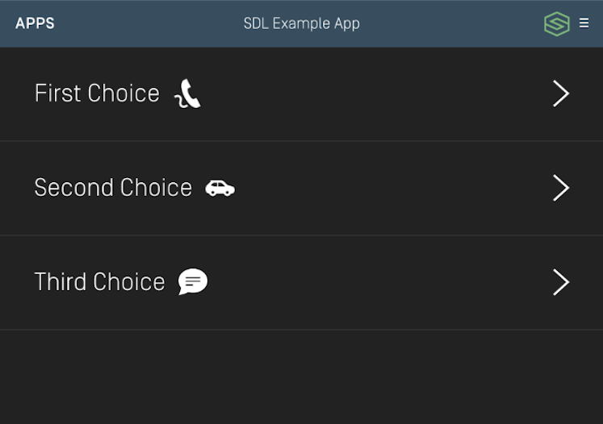
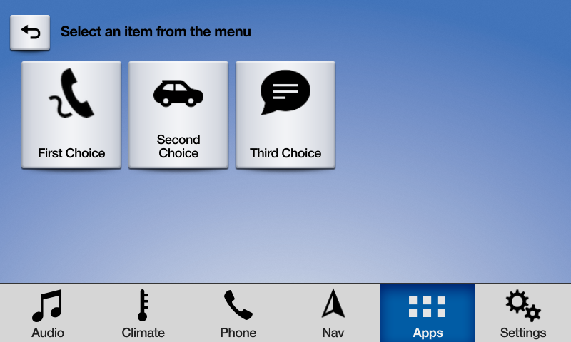
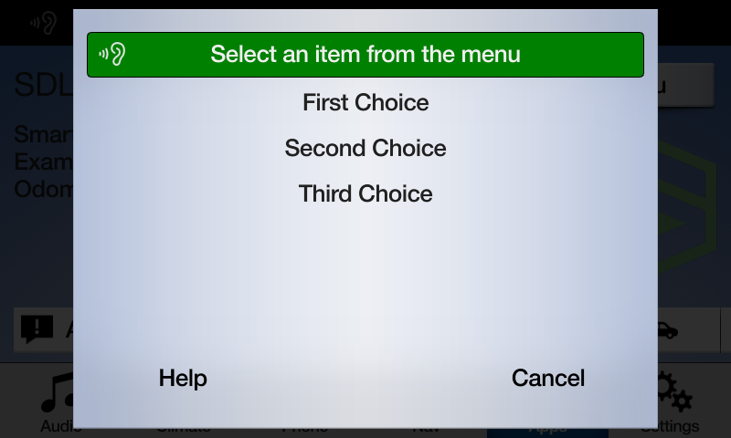
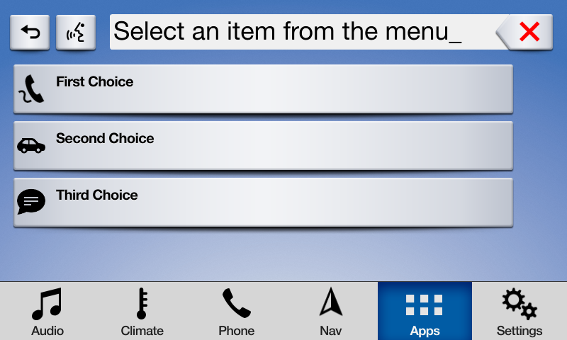
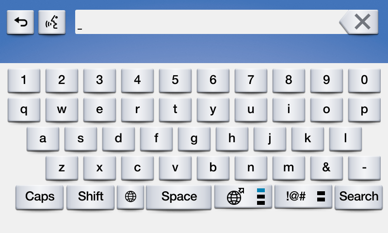

# Popup Menus and Keyboards
SDL supports modal menus and keyboards. The user can respond to the list of menu options via touch, voice (if voice recognition supported by the head unit), or keyboard input.

There are several UX considerations to take into account when designing your menus. The main menu should should not be updated very often and should act as navigation for your app. Popup menus should be used to present a selection of options to your user. They can also be used to show a keyboard that lets your user perform a search or provide user input. 

## Presenting a Popup Menu
Presenting a popup menu is similiar to presenting a modal view to request input from your user. It is possible to chain together menus to drill down, however, it is recommended to do so judiciously. Requesting too much input from a driver while they are driving is distracting and may result in your app being rejected by OEMs.

| Layout Mode                | Formatting Description |
| -------------------------- | ---------------------- |
| Present as Icon            | A grid of buttons with images |
| Present Searchable as Icon | A grid of buttons with images along with a search field in the HMI |
| Present as List            | A vertical list  of text |
| Present Searchable as List | A vertical list of text with a search field in the HMI |
| Present Keyboard           | A keyboard shows up immediately in the HMI |

### Creating Cells
An @![iOS]`SDLChoiceCell`!@ @![android, javaSE, javaEE]`ChoiceCell`!@ is similar to a @![iOS]`UITableViewCell`!@ @![android, javaSE, javaEE]`RecyclerView`!@ without the ability to configure your own UI. We provide several properties on the @![iOS]`SDLChoiceCell`!@ @![android, javaSE, javaEE]`ChoiceCell`!@ to set your data, but the layout itself is determined by the manufacturer of the head unit.

!!! IMPORTANT
On many systems, including VR commands will be *exponentially* slower than not including them. However, including them is necessary for a user to be able to respond to your prompt with their voice.
!!!

@![iOS]
##### Objective-C
```objc
SDLChoiceCell *cell = [[SDLChoiceCell alloc] initWithText:<#(nonnull NSString *)#>];
SDLChoiceCell *fullCell = [[SDLChoiceCell alloc] initWithText:<#(nonnull NSString *)#> secondaryText:<#(nullable NSString *)#> tertiaryText:<#(nullable NSString *)#> voiceCommands:<#(nullable NSArray<NSString *> *)#> artwork:<#(nullable SDLArtwork *)#> secondaryArtwork:<#(nullable SDLArtwork *)#>];
```

##### Swift
```swift
let cell = SDLChoiceCell(text: <#String#>)
let fullCell = SDLChoiceCell(text: <#String#>, secondaryText: <#String?#>, tertiaryText: <#String?#>, voiceCommands: <#[String]?#>, artwork: <#SDLArtwork?#>, secondaryArtwork: <#SDLArtwork?#>)
```
!@

@![android, javaSE, javaEE]
```java
ChoiceCell cell = new ChoiceCell("cell1 text", Collections.singletonList("cell1"), null);
ChoiceCell fullCell = new ChoiceCell("cell2 text", "cell2 secondaryText", "cell2 tertiaryText", Collections.singletonList("cell2"), image1Artwork, image2Artwork);
```
!@

### Preloading Cells
If you know the content you will show in the popup menu long before the menu is shown to the user, you can "preload" those cells in order to speed up the popup menu presentation at a later time. Once you preload a cell, you can reuse it in multiple popup menus without having to send the cell content to Core again. 

@![iOS]
##### Objective-C
```objc
[self.sdlManager.screenManager preloadChoices:<#(nonnull NSArray<SDLChoiceCell *> *)#> withCompletionHandler:^(NSError * _Nullable error) {
    <#code#>
}];
```

##### Swift
```swift
sdlManager.screenManager.preloadChoices(<#choices: [SDLChoiceCell]#>) { (error) in
    <#code#>
}
```
!@

@![android, javaSE, javaEE]
```java
sdlManager.getScreenManager().preloadChoices(Arrays.asList(cell, fullCell), new CompletionListener() {
    @Override
    public void onComplete(boolean b) {
        // <#code#>
    }
});
```
!@

### Presenting a Menu
To show a popup menu to the user, you must present the menu. If some or all of the cells in the menu have not yet been preloaded, calling the `present` API will preload the cells and then present the menu once all the cells have been uploaded. Calling `present` without preloading the cells can take longer than if the cells were preloaded earlier in the app's lifecycle especially if your cell has voice commands. Subsequent menu presentations using the same cells will be faster because the library will reuse those cells (unless you have deleted them).

##### Menu - List


##### Menu - Icon


!!! NOTE
When you preload a cell, you **do not** need to maintain a reference to it. If you reuse a cell with the same properties that has already been preloaded (or previously presented), the cell will automatically be reused.
!!!

#### Creating a Choice Set
In order to present a menu, you must bundle together a bunch of @![iOS]`SDLChoiceCell`!@ @![android, javaSE, javaEE]`ChoiceCell`!@s into an @![iOS]`SDLChoiceSet`!@ @![android, javaSE, javaEE]`ChoiceSet`!@.

!!! IMPORTANT
If the @![iOS]`SDLChoiceSet`!@ @![android, javaSE, javaEE]`ChoiceSet`!@ contains an invalid set of @![iOS]`SDLChoiceCell`!@ @![android, javaSE, javaEE]`ChoiceCell`!@s, @![iOS]the initializer will return `nil`!@ @![android, javaSE, javaEE]presenting the `ChoiceSet` will fail!@. This can happen, for example, if you have duplicate title text or if some, but not all choices have voice commands.
!!!

Some notes on various parameters (full documentation is available as API documentation on this website):

- Title: This is the title of the menu when presented
@![iOS]- Delegate: You must implement this delegate to receive callbacks based on the user's interaction with the menu
!@
@![android, javaSE, javaEE]
- Listeners: You must implement this listener interface to receive callbacks based on the user's interaction with the menu
!@
- Layout: You may present your menu as a set of tiles (like a @![iOS]`UICollectionView`!@ @![android, javaSE, javaEE]`GridView`!@) or a list (like a @![iOS]`UITableView`!@ @![android, javaSE, javaEE]`RecyclerView`!@). If you are using tiles, it's recommended to use artworks on each item.

@![iOS]
##### Objective-C
```objc
SDLChoiceSet *choiceSet = [[SDLChoiceSet alloc] initWithTitle:<#(nonnull NSString *)#> delegate:<#(nonnull id<SDLChoiceSetDelegate>)#> layout:<#(SDLChoiceSetLayout)#> timeout:<#(NSTimeInterval)#> initialPromptString:<#(nullable NSString *)#> timeoutPromptString:<#(nullable NSString *)#> helpPromptString:<#(nullable NSString *)#> vrHelpList:<#(nullable NSArray<SDLVRHelpItem *> *)#> choices:<#(nonnull NSArray<SDLChoiceCell *> *)#>];
```

##### Swift
```swift
let choiceSet = SDLChoiceSet(title: <#String#>, delegate: <#SDLChoiceSetDelegate#>, layout: <#SDLChoiceSetLayout#>, timeout: <#TimeInterval#>, initialPromptString: <#String?#>, timeoutPromptString: <#String?#>, helpPromptString: <#String?#>, vrHelpList: <#[SDLVRHelpItem]?#>, choices: <#[SDLChoiceCell]#>)
```
!@

@![android, javaSE, javaEE]
```java
ChoiceSet choiceSet = new ChoiceSet("ChoiceSet Title", Arrays.asList(cell, fullCell), new ChoiceSetSelectionListener() {
    @Override
    public void onChoiceSelected(ChoiceCell choiceCell, TriggerSource triggerSource, int rowIndex) {
        // You will be passed the `cell` that was selected, the manner in which it was selected (voice or text), and the index of the cell that was passed.      
        // <#handle selection#>    
    }

    @Override
    public void onError(String error) {
        // <#handle error#>              
    }
});
```
!@

@![iOS]
#### Implementing the Choice Set Delegate
In order to present a menu, you must implement `SDLChoiceSetDelegate` in order to receive the user's input. When a choice is selected, you will be passed the `cell` that was selected, the manner in which it was selected (voice or text), and the index of the cell in the `SDLChoiceSet` that was passed.

##### Objective-C
```objc
#pragma mark - SDLChoiceSetDelegate

- (void)choiceSet:(SDLChoiceSet *)choiceSet didSelectChoice:(SDLChoiceCell *)choice withSource:(SDLTriggerSource)source atRowIndex:(NSUInteger)rowIndex {
    <#Code#>
}

- (void)choiceSet:(SDLChoiceSet *)choiceSet didReceiveError:(NSError *)error {
    <#Code#>
}
```

##### Swift
```swift
extension <#Class Name#>: SDLChoiceSetDelegate {
    func choiceSet(_ choiceSet: SDLChoiceSet, didSelectChoice choice: SDLChoiceCell, withSource source: SDLTriggerSource, atRowIndex rowIndex: UInt) {
        <#Code#>
    }

    func choiceSet(_ choiceSet: SDLChoiceSet, didReceiveError error: Error) {
        <#Code#>
    }
}
```
!@

#### Presenting the Menu with a Mode
Finally, you will present the menu. When you do so, you must choose a `mode` to present it in. If you have no `vrCommands` on the choice cell you should choose `manualOnly`. If `vrCommands` are available, you may choose `voiceRecognitionOnly` or `both`.

You may want to choose this based on the trigger source leading to the menu being presented. For example, if the menu was presented via the user touching the screen, you may want to use a `mode` of `manualOnly` or `both`, but if the menu was presented via the user speaking a voice command, you may want to use a `mode` of `voiceRecognitionOnly` or `both`.

It may seem that the answer is to always use `both`. However, remember that you must provide `vrCommand`s on all cells to use `both`, which is exponentially slower than not providing `vrCommand`s (this is especially relevant for large menus, but less important for smaller ones). Also, some head units may not provide a good user experience for `both`.

| Interaction Mode  | Description |
| ----------------- | ----------- |
| Manual only       | Interactions occur only through the display |
| VR only           | Interactions occur only through text-to-speech and voice recognition |
| Both              | Interactions can occur both manually or through VR |

##### Menu - Manual Only Mode


##### Menu - Voice Only Mode


@![iOS]
##### Objective-C
```objc
[self.sdlManager.screenManager presentChoiceSet:<#(nonnull SDLChoiceSet *)#> mode:<#(nonnull SDLInteractionMode)#>];
```

##### Swift
```swift
sdlManager.screenManager.present(<#choiceSet: SDLChoiceSet#>, mode: <#SDLInteractionMode#>)
```
!@

@![android, javaSE, javaEE]
```java
sdlManager.getScreenManager().presentChoiceSet(choiceSet, InteractionMode.MANUAL_ONLY);
```
!@

### Presenting a Searchable Menu
In addition to presenting a standard menu, you can also present a "searchable" menu, that is, a menu with a keyboard input box at the top. For more information on implementing the keyboard portion of this menu, see *Presenting a Keyboard* below.

##### Menu with Search


@![iOS]
##### Objective-C
```objc
[self.sdlManager.screenManager presentSearchableChoiceSet:<#(nonnull SDLChoiceSet *)#> mode:<#(nonnull SDLInteractionMode)#> withKeyboardDelegate:<#(nonnull id<SDLKeyboardDelegate>)#>];
```

##### Swift
```swift
sdlManager.screenManager.presentSearchableChoiceSet(<#choiceSet: SDLChoiceSet#>, mode: <#SDLInteractionMode#>, with: <#SDLKeyboardDelegate#>)
```
!@

@![android, javaSE, javaEE]
```java
sdlManager.getScreenManager().presentSearchableChoiceSet(choiceSet, InteractionMode.MANUAL_ONLY, keyboardListener);
```
!@

### Deleting Cells
You can discover cells that have been preloaded on @![iOS]`screenManager.preloadedCells`!@ @![android, javaSE, javaEE]`sdlManager.getScreenManager().getPreloadedChoices()`!@. You may then pass an array of cells to delete from the remote system. Many times this is not necessary, but if you have deleted artwork used by cells, for example, you should delete the cells as well.

@![iOS]
##### Objective-C
```objc
[self.sdlManager.screenManager deleteChoices:<#(nonnull NSArray<SDLChoiceCell *> *)#>];
```

##### Swift
```swift
sdlManager.screenManager.deleteChoices(<#choices: [SDLChoiceCell]#>)
```
!@

@![android, javaSE, javaEE]
```java
sdlManager.getScreenManager().deleteChoices(<List of choices to delete>);
```
!@

### Dismissing the Popup Menu (RPC 6.0+)
You can dismiss a displayed choice set before the timeout has elapsed by sending a `CancelInteraction` request. If you presented the choice set using the screen manager, you can dismiss the choice set by calling `cancel` on the `SDLChoiceSet` object that you presented.

!!! NOTE
If connected to older head units that do not support this feature, the cancel request will be ignored, and the choice set will persist on the screen until the timeout has elapsed or the user dismisses it by making a selection.
!!!

@![iOS]
##### Objective-C
```objc
[choiceSet cancel];
```

##### Swift
```swift
choiceSet.cancel()
```
!@

@![android, javaSE, javaEE]
```java
// ToDo - add cancel choice set
```
!@


## Presenting a Keyboard
Presenting a keyboard or a searchable menu requires you to additionally implement the @![iOS]`SDLKeyboardDelegate`!@ @![android, javaSE, javaEE]`KeyboardListener`!@. Note that the `initialText` in the keyboard case often acts as "placeholder text" *not* as true initial text.

!!! NOTE
Keyboards are unavailable for use in many countries when the driver is distracted. This is often when the vehicle is moving above a certain speed, such as 5 miles per hour.
!!!

##### Keyboard Search


@![iOS]
##### Objective-C
```objc
// Returns a cancelID and presents the keyboard
NSNumber<SDLInt> *cancelID = [self.sdlManager.screenManager presentKeyboardWithInitialText:<#(nonnull NSString *)#> delegate:<#(nonnull id<SDLKeyboardDelegate>)#>];
```

##### Swift
```swift
// Returns a cancelID and presents the keyboard
let cancelID = sdlManager.screenManager.presentKeyboard(withInitialText: <#String#>, delegate: <#SDLKeyboardDelegate#>)
```
!@

@![android, javaSE, javaEE]
```java
sdlManager.getScreenManager().presentKeyboard("Initial text", null, keyboardListener);
```
!@

### Dismissing the Keyboard (RPC 6.0+)
You can dismiss a displayed keyboard before the timeout has elapsed by sending a `CancelInteraction` request. If you presented the keyboard using the screen manager, you can dismiss the choice set by calling dismissKeyboard with the `cancelID` that was returned (if one was returned) when presenting.

@![iOS]
##### Objective-C
```objc
// Use the saved cancelID from above to dismiss the keyboard
[self.sdlManager.screenManager dismissKeyboardWithCancelID:cancelID];
```

##### Swift
```swift
// Use the saved cancelID from above to dismiss the keyboard
sdlManager.screenManager.dismissKeyboard(withCancelID: cancelID)
```
!@

@![android, javaSE, javaEE]
```java
// ToDo - add dismiss keyboard logic
```
!@

@![iOS]
### Implementing the Keyboard Delegate
Using the `SDLKeyboardDelegate` involves two required methods (for handling the user's input and the keyboard's unexpected abort), as well as several optional methods for additional functionality.

##### Objective-C
```objc
#pragma mark - SDLKeyboardDelegate

/// Required Methods
- (void)keyboardDidAbortWithReason:(SDLKeyboardEvent)event {
    if ([event isEqualToEnum:SDLKeyboardEventCancelled]) {
        <#The user cancelled the keyboard interaction#>
    } else if ([event isEqualToEnum:SDLKeyboardEventAborted]) {
        <#The system aborted the keyboard interaction#>
    }
}

- (void)userDidSubmitInput:(NSString *)inputText withEvent:(SDLKeyboardEvent)source {
    if ([source isEqualToEnum:SDLKeyboardEventSubmitted]) {
        <#The user submitted some text with the keyboard#>
    } else if ([source isEqualToEnum:SDLKeyboardEventVoice]) {
        <#The user decided to start voice input, you should start an AudioPassThru session if supported#>
    }
}

/// Optional Methods
- (void)updateAutocompleteWithInput:(NSString *)currentInputText completionHandler:(SDLKeyboardAutocompleteCompletionHandler)completionHandler {
    <#Check the input text and return a string with the current autocomplete text#>
}

- (void)updateCharacterSetWithInput:(NSString *)currentInputText completionHandler:(SDLKeyboardCharacterSetCompletionHandler)completionHandler {
    <#Check the input text and return a set of characters to allow the user to enter#>
}

- (void)keyboardDidSendEvent:(SDLKeyboardEvent)event text:(NSString *)currentInputText {
    <#This is sent upon every event, such as keypresses, cancellations, and aborting#>
}

- (SDLKeyboardProperties *)customKeyboardConfiguration {
    <#Use an alternate keyboard configuration. The keypressMode, limitedCharacterSet, and autoCompleteText will be overridden by the screen manager#>
}
```

##### Swift
```swift
extension <#Class Name#>: SDLKeyboardDelegate {
    /// Required Methods
    func keyboardDidAbort(withReason event: SDLKeyboardEvent) {
        switch event {
        case .cancelled:
            <#The user cancelled the keyboard interaction#>
        case .aborted:
            <#The system aborted the keyboard interaction#>
        default: break
        }
    }

    func userDidSubmitInput(_ inputText: String, withEvent source: SDLKeyboardEvent) {
        switch source {
        case .voice:
            <#The user decided to start voice input, you should start an AudioPassThru session if supported#>
        case .submitted:
            <#The user submitted some text with the keyboard#>
        default: break
        }
    }

    /// Optional Methods
    func updateAutocomplete(withInput currentInputText: String, completionHandler: @escaping SDLKeyboardAutocompleteCompletionHandler) {
        <#Check the input text and return a string with the current autocomplete text#>
    }

    func updateCharacterSet(withInput currentInputText: String, completionHandler: @escaping SDLKeyboardCharacterSetCompletionHandler) {
        <#Check the input text and return a set of characters to allow the user to enter#>
    }

    func keyboardDidSendEvent(_ event: SDLKeyboardEvent, text currentInputText: String) {
        <#This is sent upon every event, such as keypresses, cancellations, and aborting#>
    }

    func customKeyboardConfiguration() -> SDLKeyboardProperties {
        <#Use an alternate keyboard configuration. The keypressMode, limitedCharacterSet, and autoCompleteText will be overridden by the screen manager#>
    }
}
```
!@

@![android, javaSE, javaEE]
### Implementing the Keyboard Listeners
Using the `KeyboardListener` involves implementing five methods: 

```java
KeyboardListener keyboardListener = new KeyboardListener() {
    @Override
    public void onUserDidSubmitInput(String inputText, KeyboardEvent event) {
        switch (event) {
            case ENTRY_VOICE:
                // <#The user decided to start voice input, you should start an AudioPassThru session if supported#>
                break;
            case ENTRY_SUBMITTED:
                // <#The user submitted some text with the keyboard#>
                break;
            default:
                break;
        }
    }

    @Override
    public void onKeyboardDidAbortWithReason(KeyboardEvent event) {
        switch (event) {
            case ENTRY_CANCELLED:
                // <#The user cancelled the keyboard interaction#>
                break;
            case ENTRY_ABORTED:
                // <#The system aborted the keyboard interaction#>
                break;
            default:
                break;
        }
    }

    @Override
    public void updateAutocompleteWithInput(String currentInputText, KeyboardAutocompleteCompletionListener keyboardAutocompleteCompletionListener) {
        // <#Check the input text and return a string with the current autocomplete text#>
    }

    @Override
    public void updateCharacterSetWithInput(String currentInputText, KeyboardCharacterSetCompletionListener keyboardCharacterSetCompletionListener) {
        // <#Check the input text and return a set of characters to allow the user to enter#>
    }

    @Override
    public void onKeyboardDidSendEvent(KeyboardEvent event, String currentInputText) {
        // <#This is sent upon every event, such as keypresses, cancellations, and aborting#>
    }
};
```
!@

## Using RPCs
If you don't want to use the @![iOS]`SDLScreenManager`!@ @![android, javaSE, javaEE]`ScreenManager`!@, you can do this manually using the `Choice`, `CreateInteractionChoiceSet`, and `PerformInteraction` RPC requests. You will need to create `Choice`s, bundle them into `CreateInteractionChoiceSet`s, and then present those choice sets via a `PerformInteraction` request. As this is no longer a recommended course of action, we will leave it to you to figure out how to manually do it.
