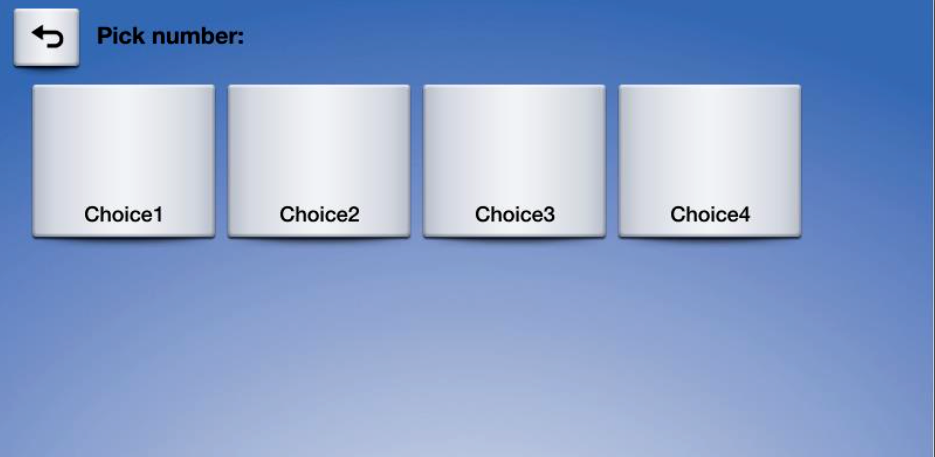
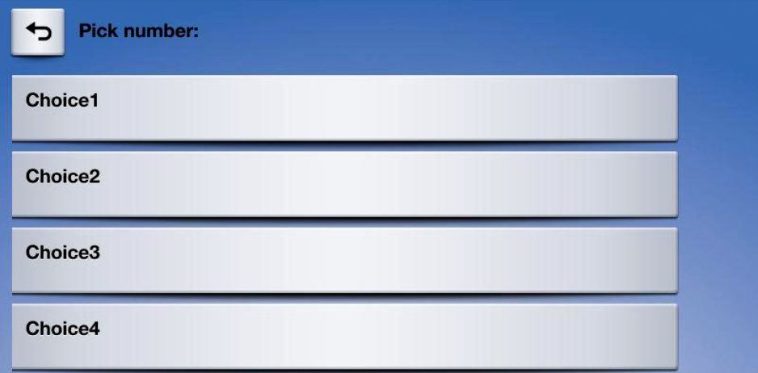
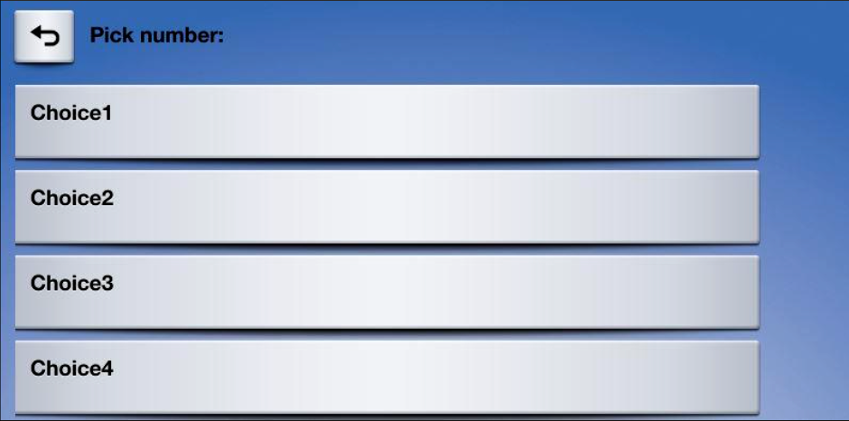
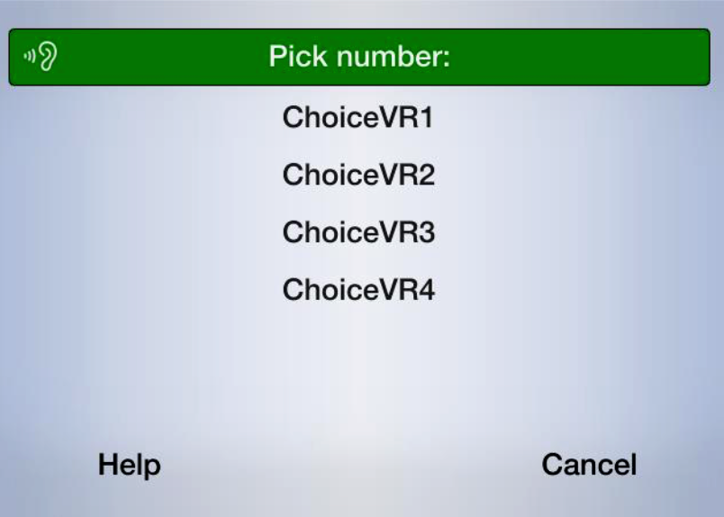
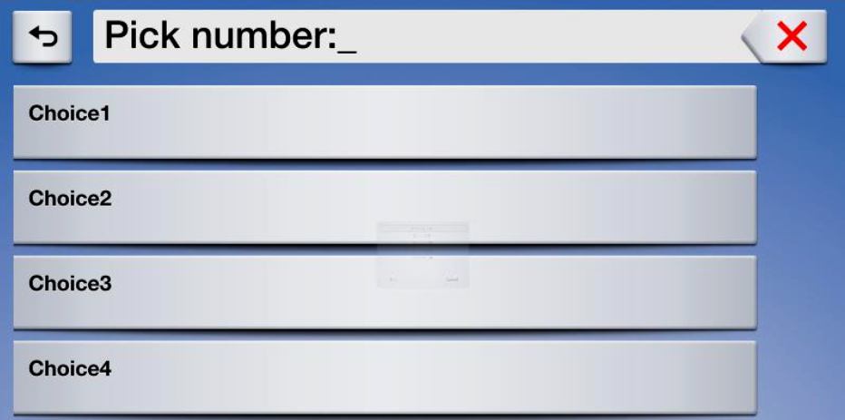

# Popup Menus and Keyboards
SDL supports modal menus and keyboards. These are requests for input from the user based on a list of options you present to the user – that they can respond to via touch or voice (if supported) – or via their own keyboard input.

There are several advantages and disadvantages to this kind of menu compared to the main menu. The main menu should remain more static and should not be updated often and only in predictable ways. The main menu is the best way to perform navigation for your app. By contrast, a popup menu is better for a selection of options for your app, and allows for a keyboard to be available for search or other user input.

## Presenting a Popup Menu
You may think of presenting a popup menu as presenting a modal `UITableViewController` to request input from the user. You may chain together menus to drill down, however, it is recommended to do so judiciously, as requesting too much input from the driver while he is driving will be distracting and may result in your app being rejected by OEMs.

| Layout Mode                | Formatting Description |
| -------------------------- | ---------------------- |
| Present as Icon            | A grid of buttons with images |
| Present Searchable as Icon | A grid of buttons with images along with a search field in the HMI |
| Present as List            | A vertical list  of text |
| Present Searchable as List | A vertical list of text with a search field in the HMI |
| Present Keyboard           | A keyboard shows up immediately in the HMI |

### Creating Cells
An `SDLChoiceCell` is similar to a `UITableViewCell` without the ability to arrange your own UI. We provide several properties on the `SDLChoiceCell` to set your data, but the layout itself is determined by the company making the head unit system.

!!! IMPORTANT
On many systems, including VR commands will be *exponentially* slower than not including them. However, including them is necessary for a user to be able to respond to your prompt with their voice.
!!!

##### Objective-C
```objc
SDLChoiceCell *cell = [[SDLChoiceCell alloc] initWithText:<#(nonnull NSString *)#>];
SDLChoiceCell *fullCell = [[SDLChoiceCell alloc] initWithText:<#(nonnull NSString *)#> secondaryText:<#(nullable NSString *)#> tertiaryText:<#(nullable NSString *)#> voiceCommands:<#(nullable NSArray<NSString *> *)#> artwork:<#(nullable SDLArtwork *)#> secondaryArtwork:<#(nullable SDLArtwork *)#>];
```

##### Swift
```swift
let cell = SDLChoiceCell(text: <#T##String#>)
let cell = SDLChoiceCell(text: <#T##String#>, secondaryText: <#T##String?#>, tertiaryText: <#T##String?#>, voiceCommands: <#T##[String]?#>, artwork: <#T##SDLArtwork?#>, secondaryArtwork: <#T##SDLArtwork?#>)
```

### Preloading Cells
If you know what some or all cells should contain before they are used, you can "preload" these cells in order to speed up their presentation at a later time. The cells you preload may be used individually or a group.

##### Objective-C
```objc
[self.sdlManager.screenManager preloadChoices:<#(nonnull NSArray<SDLChoiceCell *> *)#> withCompletionHandler:^(NSError * _Nullable error) {
    <#code#>
}];
```

##### Swift
```swift
sdlManager.screenManager.preloadChoices(<#T##choices: [SDLChoiceCell]##[SDLChoiceCell]#>) { (error) in
    <#code#>
}
```

### Presenting a Menu
Whether or not you preloaded cells, you may present a menu. If you did not preload cells, calling a `present` API will cause them to be preloaded and then presented once they are available. Therefore, this call may take longer than if the cells were preloaded earlier in the app's lifecycle. On later presentations using the same cells, it will reuse those cells (unless you deleted them of course), so later presentations will be faster.

##### Menu - Icon
###### Ford HMI


##### Menu - List
###### Ford HMI


!!! NOTE
When you preload a cell, you **do not** need to maintain a reference to it. If you reuse a cell with the same properties that has already been preloaded (or previously presented), the cell will automatically be reused.
!!!

#### Creating a Choice Set
In order to present a menu, you must bundle together a bunch of `SDLChoiceCell`s into an `SDLChoiceSet`.

!!! IMPORTANT
If the `SDLChoiceSet` contains an invalid set of `SDLChoiceCell`s, the initializer will return `nil`. This can happen, for example, if you have duplicate title text or if some, but not all choices have voice commands.
!!!

Some notes on various parameters (full documentation is available as API documentation on this website):

- Title: This is the title of the menu when presented
- Delegate: You must implement this delegate to receive callbacks based on the user's interaction with the menu
- Layout: You may present your menu as a set of tiles (like a `UICollectionView`) or a list (like a `UITableView`). If you are using tiles, it's recommended to use artworks on each item.

##### Objective-C
```objc
SDLChoiceSet *choiceSet = [[SDLChoiceSet alloc] initWithTitle:<#(nonnull NSString *)#> delegate:<#(nonnull id<SDLChoiceSetDelegate>)#> layout:<#(SDLChoiceSetLayout)#> timeout:<#(NSTimeInterval)#> initialPromptString:<#(nullable NSString *)#> timeoutPromptString:<#(nullable NSString *)#> helpPromptString:<#(nullable NSString *)#> vrHelpList:<#(nullable NSArray<SDLVRHelpItem *> *)#> choices:<#(nonnull NSArray<SDLChoiceCell *> *)#>];
```

##### Swift
```swift
let choiceSet = SDLChoiceSet(title: <#T##String#>, delegate: <#T##SDLChoiceSetDelegate#>, layout: <#T##SDLChoiceSetLayout#>, timeout: <#T##TimeInterval#>, initialPromptString: <#T##String?#>, timeoutPromptString: <#T##String?#>, helpPromptString: <#T##String?#>, vrHelpList: <#T##[SDLVRHelpItem]?#>, choices: <#T##[SDLChoiceCell]#>)
```

#### Implementing the Choice Set Delegate
In order to present a menu, you must implement `SDLChoiceSetDelegate` in order to receive the user's input. When a choice is selected, you will be passed the `cell` that was selected, the manner in which it was selected (voice or text), and the index of the cell in the `SDLChoiceSet` that was passed.

##### Objective-C
```objc
#pragma mark - SDLChoiceSetDelegate

- (void)choiceSet:(SDLChoiceSet *)choiceSet didSelectChoice:(SDLChoiceCell *)choice withSource:(SDLTriggerSource)source atRowIndex:(NSUInteger)rowIndex {
    <#Code#>
}

- (void)choiceSet:(SDLChoiceSet *)choiceSet didReceiveError:(NSError *)error {
    <#Code#>
}
```

##### Swift
```swift
extension <#Class Name#>: SDLChoiceSetDelegate {
    func choiceSet(_ choiceSet: SDLChoiceSet, didSelectChoice choice: SDLChoiceCell, withSource source: SDLTriggerSource, atRowIndex rowIndex: UInt) {
        <#Code#>
    }

    func choiceSet(_ choiceSet: SDLChoiceSet, didReceiveError error: Error) {
        <#Code#>
    }
}
```

#### Presenting the Menu with a Mode
Finally, you will present the menu. When you do so, you must choose a `mode` to present it in. If you have no `vrCommands` on the `SDLChoiceCell` you should choose `SDLInteractionModeManualOnly`. If `vrCommands` are available, you may choose `SDLInteractionModeVoiceRecognitionOnly` or `SDLInteractionModeBoth`.

You may want to choose this based on the trigger source leading to the menu being presented. For example, if the menu was presented via the user touching the screen, you may want to use a `mode` of `.manualOnly` or `.both`, but if the menu was presented via the user speaking a voice command, you may want to use a `mode` of `.voiceRecognitionOnly` or `.both`.

It may seem that the answer is to always use `.both`. However, remember that you must provide `vrCommand`s on all `SDLChoiceCell`s to use `.both`, which is exponentially slower than not providing `vrCommand`s (this is especially relevant for large menus, but less important for smaller ones). Also, some head units may not provide a good user experience for `.both`.

| Interaction Mode  | Description |
| ----------------- | ----------- |
| Manual only       | Interactions occur only through the display |
| VR only           | Interactions occur only through text-to-speech and voice recognition |
| Both              | Interactions can occur both manually or through VR |

##### Menu - Manual Only
###### Ford HMI


##### Menu - Voice Only
###### Ford HMI


##### Objective-C
```objc
[self.manager.screenManager presentChoiceSet:<#(nonnull SDLChoiceSet *)#> mode:<#(nonnull SDLInteractionMode)#>];
```

##### Swift
```swift
manager.screenManager.present(<#T##choiceSet: SDLChoiceSet##SDLChoiceSet#>, mode: <#T##SDLInteractionMode#>)
```

### Presenting a Searchable Menu
In addition to presenting a standard menu, you can also present a "searchable" menu, that is, a menu with a keyboard input box at the top. For more information on implementing the keyboard portion of this menu, see *Presenting a Keyboard* below.

###### Ford HMI


##### Objective-C
```objc
[self.sdlManager.screenManager presentSearchableChoiceSet:<#(nonnull SDLChoiceSet *)#> mode:<#(nonnull SDLInteractionMode)#> withKeyboardDelegate:<#(nonnull id<SDLKeyboardDelegate>)#>];
```

##### Swift
```swift
sdlManager.screenManager.presentSearchableChoiceSet(<#T##choiceSet: SDLChoiceSet##SDLChoiceSet#>, mode: <#T##SDLInteractionMode#>, with: <#T##SDLKeyboardDelegate#>)
```

### Deleting Cells
You can discover cells that have been preloaded on `screenManager.preloadedCells`. You may then pass an array of cells to delete from the remote system. Many times this is not necessary, but if you have deleted artwork used by cells, for example, you should delete the cells as well.

##### Objective-C
```objc
[self.sdlManager.screenManager deleteChoices:<#(nonnull NSArray<SDLChoiceCell *> *)#>];
```

##### Swift
```swift
sdlManager.screenManager.deleteChoices(<#T##choices: [SDLChoiceCell]##[SDLChoiceCell]#>)
```

## Presenting a Keyboard
Presenting a keyboard or a searchable menu requires you to additionally implement the `SDLKeyboardDelegate`. Note that the `initialText` in the keyboard case often acts as "placeholder text" *not* as true initial text.

!!! NOTE
Keyboards are unavailable for use in many countries when the driver is distracted. This is often when the vehicle is moving above a certain speed, such as 5 miles per hour.
!!!

##### Objective-C
```objc
[self.sdlManager.screenManager presentKeyboardWithInitialText:<#(nonnull NSString *)#> delegate:<#(nonnull id<SDLKeyboardDelegate>)#>];
```

##### Swift
```swift
sdlManager.screenManager.presentKeyboard(withInitialText: <#T##String#>, delegate: <#T##SDLKeyboardDelegate#>)
```

### Implementing the Keyboard Delegate
Using the `SDLKeyboardDelegate` involves two required methods (for handling the user's input and the keyboard's unexpected abort), as well as several optional methods for additional functionality.

##### Objective-C
```objc
#pragma mark - SDLKeyboardDelegate

/// Required Methods
- (void)keyboardDidAbortWithReason:(SDLKeyboardEvent)event {
    if ([event isEqualToEnum:SDLKeyboardEventCancelled]) {
        <#The user cancelled the keyboard interaction#>
    } else if ([event isEqualToEnum:SDLKeyboardEventAborted]) {
        <#The system aborted the keyboard interaction#>
    }
}

- (void)userDidSubmitInput:(NSString *)inputText withEvent:(SDLKeyboardEvent)source {
    if ([source isEqualToEnum:SDLKeyboardEventSubmitted]) {
        <#The user submitted some text with the keyboard#>
    } else if ([source isEqualToEnum:SDLKeyboardEventVoice]) {
        <#The user decided to start voice input, you should start an AudioPassThru session if supported#>
    }
}

/// Optional Methods
- (void)updateAutocompleteWithInput:(NSString *)currentInputText completionHandler:(SDLKeyboardAutocompleteCompletionHandler)completionHandler {
    <#Check the input text and return a string with the current autocomplete text#>
}

- (void)updateCharacterSetWithInput:(NSString *)currentInputText completionHandler:(SDLKeyboardCharacterSetCompletionHandler)completionHandler {
    <#Check the input text and return a set of characters to allow the user to enter#>
}

- (void)keyboardDidSendEvent:(SDLKeyboardEvent)event text:(NSString *)currentInputText {
    <#This is sent upon every event, such as keypresses, cancellations, and aborting#>
}

- (SDLKeyboardProperties *)customKeyboardConfiguration {
    <#Use an alternate keyboard configuration. The keypressMode, limitedCharacterSet, and autoCompleteText will be overridden by the screen manager#>
}
```

##### Swift
```swift
extension <#Class Name#>: SDLKeyboardDelegate {
    /// Required Methods
    func keyboardDidAbort(withReason event: SDLKeyboardEvent) {
        switch event {
        case .cancelled:
            <#The user cancelled the keyboard interaction#>
        case .aborted:
            <#The system aborted the keyboard interaction#>
        default: break
        }
    }

    func userDidSubmitInput(_ inputText: String, withEvent source: SDLKeyboardEvent) {
        switch source {
        case .voice:
            <#The user decided to start voice input, you should start an AudioPassThru session if supported#>
        case .submitted:
            <#The user submitted some text with the keyboard#>
        default: break
        }
    }

    /// Optional Methods
    func updateAutocomplete(withInput currentInputText: String, completionHandler: @escaping SDLKeyboardAutocompleteCompletionHandler) {
        <#Check the input text and return a string with the current autocomplete text#>
    }

    func updateCharacterSet(withInput currentInputText: String, completionHandler: @escaping SDLKeyboardCharacterSetCompletionHandler) {
        <#Check the input text and return a set of characters to allow the user to enter#>
    }

    func keyboardDidSendEvent(_ event: SDLKeyboardEvent, text currentInputText: String) {
        <#This is sent upon every event, such as keypresses, cancellations, and aborting#>
    }

    func customKeyboardConfiguration() -> SDLKeyboardProperties {
        <#Use an alternate keyboard configuration. The keypressMode, limitedCharacterSet, and autoCompleteText will be overridden by the screen manager#>
    }
}
```

## Using RPCs
If you don't want to use the `SDLScreenManager`, you can do this manually using the `SDLChoice`, `SDLCreateInteractionChoiceSet`, and `SDLPerformInteraction` RPC requests. You will need to create `SDLChoice`s, bundle them into `SDLCreateInteractionChoiceSet`s, and then present those choice sets via `SDLPerformInteraction`. As this is no longer a recommended course of action, we will leave it to you to figure out how to manually do it.