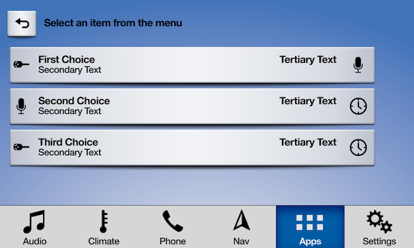
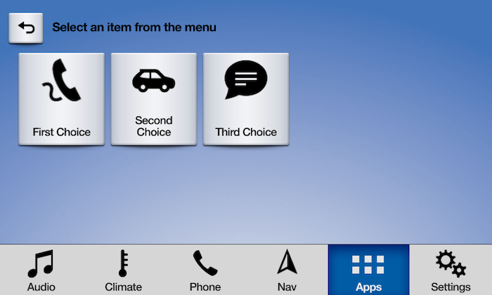
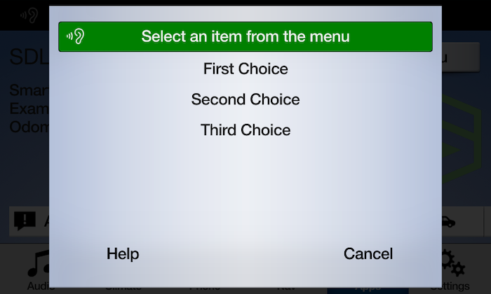
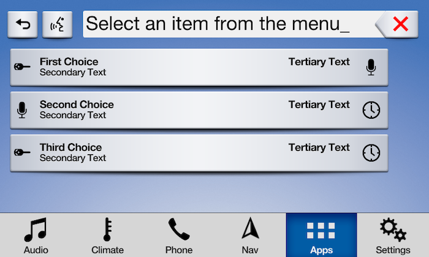
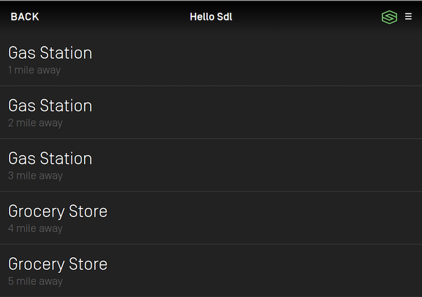
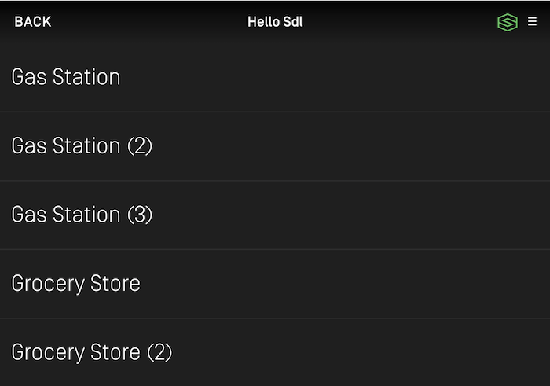

# Popup Menus
SDL supports modal menus. The user can respond to the list of menu options via touch, voice (if voice recognition is supported by the head unit), or by keyboard input to search or filter the menu.

There are several UX considerations to take into account when designing your menus. The main menu should not be updated often and should act as navigation for your app. Popup menus should be used to present a selection of options to your user.

## Presenting a Popup Menu
Presenting a popup menu is similar to presenting a modal view to request input from your user. It is possible to chain together menus to drill down, however, it is recommended to do so judiciously. Requesting too much input from a driver while they are driving is distracting and may result in your app being rejected by OEMs.

| Layout Mode                | Formatting Description |
| -------------------------- | ---------------------- |
| Present as Icon            | A grid of buttons with images |
| Present Searchable as Icon | A grid of buttons with images along with a search field in the HMI |
| Present as List            | A vertical list  of text |
| Present Searchable as List | A vertical list of text with a search field in the HMI |

### Creating Cells
@![iOS]An `SDLChoiceCell`!@ @![android, javaSE, javaEE]A `ChoiceCell`!@@![iOS, android, javaEE, javaSE] is similar to a !@@![iOS]`UITableViewCell`!@ @![android, javaSE, javaEE]`RecyclerView`!@@![iOS, android, javaEE, javaSE] without the ability to configure your own UI. !@We provide several properties on the @![iOS]`SDLChoiceCell`!@ @![android, javaSE, javaEE, javascript]`ChoiceCell`!@ to set your data, but the layout itself is determined by the manufacturer of the head unit.

!!! IMPORTANT
On many systems, including VR commands will be *exponentially* slower than not including them. However, including them is necessary for a user to be able to respond to your prompt with their voice.
!!!

@![iOS]
##### Objective-C
```objc
SDLChoiceCell *cell = [[SDLChoiceCell alloc] initWithText:<#(nonnull NSString *)#>];
SDLChoiceCell *fullCell = [[SDLChoiceCell alloc] initWithText:<#(nonnull NSString *)#> secondaryText:<#(nullable NSString *)#> tertiaryText:<#(nullable NSString *)#> voiceCommands:<#(nullable NSArray<NSString *> *)#> artwork:<#(nullable SDLArtwork *)#> secondaryArtwork:<#(nullable SDLArtwork *)#>];
```

##### Swift
```swift
let cell = SDLChoiceCell(text: <#String#>)
let fullCell = SDLChoiceCell(text: <#String#>, secondaryText: <#String?#>, tertiaryText: <#String?#>, voiceCommands: <#[String]?#>, artwork: <#SDLArtwork?#>, secondaryArtwork: <#SDLArtwork?#>)
```
!@

@![android, javaSE, javaEE]
```java
ChoiceCell cell = new ChoiceCell("cell1 text", Collections.singletonList("cell1"), null);
ChoiceCell fullCell = new ChoiceCell("cell2 text", "cell2 secondaryText", "cell2 tertiaryText", Collections.singletonList("cell2"), image1Artwork, image2Artwork);
```
!@

@![javascript]
```js
const cell = new SDL.manager.screen.choiceset.ChoiceCell("cell1 text")
    .setVoiceCommands(["cell1"])
const fullCell = new SDL.manager.screen.choiceset.ChoiceCell("cell2 text")
    .setSecondaryText("cell2 secondaryText")
    .setTertiaryText("cell2 tertiaryText")
    .setVoiceCommands(["cell2"])
    .setArtwork(image1Artwork)
    .setSecondaryArtwork(image2Artwork)
```
!@

### Preloading Cells
If you know the content you will show in the popup menu long before the menu is shown to the user, you can "preload" those cells in order to speed up the popup menu presentation at a later time. Once you preload a cell, you can reuse it in multiple popup menus without having to send the cell content to Core again. 

@![iOS]
##### Objective-C
```objc
[self.sdlManager.screenManager preloadChoices:<#(nonnull NSArray<SDLChoiceCell *> *)#> withCompletionHandler:^(NSError * _Nullable error) {
    <#code#>
}];
```

##### Swift
```swift
sdlManager.screenManager.preloadChoices(<#choices: [SDLChoiceCell]#>) { (error) in
    <#code#>
}
```
!@

@![android, javaSE, javaEE]
```java
sdlManager.getScreenManager().preloadChoices(Arrays.asList(cell, fullCell), new CompletionListener() {
    @Override
    public void onComplete(boolean b) {
        // code
    }
});
```
!@

@![javascript]
```js
const success = await sdlManager.getScreenManager().preloadChoices([cell, fullCell]);
```
!@

### Presenting a Menu
To show a popup menu to the user, you must present the menu. If some or all of the cells in the menu have not yet been preloaded, calling the `present` API will preload the cells and then present the menu once all the cells have been uploaded. Calling `present` without preloading the cells can take longer than if the cells were preloaded earlier in the app's lifecycle especially if your cell has voice commands. Subsequent menu presentations using the same cells will be faster because the library will reuse those cells (unless you have deleted them).

##### Menu - List


##### Menu - Icon


!!! NOTE
When you preload a cell, you **do not** need to maintain a reference to it. If you reuse a cell with the same properties that has already been preloaded (or previously presented), the cell will automatically be reused.
!!!

#### Creating a Choice Set
In order to present a menu, you must bundle together a bunch of @![iOS]`SDLChoiceCell`!@ @![android, javaSE, javaEE, javascript]`ChoiceCell`!@s into an @![iOS]`SDLChoiceSet`!@ @![android, javaSE, javaEE, javascript]`ChoiceSet`!@.

!!! IMPORTANT
If the @![iOS]`SDLChoiceSet`!@ @![android, javaSE, javaEE, javascript]`ChoiceSet`!@ contains an invalid set of @![iOS]`SDLChoiceCell`!@ @![android, javaSE, javaEE, javascript]`ChoiceCell`!@s, @![iOS]the initializer will return `nil`!@ @![android, javaSE, javaEE, javascript]presenting the `ChoiceSet` will fail!@. This can happen, for example, if you have duplicate title text or if some, but not all choices have voice commands.
!!!

Some notes on various parameters (full documentation is available as API documentation on this website):

- Title: This is the title of the menu when presented
@![iOS]- Delegate: You must implement this delegate to receive callbacks based on the user's interaction with the menu
!@
@![android, javaSE, javaEE, javascript]
- Listeners: You must implement this listener interface to receive callbacks based on the user's interaction with the menu
!@
- Layout: You may present your menu as a set of tiles @ !@@ !@or a list@![iOS] (like a `UITableView`)!@@![android, javaSE, javaEE] (like a `RecyclerView`)!@. If you are using tiles, it's recommended to use artworks on each item.

@![iOS]
##### Objective-C
```objc
SDLChoiceSet *choiceSet = [[SDLChoiceSet alloc] initWithTitle:<#(nonnull NSString *)#> delegate:<#(nonnull id<SDLChoiceSetDelegate>)#> layout:<#(SDLChoiceSetLayout)#> timeout:<#(NSTimeInterval)#> initialPromptString:<#(nullable NSString *)#> timeoutPromptString:<#(nullable NSString *)#> helpPromptString:<#(nullable NSString *)#> vrHelpList:<#(nullable NSArray<SDLVRHelpItem *> *)#> choices:<#(nonnull NSArray<SDLChoiceCell *> *)#>];
```

##### Swift
```swift
let choiceSet = SDLChoiceSet(title: <#String#>, delegate: <#SDLChoiceSetDelegate#>, layout: <#SDLChoiceSetLayout#>, timeout: <#TimeInterval#>, initialPromptString: <#String?#>, timeoutPromptString: <#String?#>, helpPromptString: <#String?#>, vrHelpList: <#[SDLVRHelpItem]?#>, choices: <#[SDLChoiceCell]#>)
```
!@

@![android, javaSE, javaEE]
```java
ChoiceSet choiceSet = new ChoiceSet("ChoiceSet Title", Arrays.asList(cell, fullCell), new ChoiceSetSelectionListener() {
    @Override
    public void onChoiceSelected(ChoiceCell choiceCell, TriggerSource triggerSource, int rowIndex) {
        // You will be passed the `cell` that was selected, the manner in which it was selected (voice or text), and the index of the cell that was passed.      
        // handle selection
    }

    @Override
    public void onError(String error) {
        // handle error            
    }
});
```
!@

@![javascript]
```js
const listener = new SDL.manager.screen.choiceset.ChoiceSetSelectionListener()
    .setOnChoiceSelected((choiceCell, triggerSource, rowIndex) => {
        // You will be passed the `cell` that was selected, the manner in which it was selected (voice or text), and the index of the cell that was passed.      
        // handle selection
    })
    .setOnError((error) => {
        // handle error            
    });
const choiceSet = new SDL.manager.screen.choiceset.ChoiceSet("ChoiceSet Title", [cell, fullCell], listener);
```
!@

@![iOS]
#### Implementing the Choice Set Delegate
In order to present a menu, you must implement `SDLChoiceSetDelegate` in order to receive the user's input. When a choice is selected, you will be passed the `cell` that was selected, the manner in which it was selected (voice or text), and the index of the cell in the `SDLChoiceSet` that was passed.

##### Objective-C
```objc
#pragma mark - SDLChoiceSetDelegate

- (void)choiceSet:(SDLChoiceSet *)choiceSet didSelectChoice:(SDLChoiceCell *)choice withSource:(SDLTriggerSource)source atRowIndex:(NSUInteger)rowIndex {
    <#Code#>
}

- (void)choiceSet:(SDLChoiceSet *)choiceSet didReceiveError:(NSError *)error {
    <#Code#>
}
```

##### Swift
```swift
extension <#Class Name#>: SDLChoiceSetDelegate {
    func choiceSet(_ choiceSet: SDLChoiceSet, didSelectChoice choice: SDLChoiceCell, withSource source: SDLTriggerSource, atRowIndex rowIndex: UInt) {
        <#Code#>
    }

    func choiceSet(_ choiceSet: SDLChoiceSet, didReceiveError error: Error) {
        <#Code#>
    }
}
```
!@

#### Presenting the Menu with a Mode
Finally, you will present the menu. When you do so, you must choose a `mode` to present it in. If you have no `vrCommands` on the choice cell you should choose `manualOnly`. If `vrCommands` are available, you may choose `voiceRecognitionOnly` or `both`.

You may want to choose this based on the trigger source leading to the menu being presented. For example, if the menu was presented via the user touching the screen, you may want to use a `mode` of `manualOnly` or `both`, but if the menu was presented via the user speaking a voice command, you may want to use a `mode` of `voiceRecognitionOnly` or `both`.

It may seem that the answer is to always use `both`. However, remember that you must provide `vrCommand`s on all cells to use `both`, which is exponentially slower than not providing `vrCommand`s (this is especially relevant for large menus, but less important for smaller ones). Also, some head units may not provide a good user experience for `both`.

| Interaction Mode  | Description |
| ----------------- | ----------- |
| Manual only       | Interactions occur only through the display |
| VR only           | Interactions occur only through text-to-speech and voice recognition |
| Both              | Interactions can occur both manually or through VR |

##### Menu - Manual Only Mode


##### Menu - Voice Only Mode


@![iOS]
##### Objective-C
```objc
[self.sdlManager.screenManager presentChoiceSet:<#(nonnull SDLChoiceSet *)#> mode:<#(nonnull SDLInteractionMode)#>];
```

##### Swift
```swift
sdlManager.screenManager.present(<#choiceSet: SDLChoiceSet#>, mode: <#SDLInteractionMode#>)
```
!@

@![android, javaSE, javaEE]
```java
sdlManager.getScreenManager().presentChoiceSet(choiceSet, InteractionMode.MANUAL_ONLY);
```
!@

@![javascript]
```js
sdlManager.getScreenManager().presentChoiceSet(choiceSet, SDL.rpc.enums.InteractionMode.MANUAL_ONLY);
```
!@

### Presenting a Searchable Menu
In addition to presenting a standard menu, you can also present a "searchable" menu, that is, a menu with a keyboard input box at the top. For more information on implementing the keyboard callbacks, see the [Popup Keyboards](Displaying a User Interface/Popup Keyboards) guide.

##### Menu with Search


@![iOS]
##### Objective-C
```objc
[self.sdlManager.screenManager presentSearchableChoiceSet:<#(nonnull SDLChoiceSet *)#> mode:<#(nonnull SDLInteractionMode)#> withKeyboardDelegate:<#(nonnull id<SDLKeyboardDelegate>)#>];
```

##### Swift
```swift
sdlManager.screenManager.presentSearchableChoiceSet(<#choiceSet: SDLChoiceSet#>, mode: <#SDLInteractionMode#>, with: <#SDLKeyboardDelegate#>)
```
!@

@![android, javaSE, javaEE]
```java
sdlManager.getScreenManager().presentSearchableChoiceSet(choiceSet, InteractionMode.MANUAL_ONLY, keyboardListener);
```
!@

@![javascript]
```js
sdlManager.getScreenManager().presentSearchableChoiceSet(choiceSet, SDL.rpc.enums.InteractionMode.MANUAL_ONLY, keyboardListener);
```
!@

### Deleting Cells
You can discover cells that have been preloaded on @![iOS]`screenManager.preloadedCells`!@ @![android, javaSE, javaEE, javascript]`sdlManager.getScreenManager().getPreloadedChoices()`!@. You may then pass an array of cells to delete from the remote system. Many times this is not necessary, but if you have deleted artwork used by cells, for example, you should delete the cells as well.

@![iOS]
##### Objective-C
```objc
[self.sdlManager.screenManager deleteChoices:<#(nonnull NSArray<SDLChoiceCell *> *)#>];
```

##### Swift
```swift
sdlManager.screenManager.deleteChoices(<#choices: [SDLChoiceCell]#>)
```
!@

@![android, javaSE, javaEE]
```java
sdlManager.getScreenManager().deleteChoices(<List of choices to delete>);
```
!@

@![javascript]
```js
sdlManager.getScreenManager().deleteChoices(<List of choices to delete>);
```
!@

### Dismissing the Popup Menu (RPC v6.0+)
You can dismiss a displayed choice set before the timeout has elapsed by sending a `CancelInteraction` request. If you presented the choice set using the screen manager, you can dismiss the choice set by calling `cancel` on the @![iOS]`SDLChoiceCell`!@ @![android, javaSE, javaEE, javascript]`ChoiceCell`!@ object that you presented.

!!! NOTE
If connected to older head units that do not support this feature, the cancel request will be ignored, and the choice set will persist on the screen until the timeout has elapsed or the user dismisses it by making a selection.
!!!

@![iOS]
##### Objective-C
```objc
[choiceSet cancel];
```

##### Swift
```swift
choiceSet.cancel()
```
!@

@![android, javaSE, javaEE]
```java
choiceSet.cancel();
```
!@

@![javascript]
```js
choiceSet.cancel();
```
!@

### Duplicate Cell Titles
Starting with SDL @![javascript]v1.3.0+!@@![android, javaEE, javaSE]v5.1+!@@![iOS]v7.1+!@ choice cells no longer require unique titles in order to be presented. For example, if you are trying to display points of interest as a list you can now have multiple locations with the same name but are not the same location. You cannot present multiple cells that are exactly the same. They must have some property that makes them different, such as `secondaryText` or an artwork.

##### RPC v7.1+ Connections
The titles on the choice set will be displayed as provided even if there are duplicate titles.


##### RPC v7.0 And Below Connections
The titles on the choice set will have a number appended to them when there are duplicate titles.


## Using RPCs
If you don't want to use the @![iOS]`SDLScreenManager`!@@![android, javaSE, javaEE, javascript]`ScreenManager`!@, you can do this manually using the `Choice`, `CreateInteractionChoiceSet`. You will need to create `Choice`s, bundle them into `CreateInteractionChoiceSet`s. As this is no longer a recommended course of action, we will leave it to you to figure out how to manually do it.
