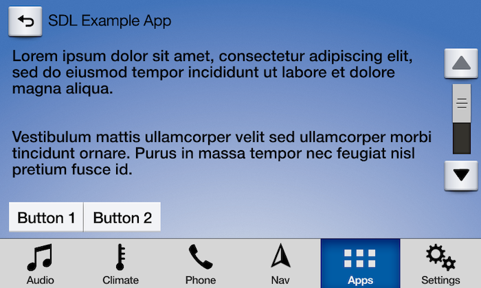

# Scrollable Message
A @![iOS]`SDLScrollableMessage`!@@![android,javaSE,javaEE]`ScrollableMessage`!@ creates an overlay containing a large block of formatted text that can be scrolled. @![iOS]`SDLScrollableMessage`!@@![android,javaSE,javaEE]`ScrollableMessage`!@ contains a body of text, a message timeout, and up to 8 soft buttons depending on head unit. You must check the @![iOS]`SystemCapabilityManager.defaultMainWindowCapability.softButtonCapabilities`!@@![android, javaSE, javaEE]`sdlManager.getSystemCapabilityManager().getDefaultMainWindowCapability().getSoftButtonCapabilities()`!@ to get the max number of `SoftButtons` allowed by the head unit for a `ScrollableMessage`.

You simply create @![iOS]an `SDLScrollableMessage`!@@![android,javaSE,javaEE]a `ScrollableMessage`!@ RPC request and send it to display the message.

!!! NOTE
The message will persist on the screen until the timeout has elapsed or the user dismisses the message by selecting a soft button or cancelling (if the head unit provides cancel UI).
!!!

## Scrollable Message UI


## Creating the Scrollable Message
@![iOS]
##### Objective-C
```objc
// Create SoftButton Array
NSMutableArray<SDLSoftButton *> *softButtons = [[NSMutableArray alloc] init];

// Create Message To Display
NSString *scrollableMessageString = [NSString stringWithFormat:@"Lorem ipsum dolor sit amet, consectetur adipiscing elit, sed do eiusmod tempor incididunt ut labore et dolore magna aliqua.\n\n\nVestibulum mattis ullamcorper velit sed ullamcorper morbi tincidunt ornare. Purus in massa tempor nec feugiat nisl pretium fusce id.\n\n\nPharetra convallis posuere morbi leo urna molestie at elementum eu. Dictum sit amet justo donec enim diam."];

// Create a timeout of 50 seconds
UInt16 scrollableMessageTimeout = 50000;

// Create SoftButtons
SDLSoftButton *scrollableSoftButton = [[SDLSoftButton alloc] initWithType:SDLSoftButtonTypeText text:@"Button 1" image:nil highlighted:NO buttonId:111 systemAction:nil handler:^(SDLOnButtonPress * _Nullable buttonPress, SDLOnButtonEvent * _Nullable buttonEvent) {
    if (buttonPress == nil) { return;
    // Create a custom action for the selected button
}];
SDLSoftButton *scrollableSoftButton2 = [[SDLSoftButton alloc] initWithType:SDLSoftButtonTypeText text:@"Button 2" image:nil highlighted:NO buttonId:222 systemAction:nil handler:^(SDLOnButtonPress * _Nullable buttonPress, SDLOnButtonEvent * _Nullable buttonEvent) {
    if (buttonPress == nil) { return; }
    // Create a custom action for the selected button
}];

[softButtons addObject:scrollableSoftButton];
[softButtons addObject:scrollableSoftButton2];

// Create SDLScrollableMessage Object
SDLScrollableMessage *scrollableMessage = [[SDLScrollableMessage alloc] initWithMessage:scrollableMessageString timeout:scrollableMessageTimeout softButtons:[softButtons copy]];

// Send the scrollable message
[sdlManager sendRequest:scrollableMessage];
```

##### Swift
```swift
// Create SoftButton Array
var softButtons = [SDLSoftButton]()

// Create Message To Display
let scrollableMessageText = """
Lorem ipsum dolor sit amet, consectetur adipiscing elit, sed do eiusmod tempor incididunt ut labore et dolore magna aliqua.

Vestibulum mattis ullamcorper velit sed ullamcorper morbi tincidunt ornare. Purus in massa tempor nec feugiat nisl pretium fusce id.

Pharetra convallis posuere morbi leo urna molestie at elementum eu. Dictum sit amet justo donec enim diam.
"""

// Create a timeout of 50 seconds
let scrollableTimeout: UInt16 = 50000

// Create SoftButtons
let scrollableSoftButton = SDLSoftButton(type: .text, text: "Button 1", image: nil, highlighted: false, buttonId: 111, systemAction: .defaultAction, handler: { (buttonPress, buttonEvent) in
    guard let press = buttonPress else { return }

    // Create a custom action for the selected button
})
let scrollableSoftButton2 = SDLSoftButton(type: .text, text: "Button 2", image: nil, highlighted: false, buttonId: 222, systemAction: .defaultAction, handler: { (buttonPress, buttonEvent) in
    guard let press = buttonPress else { return }

    // Create a custom action for the selected button
})

softButtons.append(scrollableSoftButton)
softButtons.append(scrollableSoftButton2)

// Create SDLScrollableMessage Object
let scrollableMessage = SDLScrollableMessage(message: scrollableMessageText, timeout: scrollableTimeout, softButtons: softButtons)

// Send the scrollable message
sdlManager.send(scrollableMessage)
```
!@

@![android,javaSE,javaEE]

```java

// Create Message To Display
String scrollableMessageText = "Lorem ipsum dolor sit amet, consectetur adipiscing elit, sed do eiusmod tempor incididunt ut labore et dolore magna aliqua.Vestibulum mattis ullamcorper velit sed ullamcorper morbi tincidunt ornare. Purus in massa tempor nec feugiat nisl pretium fusce id. Pharetra convallis posuere morbi leo urna molestie at elementum eu. Dictum sit amet justo donec enim diam.";
		
// Create SoftButtons
SoftButton softButton1 = new SoftButton(SoftButtonType.SBT_TEXT, 0);
softButton1.setText("Button 1");

SoftButton softButton2 = new SoftButton(SoftButtonType.SBT_TEXT, 1);
softButton2.setText("Button 2");

// Create SoftButton Array
List<SoftButton> softButtonList = Arrays.asList(softButton1, softButton2);

// Create ScrollableMessage Object
ScrollableMessage scrollableMessage = new ScrollableMessage();
scrollableMessage.setScrollableMessageBody(scrollableMessageText);
scrollableMessage.setTimeout(50000);
scrollableMessage.setSoftButtons(softButtonList);

// Send the scrollable message
sdlManager.sendRPC(scrollableMessage);

```

To listen for `OnButtonPress` events for `SoftButton`s, we need to add a listener that listens for their Id's:

```java
sdlManager.addOnRPCNotificationListener(FunctionID.ON_BUTTON_PRESS, new OnRPCNotificationListener() {
	@Override
	public void onNotified(RPCNotification notification) {
		OnButtonPress onButtonPress = (OnButtonPress) notification;
		switch (onButtonPress.getCustomButtonName()){
			case 0:
				Log.i(TAG, "Button 1 Pressed");
				break;
			case 1:
				Log.i(TAG, "Button 2 Pressed");
				break;
		}
	}
});
```

!@
