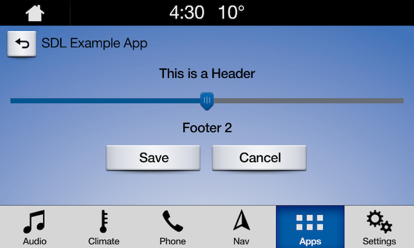

# Slider
A @![iOS]`SDLSlider`!@@![android,javaSE,javaEE]`Slider`!@ creates a full screen or pop-up overlay (depending on platform) that a user can control. There are two main @![iOS]`SDLSlider`!@@![android,javaSE,javaEE]`Slider`!@ layouts, one with a static footer and one with a dynamic footer.

!!! NOTE
The slider will persist on the screen until the timeout has elapsed or the user dismisses the slider by selecting a position or canceling.
!!!

## Slider
A slider popup with a static footer displays a single, optional, footer message below the slider UI. A dynamic footer can show a different message for each slider position.

### Slider UI


##### Dynamic Slider in Position 1


##### Dynamic Slider in Position 2


### Creating the Slider
@![iOS]
##### Objective-C
```objc
// Create the slider
SDLSlider *sdlSlider = [[SDLSlider alloc] init];
```
##### Swift
```swift
// Create the slider
let sdlSlider = SDLSlider()
```
!@

@![android,javaSE,javaEE]
```java
// TODO: Move to sections

//Create a slider
Slider slider = new Slider(5, 1, "This is a Header");

List<String> footer = Collections.singletonList("Static Footer");
slider.setSliderFooter(footer);
slider.setOnRPCResponseListener(new OnRPCResponseListener() {
    @Override
    public void onResponse(int correlationId, RPCResponse response) {
        SliderResponse sliderResponse = (SliderResponse) response;
        Log.i(TAG, "Slider Position Set: "+ sliderResponse.getSliderPosition());
    }

    @Override
    public void onError(int correlationId, Result resultCode, String info){
        Log.e(TAG, "onError: "+ resultCode+ " | Info: "+ info );
    }
});

//Send Request
sdlManager.sendRPC(slider);
```
!@

### Ticks
The number of selectable items on a horizontal axis.
@![iOS]
##### Objective-C
```objc
// Must be a number between 2 and 26
sdlSlider.numTicks = @(5);
```
##### Swift
```swift
// Must be a number between 2 and 26
sdlSlider.numTicks = 5
```
!@

@![android,javaSE,javaEE]
`TODO: add info`
!@

### Position 
The initial position of slider control (cannot exceed numTicks).
@![iOS]
##### Objective-C
```objc
// Must be a number between 1 and 26
sdlSlider.position = @(1);
```
##### Swift
```swift
// Must be a number between 1 and 26
sdlSlider.position = 1
```
!@

@![android,javaSE,javaEE]
`TODO: add info`
!@

### Header 
The header to display.
@![iOS]
##### Objective-C
```objc
// Max length 500 chars
sdlSlider.sliderHeader = @"This is a Header";
```
##### Swift
```swift
// Max length 500 chars
sdlSlider.sliderHeader = "This is a Header"
```
!@

@![android,javaSE,javaEE]
`TODO: add info`
!@

### Static Footer
The footer will have the same message across all positions of the slider.
@![iOS]
##### Objective-C
```objc
// Max length 500 chars
sdlSlider.sliderFooter = @[@"Static Footer"];
```
##### Swift
```swift
// Max length 500 chars
sdlSlider.sliderFooter = ["Static Footer"]
```
!@

@![android,javaSE,javaEE]
`TODO: add info`
!@

### Dynamic Footer
This type of footer will have a different message displayed for each position of the slider. The footer is an optional paramater. The footer message displayed will be based off of the slider's current position. The footer array should be the same length as `numTicks` because each footer must correspond to a tick value. Or, you can pass @![iOS]`nil`!@@![android,javaSE,javaEE]`null`!@ to have no footer at all.

@![iOS]
##### Objective-C
```objc
// Array length 1 - 26, Max length 500 chars
NSArray<NSString *> *footers = @[@"Footer 1", @"Footer 2", @"Footer 3"];
sdlSlider.sliderFooter = footers;
```
##### Swift
```swift
// Array length 1 - 26, Max length 500 chars
let footers = ["Footer 1", "Footer 2", "Footer 3"]
sdlSlider.sliderFooter = footers
```
!@

@![android,javaSE,javaEE]
`TODO: add info`
!@

### Cancel ID
An ID for this specific slider to allow cancellation through the `CancelInteraction` RPC.
@![iOS]
##### Objective-C
```objc
sdlSlider.cancelID = @(45);
```
##### Swift
```swift
sdlSlider.sliderFooter = 45
```
!@

@![android,javaSE,javaEE]
 `TODO: add info`
!@

## Show the Slider
@![iOS]
##### Objective-C
```objc
[manager sendRequest:sdlSlider withResponseHandler:^(__kindof SDLRPCRequest * _Nullable request, __kindof SDLRPCResponse * _Nullable response, NSError * _Nullable error) {
    if (!response || !response.success.boolValue) {
        SDLLogE(@"Error getting the SDLSlider response");
        return;
    }

    // Create a SDLSlider response object from the handler response
    SDLSliderResponse *sdlSliderResponse = (SDLSliderResponse *)response;
    NSUInteger position = sdlSliderResponse.sliderPosition.unsignedIntegerValue;

    <#Use the slider position#>
}];
```
##### Swift
```swift
manager.send(request: sdlSlider, responseHandler: { (req, res, err) in
    // Create a SDLSlider response object from the handler response
    guard let response = res as? SDLSliderResponse, response.resultCode == .success, let position = response.sliderPosition.intValue else { return }

    <#Use the slider position#>
})
```
!@

@![android,javaSE,javaEE]
 `TODO: add info`
!@

## Dismissing a Slider (RPC v6.0+)
You can dismiss a displayed slider before the timeout has elapsed by dismissing either a specific slider or the current slider.

!!! NOTE
If connected to older head units that do not support this feature, the cancel request will be ignored, and the slider will persist on the screen until the timeout has elapsed or the user dismisses by selecting a position or canceling.
!!!

### Dismissing a Specific Slider

@![iOS]
##### Objective-C
```objc
// `cancelID` is the ID that you assigned when creating the slider
SDLCancelInteraction *cancelInteraction = [[SDLCancelInteraction alloc] initWithSliderCancelID:cancelID];
[self.sdlManager sendRequest:cancelInteraction withResponseHandler:^(__kindof SDLRPCRequest * _Nullable request, __kindof SDLRPCResponse * _Nullable response, NSError * _Nullable error) {
    if (![response.resultCode isEqualToEnum:SDLResultSuccess]) { return; }
    <#The slider was canceled successfully#>
}];
```

##### Swift
```swift
// `cancelID` is the ID that you assigned when creating the slider
let cancelInteraction = SDLCancelInteraction(sliderCancelID: cancelID)
sdlManager.send(request: cancelInteraction) { (request, response, error) in
    guard response?.resultCode == .success else { return }
    <#The slider was canceled successfully#>
}
```
!@

@![android,javaSE,javaEE]
```java
// `cancelID` is the ID that you assigned when creating the slider
CancelInteraction cancelInteraction = new CancelInteraction(FunctionID.SLIDER.getId(), cancelID);
cancelInteraction.setOnRPCResponseListener(new OnRPCResponseListener() {
    @Override
    public void onResponse(int correlationId, RPCResponse response) {
        if (response.getSuccess()){
            Log.i(TAG, "Slider was dismissed successfully");
        }
    }

    @Override
    public void onError(int correlationId, Result resultCode, String info) {
        Log.e(TAG, "onError: "+ resultCode+ " | Info: "+ info );
    }
});
sdlManager.sendRPC(cancelInteraction);
```
!@

### Dismissing the Current Slider

@![iOS]
##### Objective-C
```objc
SDLCancelInteraction *cancelInteraction = [SDLCancelInteraction slider];
[self.sdlManager sendRequest:cancelInteraction withResponseHandler:^(__kindof SDLRPCRequest * _Nullable request, __kindof SDLRPCResponse * _Nullable response, NSError * _Nullable error) {
    if (![response.resultCode isEqualToEnum:SDLResultSuccess]) { return; }
    <#The slider was canceled successfully#>
}];
```

##### Swift
```swift
let cancelInteraction = SDLCancelInteraction.slider()
sdlManager.send(request: cancelInteraction) { (request, response, error) in
    guard response?.resultCode == .success else { return }
    <#The slider was canceled successfully#>
}
```
!@

@![android,javaSE,javaEE]
```java
CancelInteraction cancelInteraction = new CancelInteraction(FunctionID.SLIDER.getId());
cancelInteraction.setOnRPCResponseListener(new OnRPCResponseListener() {
    @Override
    public void onResponse(int correlationId, RPCResponse response) {
        if (response.getSuccess()){
            Log.i(TAG, "Slider was dismissed successfully");
        }
    }

    @Override
    public void onError(int correlationId, Result resultCode, String info) {
        Log.e(TAG, "onError: "+ resultCode+ " | Info: "+ info );
    }
});
sdlManager.sendRPC(cancelInteraction);
```
!@  

