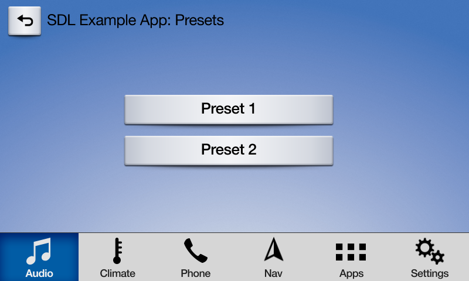

# Subscribing to System Buttons
Subscribe buttons are used to detect changes to hard buttons located in the car's center console or steering wheel. You can subscribe to the following hard buttons:

| Button  | Template | Button Type |
| ------------- | ------------- | ------------- |
| Play / Pause | media template only | soft button and hard button |
| Ok | media template only | soft button and hard button |
| Seek left | media template only | soft button and hard button |
| Seek right | media template only | soft button and hard button |
| Tune up | media template only | hard button |
| Tune down | media template only | hard button |
| Preset 0-9 | any template | hard button |
| Search | any template | hard button |

### Subscribe Buttons HMI
In the screenshot below, the pause, seek left and seek right icons are subscribe buttons.


!!! NOTE
There is no way to customize a subscribe button's image or text.
!!!

## Audio-Related Buttons
The play/pause, seek left, seek right, tune up, and tune down subscribe buttons can only be used in the `MEDIA` template. Depending on the manufacturer of the head unit, the subscribe button might also show up as a soft button in the media template. For example, the SYNC 3 HMI will add the ok, seek right, and seek left soft buttons to the media template when you subscribe to those buttons. You will automatically be assigned the media template if you set your app's `appType` to `MEDIA`.

!!! NOTE
Before library v.@![iOS]6.1!@@![android, javaSE, javaEE]4.7!@ and SDL Core v.5.0, `Ok` and `PlayPause` were combined into `Ok`. Subscribing to `Ok` will, in v.@![iOS]6.1!@@![android, javaSE, javaEE]4.7!@, also subscribe you to `PlayPause`. This means that for the time being, *you should not simultaneously subscribe to `Ok` and `PlayPause`*. In a future major version, this will change. For now, only subscribe to either `Ok` or `PlayPause` and the library will execute the right action based on the version of Core to which you are connected.
!!!

@![iOS]
##### Objective-C
```objc
SDLSubscribeButton *subscribeButton = [[SDLSubscribeButton alloc] initWithButtonName:SDLButtonNamePlayPause handler:^(SDLOnButtonPress * _Nullable buttonPress, SDLOnButtonEvent * _Nullable buttonEvent) {
    <#subscribe button selected#>
}];
[manager sendRequest:subscribeButton withResponseHandler:^(__kindof SDLRPCRequest * _Nullable request, __kindof SDLRPCResponse * _Nullable response, NSError * _Nullable error) {
    if (error != nil) { return; }
    <#subscribe button sent successfully#>
}];
```

##### Swift
```swift
let subscribeButton = SDLSubscribeButton(buttonName: .ok) { (buttonPress, buttonEvent) in
    <#subscribe button selected#>
}
sdlManager.send(request: subscribeButton) { (request, response, error) in
    guard error == nil else { return }
    <#subscribe button sent successfully#>
}
```
!@

@![android, javaSE, javaEE]
```java
sdlManager.addOnRPCNotificationListener(FunctionID.ON_BUTTON_EVENT, new OnRPCNotificationListener() {
    @Override
    public void onNotified(RPCNotification notification) {
        OnButtonPress onButtonPressNotification = (OnButtonPress) notification;
        switch (onButtonPressNotification.getButtonName()) {
            case OK:
                break;
            case PLAY_PAUSE:
                break;
            case SEEKLEFT:
                break;
            case SEEKRIGHT:
                break;
            case TUNEUP:
                break;
            case TUNEDOWN:
                break;
        }
    }
});

sdlManager.addOnRPCNotificationListener(FunctionID.ON_BUTTON_PRESS, new OnRPCNotificationListener() {
    @Override
    public void onNotified(RPCNotification notification) {
        OnButtonPress onButtonPressNotification = (OnButtonPress) notification;
        switch (onButtonPressNotification.getButtonName()) {
            case OK:
                break;
            case PLAY_PAUSE:
                break;
            case SEEKLEFT:
                break;
            case SEEKRIGHT:
                break;
            case TUNEUP:
                break;
            case TUNEDOWN:
                break;
        }
    }
});

SubscribeButton subscribeButtonRequest = new SubscribeButton();
subscribeButtonRequest.setButtonName(ButtonName.OK);
sdlManager.sendRPC(subscribeButtonRequest);
```
!@


## Preset Buttons




Preset buttons may not work in the same way as seen on the above screenshots on all head units. Some head units may have physical buttons on their console and these will trigger the subscribed button. You can check if an HMI supports subscribing to preset buttons, and how many, by calling the @![iOS] `SDLManager.systemCapabilityManager.displayCapabilities.numCustomPresetsAvailable`!@ @![android,javaSE, javaEE] sdlManager.getSystemCapabilityManager().getDefaultMainWindowCapability().getNumCustomPresetsAvailable() !@.
@![iOS]
##### Objective-C
```objc
SDLSubscribeButton *preset1 = [[SDLSubscribeButton alloc] initWithButtonName:SDLButtonNamePreset1 handler:^(SDLOnButtonPress * _Nullable buttonPress, SDLOnButtonEvent * _Nullable buttonEvent) {
    if (buttonPress == nil) { return; }
    <#Button Selected#>
}];

SDLSubscribeButton *preset2 = [[SDLSubscribeButton alloc] initWithButtonName:SDLButtonNamePreset2 handler:^(SDLOnButtonPress * _Nullable buttonPress, SDLOnButtonEvent * _Nullable buttonEvent) {
    if (buttonPress == nil) { return; }
    <#Button Selected#>
}];

[self.sdlManager sendRequests:@[preset1, preset2] progressHandler:nil completionHandler:^(BOOL success) {
    if(success) {
        <#subscribe button sent successfully#>
    }
}];
```

##### Swift
```swift
let preset1 = SDLSubscribeButton(buttonName: .preset1, handler: { (buttonPress, buttonEvent) in
    guard buttonPress != nil else { return }
    <#subscribe button selected#>
})

let preset2 = SDLSubscribeButton(buttonName: .preset2, handler: { (buttonPress, buttonEvent) in
    guard buttonPress != nil else { return }
    <#subscribe button selected#>
})

self.sdlManager.send([preset1, preset2], progressHandler: nil, completionHandler: { (success) in
    guard success else { return }
    <#subscriptions sent#>
})
```
!@

@![android,javaSE,javaEE]
```java
sdlManager.addOnRPCNotificationListener(FunctionID.ON_BUTTON_EVENT, new OnRPCNotificationListener() {
    @Override
    public void onNotified(RPCNotification notification) {
        OnButtonPress onButtonPressNotification = (OnButtonPress) notification;
        switch (onButtonPressNotification.getButtonName()) {
            case PRESET_1:
                break;
            case PRESET_2:
                break;
        }
    }
});

sdlManager.addOnRPCNotificationListener(FunctionID.ON_BUTTON_PRESS, new OnRPCNotificationListener() {
    @Override
    public void onNotified(RPCNotification notification) {
        OnButtonPress onButtonPressNotification = (OnButtonPress) notification;
        switch (onButtonPressNotification.getButtonName()) {
            case PRESET_1:
                break;
            case PRESET_2:
                break;
        }
    }
});

SubscribeButton preset1 = new SubscribeButton(ButtonName.PRESET_1);
SubscribeButton preset2 = new SubscribeButton(ButtonName.PRESET_2);
sdlManager.sendRPCs(Arrays.asList(preset1, preset2), null);
```
!@


