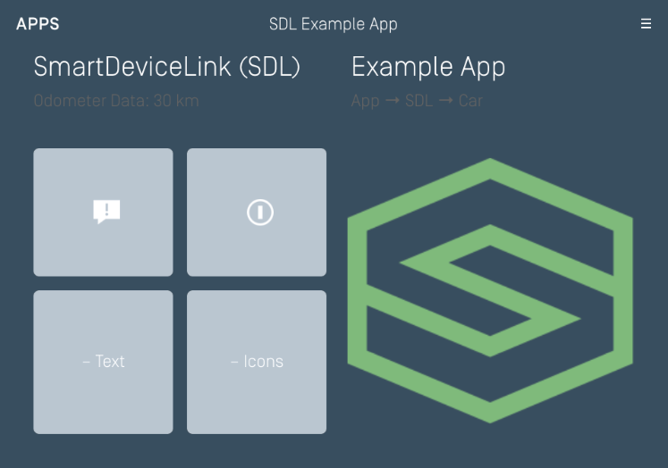
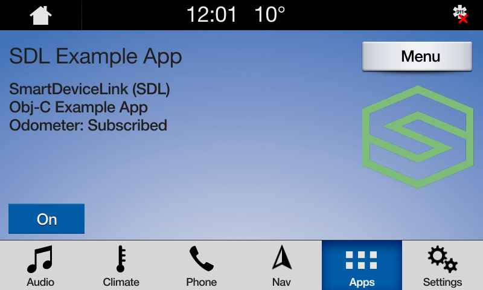
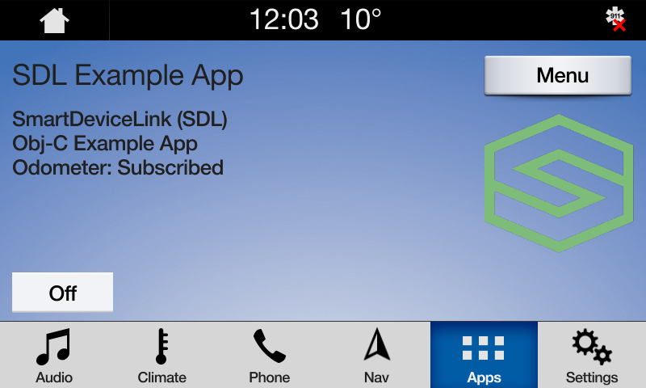
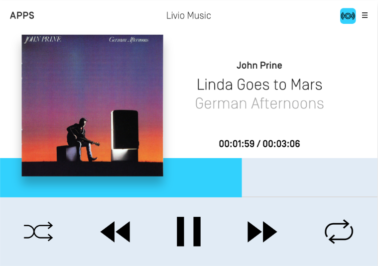
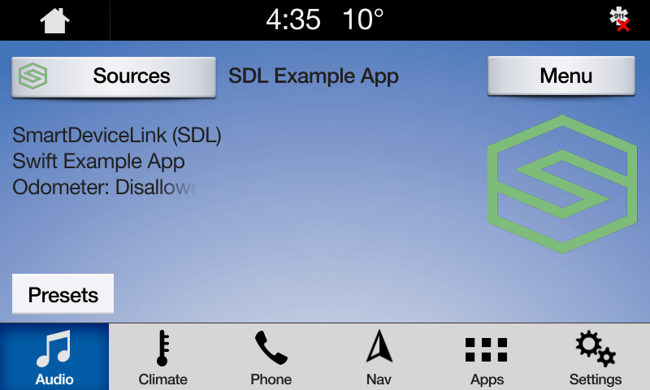
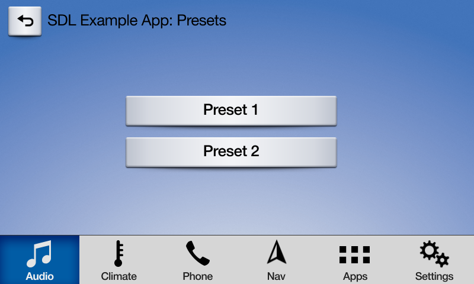

# Template Buttons
This guide shows you how to show and react to two types of buttons: soft and system buttons. The text and images of soft buttons can be customized and are part of your SDL app's UI. System buttons are used to detect changes to hard buttons located in the car's center console or steering wheel. Depending on the OEM, a system button that you have subscribed to might also show up as part of your template, however the text and image of system buttons can not be edited.     

## Custom Soft Buttons
The @![iOS]`SDLScreenManager`!@ @![android, javaSE, javaEE]`ScreenManager`!@ is a manager for easily creating text, images and soft buttons for your SDL app. To update the UI, simply give the manager the new UI data and sandwich the update between the manager's @![iOS]`beginUpdates`!@ @![android, javaSE, javaEE]`beginTransaction()`!@ and @![iOS]`endUpdatesWithCompletionHandler:`!@ @![android, javaSE, javaEE]`commit()`!@ methods.

| SDLScreenManager Parameter Name | Description |
|:--------------------------------------------|:--------------|
| softButtonObjects | An array of buttons. Each template supports a different number of soft buttons |

### Showing Soft Buttons
@![iOS]
##### Objective-C
```objc
[self.sdlManager.screenManager beginUpdates];

self.sdlManager.screenManager.softButtonObjects = @[<#SDLButtonObject#>, <#SDLButtonObject#>];

[self.sdlManager.screenManager endUpdatesWithCompletionHandler:^(NSError * _Nullable error) {
    if (error != nil) {
        <#Error Updating UI#>
    } else {
        <#Update to UI was Successful#>
    }
}];
```

##### Swift
```swift
sdlManager.screenManager.beginUpdates()

sdlManager.screenManager.softButtonObjects = [<#SDLButtonObject#>, <#SDLButtonObject#>]

sdlManager.screenManager.endUpdates { (error) in
    if error != nil {
        <#Error Updating UI#>
    } else {
        <#Update to UI was Successful#>
    }
}
```
!@

@![android, javaSE, javaEE]
```java
sdlManager.getScreenManager().beginTransaction();

// TODO 

sdlManager.getScreenManager().commit(new CompletionListener() {
	@Override
	public void onComplete(boolean success) {
		Log.i(TAG, "ScreenManager update complete: " + success);
	}
});
```
!@

### Creating Soft Buttons
To create a soft button using the `ScreenManager`, you only need to create a custom name for the button and provide the text for the button's label and/or an image for the button's icon. If your button cycles between different states (e.g. a button used to set the repeat state of a song playlist can have three states: repeat-off, repeat-one, and repeat-all) you can upload all the states on initialization. 

There are three different ways to create a soft button: with just text, with just an image, or with both text and images. If creating a button with an image, we recommend that you template the image so its color works well with both the day and night modes of the head unit. For more information on templating images please see the [Template Images](Displaying a User Interface/Template Images) guide. 



#### Text Only Soft Buttons
@![iOS]
##### Objective-C
```objc
SDLSoftButtonState *textState = [[SDLSoftButtonState alloc] initWithStateName:@"<#State Name#>" text:@"<#Button Label Text#>" image:nil];

SDLSoftButtonObject *softButton = [[SDLSoftButtonObject alloc] initWithName:@"<#Button Name#>" state:textState handler:^(SDLOnButtonPress * _Nullable buttonPress, SDLOnButtonEvent * _Nullable buttonEvent) {
    if (buttonPress == nil) { return; }
    <#Button selected#>
}];

self.sdlManager.screenManager.softButtonObjects =  @[softButton];
```
##### Swift
```swift
let textState = SDLSoftButtonState(stateName: "<#State Name#>", text: "<#Button Label Text#>", image: nil)

let softButton = SDLSoftButtonObject(name: "<#Button Name#>", state: textState) { (buttonPress, buttonEvent) in
    guard buttonPress != nil else { return }
    <#Button selected#>
}

sdlManager.screenManager.softButtonObjects = [softButton]
```
!@

@![android, javaSE, javaEE]
```java
SoftButtonState textState = new SoftButtonState("<#State Name#>", "<#Button Label Text#>", null);
SoftButtonObject softButtonObject = new SoftButtonObject("softButtonObject", Collections.singletonList(textState), textState.getName(), new SoftButtonObject.OnEventListener() {
    @Override
    public void onPress(SoftButtonObject softButtonObject, OnButtonPress onButtonPress) {
    }

    @Override
    public void onEvent(SoftButtonObject softButtonObject, OnButtonEvent onButtonEvent) {

    }
});

sdlManager.getScreenManager().setSoftButtonObjects(Collections.singletonList(softButtonObject));
```
!@

#### Image Only Soft Buttons
To see if the module supports soft buttons with images you should check the @![iOS]`softButtonCapabilities` property!@ @![android,javaSE,javaEE]`getGraphicSupported()` method!@ on @![iOS]`SDLManager`s!@ @![android,javaSE,javaEE]`SdlManager`s!@ @![iOS]`systemCapabilityManager`!@ @![android,javeSE,javaEE]`SoftButtonCapabilities` using the `SystemCapabilityManager`!@. 

@![iOS]
##### Objective-C
```objc
// Check to see if soft buttons support images
BOOL softButtonsSupportImages = self.sdlManager.systemCapabilityManager.softButtonCapabilities.firstObject.imageSupported.boolValue;

// If HMI supports images create a soft button with an image
SDLSoftButtonState *imageState = [[SDLSoftButtonState alloc] initWithStateName:@"<#State Name#>" text:nil image:[[UIImage imageNamed:@"<#Image Name#>"] imageWithRenderingMode:<#UIImageRenderingMode#>]];

SDLSoftButtonObject *softButton = [[SDLSoftButtonObject alloc] initWithName:@"<#Button Name#>" state:imageState handler:^(SDLOnButtonPress * _Nullable buttonPress, SDLOnButtonEvent * _Nullable buttonEvent) {
    if (buttonPress == nil) { return; }
    <#Button selected#>
}];

self.sdlManager.screenManager.softButtonObjects =  @[softButton];
```

##### Swift
```swift
// Check to see if soft buttons support images
let softButtonsSupportImages = sdlManager.systemCapabilityManager.softButtonCapabilities?.first?.imageSupported.boolValue ?? false

// If HMI supports images create a soft button with an image
let imageState = SDLSoftButtonState(stateName: "State Name", text: "<#State Name#>", image: UIImage(named:"<#Image Name#>")?.withRenderingMode(<#RenderingMode#>))

let softButton = SDLSoftButtonObject(name: "<#Button Name#>", state: imageState) { (buttonPress, buttonEvent) in
    guard buttonPress != nil else { return }
    <#Button selected#>
}

sdlManager.screenManager.softButtonObjects = [softButton]
```
!@

@![android, javaSE, javaEE]
```java
Object softButtonCapabilities = sdlManager.getSystemCapabilityManager().getCapability(SystemCapabilityType.SOFTBUTTON);
List<SoftButtonCapabilities> softButtonCapabilitiesList = SystemCapabilityManager.convertToList(softButtonCapabilities, SoftButtonCapabilities.class);
boolean imageSupported = false;
if (softButtonCapabilities != null && !softButtonCapabilitiesList.isEmpty() && softButtonCapabilitiesList.get(0).getImageSupported()){
    imageSupported = true;
}

if (imageSupported) {
    SoftButtonState state = new SoftButtonState("<#State Name#>", null, imageArtwork);
    SoftButtonObject softButtonObject = new SoftButtonObject("softButtonObject", Collections.singletonList(state), state.getName(), new SoftButtonObject.OnEventListener() {
        @Override
        public void onPress(SoftButtonObject softButtonObject, OnButtonPress onButtonPress) {
        }

        @Override
        public void onEvent(SoftButtonObject softButtonObject, OnButtonEvent onButtonEvent) {
        }
    });

    sdlManager.getScreenManager().setSoftButtonObjects(Collections.singletonList(softButtonObject));
}
```
!@

#### Image and Text Soft Buttons
@![iOS]
##### Objective-C
```objc
SDLSoftButtonState *state = [[SDLSoftButtonState alloc] initWithStateName:@"<#State Name#>" text:@"<#Button Label Text#>" image:[[UIImage imageNamed:@"<#Image Name#>"] imageWithRenderingMode:<#UIImageRenderingMode#>]];

SDLSoftButtonObject *softButton = [[SDLSoftButtonObject alloc] initWithName:@"<#Button Name#>" state:state handler:^(SDLOnButtonPress * _Nullable buttonPress, SDLOnButtonEvent * _Nullable buttonEvent) {
    if (buttonPress == nil) { return; }
    <#Button selected#>
}];

self.sdlManager.screenManager.softButtonObjects =  @[softButton];
```
##### Swift
```swift
let state = SDLSoftButtonState(stateName: "<#State Name#>", text: "<#Button Label Text#>", image: UIImage(named:"<#Image Name#>")?.withRenderingMode(<#RenderingMode#>))

let softButton = SDLSoftButtonObject(name: "<#Button Name#>", state: state) { (buttonPress, buttonEvent) in
    guard buttonPress != nil else { return }
    <#Button selected#>
}

sdlManager.screenManager.softButtonObjects = [softButton]
```
!@

@![android, javaSE, javaEE]
```java
SoftButtonState state = new SoftButtonState("<#State Name#>", "<#Button Label Text#>", imageArtwork);
SoftButtonObject softButtonObject = new SoftButtonObject("softButtonObject", Collections.singletonList(state), state.getName(), new SoftButtonObject.OnEventListener() {
    @Override
    public void onPress(SoftButtonObject softButtonObject, OnButtonPress onButtonPress) {
    }

    @Override
    public void onEvent(SoftButtonObject softButtonObject, OnButtonEvent onButtonEvent) {
    }
});

sdlManager.getScreenManager().setSoftButtonObjects(Collections.singletonList(softButtonObject));
```
!@

#### Highlighting a Soft Button
When a button is highlighted, the background color will change to indicate that it has been selected. 

##### Highlight On


##### Highlight Off


@![iOS]
##### Objective-C
```objc
SDLSoftButtonState *highlightOn = [[SDLSoftButtonState alloc] initWithStateName:@"<#Soft Button State Name#>" text:@"On" artwork:<#SDLArtwork#>];
highlightOn.highlighted = YES;

SDLSoftButtonState *highlightOff = [[SDLSoftButtonState alloc] initWithStateName:@"<#Soft Button State Name#>" text:@"Off" artwork:<#SDLArtwork#>];
highlightOff.highlighted = NO;

__weak typeof(self) weakSelf = self;
SDLSoftButtonObject *highlightButton = [[SDLSoftButtonObject alloc] initWithName:@"HighlightButton" states:@[highlightOn, highlightOff] initialStateName:highlightOn.name handler:^(SDLOnButtonPress * _Nullable buttonPress, SDLOnButtonEvent * _Nullable buttonEvent) {
    if (buttonPress == nil) { return; }
    SDLSoftButtonObject *transitionHighlight = [weakSelf.sdlManager.screenManager softButtonObjectNamed:@"HighlightButton"];
    [transitionHighlight transitionToNextState];
}];
```

##### Swift
```swift
let highlightOn = SDLSoftButtonState(stateName: "<#Soft Button State Name#>", text: "On", artwork: <#SDLArtwork#>)
highlightOn.isHighlighted = true
let highlightOff = SDLSoftButtonState(stateName: "<#Soft Button State Name#>", text: "Off", artwork: <#SDLArtwork#>)
highlightOff.isHighlighted = false

return SDLSoftButtonObject(name: "HighlightButton", states: [highlightOn, highlightOff], initialStateName: highlightOn.name) { [unowned self] (buttonPress, buttonEvent) in
    guard buttonPress != nil else { return }
    let transitionHighlight = self.sdlManager.screenManager.softButtonObjectNamed("HighlightButton")
    transitionHighlight?.transitionToNextState()
}
```
!@

@![android,javaSE,javaEE]
```java
SoftButtonState softButtonState1 = new SoftButtonState("Soft Button State Name", "On", image1Artwork);
softButtonState1.setHighlighted(true);
SoftButtonState softButtonState2 = new SoftButtonState("Soft Button State Name 2", "Off", image2Artwork);
softButtonState2.setHighlighted(false);
SoftButtonObject softButtonObject = new SoftButtonObject("softButtonObject", Arrays.asList(softButtonState1, softButtonState2), softButtonState1.getName(), new SoftButtonObject.OnEventListener() {
     @Override
     public void onPress(SoftButtonObject softButtonObject, OnButtonPress onButtonPress) {
          softButtonObject.transitionToNextState();
     }

     @Override
     public void onEvent(SoftButtonObject softButtonObject, OnButtonEvent onButtonEvent) {
     }
});
```
!@

### Updating the Soft Button State
When the soft button state needs to be updated, simply tell the `SoftButtonObject` to transition to the next state. If your button states do not cycle in a predictable order, you can also tell the soft button the state to transition to by passing the `stateName` of the new soft button state.

@![iOS]
##### Objective-C
```objc
SDLSoftButtonState *softButtonState1 = [[SDLSoftButtonState alloc] initWithStateName:@"<#Soft Button State Name#>" text:@"<#Button Label Text#>" artwork:<#SDLArtwork#>];
SDLSoftButtonState *softButtonState2 = [[SDLSoftButtonState alloc] initWithStateName:@"<#Soft Button State Name#>" text:@"<#Button Label Text#>" artwork:<#SDLArtwork#>];
SDLSoftButtonObject *softButtonObject = [[SDLSoftButtonObject alloc] initWithName:@"<#Soft Button Object Name#>" states:@[softButtonState1, softButtonState2] initialStateName:<#Soft Button State#>.name handler:^(SDLOnButtonPress * _Nullable buttonPress, SDLOnButtonEvent * _Nullable buttonEvent) {
    if (buttonPress == nil) { return; }
    <#Button Selected#>
}];
self.sdlManager.screenManager.softButtonObjects = @[softButtonObject];

// Transition to a new state
SDLSoftButtonObject *retrievedSoftButtonObject = [self.sdlManager.screenManager softButtonObjectNamed:@"<#Soft Button Object Name#>"];
[retrievedSoftButtonObject transitionToNextState];
```

##### Swift
```swift
let softButtonState1 = SDLSoftButtonState(stateName: "<#Soft Button State Name#>", text: "<#Button Label Text#>", artwork: <#SDLArtwork#>)
let softButtonState2 = SDLSoftButtonState(stateName: "<#Soft Button State Name#>", text: "<#Button Label Text#>", artwork: <#SDLArtwork#>)
let softButtonObject = SDLSoftButtonObject(name: "<#Soft Button Object Name#>", states: [softButtonState1, softButtonState2], initialStateName: <#Soft Button State#>.name) { (buttonPress, buttonEvent) in
    guard buttonPress != nil else { return }
    <#Button Selected#>
}
sdlManager.screenManager.softButtonObjects = [softButtonObject]

// Transition to a new state
let retrievedSoftButtonObject = sdlManager.screenManager.softButtonObjectNamed("<#Soft Button Object Name#>")
retrievedSoftButtonObject?.transitionToNextState()
```
!@

@![android, javaSE, javaEE]
```java
SoftButtonState state1 = new SoftButtonState("<#State1 Name#>", "<#Button1 Label Text#>", image1Artwork);
SoftButtonState state2 = new SoftButtonState("<#State2 Name#>", "<#Button2 Label Text#>", image2Artwork);

SoftButtonObject softButtonObject = new SoftButtonObject("softButtonObject", Arrays.asList(state1, state2), state1.getName(), new SoftButtonObject.OnEventListener() {
    @Override
    public void onPress(SoftButtonObject softButtonObject, OnButtonPress onButtonPress) { 
    }

    @Override
    public void onEvent(SoftButtonObject softButtonObject, OnButtonEvent onButtonEvent) {
    }
});

sdlManager.getScreenManager().setSoftButtonObjects(Collections.singletonList(softButtonObject));

// Transition to a new state
SoftButtonObject retrievedSoftButtonObject = sdlManager.getScreenManager().getSoftButtonObjectByName("softButtonObject");
retrievedSoftButtonObject.transitionToNextState();
```
!@

### Deleting Soft Buttons
To delete soft buttons, simply pass the screen manager a new array of soft buttons. To delete all soft buttons, simply pass the screen manager an empty array.

@![iOS]
##### Objective-C
```objc
self.sdlManager.screenManager.softButtonObjects = @[];
```

##### Swift
```swift
sdlManager.screenManager.softButtonObjects = []
```
!@

@![android,javaSE,javaEE]
```java
sdlManager.getScreenManager().setSoftButtonObjects(Collections.EMPTY_LIST);
```
!@

## Subscribing to System Buttons
Subscribe buttons are used to detect changes to hard buttons located in the car's center console or steering wheel. You can subscribe to the following hard buttons:

| Button  | Template |
| ------------- | ------------- |
| Play / Pause | Media only |
| Ok | Media only |
| Seek left | Media only |
| Seek right | Media only |
| Tune up | Media only |
| Tune down | Media only |
| Preset 0-9 | Any |
| Search | Any |
| Center Location | NavigationFullscreenMap only |
| Zoom In | NavigationFullscreenMap only |
| Zoom Out | NavigationFullscreenMap only |
| Pan Up | NavigationFullscreenMap only |
| Pan Up-Right | NavigationFullscreenMap only |
| Pan Right | NavigationFullscreenMap only |
| Pan Down-Right | NavigationFullscreenMap only |
| Pan Down | NavigationFullscreenMap only |
| Pan Down-Left | NavigationFullscreenMap only |
| Pan Left | NavigationFullscreenMap only |
| Pan Up-Left | NavigationFullscreenMap only |
| Toggle Tilt | NavigationFullscreenMap only |
| Rotate Clockwise | NavigationFullscreenMap only |
| Rotate Counter-Clockwise | NavigationFullscreenMap only |
| Toggle Heading | NavigationFullscreenMap only |

!!! NOTE
`Media` is the default template for media apps and `NavigationFullscreenMap` is the default template for navigation apps.
!!!

### Subscribe Buttons HMI
In the screenshot below, the pause, seek left and seek right icons are subscribe buttons.


!!! NOTE
There is no way to customize a subscribe button's image or text.
!!!

### Audio-Related Buttons
The play/pause, seek left, seek right, tune up, and tune down subscribe buttons can only be used in the `MEDIA` template. Depending on the manufacturer of the head unit, the subscribe button might also show up as a soft button in the media template. For example, the SYNC 3 HMI will add the ok, seek right, and seek left soft buttons to the media template when you subscribe to those buttons. You will automatically be assigned the media template if you set your app's `appType` to `MEDIA`.

!!! NOTE
Before library v.@![iOS]6.1!@@![android, javaSE, javaEE]4.7!@ and SDL Core v.5.0, `Ok` and `PlayPause` were combined into `Ok`. Subscribing to `Ok` will, in v.@![iOS]6.1!@@![android, javaSE, javaEE]4.7!@, also subscribe you to `PlayPause`. This means that for the time being, *you should not simultaneously subscribe to `Ok` and `PlayPause`*. In a future major version, this will change. For now, only subscribe to either `Ok` or `PlayPause` and the library will execute the right action based on the version of Core to which you are connected.
!!!

@![iOS]
##### Objective-C
```objc
SDLSubscribeButton *subscribeButton = [[SDLSubscribeButton alloc] initWithButtonName:SDLButtonNamePlayPause handler:^(SDLOnButtonPress * _Nullable buttonPress, SDLOnButtonEvent * _Nullable buttonEvent) {
    <#subscribe button selected#>
}];
[manager sendRequest:subscribeButton withResponseHandler:^(__kindof SDLRPCRequest * _Nullable request, __kindof SDLRPCResponse * _Nullable response, NSError * _Nullable error) {
    if (error != nil) { return; }
    <#subscribe button sent successfully#>
}];
```

##### Swift
```swift
let subscribeButton = SDLSubscribeButton(buttonName: .ok) { (buttonPress, buttonEvent) in
    <#subscribe button selected#>
}
sdlManager.send(request: subscribeButton) { (request, response, error) in
    guard error == nil else { return }
    <#subscribe button sent successfully#>
}
```
!@

@![android, javaSE, javaEE]
```java
sdlManager.addOnRPCNotificationListener(FunctionID.ON_BUTTON_EVENT, new OnRPCNotificationListener() {
    @Override
    public void onNotified(RPCNotification notification) {
        OnButtonPress onButtonPressNotification = (OnButtonPress) notification;
        switch (onButtonPressNotification.getButtonName()) {
            case OK:
                break;
            case PLAY_PAUSE:
                break;
            case SEEKLEFT:
                break;
            case SEEKRIGHT:
                break;
            case TUNEUP:
                break;
            case TUNEDOWN:
                break;
        }
    }
});

sdlManager.addOnRPCNotificationListener(FunctionID.ON_BUTTON_PRESS, new OnRPCNotificationListener() {
    @Override
    public void onNotified(RPCNotification notification) {
        OnButtonPress onButtonPressNotification = (OnButtonPress) notification;
        switch (onButtonPressNotification.getButtonName()) {
            case OK:
                break;
            case PLAY_PAUSE:
                break;
            case SEEKLEFT:
                break;
            case SEEKRIGHT:
                break;
            case TUNEUP:
                break;
            case TUNEDOWN:
                break;
        }
    }
});

SubscribeButton subscribeButtonRequest = new SubscribeButton();
subscribeButtonRequest.setButtonName(ButtonName.OK);
sdlManager.sendRPC(subscribeButtonRequest);
```
!@


### Preset Buttons





Preset buttons may not work in the same way as seen on the above screenshots on all head units. Some head units may have physical buttons on their console and these will trigger the subscribed button. You can check if an HMI supports subscribing to preset buttons, and how many, by calling the @![iOS] `SDLManager.systemCapabilityManager.displayCapabilities.numCustomPresetsAvailable`!@ @![android,javaSE, javaEE]`sdlManager.getSystemCapabilityManager().getDefaultMainWindowCapability().getNumCustomPresetsAvailable()`!@.

@![iOS]
##### Objective-C
```objc
SDLSubscribeButton *preset1 = [[SDLSubscribeButton alloc] initWithButtonName:SDLButtonNamePreset1 handler:^(SDLOnButtonPress * _Nullable buttonPress, SDLOnButtonEvent * _Nullable buttonEvent) {
    if (buttonPress == nil) { return; }
    <#Button Selected#>
}];

SDLSubscribeButton *preset2 = [[SDLSubscribeButton alloc] initWithButtonName:SDLButtonNamePreset2 handler:^(SDLOnButtonPress * _Nullable buttonPress, SDLOnButtonEvent * _Nullable buttonEvent) {
    if (buttonPress == nil) { return; }
    <#Button Selected#>
}];

[self.sdlManager sendRequests:@[preset1, preset2] progressHandler:nil completionHandler:^(BOOL success) {
    if(success) {
        <#subscribe button sent successfully#>
    }
}];
```

##### Swift
```swift
let preset1 = SDLSubscribeButton(buttonName: .preset1, handler: { (buttonPress, buttonEvent) in
    guard buttonPress != nil else { return }
    <#subscribe button selected#>
})

let preset2 = SDLSubscribeButton(buttonName: .preset2, handler: { (buttonPress, buttonEvent) in
    guard buttonPress != nil else { return }
    <#subscribe button selected#>
})

self.sdlManager.send([preset1, preset2], progressHandler: nil, completionHandler: { (success) in
    guard success else { return }
    <#subscriptions sent#>
})
```
!@

@![android,javaSE,javaEE]
```java
sdlManager.addOnRPCNotificationListener(FunctionID.ON_BUTTON_EVENT, new OnRPCNotificationListener() {
    @Override
    public void onNotified(RPCNotification notification) {
        OnButtonPress onButtonPressNotification = (OnButtonPress) notification;
        switch (onButtonPressNotification.getButtonName()) {
            case PRESET_1:
                break;
            case PRESET_2:
                break;
        }
    }
});

sdlManager.addOnRPCNotificationListener(FunctionID.ON_BUTTON_PRESS, new OnRPCNotificationListener() {
    @Override
    public void onNotified(RPCNotification notification) {
        OnButtonPress onButtonPressNotification = (OnButtonPress) notification;
        switch (onButtonPressNotification.getButtonName()) {
            case PRESET_1:
                break;
            case PRESET_2:
                break;
        }
    }
});

SubscribeButton preset1 = new SubscribeButton(ButtonName.PRESET_1);
SubscribeButton preset2 = new SubscribeButton(ButtonName.PRESET_2);
sdlManager.sendRPCs(Arrays.asList(preset1, preset2), null);
```
!@
