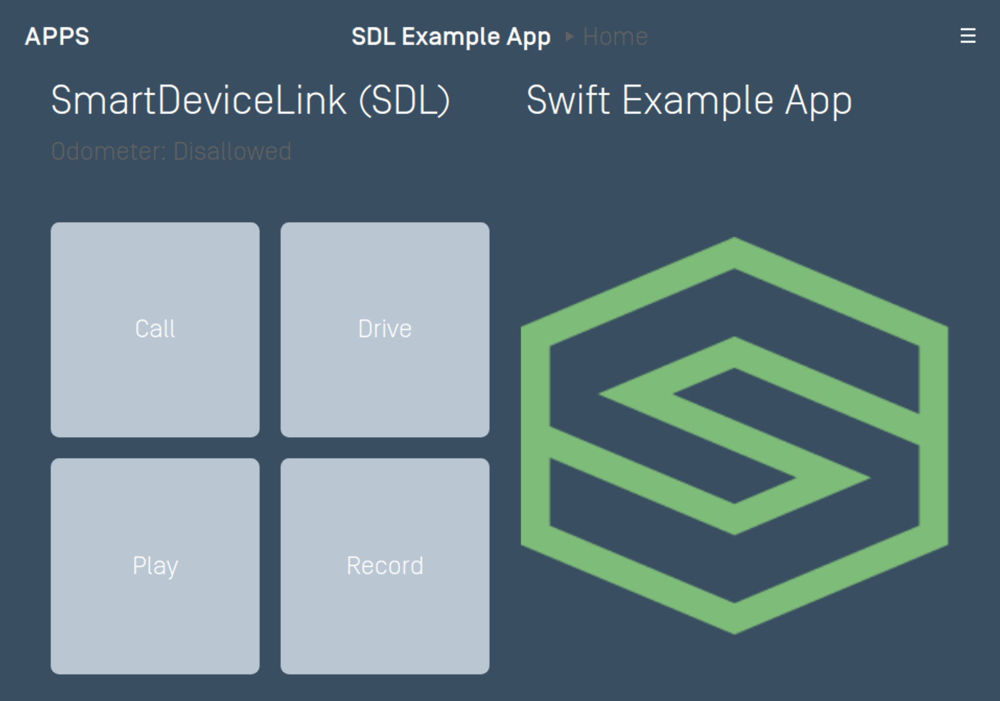
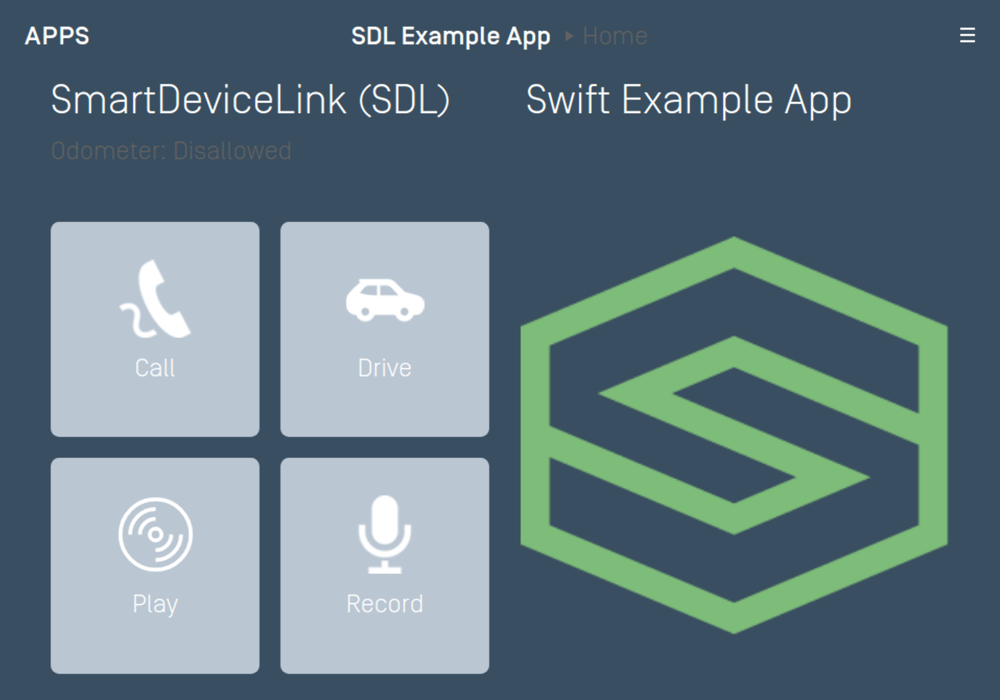
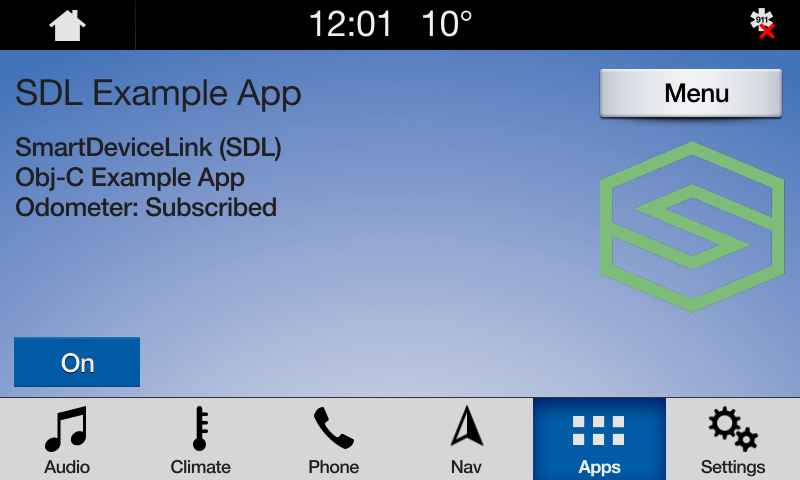
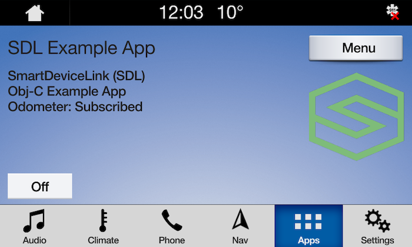

# Template Custom Buttons
You can easily create and update custom buttons (called Soft Buttons in SDL) using the @![iOS]`SDLScreenManager`!@@![android, javaSE, javaEE, javascript]`ScreenManager`!@. To update the UI, simply give the manager your new data and (optionally) sandwich the update between the manager's @![iOS]`beginUpdates`!@@![android, javaSE, javaEE, javascript]`beginTransaction()`!@ and @![iOS]`endUpdatesWithCompletionHandler`!@@![android, javaSE, javaEE, javascript]`commit()`!@ methods.

### Soft Button Fields
| @![iOS]SDLScreenManager!@@![android, javaSE, javaEE, javascript]ScreenManager!@ Parameter Name | Description |
|:--------------------------------------------|:--------------|
| softButtonObjects | An array of buttons. Each template supports a different number of soft buttons |

### Creating Soft Buttons
To create a soft button using the @![iOS]`SDLScreenManager`!@@![android, javaSE, javaEE, javascript]`ScreenManager`!@, you only need to create a custom name for the button and provide the text for the button's label and/or an image for the button's icon. If your button cycles between different states (e.g. a button used to set the repeat state of a song playlist can have three states: repeat-off, repeat-one, and repeat-all), you can create all the states on initialization. 

There are three different ways to create a soft button: with only text, with only an image, or with both text and an image. If creating a button with an image, we recommend that you template the image so its color works well with both the day and night modes of the head unit. For more information on templating images please see the [Template Images](Displaying a User Interface/Template Images) guide. 

#### Text Only Soft Buttons


@![iOS]
##### Objective-C
```objc
SDLSoftButtonObject *textSoftButton = [[SDLSoftButtonObject alloc] initWithName:@"<#Button Name#>" text:@"<#Button Label Text#>" artwork:nil handler:^(SDLOnButtonPress * _Nullable buttonPress, SDLOnButtonEvent * _Nullable buttonEvent) {
    if (buttonPress == nil) { return; }
    <#Button selected#>
}];

[self.sdlManager.screenManager beginUpdates];
self.sdlManager.screenManager.softButtonObjects = @[textSoftButton];
[self.sdlManager.screenManager endUpdatesWithCompletionHandler:^(NSError * _Nullable error) {
    if (error != nil) {
        <#Error updating UI#>
    } else {
        <#Update to UI was successful#>
    }
}];
```

##### Swift
```swift
let textSoftButton = SDLSoftButtonObject(name: "<#Button Name#>", text: "<#Button Label Text#>", artwork: nil) { (buttonPress, buttonEvent) in
    guard let buttonPress = buttonPress else { return }
    <#Button selected#>
}

sdlManager.screenManager.beginUpdates()
sdlManager.screenManager.softButtonObjects = [textSoftButton]
sdlManager.screenManager.endUpdates { (error) in
    if error != nil {
        <#Error updating UI#>
    } else {
        <#Update to UI was successful#>
    }
}
```
!@

@![android, javaSE, javaEE]
```java
SoftButtonState textState = new SoftButtonState("<#State Name#>", "<#Button Label Text#>", null);
SoftButtonObject softButtonObject = new SoftButtonObject("softButtonObject", Collections.singletonList(textState), textState.getName(), new SoftButtonObject.OnEventListener() {
    @Override
    public void onPress(SoftButtonObject softButtonObject, OnButtonPress onButtonPress) {
    }

    @Override
    public void onEvent(SoftButtonObject softButtonObject, OnButtonEvent onButtonEvent) {

    }
});

sdlManager.getScreenManager().beginTransaction();
sdlManager.getScreenManager().setSoftButtonObjects(Collections.singletonList(softButtonObject));
sdlManager.getScreenManager().commit(new CompletionListener() {
	@Override
	public void onComplete(boolean success) {
		DebugTool.logInfo(TAG, "ScreenManager update complete: " + success);
	}
});
```
!@

@![javascript]
```js
const textState = new SDL.manager.screen.utils.SoftButtonState()
    .setName('State Name')
    .setText('Button Label Text');
const softButtonObject = new SDL.manager.screen.utils.SoftButtonObject('softButtonObject', [textState], textState.getName(), function (softButtonObject, rpc) {
    if (rpc instanceof SDL.rpc.messages.OnButtonPress && rpc.getSuccess()) {
        console.log('SoftButton pressed!');
    }
});

sdlManager.getScreenManager().beginTransaction();
sdlManager.getScreenManager().setSoftButtonObjects([softButtonObject]);
// Commit the updates and catch any errors
const success = await sdlManager.getScreenManager().commit().catch(function (error) {
    // Handle Error
});
console.log('ScreenManager update complete:', success);
if (success === true) {
    // Update complete
} else {
    // Something went wrong
}
```
!@

#### Image Only Soft Buttons
You can use the @![iOS]`SDLSystemCapabilityManager`!@@![android,javaSE,javaEE,javascript]`SystemCapabilityManager`!@ to check if the HMI supports soft buttons with images. If you send image-only buttons to a HMI that does not support images, then the library will not send the buttons as they will be rejected by the head unit. If all your soft buttons have text in addition to images, the library will send the text-only buttons if the head unit does not support images.


@![iOS]
##### Objective-C
```objc
BOOL softButtonsSupportImages = self.sdlManager.systemCapabilityManager.defaultMainWindowCapability.softButtonCapabilities.firstObject.imageSupported.boolValue;
```

##### Swift
```swift
let softButtonsSupportImages = sdlManager.systemCapabilityManager.defaultMainWindowCapability.softButtonCapabilities.first.imageSupported.boolValue ?? false
```
!@

@![android, javaSE, javaEE]
```java
List<SoftButtonCapabilities> softButtonCapabilitiesList = sdlManager.getSystemCapabilityManager().getDefaultMainWindowCapability().getSoftButtonCapabilities();
boolean imageSupported = (!softButtonCapabilitiesList.isEmpty()) ? softButtonCapabilitiesList.get(0).getImageSupported() : false;
```
!@

@![javascript]
```js
const softButtonCapabilitiesList = sdlManager.getSystemCapabilityManager().getDefaultMainWindowCapability().getSoftButtonCapabilities();
const imageSupported = (softButtonCapabilitiesList.length !== 0) ? softButtonCapabilitiesList[0].getImageSupported() : false;
```
!@
 
Once you know that the HMI supports images in soft buttons you can create and send the image-only soft buttons. 

@![iOS]
##### Objective-C
```objc
SDLSoftButtonObject *imageSoftButton = [[SDLSoftButtonObject alloc] initWithName:@"<#Button Name#>" text:nil artwork:<#SDLArtwork#> handler:^(SDLOnButtonPress * _Nullable buttonPress, SDLOnButtonEvent * _Nullable buttonEvent) {
    if (buttonPress == nil) { return; }
    <#Button selected#>
}];

[self.sdlManager.screenManager beginUpdates];
self.sdlManager.screenManager.softButtonObjects = @[imageSoftButton];
[self.sdlManager.screenManager endUpdatesWithCompletionHandler:^(NSError * _Nullable error) {
    if (error != nil) {
        <#Error updating UI#>
    } else {
        <#Update to UI was successful#>
    }
}];
```

##### Swift
```swift
let imageSoftButton = SDLSoftButtonObject(name: "<#Button Name#>", text: nil, artwork: <#SDLArtwork#>) { (buttonPress, buttonEvent) in
    guard let buttonPress = buttonPress else { return }
    <#Button selected#>
}

sdlManager.screenManager.beginUpdates()
sdlManager.screenManager.softButtonObjects = [imageSoftButton]
sdlManager.screenManager.endUpdates { (error) in
    if error != nil {
        <#Error updating UI#>
    } else {
        <#Update to UI was successful#>
    }
}
```
!@

@![android, javaSE, javaEE]
```java
SoftButtonState imageState = new SoftButtonState("<#State Name#>", null, <#SdlArtwork#>);
SoftButtonObject softButtonObject = new SoftButtonObject("softButtonObject", Collections.singletonList(imageState), imageState.getName(), new SoftButtonObject.OnEventListener() {
    @Override
    public void onPress(SoftButtonObject softButtonObject, OnButtonPress onButtonPress) {
    }

    @Override
    public void onEvent(SoftButtonObject softButtonObject, OnButtonEvent onButtonEvent) {
    }
});

sdlManager.getScreenManager().beginTransaction();
sdlManager.getScreenManager().setSoftButtonObjects(Collections.singletonList(softButtonObject));
sdlManager.getScreenManager().commit(new CompletionListener() {
	@Override
	public void onComplete(boolean success) {
		DebugTool.logInfo(TAG, "ScreenManager update complete: " + success);
	}
});
```
!@

@![javascript]
```js
const imageState = new SDL.manager.screen.utils.SoftButtonState('State Name', null, sdlArtwork);
const softButtonObject = new SDL.manager.screen.utils.SoftButtonObject('softButtonObject', [imageState], imageState.getName(), function (softButtonObject, rpc) {
    if (rpc instanceof SDL.rpc.messages.OnButtonPress) {
        console.log('SoftButton pressed');
    }
});

sdlManager.getScreenManager().beginTransaction();
sdlManager.getScreenManager().setSoftButtonObjects([softButtonObject]);
// Commit the updates and catch any errors
const success = await sdlManager.getScreenManager().commit().catch(function (error) {
    // Handle Error
});
console.log('ScreenManager update complete:', success);
if (success === true) {
    // Update complete
} else {
    // Something went wrong
}
```
!@

#### Image and Text Soft Buttons


@![iOS]
##### Objective-C
```objc
SDLSoftButtonObject *textAndImageSoftButton = [[SDLSoftButtonObject alloc] initWithName:@"<#Button Name#>" text:@"<#Button Label Text#>" artwork:<#SDLArtwork#> handler:^(SDLOnButtonPress * _Nullable buttonPress, SDLOnButtonEvent * _Nullable buttonEvent) {
    if (buttonPress == nil) { return; }
    <#Button selected#>
}];

[self.sdlManager.screenManager beginUpdates];
self.sdlManager.screenManager.softButtonObjects = @[textAndImageSoftButton];
[self.sdlManager.screenManager endUpdatesWithCompletionHandler:^(NSError * _Nullable error) {
    if (error != nil) {
        <#Error updating UI#>
    } else {
        <#Update to UI was successful#>
    }
}];
```

##### Swift
```swift
let textAndImageSoftButton = SDLSoftButtonObject(name: "<#Button Name#>", text: "<#Button Label Text#>", artwork: <#SDLArtwork#>) { (buttonPress, buttonEvent) in
    guard let buttonPress = buttonPress else { return }
    <#Button selected#>
}

sdlManager.screenManager.beginUpdates()
sdlManager.screenManager.softButtonObjects = [textAndImageSoftButton]
sdlManager.screenManager.endUpdates { (error) in
    if error != nil {
        <#Error updating UI#>
    } else {
        <#Update to UI was successful#>
    }
}
```
!@

@![android, javaSE, javaEE]
```java
SoftButtonState textAndImageState = new SoftButtonState("<#State Name#>", "<#Button Label Text#>", <#SdlArtwork#>);
SoftButtonObject softButtonObject = new SoftButtonObject("softButtonObject", Collections.singletonList(textAndImageState), textAndImageState.getName(), new SoftButtonObject.OnEventListener() {
    @Override
    public void onPress(SoftButtonObject softButtonObject, OnButtonPress onButtonPress) {
    }

    @Override
    public void onEvent(SoftButtonObject softButtonObject, OnButtonEvent onButtonEvent) {
    }
});

sdlManager.getScreenManager().beginTransaction();
sdlManager.getScreenManager().setSoftButtonObjects(Collections.singletonList(softButtonObject));
sdlManager.getScreenManager().commit(new CompletionListener() {
	@Override
	public void onComplete(boolean success) {
		DebugTool.logInfo(TAG, "ScreenManager update complete: " + success);
	}
});
```
!@

@![javascript]
```js
const textAndImageState = new SDL.manager.screen.utils.SoftButtonState('State Name', 'Button Label Text', <#SdlArtwork#>);
const softButtonObject = new SDL.manager.screen.utils.SoftButtonObject('softButtonObject', [textAndImageState], textAndImageState.getName(), function (softButtonObject, rpc) {
    if (rpc instanceof SDL.rpc.messages.OnButtonPress) {
        console.log('SoftButton pressed');
    }
});

sdlManager.getScreenManager().beginTransaction();
sdlManager.getScreenManager().setSoftButtonObjects([softButtonObject])
// Commit the updates and catch any errors
const success = await sdlManager.getScreenManager().commit().catch(function (error) {
    // Handle Error
});
console.log('ScreenManager update complete:', success);
if (success === true) {
    // Update complete
} else {
    // Something went wrong
}
```
!@

#### Highlighting a Soft Button
When a button is highlighted its background color will change to indicate that it has been selected. 

##### Highlight On


##### Highlight Off


@![iOS]
##### Objective-C
```objc
SDLSoftButtonState *highlightOn = [[SDLSoftButtonState alloc] initWithStateName:@"<#Soft Button State Name#>" text:@"On" artwork:<#SDLArtwork#>];
highlightOn.highlighted = YES;

SDLSoftButtonState *highlightOff = [[SDLSoftButtonState alloc] initWithStateName:@"<#Soft Button State Name#>" text:@"Off" artwork:<#SDLArtwork#>];
highlightOff.highlighted = NO;

__weak typeof(self) weakSelf = self;
SDLSoftButtonObject *highlightButton = [[SDLSoftButtonObject alloc] initWithName:@"HighlightButton" states:@[highlightOn, highlightOff] initialStateName:highlightOn.name handler:^(SDLOnButtonPress * _Nullable buttonPress, SDLOnButtonEvent * _Nullable buttonEvent) {
    if (buttonPress == nil) { return; }
    SDLSoftButtonObject *transitionHighlight = [weakSelf.sdlManager.screenManager softButtonObjectNamed:@"HighlightButton"];
    [transitionHighlight transitionToNextState];
}];
```

##### Swift
```swift
let highlightOn = SDLSoftButtonState(stateName: "<#Soft Button State Name#>", text: "On", artwork: <#SDLArtwork#>)
highlightOn.isHighlighted = true
let highlightOff = SDLSoftButtonState(stateName: "<#Soft Button State Name#>", text: "Off", artwork: <#SDLArtwork#>)
highlightOff.isHighlighted = false

let highlightButton = SDLSoftButtonObject(name: "HighlightButton", states: [highlightOn, highlightOff], initialStateName: highlightOn.name) { (buttonPress, buttonEvent) in
    guard let buttonPress = buttonPress else { return }
    let transitionHighlight = self.sdlManager.screenManager.softButtonObjectNamed("HighlightButton")
    transitionHighlight?.transitionToNextState()
}
```
!@

@![android,javaSE,javaEE]
```java
SoftButtonState softButtonState1 = new SoftButtonState("Soft Button State Name", "On", <#SdlArtwork#>);
softButtonState1.setHighlighted(true);
SoftButtonState softButtonState2 = new SoftButtonState("Soft Button State Name 2", "Off", <#SdlArtwork#>);
softButtonState2.setHighlighted(false);
SoftButtonObject softButtonObject = new SoftButtonObject("softButtonObject", Arrays.asList(softButtonState1, softButtonState2), softButtonState1.getName(), new SoftButtonObject.OnEventListener() {
     @Override
     public void onPress(SoftButtonObject softButtonObject, OnButtonPress onButtonPress) {
          softButtonObject.transitionToNextState();
     }

     @Override
     public void onEvent(SoftButtonObject softButtonObject, OnButtonEvent onButtonEvent) {
     }
});
```
!@

@![javascript]
```js
const softButtonState1 = new SDL.manager.screen.utils.SoftButtonState('Soft Button State Name', 'On', sdlArtwork);
softButtonState1.setHighlighted(true);
const softButtonState2 = new SDL.manager.screen.utils.SoftButtonState('Soft Button State Name 2', 'Off', sdlArtwork);
softButtonState2.setHighlighted(false);
const softButtonObject = new SDL.manager.screen.utils.SoftButtonObject('softButtonObject', [softButtonState1, softButtonState2], softButtonState1.getName(), function (softButtonObj, rpc) {
    if (rpc instanceof SDL.rpc.messages.onButtonPress) {
        softButtonObject.transitionToNextState();
    }
});
```
!@

### Updating Soft Button States
When the soft button state needs to be updated, simply tell the `SoftButtonObject` to transition to the next state. If your button states do not cycle in a predictable order, you can also tell the soft button which state to transition to by passing the `stateName` of the new soft button state.

@![iOS]
##### Objective-C
```objc
SDLSoftButtonState *softButtonState1 = [[SDLSoftButtonState alloc] initWithStateName:@"<#Soft Button State Name#>" text:@"<#Button Label Text#>" artwork:<#SDLArtwork#>];
SDLSoftButtonState *softButtonState2 = [[SDLSoftButtonState alloc] initWithStateName:@"<#Soft Button State Name#>" text:@"<#Button Label Text#>" artwork:<#SDLArtwork#>];
SDLSoftButtonObject *softButtonObject = [[SDLSoftButtonObject alloc] initWithName:@"<#Soft Button Object Name#>" states:@[softButtonState1, softButtonState2] initialStateName:<#Soft Button State#>.name handler:^(SDLOnButtonPress * _Nullable buttonPress, SDLOnButtonEvent * _Nullable buttonEvent) {
    if (buttonPress == nil) { return; }
    <#Button Selected#>
}];

[self.sdlManager.screenManager beginUpdates];
self.sdlManager.screenManager.softButtonObjects = @[softButtonObject];
[self.sdlManager.screenManager endUpdatesWithCompletionHandler:^(NSError * _Nullable error) {
    if (error != nil) {
        <#Error updating UI#>
    } else {
        <#Update to UI was successful#>
    }
}];

// Transition to a new state
SDLSoftButtonObject *retrievedSoftButtonObject = [self.sdlManager.screenManager softButtonObjectNamed:@"<#Soft Button Object Name#>"];
[retrievedSoftButtonObject transitionToNextState];
```

##### Swift
```swift
let softButtonState1 = SDLSoftButtonState(stateName: "<#Soft Button State Name#>", text: "<#Button Label Text#>", artwork: <#SDLArtwork#>)
let softButtonState2 = SDLSoftButtonState(stateName: "<#Soft Button State Name#>", text: "<#Button Label Text#>", artwork: <#SDLArtwork#>)
let softButtonObject = SDLSoftButtonObject(name: "<#Soft Button Object Name#>", states: [softButtonState1, softButtonState2], initialStateName: <#Soft Button State#>.name) { (buttonPress, buttonEvent) in
    guard let buttonPress = buttonPress else { return }
    <#Button Selected#>
}

sdlManager.screenManager.beginUpdates()
sdlManager.screenManager.softButtonObjects = [softButtonObject]
sdlManager.screenManager.endUpdates { (error) in
    if error != nil {
        <#Error updating UI#>
    } else {
        <#Update to UI was successful#>
    }
}

// Transition to a new state
let retrievedSoftButtonObject = sdlManager.screenManager.softButtonObjectNamed("<#Soft Button Object Name#>")
retrievedSoftButtonObject?.transitionToNextState()
```
!@

@![android, javaSE, javaEE]
```java
SoftButtonState state1 = new SoftButtonState("<#State1 Name#>", "<#Button1 Label Text#>", <#SdlArtwork#>);
SoftButtonState state2 = new SoftButtonState("<#State2 Name#>", "<#Button2 Label Text#>", <#SdlArtwork#>);

SoftButtonObject softButtonObject = new SoftButtonObject("softButtonObject", Arrays.asList(state1, state2), state1.getName(), new SoftButtonObject.OnEventListener() {
    @Override
    public void onPress(SoftButtonObject softButtonObject, OnButtonPress onButtonPress) { 
    }

    @Override
    public void onEvent(SoftButtonObject softButtonObject, OnButtonEvent onButtonEvent) {
    }
});

sdlManager.getScreenManager().beginTransaction();
sdlManager.getScreenManager().setSoftButtonObjects(Collections.singletonList(softButtonObject));
sdlManager.getScreenManager().commit(new CompletionListener() {
	@Override
	public void onComplete(boolean success) {
		DebugTool.logInfo(TAG, "ScreenManager update complete: " + success);
	}
});

// Transition to a new state
SoftButtonObject retrievedSoftButtonObject = sdlManager.getScreenManager().getSoftButtonObjectByName("softButtonObject");
retrievedSoftButtonObject.transitionToNextState();
```
!@

@![javascript]
```js
const state1 = new SDL.manager.screen.utils.SoftButtonState('State1 Name', 'Button1 Label Text', sdlArtwork);
const state2 = new SDL.manager.screen.utils.SoftButtonState('State2 Name', 'Button2 Label Text', sdlArtwork);

const softButtonObject = new SDL.manager.screen.utils.SoftButtonObject('softButtonObject', [state1, state2], state1.getName(), function (softButtonObj, rpc) {
    if (rpc instanceof SDL.rpc.messages.OnButtonPress) {
        console.log('Soft Button pressed.');
    }
});

sdlManager.getScreenManager().beginTransaction();
sdlManager.getScreenManager().setSoftButtonObjects([]);
// Commit the updates and catch any errors
const success = await sdlManager.getScreenManager().commit().catch(function (error) {
    // Handle Error
});
console.log('ScreenManager update complete:', success);
if (success === true) {
    // Update complete, transition to a new state
    const retrievedSoftButtonObject = sdlManager.getScreenManager().getSoftButtonObjectByName('softButtonObject');
    retrievedSoftButtonObject.transitionToNextState();
} else {
    // Something went wrong
}
```
!@

### Deleting Soft Buttons
To delete soft buttons, simply pass the screen manager a new array of soft buttons. To delete all soft buttons, simply pass the screen manager an empty array.

@![iOS]
##### Objective-C
```objc
self.sdlManager.screenManager.softButtonObjects = @[];
```

##### Swift
```swift
sdlManager.screenManager.softButtonObjects = []
```
!@

@![android,javaSE,javaEE]
```java
sdlManager.getScreenManager().setSoftButtonObjects(Collections.EMPTY_LIST);
```
!@

@![javascript]
```js
sdlManager.getScreenManager().setSoftButtonObjects([]);
```
!@
