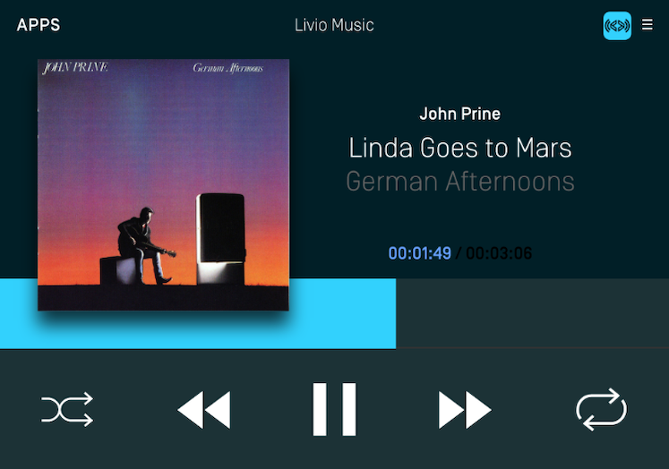
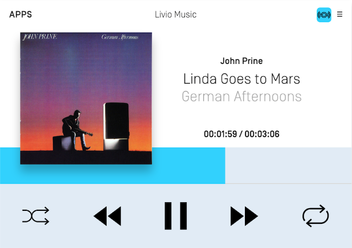

# Template Images
You can easily display text, images, and buttons using the @![iOS]`SDLScreenManager`!@@![android, javaSE, javaEE, javascript]`ScreenManager`!@. To update the UI, simply give the manager your new data and (optionally) sandwich the update between the manager's @![iOS]`beginUpdates`!@@![android, javaSE, javaEE, javascript]`beginTransaction()`!@ and @![iOS]`endUpdatesWithCompletionHandler`!@@![android, javaSE, javaEE, javascript]`commit()`!@ methods.

### Image Fields
| @![iOS]SDLScreenManager!@@![android, javaSE, javaEE, javascript]ScreenManager!@ Parameter Name  | Description |
|:--------------------------------------------|:--------------|
| primaryGraphic | The primary image in a template that supports images |
| secondaryGraphic | The second image in a template that supports multiple images |

## Showing Images
@![iOS]
##### Objective-C
```objc
[self.sdlManager.screenManager beginUpdates];
self.sdlManager.screenManager.primaryGraphic = <#SDLArtwork#>;
[self.sdlManager.screenManager endUpdatesWithCompletionHandler:^(NSError * _Nullable error) {
    if (error != nil) {
        <#Error Updating UI#>
    } else {
        <#Update to UI was Successful#>
    }
}];
```

##### Swift
```swift
sdlManager.screenManager.beginUpdates()
sdlManager.screenManager.primaryGraphic = <#SDLArtwork#>
sdlManager.screenManager.endUpdates { (error) in
    if error != nil {
        <#Error Updating UI#>
    } else {
        <#Update to UI was Successful#>
    }
}
```
!@

@![android, javaSE, javaEE]

```java
sdlManager.getScreenManager().beginTransaction();
sdlManager.getScreenManager().setPrimaryGraphic(sdlArtwork);
sdlManager.getScreenManager().commit(new CompletionListener() {
	@Override
	public void onComplete(boolean success) {
		DebugTool.logInfo(TAG, "ScreenManager update complete: " + success);
	}
});
```
!@

@![javascript]
```js
sdlManager.getScreenManager().beginTransaction();
sdlManager.getScreenManager().setPrimaryGraphic(sdlArtwork);
// Commit the updates and catch any errors
const success = await sdlManager.getScreenManager().commit().catch(function (error) {
    // Handle Error
});
console.log('ScreenManager update complete:', success);
if (success === true) {
    // Update complete
} else {
    // Something went wrong
}
```
!@

### Removing Images
To remove an image from the screen you just need to set the screen manager property to @![iOS]`nil`!@@![android, javaSE, javaEE]`null`!@.

@![iOS]
##### Objective-C
```objc
self.sdlManager.screenManager.primaryGraphic = nil;
```

##### Swift
```swift
sdlManager.screenManager.primaryGraphic = nil
```
!@

@![android, javaSE, javaEE]
```java
sdlManager.getScreenManager().setPrimaryGraphic(null);
```
!@

@![javascript]
```js
sdlManager.getScreenManager().setPrimaryGraphic(null);
```
!@

### Overwriting Images
When a file is to be uploaded to the module, the library checks if a file with the same name has already been uploaded to module and skips the upload if it can. For cases where an image by the same name needs to be re-uploaded, the @![iOS]`SDLArtwork` / `SDLFile`'s !@@![android, javaSE, javaEE, javascript]`SdlArtwork` \ `SdlFile`'s!@ `overwrite` property should be used. Setting `overwrite` to `true` before passing the image to a @![iOS]`SDLScreenManager`!@@![android, javaSE, javaEE, javascript]`ScreenManager`!@ method such as @![iOS]`primaryGraphic` and `secondaryGraphic`!@@![android, javaSE, javaEE, javascript]`setPrimaryGraphic()` and `setSecondaryGraphic()`!@ will force the image to be re-uploaded. This includes methods such as @![iOS]`preloadChoices:withCompletionHandler:`!@@![android, javaSE, javaEE, javascript]`preloadChoices()`!@ where the arguments passed in contain images.

!!! IMPORTANT
Please note that many production modules on the road do not refresh the HMI with the new image if the file name has not changed. If you want the image to refresh on the screen immediately, we suggest using two image names and toggling back and forth between the names each time you update the image. 

This issue may also extend to menus, alerts, and other UI features even if they're not on-screen at the time. Because of these issues, we do not recommend that you try to overwrite an image. Instead, you can delete an image file using the @![iOS]`SDLFileManager`!@@![android, javaSE, javaEE, javascript]`SdlFileManager`!@.
!!!

## Templating Images (RPC v5.0+)
Templated images are tinted by Core so the image is visible regardless of whether your user has set the head unit to day or night mode. For example, if a head unit is in night mode with a dark theme (see [Customizing the Template](Customizing Look and Functionality/Customizing the Template) section for more details on how to customize theme colors), then your templated images will be displayed as white. In the day theme, the image will automatically change to black.

Soft buttons, menu icons, and primary / secondary graphics can all be templated. @![iOS]A template image works [very much like it does on iOS](https://developer.apple.com/documentation/uikit/uiimage/1624153-imagewithrenderingmode) and in fact, it uses the same API as iOS. Any `SDLArtwork` created with a `UIImage` that has a `renderingMode` of `alwaysTemplate` will be templated via SDL as well.!@ Images that you wish to template must be PNGs with a transparent background and only one color for the icon. Therefore, templating is only useful for things like icons and not for images that must be rendered in a specific color. 

### Templated Images Example
In the screenshots below, the shuffle and repeat icons have been templated. In night mode, the icons are tinted white and in day mode the icons are tinted black.

##### Night Mode


##### Day Mode


@![iOS]
##### Objective-C
```objc
UIImage *image = [[UIImage imageNamed:@"<#ArtworkName#>"] imageWithRenderingMode:UIImageRenderingModeAlwaysTemplate];
SDLArtwork *artwork = [SDLArtwork artworkWithImage:image asImageFormat:SDLArtworkImageFormatPNG];
```

##### Swift
```swift
let image = UIImage(named: "<#ArtworkName#>")?.withRenderingMode(.alwaysTemplate)
let artwork = SDLArtwork(image: image, persistent: true, as: .PNG)
```
!@

@![android, javaSE, javaEE]
```java
SdlArtwork image = new SdlArtwork("<#ArtworkName#>", FileType.GRAPHIC_PNG, image, true);
image.setTemplateImage(true);
```
!@

@![javascript]
```js
const image = new SDL.manager.file.filetypes.SdlArtwork("<#ArtworkName#>", SDL.rpc.enums.FileType.GRAPHIC_PNG, <#FileData#>, true);
image.setTemplateImage(true);
```
!@

## Static Icons
Static icons are pre-existing images on the remote system that you may reference and use in your own application. Each OEM will design their own custom static icons but you can get an overview of the available icons from the icons designed for the open source [Generic HMI](https://smartdevicelink.com/en/guides/sdl-overview-guides/user-interface/static-icons/). Static icons are fully supported by the screen manager via an @![iOS]`SDLArtwork`!@@![android, javaSE, javaEE, javascript]`SdlArtwork`!@ initializer. Static icons can be used in primary and secondary graphic fields, soft button image fields, and menu icon fields.

@![iOS]
##### Objective-C
```objc
SDLArtwork *staticIconArt = [[SDLArtwork alloc] initWithStaticIcon:SDLStaticIconNameAlbum];
```

##### Swift
```swift
let staticIconArt = SDLArtwork(staticIcon: .album)
```
!@

@![android, javaSE, javaEE]
```java
SdlArtwork staticIconArt = new SdlArtwork(StaticIconName.ALBUM);
```
!@

@![javascript]
The SDL JavaScript Suite is currently missing support for the StaticIconName enum. This will be addressed in a future release. Constructing a StaticIcon can still be done using the appropriate hex values found [here](https://github.com/smartdevicelink/sdl_java_suite/blob/master/base/src/main/java/com/smartdevicelink/proxy/rpc/enums/StaticIconName.java).
```js
const staticIconAlbumName = '0x21';
const staticIconAlbumBytes = 0x21;
const staticIconArt = new SDL.manager.file.filetypes.SdlArtwork()
    .setName(staticIconAlbumName)
    .setFileData(staticIconAlbumBytes)
    .setStaticIcon(true)
    .setPersistent(false);
```
!@
