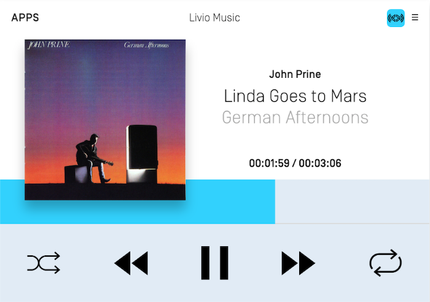
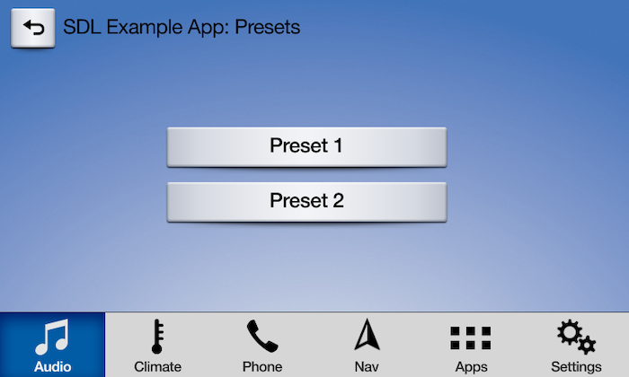

# Template Subscription Buttons
This guide shows you how to subscribe and react to "subscribe" buttons. Subscribe buttons are used to detect when the user has interacted with buttons located in the car's center console or steering wheel. A subscription button may also show up as part of your template however the text and/or image used in the button is determined by the template and is not customizable. 

In the screenshot below, the pause, seek left and seek right icons are subscribe buttons. Once subscribed, for example, to the seek left button, you will be notified when the user selects the seek left button on the HMI or when they select the seek left button on the car's center console and/or steering wheel. 



## Subscribing to Buttons
Please note that you can only successfully subscribe to certain buttons depending on your app type. Audio related buttons can only be used with the `MEDIA` app type and navigation related buttons can only be used with the `NAVIGATION` app type.

| Button  | App Type | RPC Version |
| ------------- | ------------- | ------------- |
| Ok | All | v1.0+ |
| Preset 0-9 | All | v1.0+ |
| Search | All | v1.0+ |
| Play / Pause | Media only | v5.0+ |
| Seek left | Media only | v1.0+ |
| Seek right | Media only | v1.0+ |
| Tune up | Media only | v1.0+ |
| Tune down | Media only | v1.0+ |
| Center Location | Navigation only | v6.0+ |
| Zoom In | Navigation only | v6.0+ |
| Zoom Out | Navigation only | v6.0+ |
| Pan Up | Navigation only | v6.0+ |
| Pan Up-Right | Navigation only | v6.0+ |
| Pan Right | Navigation only | v6.0+ |
| Pan Down-Right | Navigation only | v6.0+ |
| Pan Down | Navigation only | v6.0+ |
| Pan Down-Left | Navigation only | v6.0+ |
| Pan Left | Navigation only | v6.0+ |
| Pan Up-Left | Navigation only | v6.0+ |
| Toggle Tilt | Navigation only | v6.0+ |
| Rotate Clockwise | Navigation only | v6.0+ |
| Rotate Counter-Clockwise | Navigation only | v6.0+ |
| Toggle Heading | Navigation only | v6.0+ |

### Audio-Related Buttons
The play/pause, seek left, seek right, tune up, and tune down subscribe buttons can only be used if the app type is `MEDIA`. Depending on the OEM, the subscribed button could show up as a soft button in the `MEDIA` template (a `MEDIA` app will automatically be assigned the `MEDIA` template), work as a hard button on the car console or steering wheel, or both. For example, the SYNC 3 HMI will add the play/pause, seek right, and seek left soft buttons to the media template when you subscribe to those buttons. However, when you subscribe to the tune up and tune down buttons, there will be no button on the HMI but you will be notified when the user turns the tune dial on the center console.

If desired, you can toggle the play/pause button image between a play, stop and pause icon by updating the audio streaming state as described in the [Media Clock](Displaying a User Interface/Media Clock) guide. 

!!! NOTE
Before library v.@![iOS]6.1!@@![android, javaSE, javaEE]4.7!@ and RPC v5.0, `Ok` and `PlayPause` were combined into `Ok`. Subscribing to `Ok` will, in v@![iOS]6.1+!@@![android, javaSE, javaEE]4.7+!@, also subscribe you to `PlayPause`. This means that for the time being, *you should not simultaneously subscribe to `Ok` and `PlayPause`*. In a future major version, this will change. For now, only subscribe to either `Ok` or `PlayPause` and the library will execute the right action based on the connected head unit.
!!!

@![iOS]
##### Objective-C
```objc
SDLSubscribeButton *subscribeButton = [[SDLSubscribeButton alloc] initWithButtonName:SDLButtonNamePlayPause handler:^(SDLOnButtonPress * _Nullable buttonPress, SDLOnButtonEvent * _Nullable buttonEvent) {
    if (buttonPress == nil) { return; }
    <#Subscribe button selected#>
}];
[self.sdlManager sendRequest:subscribeButton withResponseHandler:^(__kindof SDLRPCRequest * _Nullable request, __kindof SDLRPCResponse * _Nullable response, NSError * _Nullable error) {
    if (!response.success.boolValue) { return; }
    <#Subscribe button sent successfully#>
}];
```

##### Swift
```swift
let subscribeButton = SDLSubscribeButton(buttonName: .playPause) { (buttonPress, buttonEvent) in
    guard let buttonPress = buttonPress else { return }
    <#Subscribe button selected#>
}
sdlManager.send(request: subscribeButton) { (request, response, error) in
    guard response?.success.boolValue == true else { return }
    <#Subscribe button sent successfully#>
}
```
!@

@![android, javaSE, javaEE]
```java
sdlManager.addOnRPCNotificationListener(FunctionID.ON_BUTTON_PRESS, new OnRPCNotificationListener() {
    @Override
    public void onNotified(RPCNotification notification) {
        OnButtonPress onButtonPressNotification = (OnButtonPress) notification;
        switch (onButtonPressNotification.getButtonName()) {
            case PLAY_PAUSE:
                <#PLAY_PAUSE subscribe button selected#>
                break;
        }
    }
});

SubscribeButton subscribeButtonRequest = new SubscribeButton();
subscribeButtonRequest.setButtonName(ButtonName.PLAY_PAUSE);
sdlManager.sendRPC(subscribeButtonRequest);
```
!@

### Preset Buttons
All app types can subscribe to preset buttons. Depending on the OEM, the preset buttons may be added to the template when subscription occurs. Preset buttons can also be physical buttons on the console that will notify the subscriber when selected. An OEM may support only template buttons or only hard buttons or they may support both template and hard buttons. The screenshot below shows how the Ford SYNC 3 HMI displays the preset buttons on the HMI. 




#### Checking if Preset Buttons are Supported
You can check if a HMI supports subscribing to preset buttons, and if so, how many preset buttons are supported, by checking the system capability manager.

@![iOS]
##### Objective-C
```objc
NSInteger numberOfCustomPresetsAvailable = self.sdlManager.systemCapabilityManager.defaultMainWindowCapability.numCustomPresetsAvailable.integerValue;
```

##### Swift
```swift
let numberOfCustomPresetsAvailable = sdlManager.systemCapabilityManager.defaultMainWindowCapability.numCustomPresetsAvailable as? NSInteger
```
!@

@![android,javaSE,javaEE]
```java
Integer numOfCustomPresetsAvailable = sdlManager.getSystemCapabilityManager().getDefaultMainWindowCapability().getNumCustomPresetsAvailable();
!@

#### Subscribing to Preset Buttons
@![iOS]
##### Objective-C
```objc
SDLSubscribeButton *preset1 = [[SDLSubscribeButton alloc] initWithButtonName:SDLButtonNamePreset1 handler:^(SDLOnButtonPress * _Nullable buttonPress, SDLOnButtonEvent * _Nullable buttonEvent) {
    if (buttonPress == nil) { return; }
    <#Subscribe button selected#>
}];

SDLSubscribeButton *preset2 = [[SDLSubscribeButton alloc] initWithButtonName:SDLButtonNamePreset2 handler:^(SDLOnButtonPress * _Nullable buttonPress, SDLOnButtonEvent * _Nullable buttonEvent) {
    if (buttonPress == nil) { return; }
    <#Subscribe button selected#>
}];

[self.sdlManager sendRequests:@[preset1, preset2] progressHandler:nil completionHandler:^(BOOL success) {
    if (!success) { return; }
    <#Subscribe buttons sent successfully#>
}];
```

##### Swift
```swift
let preset1 = SDLSubscribeButton(buttonName: .preset1, handler: { (buttonPress, buttonEvent) in
    guard let buttonPress = buttonPress else { return }
    <#Subscribe button selected#>
})

let preset2 = SDLSubscribeButton(buttonName: .preset2, handler: { (buttonPress, buttonEvent) in
    guard let buttonPress = buttonPress else { return }
    <#Subscribe button selected#>
})

self.sdlManager.send([preset1, preset2], progressHandler: nil, completionHandler: { (success) in
    guard success else { return }
    <#Subscribe buttons sent successfully#>
})
```
!@

@![android,javaSE,javaEE]
```java
sdlManager.addOnRPCNotificationListener(FunctionID.ON_BUTTON_PRESS, new OnRPCNotificationListener() {
    @Override
    public void onNotified(RPCNotification notification) {
        OnButtonPress onButtonPressNotification = (OnButtonPress) notification;
        switch (onButtonPressNotification.getButtonName()) {
            case PRESET_1:
                <#PRESET_1 subscribe button selected#>
                break;
            case PRESET_2:
                <#PRESET_2 subscribe button selected#>
                break;
        }
    }
});

SubscribeButton preset1 = new SubscribeButton(ButtonName.PRESET_1);
SubscribeButton preset2 = new SubscribeButton(ButtonName.PRESET_2);
sdlManager.sendRPCs(Arrays.asList(preset1, preset2), null);
```
!@

### Navigation Buttons
Head units supporting RPC v6.0+ may support subscription buttons that allow your user to drag and scale the map using hard buttons located on car's center console or steering wheel. Subscriptions to navigation buttons will only succeed if your app's type is `NAVIGATION`. If subscribing to these buttons succeeds, you can remove any buttons of your own from your map screen. If subscribing to these buttons fails, you can display buttons of your own on your map screen.

#### Subscribing to Navigation Buttons
@![iOS]
##### Objective-C
```objc
SDLSubscribeButton *navPanUpButton = [[SDLSubscribeButton alloc] initWithButtonName:SDLButtonNameNavPanUp handler:^(SDLOnButtonPress * _Nullable buttonPress, SDLOnButtonEvent * _Nullable buttonEvent) {
    if (buttonPress == nil) { return; }
    <#Subscribe button selected#>
}];

[self.sdlManager sendRequest:navPanUpButton withResponseHandler:^(__kindof SDLRPCRequest * _Nullable request, __kindof SDLRPCResponse * _Nullable response, NSError * _Nullable error) {
    if (!response.success.boolValue) { return; }
    <#Subscribe buttons sent successfully#>
}];
```

##### Swift
```swift
let navPanUpButton = SDLSubscribeButton(buttonName: .navPanUp) { (buttonPress, buttonEvent) in
    guard let buttonPress = buttonPress else { return }
    <#Subscribe button selected#>
}

sdlManager.send(request: navPanUpButton) { (request, response, error) in
    guard response?.success.boolValue == true else { return }
    <#Subscribe buttons sent successfully#>
}
```
!@

@![android,javaSE,javaEE]
```java
sdlManager.addOnRPCNotificationListener(FunctionID.ON_BUTTON_PRESS, new OnRPCNotificationListener() {
	@Override
	public void onNotified(RPCNotification notification) {
		OnButtonPress onButtonPressNotification = (OnButtonPress) notification;
		switch (onButtonPressNotification.getButtonName()) {
			case NAV_PAN_UP:
				break;
		}
	}
});

SubscribeButton subscribeButtonRequest = new SubscribeButton();
subscribeButtonRequest.setButtonName(ButtonName.NAV_PAN_UP);
sdlManager.sendRPC(subscribeButtonRequest);
```
!@
