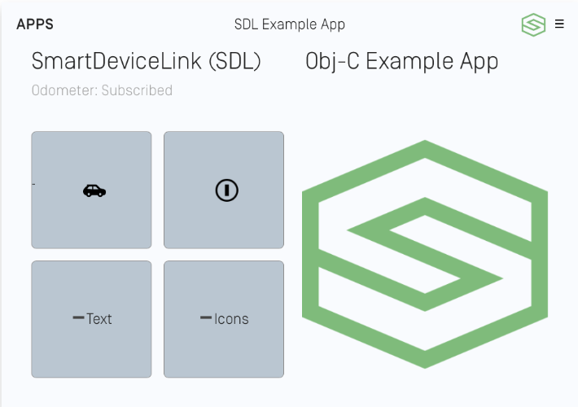

# Text, Images, and Buttons
This guide covers presenting text and images on the screen as well as creating, showing, and responding to custom buttons you create.

## Template Fields
The `SDLScreenManager` is a manager for easily creating and sending text, images and soft buttons for your SDL app. To update the UI, simply give the manager the new UI data and sandwich the update between the manager's  `beginUpdates` and ` endUpdatesWithCompletionHandler:` methods.

| SDLScreenManager Parameter Name | Description |
|:--------------------------------------------|:--------------|
| textField1 | The text displayed in a single-line display, or in the upper display line of a multi-line display |
| textField2 | The text displayed on the second display line of a multi-line display |
| textField3 | The text displayed on the third display line of a multi-line display |
| textField4 | The text displayed on the bottom display line of a multi-line display |
| mediaTrackTextField | The text displayed in the in the track field. This field is only valid for media applications |
| primaryGraphic | The primary image in a template that supports images |
| secondaryGraphic | The second image in a template that supports multiple images |
| textAlignment | The text justification for the text fields. The text alignment can be left, center, or right  |
| softButtonObjects | An array of buttons. Each template supports a different number of soft buttons |
| textField1Type | The type of data provided in `textField1` |
| textField2Type | The type of data provided in `textField2` |
| textField3Type | The type of data provided in `textField3` |
| textField4Type | The type of data provided in `textField4` |

##### Objective-C
```objc
[self.sdlManager.screenManager beginUpdates];

self.sdlManager.screenManager.textField1 = @"<#Line 1 of Text#>";
self.sdlManager.screenManager.textField2 = @"<#Line 2 of Text#>";
self.sdlManager.screenManager.primaryGraphic = [SDLArtwork persistentArtworkWithImage:[UIImage imageNamed:@"<#Image Name#>"] asImageFormat:<#SDLArtworkImageFormat#>];
SDLSoftButtonObject *softButton = [[SDLSoftButtonObject alloc] initWithName:@"<#Soft Button Name#>" state:[[SDLSoftButtonState alloc] initWithStateName:@"<#Soft Button State Name#>" text:@"<#Button Text#>" artwork:<#SDLArtwork#>] handler:^(SDLOnButtonPress * _Nullable buttonPress, SDLOnButtonEvent * _Nullable buttonEvent) {
    if (buttonPress == nil) { return; }
    <#Button Selected#>
}];
self.sdlManager.screenManager.softButtonObjects = @[softButton];

[self.sdlManager.screenManager endUpdatesWithCompletionHandler:^(NSError * _Nullable error) {
    if (error != nil) {
        <#Error Updating UI#>
    } else {
        <#Update to UI was Successful#>
    }
}];
```

##### Swift
```swift
sdlManager.screenManager.beginUpdates()

sdlManager.screenManager.textField1 = "<#Line 1 of Text#>"
sdlManager.screenManager.textField2 = "<#Line 2 of Text#>"
sdlManager.screenManager.primaryGraphic = <#SDLArtwork#>
sdlManager.screenManager.softButtonObjects = [<#SDLButtonObject#>, <#SDLButtonObject#>]

sdlManager.screenManager.endUpdates { (error) in
    if error != nil {
        <#Error Updating UI#>
    } else {
        <#Update to UI was Successful#>
    }
}
```

### Removing Text and Images
After you have displayed text and graphics onto the screen, you may want to remove those from being displayed. In order to do so, you only need to set the screen manager property to `nil`.

##### Objective-C
```objc
self.sdlManager.screenManager.textField1 = nil;
self.sdlManager.screenManager.textField2 = nil;
self.sdlManager.screenManager.primaryGraphic = nil;
```

##### Swift
```swift
sdlManager.screenManager.textField1 = nil
sdlManager.screenManager.textField2 = nil
sdlManager.screenManager.primaryGraphic = nil
```

## Soft Button Objects
To create a soft button using the `SDLScreenManager`, you only need to create a custom name for the button and provide the text for the button's label and/or an image for the button's icon. If your button cycles between different states (e.g. a button used to set the repeat state of a song playlist can have three states: repeat-off, repeat-one, and repeat-all) you can upload all the states on initialization. 

### Updating the Soft Button State
When the soft button state needs to be updated, simply tell the `SDLSoftButtonObject` to transition to the next state. If your button states do not cycle in a predictable order, you can also tell the soft button the state to transition to by passing the `stateName` of the new soft button state.

##### Objective-C
```objc
SDLSoftButtonState *softButtonState1 = [[SDLSoftButtonState alloc] initWithStateName:@"<#Soft Button State Name#>" text:@"<#Button Label Text#>" artwork:<#SDLArtwork#>];
SDLSoftButtonState *softButtonState2 = [[SDLSoftButtonState alloc] initWithStateName:@"<#Soft Button State Name#>" text:@"<#Button Label Text#>" artwork:<#SDLArtwork#>];
SDLSoftButtonObject *softButtonObject = [[SDLSoftButtonObject alloc] initWithName:@"<#Soft Button Object Name#>" states:@[softButtonState1, softButtonState2] initialStateName:@"<#Soft Button State Name#>" handler:^(SDLOnButtonPress * _Nullable buttonPress, SDLOnButtonEvent * _Nullable buttonEvent) {
    if (buttonPress == nil) { return; }
    <#Button Selected#>
}];
self.sdlManager.screenManager.softButtonObjects = @[softButtonObject];

// Transition to a new state
SDLSoftButtonObject *retrievedSoftButtonObject = [self.sdlManager.screenManager softButtonObjectNamed:@"<#Soft Button Object Name#>"];
[retrievedSoftButtonObject transitionToNextState];
```

##### Swift
```swift
let softButtonState1 = SDLSoftButtonState(stateName: "<#Soft Button State Name#>", text: "<#Button Label Text#>", artwork: <#SDLArtwork#>)
let softButtonState2 = SDLSoftButtonState(stateName: "<#Soft Button State Name#>", text: "<#Button Label Text#>", artwork: <#SDLArtwork#>)
let softButtonObject = SDLSoftButtonObject(name: "<#Soft Button Object Name#>", states: [softButtonState1, softButtonState2], initialStateName: "") { (buttonPress, buttonEvent) in
    guard buttonPress != nil else { return }
    <#Button Selected#>
}
sdlManager.screenManager.softButtonObjects = [softButtonObject]

// Transition to a new state
let retrievedSoftButtonObject = sdlManager.screenManager.softButtonObjectNamed("<#Soft Button Object Name#>")
retrievedSoftButtonObject?.transitionToNextState()
```
### Deleting Soft Buttons
To delete soft buttons, simply pass the `SDLScreenManager` an empty array of soft buttons.

## Template Images
As of SDL iOS library v6.1, when connected to a remote system running SDL Core 5.0+, you may be able to use template images. A template image works [very much like it does on iOS](https://developer.apple.com/documentation/uikit/uiimage/1624153-imagewithrenderingmode) and in fact, it uses the same API as iOS. Any `SDLArtwork` created with a `UIImage` that has a `renderingMode` of `alwaysTemplate` will be templated via SDL as well. These images must be PNGs with a transparent background and only one color for the icon. Therefore, this kind of image is only good for images like icons, not for images like album artwork, or anything requiring a specific color.

Soft buttons, menu icons, and primary / secondary graphics can be templated. It's a good idea to template images so that any head unit, no matter their background color, can display your images with a color scheme that fits. For example, if a head unit is in "Night" mode with a dark theme (see [Template Coloring in the Integration Basics section](Getting Started/Integration Basics) for more details on how to customize theme colors), then your images will be displayed as white. In the "Day" theme, the image will automatically change to black.

##### Objective-C
```objc
UIImage *image = [[UIImage imageNamed:<#String#>] imageWithRenderingMode:UIImageRenderingModeAlwaysTemplate];
SDLArtwork *artwork = [SDLArtwork artworkWithImage:image asImageFormat:SDLArtworkImageFormatPNG];
```

##### Swift
```swift
let image = UIImage(named: <#T##String#>)?.withRenderingMode(.alwaysTemplate)
let artwork = SDLArtwork(image: image, persistent: true, as: .PNG)
```

##### Template Images on Dark Background


##### Template Images on Light Background


## Static Icons
Static icons are pre-existing images on the remote system that you may reference and use in your own application. Static icons are fully supported by the screen manager via an `SDLArtwork` initializer.

Static icons can be used in primary and secondary graphic fields, soft button image fields, and menu icon fields.

##### Objective-C
```objc
SDLArtwork *staticIconArt = [[SDLArtwork alloc] initWithStaticIcon:SDLStaticIconNameAlbum];;
SDLSoftButtonState *softButtonState1 = [[SDLSoftButtonState alloc] initWithStateName:@"<#Soft Button State Name#>" text:@"<#Button Label Text#>" artwork:staticIconArt];

// Set the state into an `SDLSoftButtonObject` and then set the screen manager array of soft buttons
```

##### Swift
```swift
let staticIconArt = SDLArtwork(staticIcon: .album)
let softButtonState1 = SDLSoftButtonState(stateName: "<#Soft Button State Name#>", text: "<#Button Label Text#>", artwork: staticIconArt)

// Set the state into an `SDLSoftButtonObject` and then set the screen manager array of soft buttons
```

## Using RPCs
If you don't want to use the screen manager, you can use raw RPC requests using the `Show` RPC.
