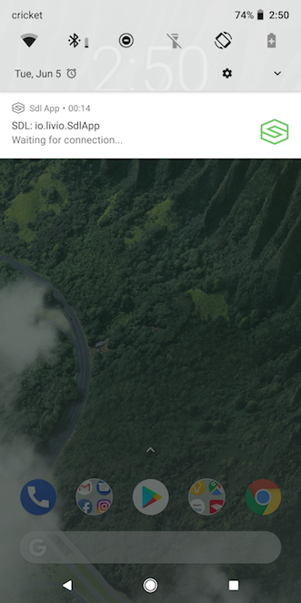
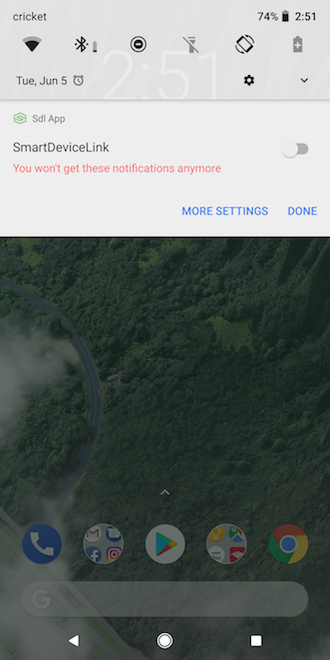

# Why do you see SDL notifications?

If you see a notification similar to the one in the screenshot below, that means you are using an app that has an SDL integration that allows it to push content to cars that support SDL. However, if your car doesn’t support SDL, you can simply hide the notification.

## How do you hide the notifications?

If you would like to hide the notification, you can simply long click on the notification and disable it as shown in the following screenshot.

