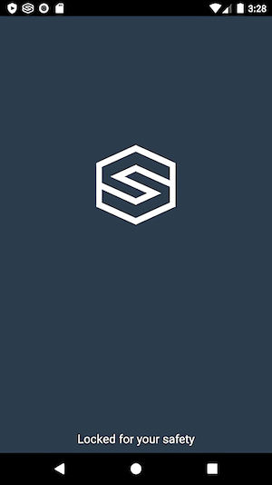

# Adding the Lock Screen
The lock screen is a vital part of your SDL app because it prevents the user from using the phone while the vehicle is in motion. SDL takes care of the lock screen for you. If you prefer your own look, but still want the recommended logic that SDL provides for free, you can also set your own custom lockscreen.

@![iOS]
If you would not like to use any of the following code, you may use the `SDLLockScreenConfiguration` class function `disabledConfiguration`, and manage the entire lifecycle of the lock screen yourself. However, it is strongly recommended that you use the provided lock screen manager, even if you use your own view controller.

To see where the `SDLLockScreenConfiguration` is used, refer to the [Integration Basics](Getting Started/Integration Basics) guide.
!@

@![android]
## Configure the Lock Screen Activity

You must declare the `SDLLockScreenActivity` in your manifest. To do so, simply add the following to your app's `AndroidManifest.xml` if you have not already done so:

```xml
<activity android:name="com.smartdevicelink.managers.lockscreen.SDLLockScreenActivity"
                  android:launchMode="singleTop"/>
```

!!! MUST
This manifest entry must be added for the lock screen feature to work.
!!!
!@

## Using the Provided Lock Screen
@![iOS]Using the default lock screen is simple. Using the lock screen this way will automatically load an automaker's logo, if available, to show alongside your logo. If it is not, the default lock screen will show your logo alone.!@

@![iOS]


To do this, instantiate a new `SDLLockScreenConfiguration`:

##### Objective-C
```objc
SDLLockScreenConfiguration *lockScreenConfiguration = [SDLLockScreenConfiguration enabledConfiguration];
```

##### Swift
```swift
let lockScreenConfiguration = SDLLockScreenConfiguration.enabled()
```
!@

@![android]
If you have implemented the `SdlManager` and have defined the `SDLLockScreenActivity` in your manifest but have not defined any lock screen configuration, you are already have a working default configuration.

!@


## Customizing the Default Lock Screen
It is possible to customize the background color and app icon in the default provided lockscreen. If you choose not to set your own app icon the library will use the SDL logo.

@![iOS]

!@

### Custom Background Color
@![iOS]
##### Objective-C
```objc
UIColor *backgroundColor = <# Desired Background Color #>
SDLLockScreenConfiguration *lockScreenConfiguration = [SDLLockScreenConfiguration enabledConfigurationWithAppIcon:<# Retreive App Icon #> backgroundColor:backgroundColor];
```

##### Swift
```swift
let backgroundColor: UIColor = <# Desired Background Color #>
let lockScreenConfiguration = SDLLockScreenConfiguration.enabledConfiguration(withAppIcon: <# Retrieve App Icon #>, backgroundColor: backgroundColor)
```
!@

@![android]
```java
lockScreenConfig.setBackgroundColor(resourceColor); // For example, R.color.black
```
!@

### Custom App Icon
@![iOS]
##### Objective-C
```objc
let appIcon: UIImage = <# Retrieve App Icon #>
SDLLockScreenConfiguration *lockScreenConfiguration = [SDLLockScreenConfiguration enabledConfigurationWithAppIcon:appIcon backgroundColor:<# Desired Background Color #>];
```

##### Swift
```swift
let appIcon: UIImage = <# Retrieve App Icon #>
let lockScreenConfiguration = SDLLockScreenConfiguration.enabledConfiguration(withAppIcon: appIcon, backgroundColor: <# Desired Background Color #>)
```
!@

@![android]
```java
lockScreenConfig.setAppIcon(appIconInt); // For example, R.drawable.lockscreen icon
```
!@

### Showing the OEM Logo
The default lock screen handles retrieving and setting the OEM logo from head units that support this feature. This feature can be disabled on the default lock screen by setting `showDeviceLogo` to false. 

@![iOS]
##### Objective-C
```objc
SDLLockScreenConfiguration *lockScreenConfiguration = [SDLLockScreenConfiguration enabledConfiguration];
lockScreenConfiguration.showDeviceLogo = NO;
```

##### Swift
```swift
let lockScreenConfiguration = SDLLockScreenConfiguration.enabled()
lockScreenConfiguration.showDeviceLogo = false
```
!@

@![android]
```java
lockScreenConfig.showDeviceLogo(false);
```
!@

## Creating a Custom Lock Screen
If you would like to use your own lock screen instead of the one provided by the library, but still use the logic we provide, you can use a new initializer within @![iOS]`SDLLockScreenConfiguration`. As of iOS 13, presented `UIViewController`s are now dismissible by swiping down on the phone screen. Unless the OEM has enabled Passenger Mode, lock screens should not be dismissible by the user. To prevent this, set the `modalPresentationStyle` property of your custom lock screen `UIViewController` to `full screen`. Not doing so may result in your app being rejected by OEMs.!@ @![android]`LockScreenConfig`:!@

@![iOS]
##### Objective-C
```objc
UIViewController *lockScreenViewController = <# Initialize Your View Controller #>;
lockScreenViewController.modalPresentationStyle = UIModalPresentationFullScreen;
SDLLockScreenConfiguration *lockScreenConfiguration = [SDLLockScreenConfiguration enabledConfigurationWithViewController:lockScreenViewController];
```

##### Swift
```swift
let lockScreenViewController = <# Initialize Your View Controller #>
lockScreenViewController.modalPresentationStyle = .fullScreen
let lockScreenConfiguration = SDLLockScreenConfiguration.enabledConfiguration(with: lockScreenViewController)
```

!@

@![android]
```java
lockScreenConfig.setCustomView(customViewInt);
```
!@

## Customizing the Lock Screen State
In SDL @![iOS]iOS v6.4!@@![android] Android v4.10!@, a new parameter `displayMode` has been added to the @![iOS]`SDLLockScreenConfiguration`!@@![android]`LockScreenConfig`!@ to control the state of the lock screen and the older boolean parameters have been deprecated.

| DisplayMode | Description |
| --------------- | ------------- |
| never | The lock screen should never be shown. This should almost always mean that you will build your own lock screen |
| requiredOnly | The lock screen should only be shown when it is required by the head unit |
| optionalOrRequired | The lock screen should be shown when required by the head unit or when the head unit says that its optional, but *not* in other cases, such as before the user has interacted with your app on the head unit |
| always | The lock screen should always be shown after connection |

### Disabling the Lock Screen
Please note that a lock screen will be required by most OEMs. You can disable the lock screen manager, but you will then be required to implement your own logic for showing and hiding the lock screen. This is not recommended as the @![iOS]`SDLLockScreenConfiguration` !@@![android]`LockScreenConfig`!@ adheres to most OEM lock screen requirements. However, if you must create a lock screen manager from scratch, the library's lock screen manager can be disabled via the @![iOS]`SDLLockScreenConfiguration`!@@![android]`LockScreenConfig`!@ as follows:

@![iOS]
##### Objective-C
```objc
SDLLockScreenConfiguration *lockScreenConfiguration = [SDLLockScreenConfiguration disabledConfiguration];
```

##### Swift
```swift
let lockScreenConfiguration = SDLLockScreenConfiguration.disabled()
```
!@

@![android]
```java
LockScreenConfig lockScreenConfig = new LockScreenConfig();
lockScreenConfig.setDisplayMode(LockScreenConfig.DISPLAY_MODE_NEVER);
```
!@


### Making the Lock Screen Always On
The lock screen manager is configured to dismiss the lock screen when it is safe to do so. To always have the lock screen visible when the device is connected to the head unit, simply update the lock screen configuration. 

@![iOS]
##### Objective-C
```objc
SDLLockScreenConfiguration *lockScreenConfiguration = [SDLLockScreenConfiguration enabledConfiguration];
lockScreenConfiguration.displayMode = SDLLockScreenConfigurationDisplayModeAlways;
```

##### Swift
```swift
let lockScreenConfiguration = SDLLockScreenConfiguration.enabled()
lockScreenConfiguration.displayMode = .always
```
!@

@![android]
```java
LockScreenConfig lockScreenConfig = new LockScreenConfig();
lockScreenConfig.setDisplayMode(LockScreenConfig.DISPLAY_MODE_ALWAYS);
```
!@

### Enabling User Lockscreen Dismissal (Passenger Mode)
Starting in RPC v6.0+ users may now have the ability to dismiss the lock screen by swiping the lock screen down. Not all OEMs support this new feature. A dismissible lock screen is enabled by default if the head unit enables the feature, but you can disable it manually as well. To disable this feature, set @![iOS]`SDLLockScreenConfiguration`s!@ @![android]`LockScreenConfig`s!@  `enableDismissGesture` to false.

@![iOS]
##### Objective-C
```objc
SDLLockScreenConfiguration *lockScreenConfiguration = [SDLLockScreenConfiguration enabledConfiguration];
lockScreenConfiguration.enableDismissGesture = NO;
```

##### Swift
```swift
let lockScreenConfiguration = SDLLockScreenConfiguration.enabledConfiguration()
lockScreenConfiguration.enableDismissGesture = false
```
!@

@![android]
```java
LockScreenConfig lockScreenConfig = new LockScreenConfig();
lockScreenConfig.enableDismissGesture(false);
```
!@
