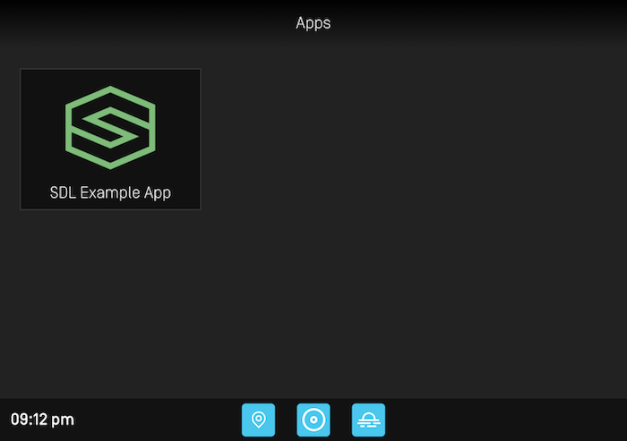
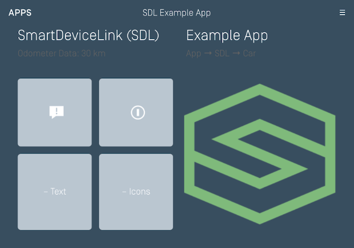
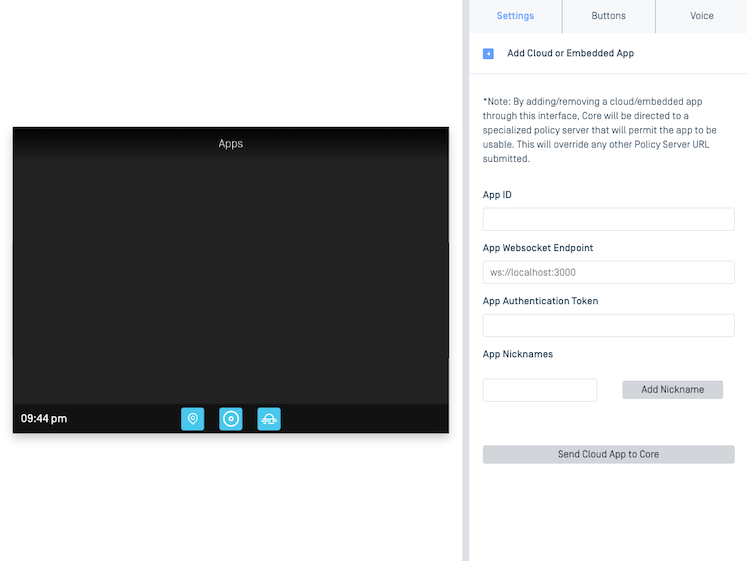

# Connecting to an Infotainment System
In order to view your SDL app, you must connect your device to a head unit that supports SDL Core. If you do not have access to a head unit, we recommend using the [Manticore web-based emulator](https://smartdevicelink.com/resources/manticore/) for testing how your SDL app reacts to real-world vehicle events, on-screen interactions and voice recognition.

@![iOS,android]
You will have to configure different connection types based on whether you are connecting to a head unit or an emulator. When connecting to a head unit, you must configure !@@![iOS]an `iAP`!@@![android]a `Multiplex`!@@![iOS,android] connection. Likewise, when connecting to an emulator, a `TCP` connection must be configured.
!@

@![iOS,android,javascript]
## Connecting to an Emulator
To connect to an emulator such as [Manticore](https://smartdevicelink.com/resources/manticore/) or a local Ubuntu [SDL Core](https://github.com/smartdevicelink/sdl_core)-based emulator you must implement a TCP connection when configuring your SDL app. 

### Getting the IP Address and Port
#### Generic SDL Core
To connect to a virtual machine running the Ubuntu [SDL Core](https://github.com/smartdevicelink/sdl_core)-based emulator, you will use the IP address of the Ubuntu OS and `12345` for the port. You may have to enable port forwarding on your virtual machine if you want to connect using a real device instead of a simulated device. 

#### Manticore
Once you launch an instance of Manticore, you will be given an IP address and port number that you can use to configure your TCP connection. 

### Setting the IP Address and Port
!@
@![iOS]
##### Objective-C
```objc
SDLLifecycleConfiguration *lifecycleConfiguration = [SDLLifecycleConfiguration debugConfigurationWithAppName:@"<#App Name#>" fullAppId:@"<#App Id#>" ipAddress:@"<#IP Address#>" port:<#Port#>];
```
##### Swift
```swift
let lifecycleConfiguration = SDLLifecycleConfiguration(appName: "<#App Name#>", fullAppId: "<#App Id#>", ipAddress: "<#IP Address#>", port: <#Port#>)
```
!@

@![android]
```java
// Set the SdlManager.Builder transport
builder.setTransportType(new TCPTransportConfig(<IP ADDRESS>, <PORT>, false));
```
!@

@![javascript]
```javascript
const lifecycleConfiguration = new SDL.manager.LifecycleConfig().setTransportConfig(new SDL.transport.TcpClientConfig(<IP Address>, <PORT>));
```
!@

@![iOS,android]
## Connecting to a Head Unit
To connect your device directly to a production vehicle head unit or Test Development Kit (TDK), make sure to implement !@@![iOS]an `iAP`!@@![android]a `Multiplex`!@@![iOS,android] connection. Then connect the device using a USB cord or, if the head unit supports it, Bluetooth.
!@

@![iOS]
##### Objective-C
```objc
SDLLifecycleConfiguration *lifecycleConfiguration = [SDLLifecycleConfiguration defaultConfigurationWithAppName:@"<#App Name#>" fullAppId:@"<#App Id#>"];
```

##### Swift
```swift
let lifecycleConfiguration = SDLLifecycleConfiguration(appName:"<#App Name#>", fullAppId: "<#App Id#>")
```
!@

@![android]
```java
// Set the SdlManager.Builder transport
builder.setTransportType(new MultiplexTransportConfig(context, <APP ID>));
```
!@

@![iOS]
### Viewing Realtime Logs
If you are testing with a vehicle head unit or TDK and wish to see realtime debug logs in the Xcode console, you should use [wireless debugging](https://developer.apple.com/videos/play/wwdc2017/404/).
!@ 

@![iOS,android,javascript]
## Running the SDL App
Build and run the project in !@@![iOS]Xcode!@@![android]Android Studio!@@![javascript]Node.js!@@![iOS,android,javascript], targeting the device or simulator that you want to test your app with. Your app should compile and launch on your device of choosing. If your connection configuration is setup correctly, you should see your SDL app icon appear on the HMI screen:



To open your app, click on your app's icon in the HMI.



This is the main screen of your SDL app. If you get to this point, your SDL app is working.

### Troubleshooting 
If you are having issues with connecting to an emulator or head unit, please see our [troubleshooting tips](Getting Started/Example Apps) in the Example Apps section of the guide. 
!@

@![javaSE,javaEE,javascript]
Your SDL !@@![javaSE]embedded!@@![javaEE]cloud!@@![javascript]cloud/webengine!@@![javaSE,javaEE,javascript] app will only work with head units that support RPC Spec v5.1+.

## Configuring the Connection
### Generic SDL Core
To connect to your app to a local Ubuntu [SDL Core](https://github.com/smartdevicelink/sdl_core)-based emulator you need to know the IP address of the machine that is running the cloud app. If needed, running `ifconfig` in the terminal will give you the current network configuration information.

#### Policy Table Configuration
Once you know the IP address, you need to set the websocket `endpoint` and app `nicknames` for your SDL app in the policy table under the ["app_policies"](https://smartdevicelink.com/en/guides/sdl-server/api-reference-documentation/policy-table/application-policies) section. This will let Core know where your instance of the SDL app is running. The websocket endpoint needs to include both the IP address and port: `ws://<ip address>:<port>/`.

```json
 "<Your SDL App ID>": {
     "keep_context": false,
     "steal_focus": false,
     "priority": "NONE",
     "default_hmi": "NONE",
     "groups": ["Base-4"],
     "RequestType": [],
     "RequestSubType": [],
     "hybrid_app_preference": "CLOUD",
     "endpoint": "ws://<ip address>:<port>",
     "enabled": true,
     "auth_token": "",
     "cloud_transport_type": "WS",
     "nicknames": ["<app name>"]
 }
```

For more information about policy tables please visit the [Policy Table](https://smartdevicelink.com/en/guides/sdl-server/api-reference-documentation/policy-table/overview) guide.

### Manticore
If you are using Manticore, the app connection information can be easily added in the settings tab of the Manticore web page. Please note that Manticore needs to access your machine's IP address in order to be able to start a websocket connection with your app. If you are hosting the app on your local machine, you may need to do extra setup to make your machine publicly accessible.



## Running the SDL App
Once you have a configured instance of Core running, you should see your SDL app name appear in a box on HMI. However, nothing will happen when you tap on the box until you build and run your SDL app.


Once your SDL app is running, either locally in an IDE or on a server, you will be able to launch the SDL app by clicking on the app icon in the HMI.


This is the main screen of your SDL app. If you get to this point, your SDL app is working.
!@
