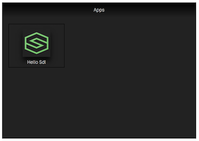
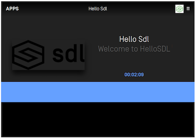
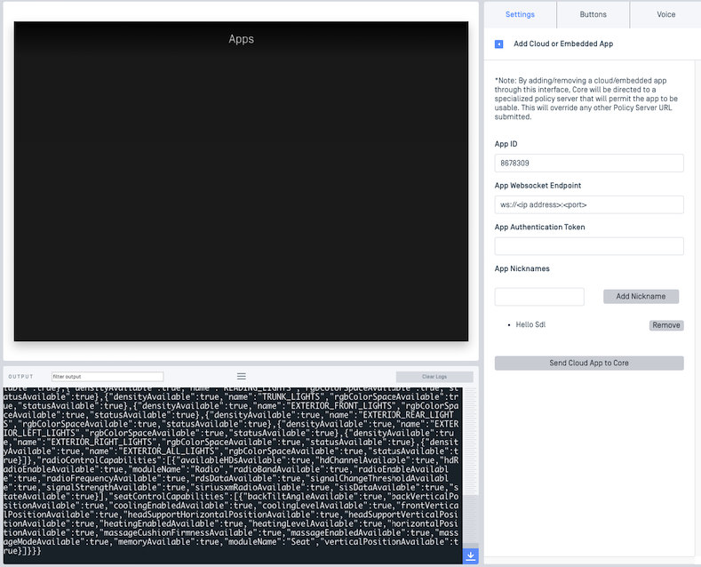

# Connecting to an Infotainment System

@![iOS]
To connect to an emulator, such as Manticore or a local Ubuntu SDL Core-based emulator, make sure to implement a TCP (`debug`) connection. The emulator and app should be on the same network (i.e. remember to set the correct IP address and port number in the `SDLLifecycleConfiguration`). The IP will most likely be the IP address of the operating system running the emulator. The port will most likely be `12345`.

!!! IMPORTANT
Known issues due to using a TCP connection:

* When app is in the background mode, the app will be unable to communicate with SDL Core. This will work on IAP connections.
* Audio will not play on the emulator. Only IAP connections are currently able to play audio because this happens over the standard Bluetooth / USB system audio channel.
* You cannot connect to an emulator using a USB connection due to Apple limitations with IAP connections.
!!!

## Connecting with a Vehicle Head Unit or a Development Kit (TDK)
### Production
To connect your iOS device directly to a vehicle head unit or TDK, make sure to implement an iAP (`default`) connection in the `SDLLifecycleConfiguration`. Then connect the iOS device to the head unit or TDK using a USB cord or Bluetooth if the head unit supports it.

### Debugging
If you are testing with a vehicle head unit or TDK and wish to see debug logs in Xcode while the app is running, you must either use another app called the [relay app](https://github.com/smartdevicelink/relay_app_ios) to help you connect to the device, or you may use [Xcode 9 / iOS 11 wireless debugging](https://developer.apple.com/videos/play/wwdc2017/404/). When using the relay app, make sure to implement a TCP connection, if using iOS 11 wireless debugging, implement a IAP connection. Please see the [guide](Developer Tools/Relay App) for the relay app to learn how to set up the connection between the device, the relay app and your app.

!!! NOTE
The same issues apply when connecting the relay app with a TDK or head unit as do when connecting to SDL Core. Please see the issues above, under the *Connect with an Emulator* heading.
!!!
!@

@![android]
To connect to an emulator, such as Manticore or a local Ubuntu SDL Core-based emulator, make sure to use `TCPTransportConfig`. The emulator and app should be on the same network (i.e. remember to set the correct IP address and port number correctly). The IP will most likely be the IP address of the operating system running the emulator. The port will most likely be `12345`.

```java 
// Set the SdlManager.Builder transport 
builder.setTransportType(new TCPTransportConfig(<IP ADDRESS>, <PORT>, false));
```

## Connecting with a Vehicle Head Unit or a Development Kit (TDK)
To connect your device directly to a vehicle head unit or TDK, make sure to use `MultiplexTransportConfig`. Then connect the device to the head unit or TDK using a USB cord or Bluetooth if the head unit supports it.


```java
// Set the SdlManager.Builder transport 
builder.setTransportType(new MultiplexTransportConfig(context, <APP ID>));
```
!@

Run the project in Android Studio, targeting the device you want the Sdl Android installed on. The Sdl Android should compile and launch on your device of choosing:

Following this, you should see an application appear on the TDK or HMI. In the case of the Generic HMI (using TCP), you will see the following:



Click on the Hello Sdl icon in the HMI.



This is the main screen of your Sdl app. If you get to this point, the project is working.

@![javaSE,javaEE]
## Getting Started
We assume that you have [SDL Core](https://github.com/smartdevicelink/sdl_core) (We recommend Ubuntu 16.04) and an [HMI](https://github.com/smartdevicelink/generic_hmi) set up prior to this point. Most people getting started with this tutorial will be using Sdl Core and our Generic HMI. If you don't want to set up a virtual machine for testing, we offer [Manticore](https://smartdevicelink.com/resources/manticore/), which is a free service that allows you to test your apps in the cloud.

!!! NOTE
Sdl Core and an HMI or Manticore are needed to run the cloud app to ensure that it connects.
!!!

## Configuring Core 
To let Sdl Core connect to your app, first you will have to know the IP address of the machine that is running the cloud app. If you don't know what it is, running ```ifconfig``` in the terminal will usually let you see it for the interface you are connected with to your network. 

After getting the IP address, you will have to set App ID, App Websocket Endpoint, and App Nicknames in Sdl Core to let it know where your instance of cloud app is running. 

!!! NOTE
The App Websocket Endpoint contains the IP Address and port as the following: `ws://<ip address>:<port>/`.
!!!


### Manticore
If you are using Manticore, the app information can be easily set in the settings tab:



!!! NOTE
Manticore needs to access you machine's IP address to be able to start a websocket connection with your app. If you are hosting the app on your local machine, you may need to do extra setup to make your machine publicly accessible. The other solution is to setup Core and HMI on your machine instead of using Manticore so Core can access your local IP address.
!!!

### Sdl Core and Generic HMI
If you are using Sdl Core and Generic HMI, you will have to add a policy table entry as the following one to the existing entries:

```JSON
 "8678309": {
     "keep_context": false,
     "steal_focus": false,
     "priority": "NONE",
     "default_hmi": "NONE",
     "groups": ["Base-4"],
     "RequestType": [],
     "RequestSubType": [],
     "hybrid_app_preference": "CLOUD",
     "endpoint": "ws://<ip address>:<port>",
     "enabled": true,
     "auth_token": "",
     "cloud_transport_type": "WS",
     "nicknames": ["<app name>"]
 }
```

Fore more information about policy tables please visit [Plicy Tables Guides](https://smartdevicelink.com/en/guides/sdl-server/api-reference-documentation/policy-table/overview).

!!! NOTE
Don't forget to replace `ws://<ip address>:<port>` with your own IP address and app port. Also `<app name>` should be replaced with the actual app name.
!!!

Following this, you should see an application appears on HMI as in the following screenshot:


!!! NOTE
Even though you see the app appears on HMI, you still cannot lunch the app at this point. You will have to run the app from IntelliJ IDEA first as described next.
!!!

## Running the App
After setting the app information in Sdl Core, you can run the project in IntelliJ IDEA. The cloud should compile and launch on your your machine. After that, you can click on the app icon in the HMI.


This is the main screen of the  app. If you get to this point, the project is working.
!@