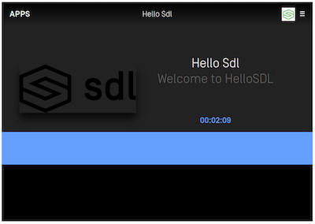
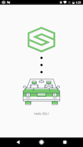

# Example Apps
@![iOS]
SDL provides two example apps: one written in Objective-C and one in Swift. Both implement the same features.

The example apps are located in the [sdl_ios](https://github.com/smartdevicelink/sdl_ios) repository. To try them, you can download the repository and run the example app targets, or you may use `pod try SmartDeviceLink` with [CocoaPods](https://cocoapods.org) installed on your Mac.

!!! NOTE
If you download or clone the SDL repository in order to run the example apps, you must first obtain the BSON submodule. You can do so by running `git submodule init` and `git submodule update` in your terminal when in the main directory of the cloned repository.
!!!

The example apps implement soft buttons, template text and images, a main menu and submenu, vehicle data, popup menus, voice commands, and capturing in-car audio.

## Connecting to Hardware
To connect the example app to [Manticore](https://smartdevicelink.com/resources/manticore/) or another emulator, make sure you are on the `TCP Debug` tab and type in the IP address and port, then press "Connect". The button will turn green when you are connected.

To connect the example app to production or debug hardware, make sure you are on the `iAP` tab and press "Connect". The button will turn green when you are connected.

## Troubleshooting
### TCP Debug Transport
1.  Make sure the correct IP address and port number is set in the `SDLLifecycleConfiguration`.
2.  Make sure the device and the SDL emulator are on the same network.
3.  If you are running an SDL Core emulator on a virtual machine, and you are using port forwarding to connect your device to the virtual machine, the IP address should be the IP address of your machine hosting the VM, not the IP address of the VM. The port number will be `12345`.
4.  Make sure there is no firewall blocking the incoming port `12345` on the machine or VM running the SDL Core emulator. Also make sure your firewall allows that outgoing port.
5.  Due to iOS background restrictions, when the app on the device is backgrounded, the app will be unable to communicate with the SDL emulator. This will work on IAP connections.
6.  Audio will not play when using a TCP connection. Only IAP connections are currently able to play audio because this happens over the standard Bluetooth / USB system audio channel.

### iAP Production Transport
1.  Make sure to use the default `SDLLifecycleConfiguration`.
2.  Make sure the [protocol](https://smartdevicelink.com/en/guides/iOS/getting-started/sdk-configuration/) strings have been added to the app.
3.  Make sure you have enabled background [capabilities](https://smartdevicelink.com/en/guides/iOS/getting-started/sdk-configuration/) for your app.
4.  If the head unit (emulators do not support IAP) does not support bluetooth, an iAP connection requires a USB cord.

#### iAP Bluetooth Production Transport
1. Bluetooth transport support is automatic when you support the iAP production transport. It cannot be turned on or off separately.
2.  Make sure the head unit supports Bluetooth transport for iPhones. Currently, only some head units support Bluetooth.
3.  Make sure to use the default `SDLLifecycleConfiguration`.
4.  Make sure Bluetooth is turned on - both on the head unit hardware and your iPhone.
5.  Ensure your iPhone is properly paired with the head unit. 
!@

@![android]
In this guide we take you through the steps to get our sample project, Hello Sdl Android, running and connected to Sdl Core as well as showing up on the generic HMI.

First, make sure you download or clone the latest release from [GitHub](https://github.com/smartdevicelink/sdl_android). The Hello Sdl Android app is a package within the SDL Android library.

Open the project in [Android Studio](https://developer.android.com/studio/index.html). We will exclusively use Android Studio as it is the current supported platform for Android development.

## Getting Started
If you are not using a production head unit for development, we recommend using [SDL Core](https://github.com/smartdevicelink/sdl_core) and this [Generic HMI](https://github.com/smartdevicelink/generic_hmi) for testing. Example screenshots for this tutorial were created using SDL Core and Generic HMI.

If you don't want to set up a virtual machine for testing, we offer [Manticore](https://smartdevicelink.com/resources/manticore/), which is a free service that allows you to test your apps via TCP/IP in the cloud.

!!! NOTE
SDL Core and an HMI or Manticore are needed to run Hello Sdl Android and to ensure that it connects
!!!

### Build Flavors
Hello Sdl Android has been built with different **build flavors**.

To access the Build Variant menu to choose your flavor, click on the menu ```Build``` then ```Select Build Variant```. A small window will appear on the bottom left of your IDE window that allows you to choose a flavor.

There are many flavors to choose from and for now we will only be concerned with the debug versions.

Versions Include:

* `multi` - Multiplexing (Bluetooth, USB, TCP (as secondary transport))
* `multi_high_bandwidth` - Multiplexing for apps that require a high bandwidth transport
* `tcp` - Transmission Control Protocol - used only for debugging purposes

We will mainly be dealing with `multi` (if using a TDK) or `tcp` (if connecting to SDL Core via a virtual machine or your localhost, or to Manticore)

## Transports

### Configure for TCP
If you aren't using a TDK or head unit, you can connect to SDL core via a virtual machine or to your localhost. To do this we will use the flavor ```tcpDebug```.

For TCP to work, you will have to know the IP address of your machine that is running Sdl Core. If you don't know what it is, running ```ifconfig``` in a linux terminal will usually let you see it for the interface you are connected with to your network. We have to modify the IP address in Hello Sdl Android to let it know where your instance of SDL Core is running.

In the main Java folder of Hello Sdl Android, open up ```SdlService.java```

In the top of this file, locate the variable declaration for ```DEV_MACHINE_IP_ADDRESS```. Change it to your Sdl Core's IP. Leave the ```TCP_PORT``` set to ```12345```.

```java
	// TCP/IP transport config
	private static final int TCP_PORT = 12345; // if using manticore, change to assigned port
	private static final String DEV_MACHINE_IP_ADDRESS = "192.168.1.78"; // change to your IP
```

!!! NOTE
if you do not change the target IP address, the application will not connect to Sdl Core or show up on the HMI
!!!

### Configure for Bluetooth
Right out of the box, all you need to do to run bluetooth is to select the ```multi_sec_offDebug``` (Multiplexing) build flavor.

### Configure for USB (AOA)
To connect to an SDL Core instance or TDK via USB transport, select the ```multi_sec_offDebug ``` (Multiplexing) build flavor. There is more information for USB transport under [Getting Started - Using AOA Protocol](Getting Started/Using AOA Protocol).

## Building the Project
For TCP, you may use the built-in Android emulator or an Android phone on the same network as SDL Core. For Bluetooth, you will need an Android phone that is paired to a TDK or head unit via Bluetooth.

!!! MUST
Make sure SDL Core and the HMI are running prior to running Hello Sdl Android
!!!

Run the project in Android Studio, targeting the device you want Hello Sdl Android installed on.

Hello Sdl Android should compile and launch on your device of choosing:


Following this, you should see an application appear on the TDK or HMI. In the case of the Generic HMI (using TCP), you will see the following:


Click on the Hello Sdl icon in the HMI.



This is the main screen of the Hello Sdl App. If you get to this point, the project is working.

On the device you are running the app on, a lock screen should now appear once the app is opened on the HMI if distracted driver notifications are set to `DD_On`:



!!! NOTE
Lock Screens are an important part of Sdl enabled applications. The goal is to keep the driver's eyes forward and off of the device
!!!

At this point Hello Sdl Android has been compiled and is running properly! Continue reading through our guides to learn about all of the
RPCs (Remote Procedure Calls) that can be made with the library.

### Troubleshooting
Sometimes things don't always go as planned, and so this section exists. If your app compiles and does NOT show up on the HMI, there are a few things to check out.

#### TCP
1. Make sure that you have changed the IP in ```SdlService.java``` to match the machine running Sdl Core. Being on the same network is also important.
2. If you are sure that the IP is correct and it is still not showing up, make sure the Build Flavor that is running is ```tcpDebug```.
3. If the two above dont work, make sure there is no firewall blocking the incoming port ```12345``` on the machine or VM running SDL Core. In the same breath, make sure your firewall allows that outgoing port.
4. There are different network configurations needed for different virtualization software (virtualbox, vmware, etc). Make sure yours is set up correctly. Or use [Manticore](https://smartdevicelink.com/resources/manticore/).

#### Bluetooth
1. Make sure the build flavor ```multi_sec_offDebug ``` is selected.
2. Ensure your phone is properly paired with the TDK
3. Make sure Bluetooth is turned on - on Both the TDK and your phone
4. Make sure apps are enabled on the TDK (in settings)
!@

@![javaEE, javaSE]
In this guide we take you through the steps to get our sample project, Hello Sdl, running and connected to SDL Core as well as showing up on the generic HMI.
!@

@![javaEE]
Make sure that you follow the steps in [Installation](Getting Started/Installation) and [Integration Basics](Getting Started/Integration Basics) sections to create a new SDL project before continuing this section. The [Hello Sdl JavaEE](https://github.com/smartdevicelink/sdl_java_suite/tree/master/hello_sdl_java_ee) project includes samples for `SdlService` and `Main` classes that can be copied to your project.
!@

@![javaSE,javaEE]
## Getting Started
We assume that you have [SDL Core](https://github.com/smartdevicelink/sdl_core) (We recommend Ubuntu 16.04) and an [HMI](https://github.com/smartdevicelink/generic_hmi) set up prior to this point. Most people getting started with this tutorial will be using Sdl Core and our Generic HMI. If you don't want to set up a virtual machine for testing, we offer [Manticore](https://smartdevicelink.com/resources/manticore/), which is a free service that allows you to test your apps in the cloud.

!!! NOTE
Sdl Core and an HMI or Manticore are needed to run Hello Sdl and to ensure that it connects.
!!!

### Configuring Manticore
If you are using Manticore, the app information can be easily set in the settings tab:


!!! NOTE
Manticore needs to access you machine's IP address to be able to start a websocket connection with your cloud app. If you are hosting the cloud app on your local machine, you may need to do extra setup to make your machine publicly accessible. The other solution is to setup Core and HMI on your machine instead of using Manticore so Core can access your local IP address.
!!!

### Configuring a Local Instance of SDL Core
To connect your app to SDL Core you will have to know the IP address of the machine that is running the Hello Sdl app. If you don't know what it is, the terminal command `ifconfig` will print out the network address. 

After getting the IP address, you will have to set the app ID, app websocket endpoint, and app nicknames in Core's policy table. This will let Core know the location of your app's instance. 

!!! NOTE
The app websocket endpoint should format the IP Address and port like so: `ws://<ip address>:<port>/`.
!!!

If you are using SDL Core and Generic HMI, you will have to add a policy table entry (in `sdl_preloaded_pt.json`) for your app to the existing `app_policies` entries. The key for your policy table entry should be the same as your app ID.

```JSON
"app_policies": {
    "8678309": {
        "keep_context": false,
        "steal_focus": false,
        "priority": "NONE",
        "default_hmi": "NONE",
        "groups": ["Base-4"],
        "RequestType": [],
        "RequestSubType": [],
        "hybrid_app_preference": "CLOUD",
        "endpoint": "ws://<ip address>:<port>",
        "enabled": true,
        "auth_token": "",
        "cloud_transport_type": "WS",
        "nicknames": ["Hello Sdl"]
    }
}
 
```

!!! NOTE
The `storage` folder in the same directory as the `sdl_preloaded_pt.json` file needs to be deleted before changes made to the `sdl_preloaded_pt.json` will take effect.
!!!

For more information about policy tables please visit the [Policy Tables Guide](https://smartdevicelink.com/en/guides/sdl-server/api-reference-documentation/policy-table/overview).

!!! NOTE
Don't forget to modify `ws://<ip address>:<port>` with your own IP address and port number. To find and/or change the port configured in the Hello Sdl app, check the port variable in the `Main.java` class.
!!!

If the policy table configuration is correct, after you have connected at least once (the app has to download the app icon from the stored URL and send it to Core), you should see the app icon appear:


#### Running the App
After you have successfully configured SDL Core's policy table, you can run an instance of app in the IntelliJ IDEA. Once the Hello Sdl app compiles and launches on your your machine, you can click on the Hello Sdl icon in the HMI.


This is the main screen of the Hello Sdl app. If you get to this point, the project is working.

At this point Hello Sdl has been successfully setup! Continue reading through our guides to learn how to build a SDL application.
!@
