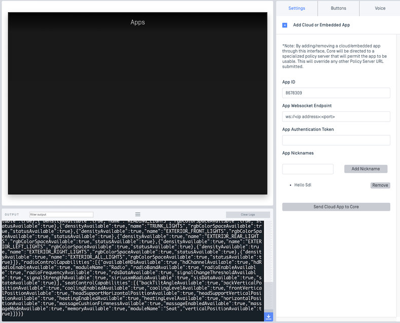
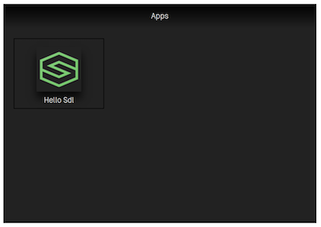
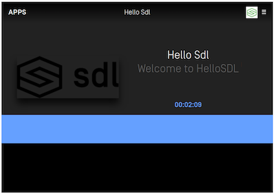

## Hello SDL JavaSE

### Introduction

In this guide we take you through the steps to get our sample project, Hello Sdl, running and connected to Sdl Core as well as showing up on the generic HMI.

First, make sure you download or clone the latest release from [GitHub](https://github.com/smartdevicelink/sdl_java_suite). It is a project within the SDL Java Suite root directory. Then, open the Hello Sdl project in [IntelliJ IDEA](https://www.jetbrains.com/idea/) and wait for it to finish loading. 

### Getting Started

We assume that you have [SDL Core](https://github.com/smartdevicelink/sdl_core) (We recommend Ubuntu 16.04) and an [HMI](https://github.com/smartdevicelink/generic_hmi) set up prior to this point. Most people getting started with this tutorial will be using Sdl Core and our Generic HMI. If you don't want to set up a virtual machine for testing, we offer [Manticore](https://smartdevicelink.com/resources/manticore/), which is a free service that allows you to test your apps in the cloud.

!!! NOTE
Sdl Core and an HMI or Manticore are needed to run Hello Sdl and to ensure that it connects.
!!!

### Configuring Core 

To let Sdl Core connect to your app, first you will have to know the IP address of the machine that is running the Hello Sdl app. If you don't know what it is, running ```ifconfig``` in the terminal will usually let you see it for the interface you are connected with to your network. 

After getting the IP address, you will have to set App ID, App Websocket Endpoint, and App Nicknames in Sdl Core to let it know where your instance of Hello Sdl is running. 

!!! NOTE
The App Websocket Endpoint contains the IP Address and port as the following: `ws://<ip address>:<port>/`.
!!!


#### Manticore
If you are using Manticore, the app information can be easily set in the settings tab:



!!! NOTE
Manticore needs to access you machine's IP address to be able to start a websocket connection with your embedded app. If you are hosting the embedded app on your local machine, you may need to do extra setup to make your machine publicly accessible. The other solution is to setup Core and HMI on your machine instead of using Manticore so Core can access your local IP address.
!!!

#### Sdl Core and Generic HMI
If you are using Sdl Core and Generic HMI, you will have to add a policy table entry as the following one to the existing entries:

```JSON
 "8678309": {
     "keep_context": false,
     "steal_focus": false,
     "priority": "NONE",
     "default_hmi": "NONE",
     "groups": ["Base-4"],
     "RequestType": [],
     "RequestSubType": [],
     "hybrid_app_preference": "CLOUD",
     "endpoint": "ws://<ip address>:<port>",
     "enabled": true,
     "auth_token": "",
     "cloud_transport_type": "WS",
     "nicknames": ["Hello Sdl"]
 }
```

 Fore more information about policy tables please visit [Plicy Tables Guides](https://smartdevicelink.com/en/guides/sdl-server/api-reference-documentation/policy-table/overview).

!!! NOTE
Don't forget to replace `ws://<ip address>:<port>` with your own IP address and app port. The port that is used in Hello Sdl App is `5432`. It can be changed to a different port by modifying the number in `Main.java` class.
!!!

Following this, you should see an application appears on HMI as in the following screenshot:



!!! NOTE
Even though you see the app appears on HMI, you still cannot lunch the app at this point. You will have to run the Hello Sdl app from IntelliJ IDEA first as described next.
!!!

### Running the App
After setting the app information in Sdl Core, you can run the project in IntelliJ IDEA. Hello Sdl should compile and launch on your your machine. After that, you can click on the Hello Sdl icon in the HMI.



This is the main screen of the Hello Sdl app. If you get to this point, the project is working.

At this point Hello Sdl has been compiled and is running properly! Continue reading through our guides to learn about all of the RPCs (Remote Procedure Calls) that can be made with the library.