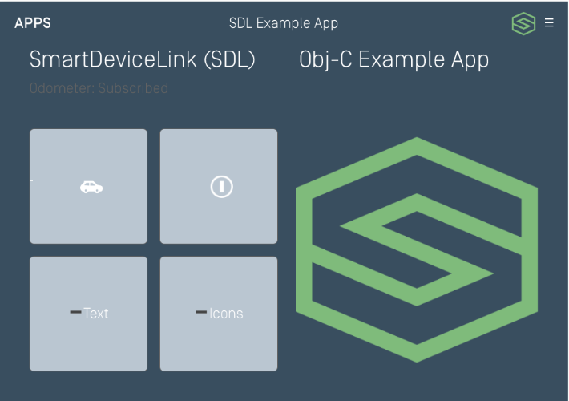

# Integration Basics
### How SDL Works
SmartDeviceLink works by sending remote procedure calls (RPCs) back and forth between a smartphone application and the SDL Core. These RPCs allow you to build the user interface, detect button presses, play audio, and get vehicle data, among other things. You will use the SDL library to build your app on the SDL Core.

## Set Up a Proxy Manager Class
You will need a class that manages the RPCs sent back and forth between your app and SDL Core. Since there should be only one active connection to the SDL Core, you may wish to implement this proxy class using the singleton pattern.

##### Objective-C
###### ProxyManager.h

```objc
#import <Foundation/Foundation.h>

NS_ASSUME_NONNULL_BEGIN

@interface ProxyManager : NSObject

+ (instancetype)sharedManager;

@end

NS_ASSUME_NONNULL_END
```

###### ProxyManager.m
```objc
#import "ProxyManager.h"

NS_ASSUME_NONNULL_BEGIN

@interface ProxyManager ()

@end

@implementation ProxyManager

+ (instancetype)sharedManager {
    static ProxyManager* sharedManager = nil;
    static dispatch_once_t onceToken;
    dispatch_once(&onceToken, ^{
        sharedManager = [[ProxyManager alloc] init];
    });

    return sharedManager;
}

- (instancetype)init {
    self = [super init];
    if (!self) {
      return nil;
    }
}

@end

NS_ASSUME_NONNULL_END
```

##### Swift
```swift
class ProxyManager: NSObject {
  // Singleton
  static let sharedManager = ProxyManager()

  private override init() {
    super.init()
  }
}
```

Your app should always start passively watching for a connection with a SDL Core as soon as the app launches. The easy way to do this is by instantiating the *ProxyManager* class in the `didFinishLaunchingWithOptions()` method in your *AppDelegate* class.

The connect method will be implemented later. To see a full example, navigate to the bottom of this page.

##### Objective-C
```objc
@implementation AppDelegate

- (BOOL)application:(UIApplication *)application didFinishLaunchingWithOptions:(NSDictionary *)launchOptions {
  // Initialize and start the proxy
  [[ProxyManager sharedManager] connect];
}

@end
```

##### Swift
```swift
class AppDelegate: UIResponder, UIApplicationDelegate {
  func application(_ application: UIApplication, didFinishLaunchingWithOptions launchOptions: [UIApplicationLaunchOptionsKey: Any]?) -> Bool {
    // Initialize and start the proxy
    ProxyManager.sharedManager.connect()

    return true
  }
}
```

## Importing the SDL Library
At the top of the *ProxyManager* class, import the SDL for iOS library.

##### Objective-C
```objc
#import <SmartDeviceLink/SmartDeviceLink.h>
```

##### Swift
```swift
import SmartDeviceLink
```

## Creating the SDL Manager
The `SDLManager` is the main class of SmartDeviceLink. It will handle setting up the initial connection with the head unit. It will also help you upload images and send RPCs.

##### Objective-C
```objc
#import "ProxyManager.h"
#import "SmartDeviceLink.h"

NS_ASSUME_NONNULL_BEGIN

@interface ProxyManager ()

@property (nonatomic, strong) SDLManager *sdlManager;

@end

@implementation ProxyManager

+ (instancetype)sharedManager {
    static ProxyManager *sharedManager = nil;
    static dispatch_once_t onceToken;
    dispatch_once(&onceToken, ^{
        sharedManager = [[ProxyManager alloc] init];
    });

    return sharedManager;
}

- (instancetype)init {
    self = [super init];
    if (!self) {
      return nil;
    }

    return self
}

@end

NS_ASSUME_NONNULL_END
```

##### Swift
```swift
class ProxyManager: NSObject {
  // Manager
  fileprivate var sdlManager: SDLManager!
    
  // Singleton
  static let sharedManager = ProxyManager()

  private override init() {
    super.init()
  }
}
```

### 1. Create a Lifecycle Configuration   
In order to instantiate the `SDLManager` class, you must first configure an `SDLConfiguration`. To start, we will look at the `SDLLifecycleConfiguration`. You will at minimum need a `SDLLifecycleConfiguration` instance with the application name and application id. During the development stage, a dummy app id is usually sufficient. For more information about obtaining an application id, please consult the [SDK Configuration](Getting Started/SDK Configuration) section of this guide. You must also decide which network configuration to use to connect the app to the SDL Core. Optional, but recommended, configuration properties include short app name, app icon, and app type.

#### Network Connection Type
There are two different ways to connect your app to a SDL Core: with a TCP (Wi-Fi) network connection or with an iAP (USB / Bluetooth) network connection. Use TCP for debugging and use iAP for production level apps.

##### iAP
##### Objective-C
```objc
SDLLifecycleConfiguration* lifecycleConfiguration = [SDLLifecycleConfiguration defaultConfigurationWithAppName:@"<#App Name#>" fullAppId:@"<#App Id#>"];
```
##### Swift
```swift
let lifecycleConfiguration = SDLLifecycleConfiguration(appName:"<#App Name#>", fullAppId: "<#App Id#>")
```

##### TCP
##### Objective-C
```objc
SDLLifecycleConfiguration* lifecycleConfiguration = [SDLLifecycleConfiguration debugConfigurationWithAppName:@"<#App Name#>" fullAppId:@"<#App Id#>" ipAddress:@"<#IP Address#>" port:<#Port#>];
```
##### Swift
```swift
let lifecycleConfiguration = SDLLifecycleConfiguration(appName: "<#App Name#>", fullAppId: "<#App Id#>", ipAddress: "<#IP Address#>", port: <#Port#>))
```  

!!! NOTE
If you are connecting your app to an emulator using a TCP connection, the IP address is your computer or virtual machine’s IP address, and the port number is usually 12345.
!!!

### 2. Short App Name (optional)
This is a shortened version of your app name that is substituted when the full app name will not be visible due to character count constraints. You will want to make this as short as possible.

##### Objective-C
```objc
lifecycleConfiguration.shortAppName = @"<#Shortened App Name#>";
```

##### Swift
```swift
lifecycleConfiguration.shortAppName = "<#Shortened App Name#>"
```

### 3. App Icon
This is a custom icon for your application. Please refer to [Adaptive Interface Capabilities](Displaying a User Interface/Adaptive Interface Capabilities) for icon sizes.

##### Objective-C
```objc
UIImage* appImage = [UIImage imageNamed:@"<#AppIcon Name#>"];
if (appImage) {
  SDLArtwork* appIcon = [SDLArtwork persistentArtworkWithImage:appImage name:@"<#Name to Upload As#>" asImageFormat:SDLArtworkImageFormatPNG /* or SDLArtworkImageFormatJPG */];
  lifecycleConfiguration.appIcon = appIcon;  
}
```

##### Swift
```swift
if let appImage = UIImage(named: "<#AppIcon Name#>") {
  let appIcon = SDLArtwork(image: appImage, name: "<#Name to Upload As#>", persistent: true, as: .JPG /* or .PNG */)
  lifecycleConfiguration.appIcon = appIcon  
}
```

!!! NOTE
Persistent files are used when the image ought to remain on the remote system between ignition cycles. This is commonly used for menu artwork, soft button artwork and app icons. Non-persistent artwork is usually used for dynamic images like music album artwork.
!!!

### 4. App Type (optional)
The app type is used by car manufacturers to decide how to categorize your app. Each car manufacturer has a different categorization system. For example, if you set your app type as media, your app will also show up in the audio tab as well as the apps tab of Ford’s SYNC3 head unit. The app type options are: default, communication, media (i.e. music/podcasts/radio), messaging, navigation, projection, information, and social.

!!! NOTE
Navigation and projection applications both use video and audio byte streaming. However, navigation apps require special permissions from OEMs, and projection apps are only for internal use by OEMs.
!!!

##### Objective-C
```objc
lifecycleConfiguration.appType = SDLAppHMITypeMedia;
```

##### Swift
```swift
lifecycleConfiguration.appType = .media
```

#### Additional App Types
If one app type doesn't cover your full app use-case, you can add additional `AppHMIType`s as well.

##### Objective-C

```objc
lifecycleConfiguration.additionalAppTypes = @[SDLAppHMITypeInformation];
```

##### Swift

```swift
lifecycleConfiguration.additionalAppTypes = [SDLAppHMITypeInformation];
```

### 5. Template Coloring
You can alter the appearance of your app on a head unit in a consistent way using template coloring APIs.

!!! NOTE
This will only work when connected to head units running SDL Core v5.0 or later.
!!!

##### Objective-C
```objc
SDLRGBColor *green = [[SDLRGBColor alloc] initWithRed:126 green:188 blue:121];
SDLRGBColor *white = [[SDLRGBColor alloc] initWithRed:249 green:251 blue:254];
SDLRGBColor *darkGrey = [[SDLRGBColor alloc] initWithRed:57 green:78 blue:96];
SDLRGBColor *grey = [[SDLRGBColor alloc] initWithRed:186 green:198 blue:210];
lifecycleConfiguration.dayColorScheme = [[SDLTemplateColorScheme alloc] initWithPrimaryRGBColor:green secondaryRGBColor:grey backgroundRGBColor:white];
lifecycleConfiguration.nightColorScheme = [[SDLTemplateColorScheme alloc] initWithPrimaryRGBColor:green secondaryRGBColor:grey backgroundRGBColor:darkGrey];
```

##### Swift
```swift
let green = SDLRGBColor(red: 126, green: 188, blue: 121)
let white = SDLRGBColor(red: 249, green: 251, blue: 254)
let grey = SDLRGBColor(red: 186, green: 198, blue: 210)
let darkGrey = SDLRGBColor(red: 57, green: 78, blue: 96)
lifecycleConfiguration.dayColorScheme = SDLTemplateColorScheme(primaryRGBColor: green, secondaryRGBColor: grey, backgroundRGBColor: white)
lifecycleConfiguration.nightColorScheme = SDLTemplateColorScheme(primaryRGBColor: green, secondaryRGBColor: grey, backgroundRGBColor: darkGrey)
```

!!! NOTE
You may only change the template coloring in the `lifecycleConfiguration` and in `SetDisplayLayout` RPC requests. You may only change the template coloring once per template. i.e. You cannot change to the same template you are already on using `SetDisplayLayout` and expect the coloring to change.
!!!

##### Template Coloring



### 6. Determine SDL Support
You have the ability to determine a minimum SDL protocol and minimum SDL RPC version that your app supports. We recommend not setting these values until your app is ready for production. The OEMs you support will help you configure the correct `minimumProtocolVersion` and `minimumRPCVersion` during the application review process.

If a head unit is blocked by protocol version, your app icon will never appear on the head unit's screen. If you configure your app to block by RPC version, it will appear and then quickly disappear. So while blocking with `minimumProtocolVersion` is preferable, `minimumRPCVersion` allows you more granular control over which RPCs will be present.

##### Objective-C
```objc
lifecycleConfiguration.minimumProtocolVersion = [SDLVersion versionWithString:@"3.0.0"];
lifecycleConfiguration.minimumRPCVersion = [SDLVersion versionWithString:@"4.0.0"];
```

##### Swift
```swift
lifecycleConfiguration.minimumProtocolVersion = SDLVersion(string: "3.0.0")
lifecycleConfiguration.minimumRPCVersion = SDLVersion(string: "4.0.0")
```

### 7. Lock Screen
A lock screen is used to prevent the user from interacting with the app on the smartphone while they are driving. When the vehicle starts moving, the lock screen is activated. Similarly, when the vehicle stops moving, the lock screen is removed. You must implement a lock screen in your app for safety reasons. Any application without a lock screen will not get approval for release to the public.

The SDL SDK can take care of the lock screen implementation for you, automatically using your app logo and the connected vehicle logo. If you do not want to use the default lock screen, you can implement your own custom lock screen.

For more information, please refer to the [Adding the Lock Screen](Getting Started/Adding the Lock Screen) section, for this guide we will be using `SDLLockScreenConfiguration`'s basic `enabledConfiguration`.

##### Objective-C
```objc
[SDLLockScreenConfiguration enabledConfiguration]
```

##### Swift
```swift
SDLLockScreenConfiguration.enabled()
```

### 8. Logging
A logging configuration is used to define where and how often SDL will log. It will also allow you to set your own logging modules and filters. For more information about setting up logging, see [the logging guide](Developer Tools/Configuring SDL Logging).

##### Objective-C
```objc
[SDLLogConfiguration defaultConfiguration]
```

##### Swift
```objc
SDLLogConfiguration.default()
```

### 9. Set the Configuration
The `SDLConfiguration` class is used to set the lifecycle, lock screen, logging, and optionally (dependent on if you are a Navigation or Projection app) streaming media configurations for the app. Use the lifecycle configuration settings above to instantiate a `SDLConfiguration` instance.

##### Objective-C
```objc
SDLConfiguration* configuration = [SDLConfiguration configurationWithLifecycle:lifecycleConfiguration lockScreen:[SDLLockScreenConfiguration enabledConfiguration] logging:[SDLLogConfiguration defaultConfiguration] fileManager:[SDLFileManagerConfiguration defaultConfiguration]];
```

##### Swift
```swift
let configuration = SDLConfiguration(lifecycle: lifecycleConfiguration, lockScreen: .enabled(), logging: .default(), fileManager: .default())
```

### 10. Create a SDLManager
Now you can use the `SDLConfiguration` instance to instantiate the `SDLManager`.

##### Objective-C
```objc
self.sdlManager = [[SDLManager alloc] initWithConfiguration:configuration delegate:self];
```

##### Swift
```swift
sdlManager = SDLManager(configuration: configuration, delegate: self)
```

### 11. Start the SDLManager
The manager should be started as soon as possible in your application's lifecycle. We suggest doing this in the `didFinishLaunchingWithOptions()` method in your *AppDelegate* class. Once the manager has been initialized, it will immediately start watching for a connection with the remote system. The manager will passively search for a connection with a SDL Core during the entire lifespan of the app. If the manager detects a connection with a SDL Core, the `startWithReadyHandler` will be called.

Create a new function in the *ProxyManager* class called `connect`.

##### Objective-C
```objc
- (void)connect {
    [self.sdlManager startWithReadyHandler:^(BOOL success, NSError * _Nullable error) {
        if (success) {
            // Your app has successfully connected with the SDL Core
        }
    }];
}
```

##### Swift
```swift
func connect() {
    // Start watching for a connection with a SDL Core
    sdlManager.start { (success, error) in
        if success {
            // Your app has successfully connected with the SDL Core
        }
    }
}
```

!!! NOTE  
In production, your app will be watching for connections using iAP, which will not use any more battery power than normal.  
!!!  

If the connection is successful, you can start sending RPCs to the SDL Core. However, some RPCs can only be sent when the HMI is in the `FULL` or `LIMITED` state. If the SDL Core's HMI is not ready to accept these RPCs, your requests will be ignored. If you want to make sure that the SDL Core will not ignore your RPCs, use the `SDLManagerDelegate` methods in the next section.

### Example Implementation of a Proxy Class  
The following code snippet has an example of setting up both a TCP and iAP connection.

##### Objective-C
###### ProxyManager.h
```objc
#import <Foundation/Foundation.h>

NS_ASSUME_NONNULL_BEGIN

@interface ProxyManager : NSObject

+ (instancetype)sharedManager;
- (void)start;

@end

NS_ASSUME_NONNULL_END
```

###### ProxyManager.m 
```objc
#import <SmartDeviceLink/SmartDeviceLink.h>

NS_ASSUME_NONNULL_BEGIN

static NSString* const AppName = @"<#App Name#>";
static NSString* const AppId = @"<#App Id#>";
@interface ProxyManager () <SDLManagerDelegate>

@property (nonatomic, strong) SDLManager* sdlManager;

@end

@implementation ProxyManager

+ (instancetype)sharedManager {
    static ProxyManager *sharedManager = nil;
    static dispatch_once_t onceToken;
    dispatch_once(&onceToken, ^{
        sharedManager = [[ProxyManager alloc] init];
    });
    
    return sharedManager;
}

- (instancetype)init {
    self = [super init];
    if (!self) {
        return nil;
    }
    
    // Used for USB Connection
    SDLLifecycleConfiguration* lifecycleConfiguration = [SDLLifecycleConfiguration defaultConfigurationWithAppName:AppName fullAppId:AppId];

    // Used for TCP/IP Connection
//    SDLLifecycleConfiguration* lifecycleConfiguration = [SDLLifecycleConfiguration debugConfigurationWithAppName:AppName fullAppId:AppId  ipAddress:@"<#IP Address#>" port:<#Port#>];
    
    UIImage* appImage = [UIImage imageNamed:@"<#AppIcon Name#>"];
    if (appImage) {
        SDLArtwork* appIcon = [SDLArtwork persistentArtworkWithImage:appImage name:@"<#Name to Upload As#>" asImageFormat:SDLArtworkImageFormatJPG /* or SDLArtworkImageFormatPNG */];
        lifecycleConfiguration.appIcon = appIcon;
    }
    
    lifecycleConfiguration.shortAppName = @"<#Shortened App Name#>";
    lifecycleConfiguration.appType = [SDLAppHMIType MEDIA];
    
    SDLConfiguration* configuration = [SDLConfiguration configurationWithLifecycle:lifecycleConfiguration lockScreen:[SDLLockScreenConfiguration enabledConfiguration] logging:[SDLLogConfiguration defaultConfiguration] fileManager:[SDLFileManager defaultConfiguration]];

    self.sdlManager = [[SDLManager alloc] initWithConfiguration:configuration delegate:self];
    
    return self;
}

- (void)connect {
    [self.sdlManager startWithReadyHandler:^(BOOL success, NSError * _Nullable error) {
        if (success) {
            // Your app has successfully connected with the SDL Core
        }
    }];
}

#pragma mark SDLManagerDelegate
- (void)managerDidDisconnect {
    NSLog(@"Manager disconnected!");
}

- (void)hmiLevel:(SDLHMILevel *)oldLevel didChangeToLevel:(SDLHMILevel *)newLevel {
    NSLog(@"Went from HMI level %@ to HMI Level %@", oldLevel, newLevel);
}

@end

NS_ASSUME_NONNULL_END
```

##### Swift
```swift
import SmartDeviceLink

class ProxyManager: NSObject {
    private let appName = "<#App Name#>"
    private let appId = "<#App Id#>"
    
    // Manager
    fileprivate var sdlManager: SDLManager!
    
    // Singleton
    static let sharedManager = ProxyManager()
    
    private override init() {
        super.init()

        // Used for USB Connection
        let lifecycleConfiguration = SDLLifecycleConfiguration(appName: appName, fullAppId: appId)
        
        // Used for TCP/IP Connection
        // let lifecycleConfiguration = SDLLifecycleConfiguration(appName: appName, fullAppId: appId, ipAddress: "<#IP Address#>", port: <#Port#>)
        
        // App icon image
        if let appImage = UIImage(named: "<#AppIcon Name#>") {
            let appIcon = SDLArtwork(image: appImage, name: "<#Name to Upload As#>", persistent: true, as: .JPG /* or .PNG */)
            lifecycleConfiguration.appIcon = appIcon
        }
        
        lifecycleConfiguration.shortAppName = "<#Shortened App Name#>"
        lifecycleConfiguration.appType = .media
        
        let configuration = SDLConfiguration(lifecycle: lifecycleConfiguration, lockScreen: .enabled(), logging: .default(), fileManager: .default())
        
        sdlManager = SDLManager(configuration: configuration, delegate: self)                
    }
    
    func connect() {
        // Start watching for a connection with a SDL Core
        sdlManager.start { (success, error) in
            if success {
                // Your app has successfully connected with the SDL Core
            }
        }
    }
}

//MARK: SDLManagerDelegate
extension ProxyManager: SDLManagerDelegate {
  func managerDidDisconnect() {
    print("Manager disconnected!")
  }

  func hmiLevel(_ oldLevel: SDLHMILevel, didChangeToLevel newLevel: SDLHMILevel) {
    print("Went from HMI level \(oldLevel) to HMI level \(newLevel)")
  }
}
```

## Implement the SDL Manager Delegate
The *ProxyManager* class should conform to the `SDLManagerDelegate` protocol. This means that the *ProxyManager* class must implement the following required methods:

1. `managerDidDisconnect` This function is called when the proxy disconnects from the SDL Core. Do any cleanup you need to do in this function.
2. `hmiLevel:didChangeToLevel:` This function is called when the HMI level changes for the app. The HMI level can be `FULL`, `LIMITED`, `BACKGROUND`, or `NONE`. It is important to note that most RPCs sent while the HMI is in `BACKGROUND` or `NONE` mode will be ignored by the SDL Core. For more information, please refer to [Understanding Permissions](Getting Started/Understanding Permissions).

In addition, there are three optional methods:

1. `audioStreamingState:didChangeToState:` Called when the audio streaming state of this application changes on the remote system. For more information, please refer to [Understanding Permissions](Getting Started/Understanding Permissions).
1. `systemContext:didChangeToContext:` Called when the system context (i.e. a menu is open, an alert is visible,  a voice recognition session is in progress) of this application changes on the remote system. For more information, please refer to [Understanding Permissions](Getting Started/Understanding Permissions).
1. `managerShouldUpdateLifecycleToLanguage:` Called when the head unit language does not match the `language` set in the `SDLLifecycleConfiguration` but does match a language included in `languagesSupported`. If desired, you can customize the `appName`, the `shortAppName`,  and `ttsName` for the head unit's current language. For more information about supporting more than one language in your app please refer to [Getting Started/Adapting to the Head Unit Language](Getting Started/Adapting to the Head Unit Language).

## Where to Go From Here
You should now be able to connect to a head unit or emulator. From here, [learn about designing your main interface](Displaying a User Interface/Main Screen Templates). For further details on connecting, see [Connecting to a SDL Core](Getting Started/Connecting to an Infotainment System).
