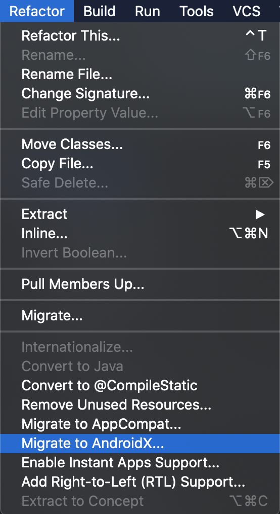

# Upgrading to 5.0

## Overview

This guide is to help developers get setup with the SDL Java library version 5.0. It is assumed that the developer is already updated to at least version 4.11 or 4.12 of the library.

The full release notes are published [here](https://github.com/smartdevicelink/sdl_java_suite/releases).

## New minimum SDK 
SDL now has a new minimum required SDK version of 16. You can change the minimum SDK version in the apps build.gradle file by changing minSdkVersion to 16. An example:

```Gradle
defaultConfig {
    applicationId "com.sdl.mobileweather"
    minSdkVersion 16
    targetSdkVersion 26
    versionCode 27
    versionName "1.7.15"
    testInstrumentationRunner "android.support.test.runner.AndroidJUnitRunner"
}
```

## AndroidX
SDL now uses AndroidX. To migrate your app to use AndroidX, In Android Studio or IntelliJ, click on Refactor, then Migrate to AndroidX.

 

!!! NOTE
To migrate to AndroidX you must set the `compileSdkVersion` to 28 in the apps build.gradle file
!!!

## Import changes
 Some classes have moved packages, and imports may need to be changed.

 Exapmpe: 
OnSystemCapabilityListener has moved packages from:
 `import com.smartdevicelink.proxy.interfaces.OnSystemCapabilityListener;` 
 to 
 `import com.smartdevicelink.managers.lifecycle.OnSystemCapabilityListener;` 

## SdlManagerListener changes
In 4.12 a new managerShouldUpdateLifecycle method was added and the old managerShouldUpdateLifecycle method was deprecated. In 5.0 the deprecated method was removed. More detail can be found [here](Getting Started/Adapting to the Head Unit Language).

Before:

```java
SdlManagerListener listener = new SdlManagerListener() {
    @Override
    public void onStart() {
    }

    @Override
    public void onDestroy() {
    }

    @Override
    public void onError(String info, Exception e) {
    }

    @Override
    public LifecycleConfigurationUpdate managerShouldUpdateLifecycle(Language language, Language hmiLanguage) {
        return null;
    }

    @Override
    public LifecycleConfigurationUpdate managerShouldUpdateLifecycle(Language language) {
        return null;
    }
};
```

Now:

```java
SdlManagerListener listener = new SdlManagerListener() {
    @Override
    public void onStart() {
    }

    @Override
    public void onDestroy() {
    }

    @Override
    public void onError(String info, Exception e) {
    }

    @Override
    public LifecycleConfigurationUpdate managerShouldUpdateLifecycle(Language language, Language hmiLanguage) {
        return null;
    }
};
```

## Sending RPC's listener updates
When sending RPC's with a listener, onError has been removed from `OnMultipleRequestListener.java` and `OnRPCResponseListener.java`. Instead of onError getting called, onResponse will be called whether its a success or not.

OnRPCResponseListener Before:

```Java
subscribeButtonLeft.setOnRPCResponseListener(new OnRPCResponseListener() {
    @Override
    public void onResponse(int correlationId, RPCResponse response) {

    }

    @Override
    public void onError(int correlationId, Result resultCode, String info) {
        <#Handle Error#>
    }
});
```
OnRPCResponseListener Now:
```Java
subscribeButtonLeft.setOnRPCResponseListener(new OnRPCResponseListener() {
    @Override
    public void onResponse(int correlationId, RPCResponse response) {
        if(response.getSuccess()){
            // Add if statement to check success
        }
    }
});
```

OnMultipleRequestListener Before:
```Java
sdlManager.sendRPCs(Arrays.asList(subscribeButtonLeft, subscribeButtonRight), new OnMultipleRequestListener() {
    @Override
    public void onUpdate(int remainingRequests) {

    }

    @Override
    public void onFinished() {

    }

    @Override
    public void onError(int correlationId, Result resultCode, String info) {

    }

    @Override
    public void onResponse(int correlationId, RPCResponse response) {

    }
});
```

OnMultipleRequestListener Now:

```Java
sdlManager.sendRPCs(Arrays.asList(subscribeButtonLeft, subscribeButtonRight), new OnMultipleRequestListener() {
    @Override
    public void onUpdate(int remainingRequests) {

    }

    @Override
    public void onFinished() {

    }

    @Override
    public void onResponse(int correlationId, RPCResponse response) {
    	if(response.getSuccess()){
            // Add if statement to check success
        }

    }
});
```


## Use Multiplex instead of legacy BT & USB
`BTTransportConfig.java` and `USBTransportConfig` have been removed from the library. You should use `MultiplexBluetoothTransport.java` and `MultiplexUsbTransport.java` instead.

## ScreenManager Template Management
You can now use the ScreenManager to change screen templates and day/night color schemes. See [Main Screen Templates](Displaying a User Interface/Main Screen Templates) for more detail.

Example:
```java
TemplateConfiguration configuration = new TemplateConfiguration().setTemplate(Template).setDayColorScheme(DayColorScheme).setNightColorScheme(NightColorScheme);
sdlManager.getScreenManager().changeLayout(configuration, new CompletionListener() {
    @Override
    public void onComplete(boolean success) {
                
    }
});
```

## Chainable RPC setters
Rpc setters are now chainable. Before you had to either use a constructor that took all parameters or set everyone individually. Now you can chain them together.

Before:
```Java
Alert alert = new Alert();
alert.setAlertText1("text1");
alert.setDuration(5000);
alert.setPlayTone(true);
```
Now:
```Java
Alert alert = new Alert().setAlertText1("text1").setDuration(5000).setPlayTone(true);
```

## New DebugTool methods
There is a new way of logging information in debug mode. Before for example, we would use Log.e to log errors, now we use the DebugTool.logError.

`Log.i` to `DebugTool.logInfo`
`Log.w` to `DebugTool.logWarning`
`Log.e` to `DebugTool.logError`

Before:

```Java
Log.e(TAG, "There is an error");
```

Now:
```Java
DebugTool.logError(TAG, "There is an error");
```

!!! NOTE
In JavaSE you must use the DebugTool, the old log methods will not work.
!!!


## TTSChunkFactory removal
`TTSChunkFactory.java` was removed. To create a voice command you should now use `TTSChunk` An example of creating and sending a voice command:

Before:
```Java
Speak msg = new Speak(TTSChunkFactory.createSimpleTTSChunks("Voice Message to speak"));
sdlManager.sendRPC(msg);
```
Now:
```Java
Speak msg = new Speak(Collections.singletonList(new TTSChunk("Voice Message to speak", SpeechCapabilities.TEXT)));
sdlManager.sendRPC(msg);
```


