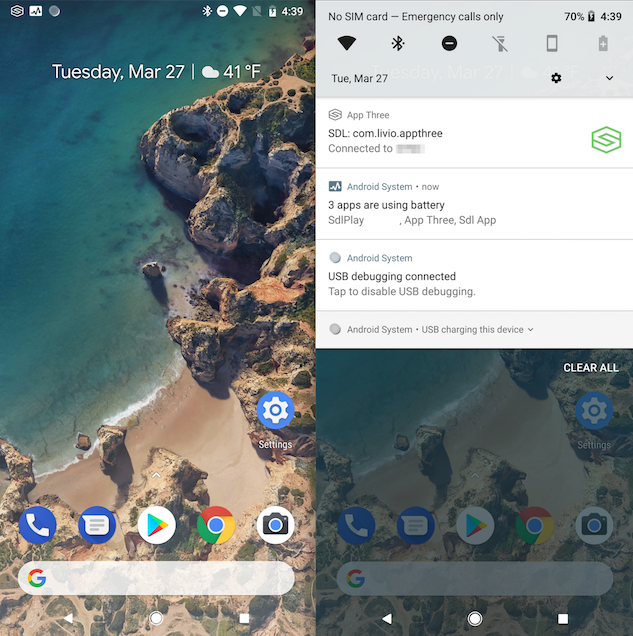
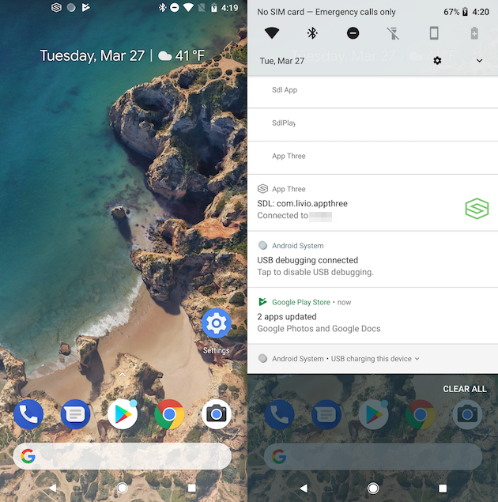

# Updating from 4.4 to 4.5 


This guide is to help developers get setup with the SDL Android library 4.5. It is assumed that the developer is already updated to 4.4 of the library. There are a few very important changes that we need to make to the integration to keep things working well. The first is a few new additions to the AndroidManifest.xml and the `SdlRouterService` entry. Next, we have to prepare for Android Oreo's push towards foreground services.

We will make changes to:

* AndroidManifest.xml
* SdlService
* SdlBroadcastReceiver


## AndroidManifest.xml Updates
Assuming the manifest was up to date with version 4.4 requirements we need to add an intent-filter and a meta-data item. The entire entry should look as follows:

```xml
<manifest xmlns:android="http://schemas.android.com/apk/res/android"
    package="com.company.mySdlApplication">

    <application>
    
    ...

        <service
        	android:name="com.company.mySdlApplication.SdlRouterService"
        	android:exported="true" 
        	android:process="com.smartdevicelink.router"
            tools:ignore="ExportedService">
            <intent-filter>
                <action android:name="com.smartdevicelink.router.service"/>
            </intent-filter>
            <meta-data android:name="sdl_router_version"  android:value="@integer/sdl_router_service_version_value" />
        </service>
    
    </application>

    ...

</manifest>
```


### Intent Filter

```xml
<intent-filter>
    <action android:name="com.smartdevicelink.router.service"/>
</intent-filter>
```

The new versions of the SDL Android library rely on the `com.smartdevicelink.router.service` action to query SDL enabled apps that host router services. This allows the library to determine which router service to start.

!!! MUST
This `intent-filter` MUST be included.
!!!

### Metadata

#### Router Service Version

```xml
<meta-data android:name="sdl_router_version"  android:value="@integer/sdl_router_service_version_value" />
```

Adding the `sdl_router_version` metadata allows the library to know the version of the router service that the app is using. This makes it simpler for the library to choose the newest router service when multiple router services are available.

#### Custom Router Service

```xml
<meta-data android:name="sdl_custom_router" android:value="false" />
```

!!! NOTE
This is only for specific OEM applications, therefore normal developers do not need to worry about this.
!!!

Some OEMs choose to implement custom router services. Setting the `sdl_custom_router` metadata value to `true` means that the app is using something custom over the default router service that is included in the SDL Android library. Do not include this `meta-data` entry unless you know what you are doing. 

## Android Oreo's Push To Foreground Services


Previous versions of Android allowed our SDL app partners to start their SDL services in the background and attach themselves to the foregrounded SDL router service. Android Oreo (API 26) has changed that. Due to new OS limitations, apps must start their SDL service in the foreground. 

### What do I need to do?

There are a few changes to make, one in the `SdlBroadcastReceiver` and the other in the `SdlService` (or which service the proxy is implemented).


#### SdlBroadcastReceiver

##### Previous version
```java
	@Override
	public void onSdlEnabled(Context context, Intent intent) {
		Log.d(TAG, "SDL Enabled");
		intent.setClass(context, SdlService.class);
		context.startService(intent);
	}
```

##### Sample Update

```java
	@Override
	public void onSdlEnabled(Context context, Intent intent) {
		Log.d(TAG, "SDL Enabled");
		intent.setClass(context, SdlService.class);
		if(Build.VERSION.SDK_INT < Build.VERSION_CODES.O) {
			context.startService(intent);
		}else{
			context.startForegroundService(intent);
		}

	}
```

This means the app will start the SDL service in the background if we are on a device that uses Android N or earlier. If the app is running on  Android Oreo or newer, the service will make a promise to the OS that the service will move into the foreground. If the service doesn't explicitly move into the foreground an exception will be thrown. 


#### SdlService (Or similar)

Within the `SdlService` class or similar you will need to add a call to start the service in the foreground. This will include creating a notification to sit in the status bar tray. This information and icons should be relevant for what the service is doing/going to do. If you already start your service in the foreground, you can ignore this section.

```java

public void onCreate() {
    super.onCreate();
    ...
    
    NotificationManager notificationManager = (NotificationManager) getSystemService(Context.NOTIFICATION_SERVICE);
     notificationManager.createNotificationChannel(...);
     Notification serviceNotification = new Notification.Builder(this, *Notification Channel*)
         .setContentTitle(...)
         .setSmallIcon(....)
         .setLargeIcon(...)
         .setContentText(...)
         .setChannelId(channel.getId())
         .build();
     startForeground(id, serviceNotification);
}

```

#### Exiting the Foreground

It's important that you don't leave you notification in the notification tray as it is very confusing to users. So in the `onDestroy` method in your service, simply call the `stopForeground` method.

```java
@Override
public void onDestroy(){
    //...
	if(Build.VERSION.SDK_INT>=Build.VERSION_CODES.O){
		NotificationManager notificationManager = (NotificationManager) getSystemService(Context.NOTIFICATION_SERVICE);
		if(notificationManager!=null){ //If this is the only notification on your channel
			notificationManager.deleteNotificationChannel(* Notification Channel*);
		}
		stopForeground(true);
	}
}
```

### Notification Suggestions

We realize that pushing a notification to the notification tray is not ideal for any apps, but with Android's push for more transparency to users it's important that we don't try to workaround that. Android is getting stricter with their guidelines and could potentially prevent apps from being released if they are found to be not adhering to these rules. 

#### The Correct way

The right way to handle the new foreground service requirement is to simply push a full fledged notification to the notification tray.

###### How to do it

```java
    @Override
    public void onCreate() {
        super.onCreate();
        ...
        if(Build.VERSION.SDK_INT >= Build.VERSION_CODES.O) {
            NotificationManager notificationManager = (NotificationManager) getSystemService(Context.NOTIFICATION_SERVICE);
            NotificationChannel channel = new NotificationChannel("MyApp", "SdlService", NotificationManager.IMPORTANCE_DEFAULT);
            notificationManager.createNotificationChannel(channel);
            Notification serviceNotification = new Notification.Builder(this, channel.getId())
                    .setContentTitle("MyApp is connected through SDL")
                    .setSmallIcon(R.drawable.ic_launcher_foreground)
                    .build();
            startForeground(id, serviceNotification);
        }
    }

```


#### The Not So Correct Way

Currently Android Oreo allows a notification to be used that has not declared a notification channel. This results in the notification icon not actually appearing on its own. Instead it is grouped together into the notification channel that reads "# apps are using battery" from the Android System. This is likely to prevent breaking changes from apps that have not updated their integration to Android Oreo, however, we fully anticipate this to be changed in the future so it is not recommended. 

###### How to do it

```java
    @Override
    public void onCreate() {
        super.onCreate();
        ...
        if(Build.VERSION.SDK_INT >= Build.VERSION_CODES.O) {
            Notification serviceNotification = new Notification.Builder(this, "NoChannel")
                    .setContentTitle("MyApp is connected through SDL")
                    .setSmallIcon(R.drawable.ic_launcher_foreground)
                    .build();
            startForeground(id, serviceNotification);
        }
    }

```

###### How it looks
 


#### The Absolutely Not Correct Way

It is possible to create a somewhat invisible notification. This will appear to just be blank space in the notification tray. With adding minimal content to the notification when the user pulls down the tray it will have a very small footprint on the screen. However, this is completely disingenuous to the user and should not be considered a solution. Android will most likely see this as bad behavior and could prevent you from releasing your app or even remove your app from the play store with a ban included. Don't do this.

###### How to do it

```java
    @Override
    public void onCreate() {
        super.onCreate();
        ...
        if(Build.VERSION.SDK_INT >= Build.VERSION_CODES.O) {
            NotificationManager notificationManager = (NotificationManager) getSystemService(Context.NOTIFICATION_SERVICE);
            NotificationChannel channel = new NotificationChannel("MyApp", "SdlService", NotificationManager.IMPORTANCE_DEFAULT);
            notificationManager.createNotificationChannel(channel);
            Notification serviceNotification = new Notification.Builder(this, channel.getId())
                    .setSmallIcon(R.drawable.sdl_tray_invis)
                    .build();
            startForeground(id, serviceNotification);
        }
    }
```


###### How it looks


