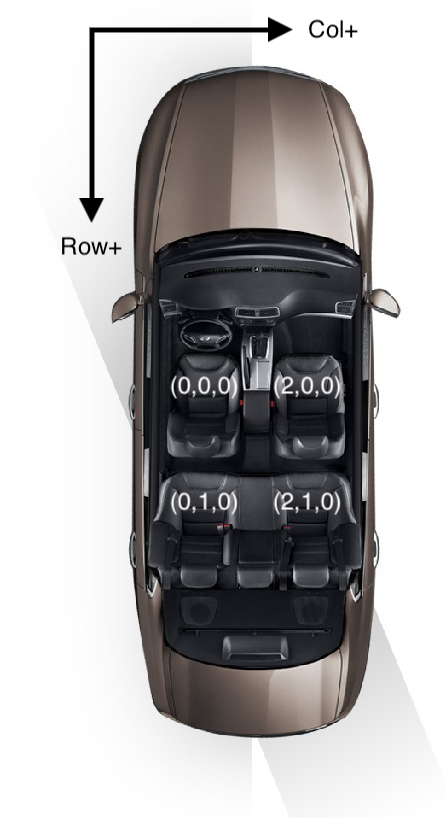

# Remote Control Vehicle Features
The remote control framework allows apps to control modules such as climate, radio, seat, lights, etc., within a vehicle. Newer head units can support multi-zone modules that allow customizations based on seat location. 

!!! Note
If you are using this feature in your app, you will most likely need to request permission from the vehicle manufacturer. Not all head units support the remote control framework and only the newest head units will support multi-zone modules.
!!!

## Why Use Remote Control?
Consider the following scenarios:

- A radio application wants to use the in-vehicle radio tuner. It needs the functionality to select the radio band (AM/FM/XM/HD/DAB), tune the radio frequency or change the radio station, as well as obtain general radio information for decision making.
- A climate control application needs to turn on the AC, control the air circulation mode, change the fan speed and set the desired cabin temperature.
- A user profile application wants to remember users' favorite settings and apply it later automatically when the users get into the same/another vehicle.

### Supported Modules
Currently, the remote control feature supports these modules:

| Remote Control Modules | RPC Version  |
| ---------              | -------  |
| Climate                | v4.5+ |
| Radio                  | v4.5+ |
| Seat                   | v5.0+ |
| Audio                  | v5.0+ |
| Light                  | v5.0+ |
| HMI Settings           | v5.0+ |

The following table lists which items are in each control module.

#### Climate

| Control Item | RPC Item Name | Value Range | Type | Comments | RPC Version Changes |
| --------------- | ------------ | ------------ | ------------ | ------------ | ------------ |
| Climate Enable | climateEnable | on, off | Get/Set/Notification | Enabled to turn on the climate system, Disabled to turn off the climate system. All other climate items need climate enabled to work. | Since v6.0 |
| Current Cabin Temperature | currentTemperature | N/A | Get/Notification | Read only, value range depends on OEM | Since v4.5 |
| Desired Cabin Temperature | desiredTemperature | N/A | Get/Set/Notification | Value range depends on OEM | Since v4.5 |
| AC Setting | acEnable | on, off | Get/Set/Notification |  | Since v4.5 |
| AC MAX Setting | acMaxEnable | on, off  | Get/Set/Notification |  | Since v4.5 |
| Air Recirculation Setting | circulateAirEnable | on, off  | Get/Set/Notification |  | Since v4.5 |
| Auto AC Mode Setting | autoModeEnable | on, off | Get/Set/Notification |  | Since v4.5 |
| Defrost Zone Setting | defrostZone | front, rear, all, none  | Get/Set/Notification |  | Since v4.5 |
| Dual Mode Setting | dualModeEnable | on, off  | Get/Set/Notification |  | Since v4.5 |
| Fan Speed Setting | fanSpeed | 0%-100% | Get/Set/Notification |  | Since v4.5 |
| Ventilation Mode Setting | ventilationMode | upper, lower, both, none | Get/Set/Notification |  | Since v4.5 |
| Heated Steering Wheel Enabled | heatedSteeringWheelEnable | on, off | Get/Set/Notification | | Since v5.0 |
| Heated Windshield Enabled | heatedWindshieldEnable | on, off | Get/Set/Notification | | Since v5.0 |
| Heated Rear Window Enabled | heatedRearWindowEnable | on, off | Get/Set/Notification | | Since v5.0 |
| Heated Mirrors Enabled | heatedMirrorsEnable | on, off | Get/Set/Notification | | Since v5.0 |

#### Radio

| Control Item | RPC Item Name | Value Range | Type | Comments | RPC Version Changes |
| --------------- | ------------ | ------------ | ------------ | ------------ | ------------ |
| Radio Enabled | radioEnable | true, false  | Get/Set/Notification | Read only, all other radio control items need radio enabled to work | Since v4.5 |
| Radio Band | band | AM, FM, XM  | Get/Set/Notification | | Since v4.5 |
| Radio Frequency | frequencyInteger / frequencyFraction | 0-1710, 0-9 | Get/Set/Notification | Value range depends on band | Since v4.5 |
| Radio RDS Data | rdsData | RdsData struct | Get/Notification | Read only | Since v4.5 |
| Available HD Channels | availableHdChannels | Array size 0-8, values 0-7 | Get/Notification | Read only | Since v6.0, replaces availableHDs |
| Available HD Channels (DEPRECATED) | availableHDs | 1-7 (Deprecated in v6.0) (1-3 before v5.0) | Get/Notification | Read only | Since v4.5, updated in v5.0, deprecated in v6.0 |
| Current HD Channel | hdChannel | 0-7 (1-3 before v.5.0) (1-7 between v.5.0-6.0) | Get/Set/Notification |  | Since v4.5, updated in v5.0, updated in v6.0 |
| Radio Signal Strength | signalStrength | 0-100% | Get/Notification | Read only | Since v4.5 |
| Signal Change Threshold | signalStrengthThreshold | 0-100% | Get/Notification | Read only | Since v4.5 |
| Radio State | state | Acquiring, acquired, multicast, not_found | Get/Notification | Read only | Since v4.5 |
| SIS Data | sisData | SisData struct | Get/Notification | Read only | Since v5.0 |

#### Seat

| Control Item | RPC Item Name | Value Range | Type | Comments | RPC Version Changes |
| --------------- | ------------ | ------------ | ------------ | ------------ | ------------ |
| Seat Heating Enabled | heatingEnabled | true, false | Get/Set/Notification | Indicates whether heating is enabled for a seat | Since v5.0 |
| Seat Cooling Enabled | coolingEnabled | true, false | Get/Set/Notification | Indicates whether cooling is enabled for a seat | Since v5.0 |
| Seat Heating level | heatingLevel | 0-100% | Get/Set/Notification | Level of the seat heating | Since v5.0 |
| Seat Cooling level | coolingLevel | 0-100% | Get/Set/Notification | Level of the seat cooling | Since v5.0 |
| Seat Horizontal Position | horizontalPosition | 0-100% | Get/Set/Notification | Adjust a seat forward/backward, 0 means the nearest position to the steering wheel, 100% means the furthest position from the steering wheel | Since v5.0 |
| Seat Vertical Position | verticalPosition | 0-100% | Get/Set/Notification | Adjust seat height (up or down) in case there is only one actuator for seat height, 0 means the lowest position, 100% means the highest position| Since v5.0 |
| Seat-Front Vertical Position | frontVerticalPosition | 0-100% | Get/Set/Notification | Adjust seat front height (in case there are two actuators for seat height), 0 means the lowest position, 100% means the highest position | Since v5.0 |
| Seat-Back Vertical Position | backVerticalPosition | 0-100% | Get/Set/Notification | Adjust seat back height (in case there are two actuators for seat height), 0 means the lowest position, 100% means the highest position | Since v5.0 |
| Seat Back Tilt Angle | backTiltAngle | 0-100% | Get/Set/Notification | Backrest recline, 0 means the angle that back top is nearest to the steering wheel, 100% means the angle that back top is furthest from the steering wheel | Since v5.0 |
| Head Support Horizontal Position | headSupportHorizontalPosition | 0-100% | Get/Set/Notification | Adjust head support forward/backward, 0 means the nearest position to the front, 100% means the furthest position from the front | Since v5.0 |
| Head Support Vertical Position | headSupportVerticalPosition | 0-100% | Get/Set/Notification | Adjust head support height (up or down), 0 means the lowest position, 100% means the highest position | Since v5.0 |
| Seat Massaging Enabled | massageEnabled | true, false | Get/Set/Notification | Indicates whether massage is enabled for a seat | Since v5.0 |
| Massage Mode | massageMode | MassageModeData struct | Get/Set/Notification | List of massage mode of each zone | Since v5.0 |
| Massage Cushion Firmness | massageCushionFirmness | MassageCushionFirmness struct | Get/Set/Notification | List of firmness of each massage cushion | Since v5.0 |
| Seat memory | memory | SeatMemoryAction struct | Get/Set/Notification | Seat memory | Since v5.0 |

#### Audio

|Control Item | RPC Item Name | Value Range | Type | Comments | RPC Version Changes |
| --------------- | ------------ | ------------ | ------------ | ------------ | ------------ |
| Audio Volume | volume | 0%-100% | Get/Set/Notification | The audio source volume level | Since SDL v5.0 |
| Audio Source | source | PrimaryAudioSource enum | Get/Set/Notification | Defines one of the available audio sources | Since SDL v5.0 |
| Keep Context | keepContext | true, false | Set only | Controls whether the HMI will keep the current application context or switch to the default media UI/APP associated with the audio source | Since SDL v5.0 |
| Equalizer Settings | equalizerSettings | EqualizerSettings struct | Get/Set/Notification | Defines the list of supported channels (band) and their current/desired settings on HMI | Since SDL v5.0 |

#### Light

| Control Item | RPC Item Name | Value Range | Type | Comments | RPC Version Changes |
| --------------- | ------------ | ------------ | ------------ | ------------ | ------------ |
| Light State | lightState | Array of LightState struct | Get/Set/Notification | | Since SDL v5.0 |

#### HMI Settings

| Control Item | RPC Item Name | Value Range | Type | Comments | RPC Version Changes |
| --------------- | ------------ | ------------ | ------------ | ------------ | ------------ |
| Display Mode | displayMode | Day, Night, Auto | Get/Set/Notification | Current display mode of the HMI display | Since SDL v5.0 |
| Distance Unit | distanceUnit | Miles, Kilometers | Get/Set/Notification | Distance Unit used in the HMI (for maps/tracking distances) | Since SDL v5.0 |
| Temperature Unit | temperatureUnit | Fahrenheit, Celsius | Get/Set/Notification | Temperature Unit used in the HMI (for temperature measuring systems) | Since SDL v5.0 |

### Remote Control Button Presses
The remote control framework also allows mobile applications to send simulated button press events for the following common buttons in the vehicle.

| RC Module | Control Button |
| ------------ | ------------ |
| **Climate** | AC |
|             | AC MAX |
|             | RECIRCULATE |
|             | FAN UP |
|             | FAN DOWN |
|             | TEMPERATURE UP |
|             | TEMPERATURE DOWN |
|             | DEFROST |
|             | DEFROST REAR |
|             | DEFROST MAX |
|             | UPPER VENT |
|             | LOWER VENT |
| **Radio**   | VOLUME UP |
|             | VOLUME DOWN |
|             | EJECT |
|             | SOURCE |
|             | SHUFFLE |
|             | REPEAT |

## Integration
For remote control to work, the head unit must support SDL RPC v4.4+. In addition, your app's @![iOS]`appType` / `additionalAppTypes`!@@![android, javaSE, javaEE,javascript]`appHMIType`!@ must include `REMOTE_CONTROL`.

### Multiple Modules (RPC v6.0+)
Each module type can have multiple modules in RPC v6.0+. In previous versions, only one module was available for each module type. A specific module is controlled using the unique id assigned to the module. When sending remote control RPCs to a RPC v6.0+ head unit, the `moduleInfo.moduleId` must be stored and provided to control the desired module. If no `moduleId` is set, the HMI will use the default module of that module type. When connected to <6.0 systems, the `moduleInfo` struct will be @![iOS]`nil`!@@![android, javaSE, javaEE,javascript]`null`!@, and only the default module will be available for control.

### Getting Remote Control Module Information
Prior to using any remote control RPCs, you must check that the head unit has the remote control capability. As you will encounter head units that do *not* support remote control, or head units that do not give your application permission to read and write remote control data, this check is important.

When connected to head units supporting RPC v6.0+, you should save this information for future use. The `moduleId` contained within the `moduleInfo` struct on each capability is necessary to control that module.

@![iOS]
##### Objective-C
```objc
[self.sdlManager.systemCapabilityManager subscribeToCapabilityType:SDLSystemCapabilityTypeRemoteControl withUpdateHandler:^(SDLSystemCapability * _Nullable capability, BOOL subscribed, NSError * _Nullable error) {
    if (!capability.remoteControlCapability) { return; }
    <#Save the remote control capabilities#>
}];
```

##### Swift
```swift
sdlManager.systemCapabilityManager.subscribe(capabilityType: .remoteControl) { (capability, subscribed, error) in
    guard capability?.remoteControlCapability != nil else { return }
    <#Save the remote control capabilities#>
}
```
!@

@![android,javaEE,javaSE]
```java
sdlManager.getSystemCapabilityManager().getCapability(SystemCapabilityType.REMOTE_CONTROL, new OnSystemCapabilityListener() {
    @Override
    public void onCapabilityRetrieved(Object capability) {
        RemoteControlCapabilities remoteControlCapabilities = (RemoteControlCapabilities) capability;
        <#Save the remote control capabilities#>
    }

    @Override
    public void onError(String info) {
        <#Handle Error#>
    }
}, false);
```
!@

@![javascript]
```js
sdlManager.getSystemCapabilityManager().addOnSystemCapabilityListener(SDL.rpc.enums.SystemCapabilityType.REMOTE_CONTROL, (remoteControlCapabilities) => {
    <#Save remote control capabilities#>
});
```
!@

#### Getting Module Data Location and Service Areas (RPC v6.0+)
With the saved remote control capabilities struct you can build a UI to display modules to the user by getting the location of the module and the area that it services. This will map to the grid you receive in **Setting the User's Seat** below.

!!! Note
This data is only available when connected to SDL RPC v6.0+ systems. On previous systems, only one module per module type was available, so the module's location didn't matter. You will not be able to build a custom UI for those cases and should use a generic UI instead.
!!!

@![iOS]
##### Objective-C
```objc
// Get the first climate module's information
SDLClimateControlCapabilities *firstClimateModule = <#Remote Control Capabilities#>.climateControlCapabilities.firstObject;

NSString *climateModuleId = firstClimateModule.moduleInfo.moduleId;
SDLGrid *climateModuleLocation = firstClimateModule.moduleInfo.location;
```

##### Swift
```swift
// Get the first climate module's information
let firstClimateModule = <#Remote Control Capabilities#>.climateControlCapabilities.first;

let climateModuleId = firstClimateModule.moduleInfo.moduleId;
let climateModuleLocation = firstClimateModule.moduleInfo.location;
```
!@

@![android,javaEE,javaSE]
```java
// Get the first climate module's information
ClimateControlCapabilities firstClimateModule = <#Remote Control Capabilities#>.getClimateControlCapabilities().get(0);

String climateModuleId = firstClimateModule.getModuleInfo().getModuleId();
Grid climateModuleLocation = firstClimateModule.getModuleInfo().getModuleLocation();
```
!@

@![javascript]
```js
// Get the first climate module's information
const firstClimateModule = <#Remote Control Capabilities#>.getClimateControlCapabilities()[0];
const climateModuleId = firstClimateModule.getModuleInfo().getModuleId();
const climateModuleLocation = firstClimateModule.getModuleInfo().getModuleLocation();
```
!@

### Setting The User's Seat (RPC v6.0+)
Before you attempt to take control of any module, you should have your user select their seat location as this affects which modules they have permission to control. You may wish to show the user a map or list of all available seats in your app in order to ask them where they are located. The following example is only meant to show you how to access the available data and not how to build your UI/UX. 

An array of seats can be found in the `seatLocationCapability`'s `seat` array. Each @![iOS]`SDLSeatLocation`!@@![android, javaSE, javaEE, javascript]`SeatLocation`!@ object within the `seats` array will have a `grid` parameter. The `grid` will tell you the seat placement of that particular seat. This information is useful for creating a seat location map from which users can select their seat.

@![iOS]
##### Objective-C
```objc
[self.sdlManager.systemCapabilityManager subscribeToCapabilityType:SDLSystemCapabilityTypeSeatLocation withUpdateHandler:^(SDLSystemCapability * _Nullable capability, BOOL subscribed, NSError * _Nullable error) {
    if (!capability.seatLocationCapability) { return; }
    NSArray<SDLSeatLocation *> *seats = capability.seatLocationCapability.seats;

    <#Save seat location capabilities#>
}];
```

##### Swift
```swift
sdlManager.systemCapabilityManager.subscribe(capabilityType: .seatLocation) { (capability, subscribed, error) in
    guard let seatLocationCapability = capability?.seatLocationCapability else { return }
    let seats = seatLocationCapability.seats ?? []

    <#Save seat location capabilities#>
}
```
!@

@![android,javaEE,javaSE]
```java
sdlManager.getSystemCapabilityManager().addOnSystemCapabilityListener(SystemCapabilityType.SEAT_LOCATION, new OnSystemCapabilityListener() {
    @Override
    public void onCapabilityRetrieved(Object capability) {
        SeatLocationCapability seatLocationCapability = (SeatLocationCapability) capability;
        if (seatLocationCapability.getSeatLocations() != null && seatLocationCapability.getSeatLocations().size() > 0){
            List<SeatLocation> seats = seatLocationCapability.getSeatLocations();

            <#Save seat location capabilities#>
        }
    }

    @Override
    public void onError(int correlationId, Result resultCode, String info) {
        <#Handle Error#>
    }
});
```
!@

@![javascript]
```js
sdlManager.getSystemCapabilityManager().addOnSystemCapabilityListener(SDL.rpc.enums.SystemCapabilityType.SEAT_LOCATION, (seatLocationCapability) => {
    if (seatLocationCapability.getSeatLocations() !== null && seatLocationCapability.getSeatLocations().length > 0) {
        const seats = seatLocationCapability.getSeatLocations();
        <#Save seat location capabilities#>
    }
});
```
!@

The `grid` system starts with the front left corner of the bottom level of the vehicle being `(col=0, row=0, level=0)`. For example, assuming a vehicle manufactured for sale in the United States with three seats in the backseat, `(0, 0, 0)` would be the drivers' seat. The front passenger location would be at `(2, 0, 0)` and the rear middle seat would be at `(1, 1, 0)`. The `colspan` and `rowspan` properties tell you how many rows and columns that module or seat takes up. The `level` property tells you how many decks the vehicle has (i.e. a double-decker bus would have 2 levels).



|         | col=0   | col=1   | col=2   |
| ---     | ---     | ---     | ---     |
| row=0   | driver's seat: {col=0, row=0, level=0, colspan=1, rowspan=1, levelspan=1} |   | front passenger's seat : {col=2, row=0, level=0, colspan=1, rowspan=1, levelspan=1} |
| row=1   | rear-left seat : {col=0, row=1, level=0, colspan=1, rowspan=1, levelspan=1} | rear-middle seat :  {col=1, row=1, level=0, colspan=1, rowspan=1, levelspan=1} | rear-right seat : {col=2, row=1, level=0, colspan=1, rowspan=1, levelspan=1} |

#### Updating the User's Seat Location

When the user selects their seat, you must send an @![iOS]`SDLSetGlobalProperties`!@@![android, javaSE, javaEE,javascript]`SetGlobalProperties`!@ RPC with the appropriate `userLocation` property in order to update that user's location within the vehicle (The default seat location is `Driver`).

@![iOS]
##### Objective-C
```objc
SDLSetGlobalProperties *seatLocation = [[SDLSetGlobalProperties alloc] init];
seatLocation.userLocation = <#Selected Seat#>;
[self.sdlManager sendRequest:seatLocation withResponseHandler:^(__kindof SDLRPCRequest * _Nullable request, __kindof SDLRPCResponse * _Nullable response, NSError * _Nullable error) {
    if(!response.success) { return; }
    <#Seat location updated#>
}];
```

##### Swift
```swift
let seatLocation = SDLSetGlobalProperties()
seatLocation.userLocation = <#Selected Seat#>;
sdlManager.send(request: seatLocation, responseHandler: { (request, response, error) in
    guard response?.success.boolValue == true else { return }
    <#Seat location updated#>
})
```
!@

@![android,javaEE,javaSE]
```java
SetGlobalProperties seatLocation = new SetGlobalProperties();
seatLocation.setUserLocation(<#Selected Seat#>;);
seatLocation.setOnRPCResponseListener(new OnRPCResponseListener() {
    @Override
    public void onResponse(int correlationId, RPCResponse response) {
        <#Seat location updated#>
    }

    @Override
    public void onError(int correlationId, Result resultCode, String info) {
        <#Handle Error#>
    }
});
sdlManager.sendRPC(seatLocation);
```
!@

@![javascript]
```js
// sdl_javascript_suite v1.1+
const seatLocation = new SDL.rpc.messages.SetGlobalProperties()
    .setUserLocation(<#Selected Seat#>);
const response = await sdlManager.sendRpcResolve(seatLocation);
<#Seat location updated#>
// thrown exceptions should be caught by a parent function via .catch()

// Pre sdl_javascript_suite v1.1
const seatLocation = new SDL.rpc.messages.SetGlobalProperties()
    .setUserLocation(<#Selected Seat#>);
const response = await sdlManager.sendRpc(seatLocation).catch(error => error);
<#Seat location updated#>
```
!@

### Getting Module Data 
Seat location does not affect the ability to get data from a module. Once you know you have permission to use the remote control feature and you have `moduleId`s (when connected to RPC v6.0+ systems), you can retrieve the data for any module. The following code is an example of how to subscribe to the data of a radio module. 

When connected to head units that only support RPC versions older than v6.0, there can only be one module for each module type (e.g. there can only be one climate module, light module, radio module, etc.), so you will not need to pass a `moduleId`.

#### Subscribing to Module Data
You can either subscribe to module data or receive it one time. If you choose to subscribe to module data you will receive continuous updates on the vehicle data you have subscribed to.

!!! NOTE
Subscribing to the `OnInteriorVehicleData` notification must be done before sending the @![iOS]`SDLGetInteriorVehicleData`!@@![android, javaSE, javaEE, javascript]`GetInteriorVehicleData`!@ request.
!!!

@![iOS]
##### Objective-C
```objc
[self.sdlManager subscribeToRPC:SDLDidReceiveInteriorVehicleDataNotification withBlock:^(__kindof SDLRPCMessage * _Nonnull message) {
    SDLRPCNotificationNotification *dataNotification = (SDLRPCNotificationNotification *)message;
    SDLOnInteriorVehicleData *onInteriorVehicleData = (SDLOnInteriorVehicleData *)dataNotification.notification;
    if (onInteriorVehicleData == nil) { return; }

    // This block will now be called whenever vehicle data changes
    // NOTE: If you subscribe to multiple modules, all the data will be sent here. You will have to split it out based on `onInteriorVehicleData.moduleData.moduleType` yourself.
    <#Code#>
}];
```

After you subscribe to the `SDLDidReceiveInteriorVehicleDataNotification` you must also subscribe to the module you wish to receive updates for. Subscribing to a module will send a notification when that particular module is changed.

###### RPC < v6.0
```objc
SDLGetInteriorVehicleData *getInteriorVehicleData = [[SDLGetInteriorVehicleData alloc] initAndSubscribeToModuleType:SDLModuleTypeRadio];
[self.sdlManager sendRequest:getInteriorVehicleData withResponseHandler:^(__kindof SDLRPCRequest * _Nullable request, __kindof SDLRPCResponse * _Nullable response, NSError * _Nullable error) {
    SDLGetInteriorVehicleDataResponse *dataResponse = (SDLGetInteriorVehicleDataResponse *)response;
    // This can now be used to retrieve data
    <#Code#>
}];
```

###### RPC v6.0+
```objc
SDLGetInteriorVehicleData *getInteriorVehicleData = [[SDLGetInteriorVehicleData alloc] initAndSubscribeToModuleType:SDLModuleTypeRadio moduleId:@"<#ModuleID#>"];
[self.sdlManager sendRequest:getInteriorVehicleData withResponseHandler:^(__kindof SDLRPCRequest * _Nullable request, __kindof SDLRPCResponse * _Nullable response, NSError * _Nullable error) {
    SDLGetInteriorVehicleDataResponse *dataResponse = (SDLGetInteriorVehicleDataResponse *)response;
    // This can now be used to retrieve data
    <#Code#>
}];
```

##### Swift
```swift
sdlManager.subscribe(to: .SDLDidReceiveInteriorVehicleData) { (message) in
    guard let onInteriorVehicleData = message as? SDLOnInteriorVehicleData else { return }

    // This block will now be called whenever vehicle data changes
    // NOTE: If you subscribe to multiple modules, all the data will be sent here. You will have to split it out based on `onInteriorVehicleData.moduleData.moduleType` yourself.
    <#Code#>
}
```

After you subscribe to the `.SDLDidReceiveInteriorVehicleData` you must also subscribe to the module you wish to receive updates for. Subscribing to a module will send a notification when that particular module is changed.

###### RPC < v6.0
```swift
let getInteriorVehicleData = SDLGetInteriorVehicleData(andSubscribeToModuleType: .radio)
sdlManager.send(request: getInteriorVehicleData) { (req, res, err) in
    guard let response = res as? SDLGetInteriorVehicleDataResponse else { return }
    // This can now be used to retrieve data
    <#Code#>
}
```

###### RPC v6.0+
```swift
let getInteriorVehicleData = SDLGetInteriorVehicleData(andSubscribeToModuleType: .radio, moduleId: "<#ModuleID#>")
sdlManager.send(request: getInteriorVehicleData) { (req, res, err) in
    guard let response = res as? SDLGetInteriorVehicleDataResponse else { return }
    // This can now be used to retrieve data
    <#Code#>
}
```
!@

@![android, javaSE, javaEE]
```java
sdlManager.addOnRPCNotificationListener(FunctionID.ON_INTERIOR_VEHICLE_DATA, new OnRPCNotificationListener() {
    @Override
    public void onNotified(RPCNotification notification) {
        OnInteriorVehicleData onInteriorVehicleData = (OnInteriorVehicleData) notification;
        if (onInteriorVehicleData != null){
            // NOTE: If you subscribe to multiple modules, all the data will be sent here. You will have to
            // split it out based on `onInteriorVehicleData.getModuleData().getModuleType()` yourself.
            <#Code#>
        }
    }
});
```

After you subscribe to the `InteriorVehicleDataNotification` you must also subscribe to the module you wish to receive updates for. Subscribing to a module will send a notification when that particular module is changed.


###### RPC < v6.0
```java
GetInteriorVehicleData getInteriorVehicleData = new GetInteriorVehicleData(ModuleType.RADIO);
getInteriorVehicleData.setOnRPCResponseListener(new OnRPCResponseListener() {
    @Override
    public void onResponse(int correlationId, RPCResponse response) {
        // This can now be used to retrieve data
        <#Code#>
    }

    @Override
    public void onError(int correlationId, Result resultCode, String info){
        <#Handle Error#>
    }
});
sdlManager.sendRPC(getInteriorVehicleData);
```

###### RPC v6.0+
```java
GetInteriorVehicleData getInteriorVehicleData = new GetInteriorVehicleData(ModuleType.RADIO);
getInteriorVehicleData.setModuleId(<#ModuleID#>);
getInteriorVehicleData.setOnRPCResponseListener(new OnRPCResponseListener() {
    @Override
    public void onResponse(int correlationId, RPCResponse response) {
        // This can now be used to retrieve data
        <#Code#>
    }

    @Override
    public void onError(int correlationId, Result resultCode, String info){
        <#Handle Error#>
    }
});
sdlManager.sendRPC(getInteriorVehicleData);
```
!@

@![javascript]
```js
sdlManager.addRpcListener(SDL.rpc.enums.FunctionID.OnInteriorVehicleData, (onInteriorVehicleData) => {
    if (onInteriorVehicleData !== null) {
        // NOTE: If you subscribe to multiple modules, all the data will be sent here. You will have to
        // split it out based on `onInteriorVehicleData.getModuleData().getModuleType()` yourself.
        <#Code#>
    }
});
```

After you subscribe to the `InteriorVehicleDataNotification` you must also subscribe to the module you wish to receive updates for. Subscribing to a module will send a notification when that particular module is changed.

###### RPC < v6.0
```js
// sdl_javascript_suite v1.1+
const getInteriorVehicleData = new SDL.rpc.messages.GetInteriorVehicleData()
    .setModuleType(SDL.rpc.enums.ModuleType.RADIO);
const response = await sdlManager.sendRpcResolve(getInteriorVehicleData);
// This can now be used to retrieve data
<#Code#>
// thrown exceptions should be caught by a parent function via .catch()

// Pre sdl_javascript_suite v1.1
const getInteriorVehicleData = new SDL.rpc.messages.GetInteriorVehicleData()
    .setModuleType(SDL.rpc.enums.ModuleType.RADIO);
const response = await sdlManager.sendRpc(getInteriorVehicleData).catch(error => error);
// This can now be used to retrieve data
<#Code#>
```

###### RPC v6.0+
```js
// sdl_javascript_suite v1.1+
const getInteriorVehicleData = new SDL.rpc.messages.GetInteriorVehicleData()
    .setModuleType(SDL.rpc.enums.ModuleType.RADIO)
    .setModuleId(<#ModuleID#>);
const response = await sdlManager.sendRpcResolve(getInteriorVehicleData);
// This can now be used to retrieve data
<#Code#>
// thrown exceptions should be caught by a parent function via .catch()

// Pre sdl_javascript_suite v1.1
const getInteriorVehicleData = new SDL.rpc.messages.GetInteriorVehicleData()
    .setModuleType(SDL.rpc.enums.ModuleType.RADIO)
    .setModuleId(<#ModuleID#>);
const response = await sdlManager.sendRpc(getInteriorVehicleData).catch(error => error);
// This can now be used to retrieve data
<#Code#>
```
!@

After you subscribe to the `InteriorVehicleDataNotification` you must also subscribe to the module you wish to receive updates for. Subscribing to a module will send a notification when that particular module is changed.


#### Getting One-Time Data
To get data from a module without subscribing send a @![iOS]`SDLGetInteriorVehicleData`!@@![android, javaSE, javaEE, javascript]`GetInteriorVehicleData`!@ request with the `subscribe` flag set to `false`.

@![iOS]
##### Objective-C
###### RPC < v6.0
```objc
SDLGetInteriorVehicleData *getInteriorVehicleData = [[SDLGetInteriorVehicleData alloc] initWithModuleType:SDLModuleTypeRadio];
[self.sdlManager sendRequest:getInteriorVehicleData withResponseHandler:^(__kindof SDLRPCRequest * _Nullable request, __kindof SDLRPCResponse * _Nullable response, NSError * _Nullable error) {
    SDLGetInteriorVehicleDataResponse *dataResponse = (SDLGetInteriorVehicleDataResponse *)response;
    // This can now be used to retrieve data
}];
```

###### RPC v6.0+
```objc
SDLGetInteriorVehicleData *getInteriorVehicleData = [[SDLGetInteriorVehicleData alloc] initWithModuleType:SDLModuleTypeRadio moduleId:@"<#ModuleID#>"];
[self.sdlManager sendRequest:getInteriorVehicleData withResponseHandler:^(__kindof SDLRPCRequest * _Nullable request, __kindof SDLRPCResponse * _Nullable response, NSError * _Nullable error) {
    SDLGetInteriorVehicleDataResponse *dataResponse = (SDLGetInteriorVehicleDataResponse *)response;
    // This can now be used to retrieve data
}];
```

##### Swift
###### RPC < v6.0
```swift
let getInteriorVehicleData = SDLGetInteriorVehicleData(moduleType: .radio)
sdlManager.send(request: getInteriorVehicleData) { (req, res, err) in
    guard let response = res as? SDLGetInteriorVehicleDataResponse else { return }
    // This can now be used to retrieve data
    <#Code#>
}
```

###### RPC v6.0+
```objc
let getInteriorVehicleData =  SDLGetInteriorVehicleData(moduleType: .radio, moduleId: <#ModuleID#>)
sdlManager.send(request: getInteriorVehicleData) { (req, res, err) in
    guard let response = res as? SDLGetInteriorVehicleDataResponse else { return }
    // This can now be used to retrieve data
    <#Code#>
}
```
!@

@![android, javaEE, javaSE]

###### RPC < v6.0
```java
GetInteriorVehicleData interiorVehicleData = new GetInteriorVehicleData(ModuleType.RADIO);
interiorVehicleData.setOnRPCResponseListener(new OnRPCResponseListener() {
    @Override
    public void onResponse(int correlationId, RPCResponse response) {
        // This can now be used to retrieve data
        <#Code#>
    }

    @Override
    public void onError(int correlationId, Result resultCode, String info){
        <#Handle Error#>
    }
});
sdlManager.sendRPC(interiorVehicleData);
```

###### RPC 6.0+
```java
GetInteriorVehicleData interiorVehicleData = new GetInteriorVehicleData(ModuleType.RADIO);
interiorVehicleData.setModuleId("<#ModuleID#>");
interiorVehicleData.setOnRPCResponseListener(new OnRPCResponseListener() {
    @Override
    public void onResponse(int correlationId, RPCResponse response) {
        // This can now be used to retrieve data
        <#Code#>
    }

    @Override
    public void onError(int correlationId, Result resultCode, String info){
        <#Handle Error#>
    }
});
sdlManager.sendRPC(interiorVehicleData);
```
!@

@![javascript]
###### RPC < v6.0
```js
// sdl_javascript_suite v1.1+
const interiorVehicleData = new SDL.rpc.messages.GetInteriorVehicleData()
    .setModuleType(SDL.rpc.enums.ModuleType.RADIO);
const response = await sdlManager.sendRpcResolve(interiorVehicleData);
// thrown exceptions should be caught by a parent function via .catch()

// Pre sdl_javascript_suite v1.1
const interiorVehicleData = new SDL.rpc.messages.GetInteriorVehicleData()
    .setModuleType(SDL.rpc.enums.ModuleType.RADIO);
const response = await sdlManager.sendRpc(interiorVehicleData).catch(error => error);
// This can now be used to retrieve data
<#Code#>
```

###### RPC 6.0+
```js
// sdl_javascript_suite v1.1+
const interiorVehicleData = new SDL.rpc.messages.GetInteriorVehicleData()
    .setModuleType(SDL.rpc.enums.ModuleType.RADIO)
    .setModuleId('<#ModuleID#>');
const response = await sdlManager.sendRpcResolve(interiorVehicleData);
// thrown exceptions should be caught by a parent function via .catch()

// Pre sdl_javascript_suite v1.1
const interiorVehicleData = new SDL.rpc.messages.GetInteriorVehicleData()
    .setModuleType(SDL.rpc.enums.ModuleType.RADIO)
    .setModuleId('<#ModuleID#>');
const response = await sdlManager.sendRpc(interiorVehicleData).catch(error => error);
// This can now be used to retrieve data
<#Code#>
```
!@
### Setting Module Data

Not only do you have the ability to get data from these modules, but, if you have the right permissions, you can also set module data.

#### Getting Consent to Control a Module (RPC v6.0+)
Some OEMs may wish to ask the driver for consent before a user can control a module. The @![iOS]`SDLGetInteriorVehicleDataConsent`!@@![android, javaSE, javaEE, javascript]`GetInteriorVehicleDataConsent`!@ RPC will alert the driver in some OEM head units if the module is not free (another user has control) and `allowMultipleAccess` (multiple users can access/set the data at the same time) is `true`. The `allowMultipleAccess` property is part of the `moduleInfo` in the module object.

Check the `allowed` property in the @![iOS]`SDLGetInteriorVehicleDataConsentResponse`!@@![android, javaSE, javaEE, javascript]`GetInteriorVehicleDataConsentResponse`!@ to see what modules can be controlled. Note that the order of the `allowed` array is 1-1 with the `moduleIds` array you passed into the @![iOS]`SDLGetInteriorVehicleDataConsent`!@@![android, javaSE, javaEE, javascript]`GetInteriorVehicleDataConsent`!@ RPC.

!!! Note
You should always try to get consent before setting any module data. If consent is not granted you should not attempt to set any module's data.
!!!

@![iOS]
##### Objective-C
```objc
SDLGetInteriorVehicleDataConsent *getInteriorVehicleDataConsent = [[SDLGetInteriorVehicleDataConsent alloc] initWithModuleType:<#ModuleType#> moduleIds:@[@"<#ModuleID#>", @"<#ModuleID#>", @"<#ModuleID#>"]];
[self.sdlManager sendRequest:getInteriorVehicleDataConsent withResponseHandler:^(__kindof SDLRPCRequest * _Nullable request, __kindof SDLRPCResponse * _Nullable response, NSError * _Nullable error) {
    if (!response.success) { return; }
    <#Allowed is an array of true or false values#>
}];
```
##### Swift
```swift
let getInteriorVehicleDataConsent = SDLGetInteriorVehicleDataConsent(moduleType: <#ModuleType#>, moduleIds: ["<#ModuleID#>", "<#ModuleID#>", "<#ModuleID#>"])
sdlManager.send(request: getInteriorVehicleDataConsent , responseHandler: { (request, response, error) in
    guard let res = response as? SDLGetInteriorVehicleDataConsentResponse else { return }
    guard let allowed = res.allowed else { return }
    let boolAllowed = allowed.map ({ (bool) -> Bool in
        return bool.boolValue
    })

    <#boolAllowed is an array of true or false values#>
})
```
!@

@![android, javaEE, javaSE]
```java
GetInteriorVehicleDataConsent getInteriorVehicleDataConsent = new GetInteriorVehicleDataConsent(<#ModuleType#>,<#ModuleIDs#>,);
getInteriorVehicleDataConsent.setOnRPCResponseListener(new OnRPCResponseListener() {
    @Override
    public void onResponse(int correlationId, RPCResponse response) {
        GetInteriorVehicleDataConsentResponse getInteriorVehicleDataConsentResponse = (GetInteriorVehicleDataConsentResponse) response;
        List<Boolean> allowed = getInteriorVehicleDataConsentResponse.getAllowances();
            <#Allowed is an array of true or false values#>
    }

    @Override
    public void onError(int correlationId, Result resultCode, String info){
        <#Handle Error#>
    }
});
sdlManager.sendRPC(getInteriorVehicleDataConsent);
```
!@

@![javascript]
```js
// sdl_javascript_suite v1.1+
const getInteriorVehicleDataConsent = new SDL.rpc.messages.GetInteriorVehicleDataConsent()
    .setModuleType(<#ModuleType#>)
    .setModuleIds(<#ModuleIDs#>);
const getInteriorVehicleDataConsentResponse = await sdlManager.sendRpcResolve(getInteriorVehicleDataConsent);
const allowed = getInteriorVehicleDataConsentResponse.getAllowances();
<#Allowed is an array of true or false values#>
// thrown exceptions should be caught by a parent function via .catch()

// Pre sdl_javascript_suite v1.1
const getInteriorVehicleDataConsent = new SDL.rpc.messages.GetInteriorVehicleDataConsent()
    .setModuleType(<#ModuleType#>)
    .setModuleIds(<#ModuleIDs#>);
const getInteriorVehicleDataConsentResponse = await sdlManager.sendRpc(getInteriorVehicleDataConsent).catch(error => error);
const allowed = getInteriorVehicleDataConsentResponse.getAllowances();
<#Allowed is an array of true or false values#>
```
!@

#### Controlling a Module
Below is an example of setting climate control data. It is likely that you will not need to set all the data as in the code example below. When connected to RPC v6.0+ systems, you must set the `moduleId` in @![iOS]`SDLSetInteriorVehicleData.moduleData`!@@![android, javaSE, javaEE, javascript]`SetInteriorVehicleData.setModuleData`!@. When connected to < v6.0 systems, there is only one module per module type, so you must only pass the type of the module you wish to control.

When you received module information above in **Getting Remote Control Module Information** on RPC v6.0+ systems, you received information on the `location` and `serviceArea` of the module. The permission area of a module depends on that `serviceArea`. The `location` of a module is like the `seats` array: it maps to the `grid` to tell you the physical location of a particular module. The `serviceArea` maps to the grid to show how far that module's scope reaches.

For example, a radio module usually serves all passengers in the vehicle, so its service area will likely cover the entirety of the vehicle grid, while a climate module may only cover a passenger area and not the driver or the back row. If a `serviceArea` is not included, it is assumed that the `serviceArea` is the same as the module's `location`. If neither is included, it is assumed that the `serviceArea` covers the whole area of the vehicle. If a user is not sitting within the `serviceArea`'s `grid`, they will not receive permission to control that module (attempting to set data will fail).

@![iOS]
##### Objective-C
###### RPC < v6.0
```objc
SDLTemperature *temperature = [[SDLTemperature alloc] initWithUnit:<#Temp Unit#> value:<#Temp Value#>];
SDLClimateControlData *climateControlData = [[SDLClimateControlData alloc] initWithFanSpeed:<#Fan Speed#> desiredTemperature:<#Desired Temperature#> acEnable:<#AC Enabled#> circulateAirEnable:<#Circulate Air Enabled#> autoModeEnable:<#Auto Mode Enabled#> defrostZone:<#Defrost Zone#> dualModeEnable:<#Dual Mode Enabled#> acMaxEnable:<#AC Max Enabled#> ventilationMode:<#Ventilation Mode#> heatedSteeringWheelEnable:<#Heated Steering Wheel Enabled#> heatedWindshieldEnable:<#Heated Windshield Enabled#> heatedRearWindowEnable:<#Heated Rear Window Enabled#> heatedMirrorsEnable:<#Heated Mirrors Enabled#> climateEnable:<#Climate System Enabled#>];
SDLModuleData *moduleData = [[SDLModuleData alloc] initWithClimateControlData:climateControlData];
SDLSetInteriorVehicleData *setInteriorVehicleData = [[SDLSetInteriorVehicleData alloc] initWithModuleData:moduleData];

[self.sdlManager sendRequest:setInteriorVehicleData withResponseHandler:^(__kindof SDLRPCRequest * _Nullable request, __kindof SDLRPCResponse * _Nullable response, NSError * _Nullable error) {
    if(!response.success) { return; }
}];
```

###### RPC v6.0+
```objc
SDLTemperature *temperature = [[SDLTemperature alloc] initWithUnit:<#Temp Unit#> value:<#Temp Value#>];
SDLClimateControlData *climateControlData = [[SDLClimateControlData alloc] initWithFanSpeed:<#Fan Speed#> desiredTemperature:<#Desired Temperature#> acEnable:<#AC Enabled#> circulateAirEnable:<#Circulate Air Enabled#> autoModeEnable:<#Auto Mode Enabled#> defrostZone:<#Defrost Zone#> dualModeEnable:<#Dual Mode Enabled#> acMaxEnable:<#AC Max Enabled#> ventilationMode:<#Ventilation Mode#> heatedSteeringWheelEnable:<#Heated Steering Wheel Enabled#> heatedWindshieldEnable:<#Heated Windshield Enabled#> heatedRearWindowEnable:<#Heated Rear Window Enabled#> heatedMirrorsEnable:<#Heated Mirrors Enabled#> climateEnable:<#Climate System Enabled#>];
SDLModuleData *moduleData = [[SDLModuleData alloc] initWithClimateControlData:climateControlData];
moduleData.moduleId = @"<#ModuleID#>";
SDLSetInteriorVehicleData *setInteriorVehicleData = [[SDLSetInteriorVehicleData alloc] initWithModuleData:moduleData];
[self.sdlManager sendRequest:setInteriorVehicleData withResponseHandler:^(__kindof SDLRPCRequest * _Nullable request, __kindof SDLRPCResponse * _Nullable response, NSError * _Nullable error) {
    if(!response.success) { return; }
}];
```

##### Swift
###### RPC < v6.0
```swift
let temperature = SDLTemperature(unit: <#Temp Unit#>, value: <#Temp Value#>)
let climateControlData = SDLClimateControlData(fanSpeed: NSNumber(<#Fan Speed#>), desiredTemperature: <#Desired Temperature#>, acEnable: NSNumber(<#AC Enabled#>), circulateAirEnable: NSNumber(<#Circulate Air Enabled#>), autoModeEnable: NSNumber(<#Auto Mode Enabled#>), defrostZone: <#Defrost Zone#>, dualModeEnable: NSNumber(<#Dual Mode Enabled#>), acMaxEnable: NSNumber(<#AC Max Enabled#>), ventilationMode: <#Ventilation Mode#>, heatedSteeringWheelEnable: NSNumber(<#Heated Steering Wheel Enabled#>), heatedWindshieldEnable: NSNumber(<#Heated Windshield Enabled#>), heatedRearWindowEnable: NSNumber(<#Heated Rear Window Enabled#>), heatedMirrorsEnable: NSNumber(<#Heated Mirrors Enabled#>), climateEnable: NSNumber(<#Climate System Enabled#>))
let moduleData = SDLModuleData(climateControlData: climateControlData)
let setInteriorVehicleData = SDLSetInteriorVehicleData(moduleData: moduleData)

sdlManager.send(request: setInteriorVehicleData) { (request, response, error) in
    guard response?.success.boolValue == true else { return }
}
```

###### RPC v6.0+
```swift
let temperature = SDLTemperature(unit: .fahrenheit, value: 74.1)
let climateControlData = SDLClimateControlData(fanSpeed: NSNumber(<#Fan Speed#>), desiredTemperature: <#Desired Temperature#>, acEnable: NSNumber(<#AC Enabled#>), circulateAirEnable: NSNumber(<#Circulate Air Enabled#>), autoModeEnable: NSNumber(<#Auto Mode Enabled#>), defrostZone: <#Defrost Zone#>, dualModeEnable: NSNumber(<#Dual Mode Enabled#>), acMaxEnable: NSNumber(<#AC Max Enabled#>), ventilationMode: <#Ventilation Mode#>, heatedSteeringWheelEnable: NSNumber(<#Heated Steering Wheel Enabled#>), heatedWindshieldEnable: NSNumber(<#Heated Windshield Enabled#>), heatedRearWindowEnable: NSNumber(<#Heated Rear Window Enabled#>), heatedMirrorsEnable: NSNumber(<#Heated Mirrors Enabled#>), climateEnable: NSNumber(<#Climate System Enabled#>))
let moduleData = SDLModuleData(climateControlData: climateControlData)
moduleData.moduleId = "<#ModuleID#>"
let setInteriorVehicleData = SDLSetInteriorVehicleData(moduleData: moduleData)

sdlManager.send(request: setInteriorVehicleData) { (request, response, error) in
    guard response?.success.boolValue == true else { return }
}
```
!@

@![android, javaSE, javaEE]

###### RPC < v6.0
```java

Temperature temp = new Temperature(TemperatureUnit.FAHRENHEIT, 74.1f);

ClimateControlData climateControlData = new ClimateControlData();
climateControlData.setAcEnable(true);
climateControlData.setAcMaxEnable(true);
climateControlData.setAutoModeEnable(false);
climateControlData.setCirculateAirEnable(true);
climateControlData.setCurrentTemperature(temp);
climateControlData.setDefrostZone(DefrostZone.FRONT);
climateControlData.setDualModeEnable(true);
climateControlData.setFanSpeed(2);
climateControlData.setVentilationMode(VentilationMode.BOTH);
climateControlData.setDesiredTemperature(temp);

ModuleData moduleData = new ModuleData(ModuleType.CLIMATE);
moduleData.setClimateControlData(climateControlData);

SetInteriorVehicleData setInteriorVehicleData = new SetInteriorVehicleData(moduleData);
setInteriorVehicleData.setOnRPCResponseListener(new OnRPCResponseListener() {
    @Override
    public void onResponse(int correlationId, RPCResponse response) {
        <#Code#>
    }

    @Override
    public void onError(int correlationId, Result resultCode, String info){
        <#Handle Error#>
    }
});
sdlManager.sendRPC(setInteriorVehicleData);
```

###### RPC 6.0+
```java
Temperature temp = new Temperature(TemperatureUnit.FAHRENHEIT, 74.1f);

ClimateControlData climateControlData = new ClimateControlData();
climateControlData.setAcEnable(true);
climateControlData.setAcMaxEnable(true);
climateControlData.setAutoModeEnable(false);
climateControlData.setCirculateAirEnable(true);
climateControlData.setCurrentTemperature(temp);
climateControlData.setDefrostZone(DefrostZone.FRONT);
climateControlData.setDualModeEnable(true);
climateControlData.setFanSpeed(2);
climateControlData.setVentilationMode(VentilationMode.BOTH);
climateControlData.setDesiredTemperature(temp);

ModuleData moduleData = new ModuleData(ModuleType.CLIMATE);
moduleData.setModuleId("<#ModuleID#>");
moduleData.setClimateControlData(climateControlData);

SetInteriorVehicleData setInteriorVehicleData = new SetInteriorVehicleData(moduleData);
setInteriorVehicleData.setOnRPCResponseListener(new OnRPCResponseListener() {
    @Override
    public void onResponse(int correlationId, RPCResponse response) {
        <#Code#>
    }

    @Override
    public void onError(int correlationId, Result resultCode, String info){
        <#Handle Error#>
    }
});
sdlManager.sendRPC(setInteriorVehicleData);
```
!@

@![javascript]
###### RPC < v6.0
```js
const temp = new SDL.rpc.struct.Temperature()
    .setUnit(SDL.rpc.enums.TemperatureUnit.FAHRENHEIT)
    .setValueParam(74.1);

const climateControlData = SDL.rpc.structs.ClimateControlData()
    .setAcEnable(true)
    .setAcMaxEnable(true)
    .setAutoModeEnable(false)
    .setCirculateAirEnable(true)
    .setCurrentTemperature(temp)
    .setDefrostZone(SDL.rpc.enums.DefrostZone.FRONT)
    .setDualModeEnable(true)
    .setFanSpeed(2)
    .setVentilationMode(SDL.rpc.enums.VentilationMode.BOTH)
    .setDesiredTemperature(temp);

const moduleData = new SDL.rpc.structs.ModuleData()
    .setModuleType(SDL.rpc.enums.ModuleType.CLIMATE)
    .setClimateControlData(climateControlData);

const setInteriorVehicleData = new SDL.rpc.messages.SetInteriorVehicleData()
    .setModuleData(moduleData);

// sdl_javascript_suite v1.1+
const response = await sdlManager.sendRpcResolve(setInteriorVehicleData);
// thrown exceptions should be caught by a parent function via .catch()

// Pre sdl_javascript_suite v1.1
const response = await sdlManager.sendRpc(setInteriorVehicleData).catch(error => error);
```

###### RPC 6.0+
```js
const temp = new SDL.rpc.struct.Temperature()
    .setUnit(SDL.rpc.enums.TemperatureUnit.FAHRENHEIT)
    .setValueParam(74.1);

const climateControlData = SDL.rpc.structs.ClimateControlData()
    .setAcEnable(true)
    .setAcMaxEnable(true)
    .setAutoModeEnable(false)
    .setCirculateAirEnable(true)
    .setCurrentTemperature(temp)
    .setDefrostZone(SDL.rpc.enums.DefrostZone.FRONT)
    .setDualModeEnable(true)
    .setFanSpeed(2)
    .setVentilationMode(SDL.rpc.enums.VentilationMode.BOTH)
    .setDesiredTemperature(temp);
    
const moduleData = new SDL.rpc.structs.ModuleData()
    .setModuleType(SDL.rpc.enums.ModuleType.CLIMATE)
    .setModuleId("<#ModuleID#>")
    .setClimateControlData(climateControlData);

const setInteriorVehicleData = new SDL.rpc.messages.SetInteriorVehicleData()
    .setModuleData(moduleData);

// sdl_javascript_suite v1.1+
const response = await sdlManager.sendRpcResolve(setInteriorVehicleData);
// thrown exceptions should be caught by a parent function via .catch()

// Pre sdl_javascript_suite v1.1
const response = await sdlManager.sendRpc(setInteriorVehicleData).catch(error => error);
```
!@

#### Button Presses
Another unique feature of remote control is the ability to send simulated button presses to the associated modules, imitating a button press on the hardware itself. Simply specify the module, the button, and the type of press you would like to simulate.

@![iOS]
##### Objective-C
###### RPC < v6.0
```objc
SDLButtonPress *buttonPress = [[SDLButtonPress alloc] initWithButtonName:SDLButtonNameEject moduleType:SDLModuleTypeRadio moduleId:nil buttonPressMode:SDLButtonPressModeShort];

[self.sdlManager sendRequest:buttonPress withResponseHandler:^(__kindof SDLRPCRequest * _Nullable request, __kindof SDLRPCResponse * _Nullable response, NSError * _Nullable error) {
    if(!response.success) { return; }
}];
```

###### RPC v6.0+
```objc
SDLButtonPress *buttonPress = [[SDLButtonPress alloc] initWithButtonName:SDLButtonNameEject moduleType:SDLModuleTypeRadio moduleId:@"<#ModuleID#>" buttonPressMode:SDLButtonPressModeShort];

[self.sdlManager sendRequest:buttonPress withResponseHandler:^(__kindof SDLRPCRequest * _Nullable request, __kindof SDLRPCResponse * _Nullable response, NSError * _Nullable error) {
    if(!response.success) { return; }
}];
``` 

##### Swift
###### RPC < v6.0
```swift
let buttonPress = SDLButtonPress(buttonName: .eject, moduleType: .radio, moduleId: nil, buttonPressMode: .short)
buttonPress.buttonPressMode = .short

sdlManager.send(request: buttonPress) { (request, response, error) in
    guard response?.success.boolValue == true else { return }
}
```

###### RPC v6.0+
```swift
let buttonPress = SDLButtonPress(buttonName: .eject, moduleType: .radio, moduleId: "<#ModuleID#>", buttonPressMode: .short)

sdlManager.send(request: buttonPress) { (request, response, error) in
    guard response?.success.boolValue == true else { return }
}
```
!@

@![android, javaSE, javaEE]

###### RPC < 6.0
```java
ButtonPress buttonPress = new ButtonPress(ModuleType.RADIO, ButtonName.EJECT, ButtonPressMode.SHORT);
buttonPress.setOnRPCResponseListener(new OnRPCResponseListener() {
    @Override
    public void onResponse(int correlationId, RPCResponse response) {
        <#Code#>
    }

    @Override
    public void onError(int correlationId, Result resultCode, String info){
        <#Handle Error#>
    }
});
sdlManager.sendRPC(buttonPress);
```

###### RPC 6.0+
```java
ButtonPress buttonPress = new ButtonPress(ModuleType.RADIO, ButtonName.EJECT, ButtonPressMode.SHORT);
buttonPress.setModuleId("<#ModuleID#>");
buttonPress.setOnRPCResponseListener(new OnRPCResponseListener() {
    @Override
    public void onResponse(int correlationId, RPCResponse response) {
        <#Code#>
    }

    @Override
    public void onError(int correlationId, Result resultCode, String info){
        <#Handle Error#>
    }
});
sdlManager.sendRPC(buttonPress);
```
!@

@![javascript]
###### RPC < 6.0
```js
const buttonPress = new SDL.rpc.messages.ButtonPress()
    .setModuleType(SDL.rpc.enums.ModuleType.RADIO)
    .setButtonName(SDL.rpc.enums.ButtonName.EJECT)
    .setButtonPressMode(SDL.rpc.enums.ButtonPressMode.SHORT);

// sdl_javascript_suite v1.1+
const response = await sdlManager.sendRpcResolve(buttonPress);
// thrown exceptions should be caught by a parent function via .catch()

// Pre sdl_javascript_suite v1.1
const response = await sdlManager.sendRpc(buttonPress).catch(error => error);
```

###### RPC 6.0+
```js
const buttonPress = new SDL.rpc.messages.ButtonPress()
    .setModuleType(SDL.rpc.enums.ModuleType.RADIO)
    .setButtonName(SDL.rpc.enums.ButtonName.EJECT)
    .setModuleId('<#ModuleID#>')
    .setButtonPressMode(SDL.rpc.enums.ButtonPressMode.SHORT);

// sdl_javascript_suite v1.1+
const response = await sdlManager.sendRpcResolve(buttonPress);
// thrown exceptions should be caught by a parent function via .catch()

// Pre sdl_javascript_suite v1.1
const response = await sdlManager.sendRpc(buttonPress).catch(error => error);
```
!@

#### Releasing the Module (RPC v6.0+)
When the user no longer needs control over a module, you should release the module so other users can control it. If you do not release the module, other users who would otherwise be able to control the module may be rejected from doing so.

@![iOS]
##### Objective-C
```objc
SDLReleaseInteriorVehicleDataModule *releaseInteriorVehicleDataModule = [[SDLReleaseInteriorVehicleDataModule alloc] initWithModuleType:<#ModuleType#> moduleId:@"<#ModuleID#>"];
[self.sdlManager sendRequest:releaseInteriorVehicleDataModule withResponseHandler:^(__kindof SDLRPCRequest * _Nullable request, __kindof SDLRPCResponse * _Nullable response, NSError * _Nullable error) {
    if(!response.success) { return; }
    <#Module Was Released#>
}];
```

##### Swift
```swift
let releaseInteriorVehicleDataModule = SDLReleaseInteriorVehicleDataModule(moduleType: <#ModuleType#>, moduleId: "<#ModuleID#>")
sdlManager.send(request: releaseInteriorVehicleDataModule) { (request, response, error) in
    guard response?.success.boolValue == true else { return }
    <#Module Was Released#>
}
```
!@

@![android, javaEE, javaSE]
```java
ReleaseInteriorVehicleDataModule releaseInteriorVehicleDataModule = new ReleaseInteriorVehicleDataModule(<#ModuleType#>);
releaseInteriorVehicleDataModule.setModuleId(<#ModuleID#>);
releaseInteriorVehicleDataModule.setOnRPCResponseListener(new OnRPCResponseListener() {
    @Override
    public void onResponse(int correlationId, RPCResponse response) {
        <#Module Was Released#>
    }

    @Override
    public void onError(int correlationId, Result resultCode, String info){
        <#Handle Error#>
    }
});
sdlManager.sendRPC(releaseInteriorVehicleDataModule);
```
!@

@![javascript]
```js
// sdl_javascript_suite v1.1+
const releaseInteriorVehicleDataModule = new SDL.rpc.messages.ReleaseInteriorVehicleDataModule()
    .setModuleType(<#ModuleType#>)
    .setModuleId(<#ModuleID#>);
const response = await sdlManager.sendRpcResolve(releaseInteriorVehicleDataModule);
<#Module Was Released#>
// thrown exceptions should be caught by a parent function via .catch()

// Pre sdl_javascript_suite v1.1
const releaseInteriorVehicleDataModule = new SDL.rpc.messages.ReleaseInteriorVehicleDataModule()
    .setModuleType(<#ModuleType#>)
    .setModuleId(<#ModuleID#>);
const response = await sdlManager.sendRpc(releaseInteriorVehicleDataModule).catch(error => error);
<#Module Was Released#>
```
!@
