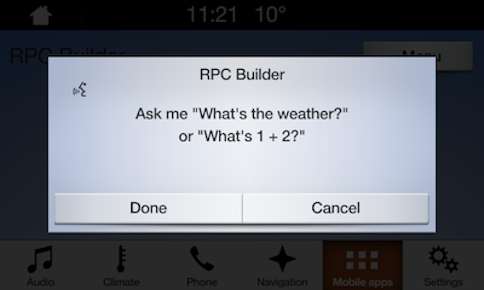

# Getting Microphone Audio
Capturing in-car audio allows developers to interact with users by requesting raw audio data provided to them from the car's microphones. In order to gather the raw audio from the vehicle, you must leverage the @![iOS][`SDLPerformAudioPassThru`](https://smartdevicelink.com/en/docs/iOS/master/Classes/SDLPerformAudioPassThru/)!@@![android,javaSE,javaEE,javascript]`PerformAudioPassThru`!@ RPC.

SDL does not support automatic speech cancellation detection, so if this feature is desired, it is up to the developer to implement. The user may press an "OK" or "Cancel" button, the dialog may timeout, or you may close the dialog with @![iOS]`SDLEndAudioPassThru`!@@![android,javaSE,javaEE,javascript]`EndAudioPassThru`!@.

!!! NOTE
SDL does not support an open microphone. However, SDL is working on wake-word support in the future. You may implement a voice command and start an audio pass thru session when that voice command occurs.
!!!

!!! NOTE
[Manticore](https://smartdevicelink.com/resources/manticore/) [does not currently support](https://smartdevicelink.com/resources/manticore/#support-notes) the `PerformAudioPassThru` RPC used for getting microphone audio.
!!!

## Starting Audio Capture
Before you start an audio capture session you need to find out what audio pass thru capabilities the module supports. You can then use that information to start an audio pass thru session.

### Getting the Supported Capabilities
You must use a sampling rate, bit rate, and audio type supported by the module. Once you have successfully connected to the module, you can access these properties on the @![iOS]`SDLManager.systemCapabilityManager`!@@![android,javaSE,javaEE,javascript]`sdlManager.getSystemCapabilityManager`!@ instance.

@![iOS]
|~
```objc
NSArray<SDLAudioPassThruCapabilities *> *audioPassThruCapabilities = self.sdlManager.systemCapabilityManager.audioPassThruCapabilities;
```
```swift
let audioPassThruCapabilities = sdlManager.systemCapabilityManager.audioPassThruCapabilities
```
~|
!@

@![android, javaSE, javaEE]
```java
sdlManager.getSystemCapabilityManager().getCapability(SystemCapabilityType.AUDIO_PASSTHROUGH, new OnSystemCapabilityListener() {
    @Override
    public void onCapabilityRetrieved(Object capability) {
        List<AudioPassThruCapabilities> audioPassThruCapabilities = (List<AudioPassThruCapabilities>) capability;
    }

    @Override
    public void onError(String info) {
        // Handle Error
    }
}, false);
```
!@

@![javascript]
```js
// This is technically a private property and a `getAudioPassThruCapabilities` method will be added to retrieve it in a future release.
let audioPassThruCapabilities = sdlManager.getSystemCapabilityManager()._audioPassThruCapabilities;
```
!@

The module may return one or multiple supported audio pass thru capabilities. Each capability will have the following properties:

| Audio Pass Thru Capability | Parameter Name  |  Description |
| ------------- | ------------- | ------------- |
| Sampling Rate | samplingRate | The sampling rate |
| Bits Per Sample | bitsPerSample | The sample depth in bits |
| Audio Type | audioType | The audio type |

### Sending the Audio Capture Request
To initiate audio capture, first construct a @![iOS]`SDLPerformAudioPassThru`!@@![android,javaSE,javaEE,javascript]`PerformAudioPassThru`!@ request. 

@![iOS]
|~
```objc
SDLPerformAudioPassThru *audioPassThru = [[SDLPerformAudioPassThru alloc] initWithInitialPrompt:@"<#A speech prompt when the dialog appears#>" audioPassThruDisplayText1:@"<#Ask me \"What's the weather?\"#>" audioPassThruDisplayText2:@"<#or \"What is 1 + 2?\"#>" samplingRate:SDLSamplingRate16KHZ bitsPerSample:SDLBitsPerSample16Bit audioType:SDLAudioTypePCM maxDuration:<#Time in milliseconds to keep the dialog open#> muteAudio:YES];

[self.sdlManager sendRequest:audioPassThru withResponseHandler:^(__kindof SDLRPCRequest * _Nullable request, __kindof SDLRPCResponse * _Nullable response, NSError * _Nullable error) {
    if ([response.resultCode isEqualToEnum:SDLResultSuccess]) {
        // The audio pass thru ended successfully.
        <#Process the audio data#>
    } else if ([response.resultCode isEqualToEnum:SDLResultAborted]) {
        // The audio pass thru was aborted by the user. You should cancel any usage of the audio data.
        <#Cancel any usage of the audio data#>
    } else {
        // Some other error occurred.
        <#Handle error#>
    }
}];
```
```swift
let audioPassThru = SDLPerformAudioPassThru(initialPrompt: "<#A speech prompt when the dialog appears#>", audioPassThruDisplayText1: "<#Ask me \"What's the weather?\"#>", audioPassThruDisplayText2: "<#or \"What is 1 + 2?\"#>", samplingRate: .rate16KHZ, bitsPerSample: .sample16Bit, audioType: .PCM, maxDuration: <#Time in milliseconds to keep the dialog open#>, muteAudio: true)

sdlManager.send(request: audioPassThru) { (request, response, error) in
    guard let response = response else { return }

    switch response.resultCode {
    case .success:
        // The audio pass thru ended successfully.
        <#Process the audio data#>
    case .aborted:
        // The audio pass thru was aborted by the user. You should cancel any usage of the audio data.
        <#Cancel any usage of the audio data#>
    default:
        // Some other error occurred.
        <#Handle error#>
    }
}
```
~|
!@

@![android,javaSE,javaEE]
```java
TTSChunk initialPrompt = new TTSChunk("Ask me What's the weather? or What's 1 plus 2?", SpeechCapabilities.TEXT);

PerformAudioPassThru audioPassThru = new PerformAudioPassThru()
    .setAudioPassThruDisplayText1("Ask me \"What's the weather?\"")
    .setAudioPassThruDisplayText2("or \"What's 1 + 2?\"")
    .setInitialPrompt(Arrays.asList(initialPrompt))
    .setSamplingRate(SamplingRate._22KHZ)
    .setMaxDuration(7000)
    .setBitsPerSample(BitsPerSample._16_BIT)
    .setAudioType(AudioType.PCM)
    .setMuteAudio(false);
audioPassThru.setOnRPCResponseListener(new OnRPCResponseListener() {
    @Override
	public void onResponse (int correlationId, RPCResponse response) {
        switch (response.getResultCode()) {
            case SUCCESS:
                // The audio pass thru ended successfully. Process the audio data
			case ABORTED:
			    // The audio pass thru was aborted by the user. You should cancel any usage of the audio data.
			default:
			    // Some other error occurred. Handle the error.
        }
    }
});

sdlManager.sendRPC(audioPassThru);
```
!@

@![javascript]
```js
const audioPassThru = new SDL.rpc.messages.PerformAudioPassThru()
    .setAudioPassThruDisplayText1('Ask me "What\'s the weather?"')
    .setAudioPassThruDisplayText2('or "What\'s 1 + 2?"')
    .setInitialPrompt([new SDL.rpc.structs.TTSChunk()
        .setType(SDL.rpc.enums.SpeechCapabilities.SC_TEXT)
        .setText('Ask me What\'s the weather? or What\'s 1 plus 2?')
    ])
    .setSamplingRate(SDL.rpc.enums.SamplingRate.SamplingRate_16KHZ)
    .setMaxDuration(7000)
    .setBitsPerSample(SDL.rpc.enums.BitsPerSample.BitsPerSample_16_BIT)
    .setAudioType(SDL.rpc.enums.AudioType.PCM)
    .setMuteAudio(false);

// sdl_javascript_suite v1.1+
sdlManager.sendRpcResolve(performAPT);
// Pre sdl_javascript_suite v1.1
sdlManager.sendRpc(performAPT);
```
!@



### Gathering Audio Data
SDL provides audio data as fast as it can gather it and sends it to the developer in chunks. In order to retrieve this audio data, the developer must @![iOS]add a handler to the `SDLPerformAudioPassThru`.!@
@![android,javaSE,javaEE,javascript]observe the `OnAudioPassThru` notification.!@

!!! NOTE
This audio data is only the current chunk of audio data, so the app is in charge of saving previously retrieved audio data.
!!!

@![iOS]
|~
```objc
SDLPerformAudioPassThru *audioPassThru = <#SDLPerformAudioPassThru#>;

audioPassThru.audioDataHandler = ^(NSData * _Nullable audioData) {
    if (audioData.length == 0) { return; }
    <#Do something with current audio data#>
};

[self.sdlManager sendRequest:audioPassThru];
```
```swift
let audioPassThru = <#SDLPerformAudioPassThru#>

audioPassThru.audioDataHandler = { (data) in
    guard let audioData = data else { return }
    <#Do something with current audio data#>
}

sdlManager.send(audioPassThru)
```
~|
!@

@![android,javaSE,javaEE]
```java
sdlManager.addOnRPCNotificationListener(FunctionID.ON_AUDIO_PASS_THRU, new OnRPCNotificationListener() {
    @Override
    public void onNotified(RPCNotification notification) {
        OnAudioPassThru onAudioPassThru = (OnAudioPassThru) notification;
        byte[] dataRcvd = onAudioPassThru.getAPTData();
        // Do something with current audio data
    }
});
```
!@

@![javascript]
```js
sdlManager.addRpcListener(SDL.rpc.enums.FunctionID.OnAudioPassThru, function (onAudioPassThru) {
    if(onAudioPassThru instanceof SDL.rpc.messages.OnAudioPassThru) {
        const dataRcvd = onAudioPassThru.getBulkData();
        // Do something with current audio data
    }
});
```
!@

#### Format of Audio Data
The format of audio data is described as follows:

* It does not include a header (such as a RIFF header) at the beginning.
* The audio sample is in linear PCM format.
* The audio data includes only one channel (i.e. monaural).
* For bit rates of 8 bits, the audio samples are unsigned. For bit rates of 16 bits, the audio samples are signed and are in little-endian.

## Ending Audio Capture
@![iOS]`SDLPerformAudioPassThru`!@@![android,javaSE,javaEE,javascript]`PerformAudioPassThru`!@ is a request that works in a different way than other RPCs. For most RPCs, a request is followed by an immediate response, with whether that RPC was successful or not. This RPC, however, will only send out the response when the audio pass thru has ended.

Audio capture can be ended four ways:

1. The audio pass thru has timed out.
    * If the audio pass thru surpasses the timeout duration, this request will be ended with a `resultCode` of `SUCCESS`. You should handle the audio pass thru as though it was successful.
2. The audio pass thru was closed due to user pressing "Cancel" (or other head-unit provided cancellation button).
    * If the audio pass thru was displayed, and the user pressed the "Cancel" button, you will receive a `resultCode` of `ABORTED`. You should ignore the audio pass thru.
3. The audio pass thru was closed due to user pressing "Done" (or other head-unit provided completion button).
    * If the audio pass thru was displayed and the user pressed the "Done" button, you will receive a `resultCode` of `SUCCESS`. You should handle the audio pass thru as though it was successful.
4. The audio pass thru was ended due to a request from the app for it to end.
    * If the audio pass thru was displayed, but you have established on your own that you no longer need to capture audio data, you can send an @![iOS]`SDLEndAudioPassThru`!@@![android,javaSE,javaEE,javascript]`EndAudioPassThru`!@ RPC. You will receive a `resultCode` of `SUCCESS`. Depending on the reason that you sent the @![iOS]`SDLEndAudioPassThru`!@@![android,javaSE,javaEE,javascript]`EndAudioPassThru`!@ RPC, you can choose whether or not to handle the audio pass thru as though it were successful. See [Manually Stopping Audio Capture](#manually-stopping-audio-capture) below for more details.

### Manually Stopping Audio Capture
To force stop audio capture, simply send an @![iOS]`SDLEndAudioPassThru`!@@![android,javaSE,javaEE,javascript]`EndAudioPassThru`!@ request. Your @![iOS]`SDLPerformAudioPassThru`!@@![android,javaSE,javaEE,javascript]`PerformAudioPassThru`!@ request will receive response with a `resultCode` of `SUCCESS` when the audio pass thru has ended.

@![iOS]
|~
```objc
SDLEndAudioPassThru *endAudioPassThru = [[SDLEndAudioPassThru alloc] init];
[self.sdlManager sendRequest:endAudioPassThru withResponseHandler:^(__kindof SDLRPCRequest * _Nullable request, __kindof SDLRPCResponse * _Nullable response, NSError * _Nullable error) {
    if (!response.success.boolValue) {
        // There was an error sending the end audio pass thru
        return;
    }
    // The end audio pass thru was sent successfully
}];
```
```swift
let endAudioPassThru = SDLEndAudioPassThru()
sdlManager.send(request: endAudioPassThru) { (request, response, error) in
    guard let response = response, response.success.boolValue else {
        // There was an error sending the end audio pass thru
        return
    }

    // The end audio pass thru was sent successfully
}
```
~|
!@

@![android,javaSE,javaEE]
```java
EndAudioPassThru endAudioPassThru = new EndAudioPassThru();
endAudioPassThru.setOnRPCResponseListener(new OnRPCResponseListener() {
    @Override
    public void onResponse (int correlationId, RPCResponse response) {
        if (!response.getSuccess())) {
            // There was an error sending the end audio pass thru
            return;
        }

        // The end audio pass thru was sent successfully
    }
});

sdlManager.sendRPC(endAudioPassThru);
```
!@

@![javascript]
```js
// sdl_javascript_suite v1.1+
const response = await sdlManager.sendRpcResolve(performAPT);
if (response instanceof SDL.rpc.messages.PerformAudioPassThruResponse) {
    if (response.getResultCode() === SDL.rpc.enums.Result.SUCCESS) {
        // We can use the data
    } else {
        // Cancel any usage of the data
        console.log('Audio pass thru attempt failed.');
    }
}
// thrown exceptions should be caught by a parent function via .catch()

// Pre sdl_javascript_suite v1.1
const response = await sdlManager.sendRpc(performAPT).catch(error => error);
if (response instanceof SDL.rpc.messages.PerformAudioPassThruResponse) {
    if (response.getResultCode() === SDL.rpc.enums.Result.SUCCESS) {
        // We can use the data
    } else {
        // Cancel any usage of the data
        console.log('Audio pass thru attempt failed.');
    }
} else {
    // Handle Error
}

// The end audio pass thru was sent successfully
```
!@

## Handling the Response
To process the response received from an ended audio capture, make sure that you are listening to the @![iOS]`SDLPerformAudioPassThru`!@@![android,javaSE,javaEE,javascript]`PerformAudioPassThru`!@ response. If the response has a successful result, all of the audio data for the audio pass thru has been received and is ready for processing.
